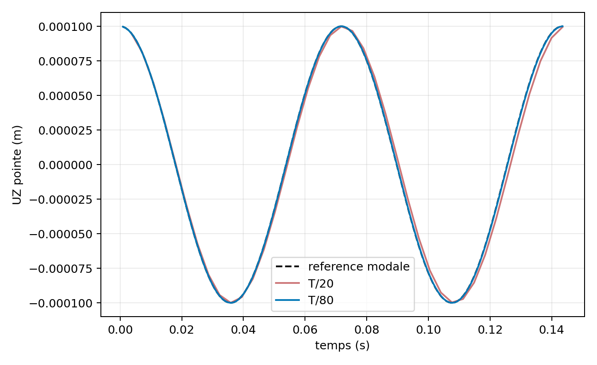
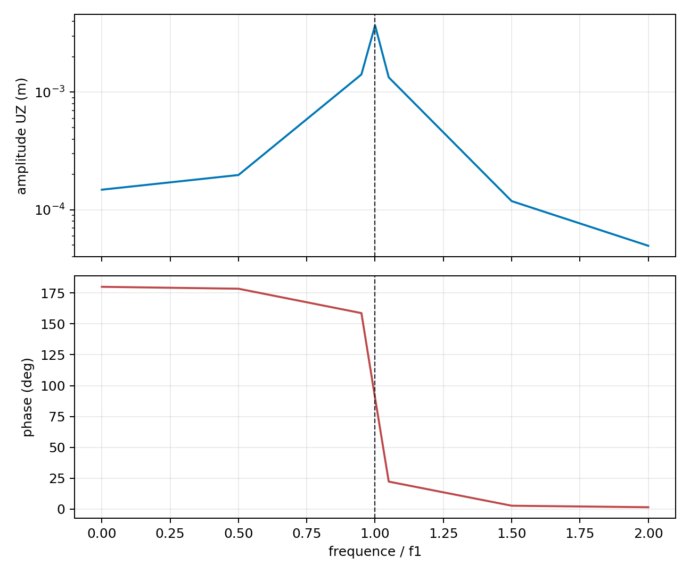
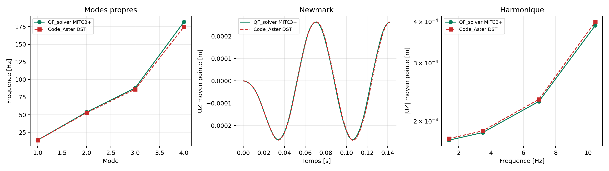

# MITC3+ multicouche - statique et dynamique lineaire

## Domaine etabli

`VNV-MITC3-LAMINATE-DYNAMIC-001` couvre une coque MITC3+ plane, en petits
deplacements, de stratification symetrique `[0/90/90/0]`. Chaque pli est
orthotrope et la masse est coherente. Les rotations de drilling n'ont pas
d'inertie artificielle : les directions sans masse sont condensees avant les
calculs modal, Newmark et harmonique.

Le statut est **verified_development_external_correlation**. La coherence
interne est completee par des correlations externes des reponses dynamiques et
des contraintes planes par pli. Le cas courbe avec orientation projetee et la
decision Owner restent ouverts.

## Preuve statique

Le patch applique une resultante membranaire constante `N = [1000, 0, 0]`
N/m sur un panneau plan. La reference est la theorie classique des
stratifies :

\[
  \varepsilon^0 = A^{-1} N.
\]

Les deplacements affines imposes par cette deformation sont retrouves a
precision machine sur quatre maillages, de 2 a 64 triangles. Le
post-traitement contient les contraintes aux trois positions d'epaisseur des
quatre plis.

## Dynamique

Le porte-a-faux `8 x 2` triangles est d'abord resolu en modal. Son premier
mode initialise Newmark et construit la charge harmonique `F=M phi_1`. Cette
reduction fournit l'oracle ferme suivant :

\[
 u_{tip}(t)=u_0\cos(2\pi f_1 t).
\]

La campagne controle residus, orthogonalites de masse et de raideur,
condensation du drilling, convergence Newmark sur `T/20`, `T/40`, `T/80`,
conservation de l'energie non amortie, limite statique a `0 Hz`, phase,
resonance et disponibilite des resultats par pli en harmonique.





## Reproduction

```powershell
python .\scripts\run_mitc3_laminate_dynamic_vnv.py `
  --output .\results\VNV-MITC3-LAMINATE-DYNAMIC-001
```

Les artefacts controles sont conserves dans
`qualification/vnv/mitc3_laminate_dynamic/reference/`.

## Correlation externe de reponse dynamique

`VNV-MITC3-LAMINATE-DYNAMICS-CODEASTER-DST-019` execute le meme porte-a-faux
`12 x 3` (72 `TRIA3`), avec le meme empilement `[0/90/90/0]`, la densite, les
blocages, la table Newmark et la grille harmonique. Code_Aster 18.1 est lance
dans son image Docker epinglee avec `DST / DEFI_COMPOSITE`.

| Observable | Ecart QF_solver / Code_Aster | Seuil | Verdict |
| --- | ---: | ---: | --- |
| Quatre premieres frequences | `3,957 %` | `12 %` | PASS |
| Historique Newmark, UZ moyen de pointe | `2,318 %` | `15 %` | PASS |
| Reponse harmonique complexe sous resonance | `1,345 %` | `15 %` | PASS |
| Residu modal QF_solver | `3,86e-09` | `1e-07` | PASS |
| Residu dynamique QF_solver | `1,09e-11` | `1e-07` | PASS |



```powershell
python .\scripts\run_code_aster_mitc3_laminate_dynamic_vnv.py `
  --output .\results\VNV-MITC3-LAMINATE-DYNAMICS-CODEASTER-DST-019
```

Les preuves controlees sont dans
`qualification/vnv/external/code_aster_mitc3_laminate_dynamic/reference/`.

## Correlation externe des contraintes par pli

`VNV-MITC3-LAMINATE-PLY-STRESS-CALCULIX-S6-020` utilise un patch membranaire
plan de `1,0 m x 0,2 m`, un empilement symetrique `[0/90/90/0]` et une
resultante constante `N11 = 1000 N/m`. Les memes noeuds de coin, les memes
blocages et les memes forces de rive sont fournis a QF_solver et a CalculiX
2.20 `S6 COMPOSITE`. Les contraintes `S11`, `S22`, `S12` sont exprimees dans
les axes materiau et moyennees par pli aux points d'integration; aucune valeur
nodale extrapolee n'est utilisee.

| Maillage QF_solver | Ecart L2 par pli | Erreur patch QF_solver |
| --- | ---: | ---: |
| `4 x 1`, 8 triangles | `0,12036 %` | `1,755e-14` |
| `8 x 2`, 32 triangles | `0,11045 %` | `1,885e-13` |
| `16 x 4`, 128 triangles | `0,09625 %` | `2,278e-13` |

Le seuil externe est `2 %`; le dernier increment CalculiX vaut `0,07313 %`,
sous le seuil de stabilisation de `0,2 %`. Cette preuve ferme la contrainte
par pli pour un champ membranaire affine plan, mais ne demontre ni contrainte
interlaminaire, ni bord libre, ni comportement sur coque courbe.


```powershell
python .\scripts\run_calculix_mitc3_laminate_ply_stress_vnv.py `
  --output .\results\VNV-MITC3-LAMINATE-PLY-STRESS-CALCULIX-S6-020
```

Les artefacts controles sont archives dans
`qualification/vnv/external/calculix_mitc3_laminate_ply_stress/reference/`.

## Limites ouvertes

- la preuve est plane et symetrique : elle n'exerce ni courbure, ni couplage
  `B` non nul, ni offset de surface moyenne ;
- les historiques de contrainte nodale MITC3+ ne sont pas demandes lorsque
  les facettes adjacentes n'ont pas de repere local aligne ; les resultats
  elementaires/par pli restent disponibles ;
- dommage, delaminage, grandes rotations et dynamique non lineaire sont hors
  perimetre.
