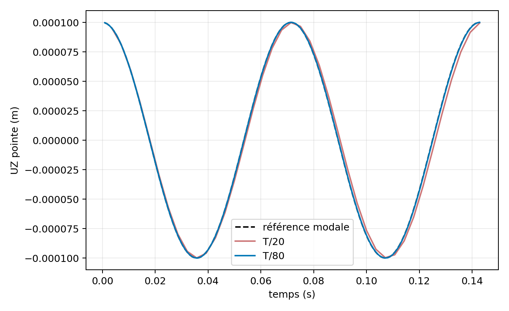
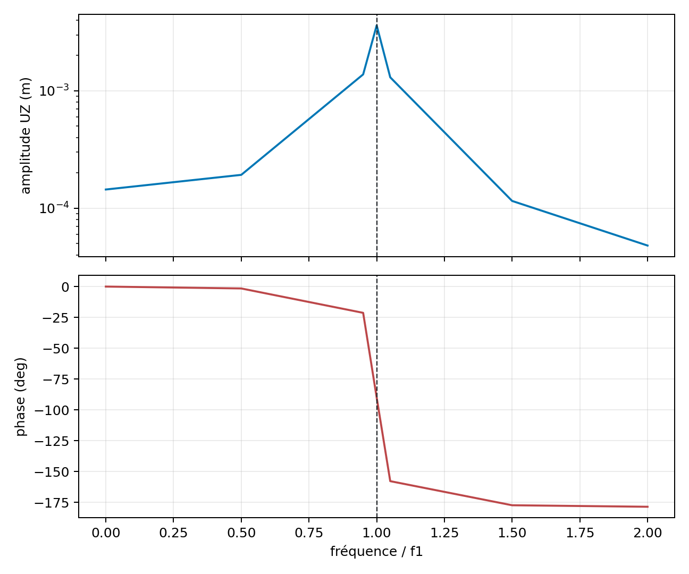
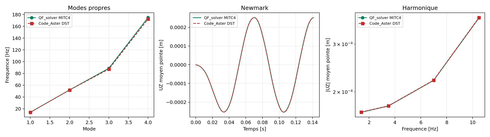

# MITC4 multicouche - dynamique lineaire

## Perimetre

Cette page documente `VNV-MITC4-LAMINATE-DYNAMIC-001`, une verification
interne des chemins modal, Newmark et harmonique pour une coque MITC4 plane,
en petits deplacements, avec le stratifie symetrique `[0/90/90/0]`. La masse
est coherente et est integree pli par pli. Les rotations de drilling sont sans
inertie physique et sont condensees statiquement avant le calcul dynamique.

Le statut est **experimental_owner_accepted_bounded**. La coherence interne
est completee par une correlation reproductible Code_Aster sur le meme
maillage, puis acceptee par l'Owner le 10 aout 2026 pour le domaine plan borne.
Cette decision ne vaut ni maturite stable, ni qualification externe de la
dynamique multicouche en general.

## Masse et reduction

Pour chaque facette, la masse repartie utilise la masse surfacique
`sum(rho_k t_k)` et l'inertie de rotation
`sum(rho_k (z_(k+1)^3-z_k^3)/3)`. En separant les DDL physiques `p` des
rotations de drilling `d`, la reduction retenue est :

\[
K_c=K_{pp}-K_{pd}K_{dd}^{-1}K_{dp}, \qquad M_c=M_{pp}.
\]

La campagne publie le nombre de DDL candidats et effectivement condenses. Le
mode fondamental sert uniquement d'oracle algorithme : il initialise Newmark
et construit la charge harmonique `F=M phi_1`.

## Resultats reproduits

La campagne controle les residus modaux, les orthogonalites de masse et de
raideur, la convergence temporelle Newmark, la conservation de l'energie non
amortie, la limite statique a `0 Hz`, la phase, la resonance et la presence de
contraintes par pli dans le post-traitement harmonique.





```powershell
python .\scripts\run_mitc4_laminate_dynamic_vnv.py `
  --output .\results\VNV-MITC4-LAMINATE-DYNAMIC-001
```

Les sorties de reference sont dans
`qualification/vnv/mitc4_laminate_dynamic/reference/` : `summary.json`, le
rapport Markdown, deux PNG et un manifeste SHA-256.

## Correlation externe sur meme maillage

`VNV-MITC4-LAMINATE-DYNAMICS-CODEASTER-DST-018` reprend le porte-a-faux avec
`12 x 3` QUAD4, l'empilement, les densites, le blocage encastre, la table de
charge Newmark et la grille harmonique. Code_Aster 18.1 est execute dans
l'image Docker epinglee avec `DST / DEFI_COMPOSITE`; QF_solver utilise MITC4.
Cette comparaison est donc independante mais reste inter-formulation.

| Observable | Ecart QF_solver / Code_Aster | Seuil | Verdict |
| --- | ---: | ---: | --- |
| Frequencies propres, quatre premiers modes | `1,678 %` | `10 %` | PASS |
| Historique Newmark, UZ moyen en pointe | `0,422 %` | `12 %` | PASS |
| Reponse harmonique complexe sous resonance | `0,205 %` | `12 %` | PASS |
| Residu modal QF_solver | `3,61e-09` | `1e-07` | PASS |
| Residu dynamique QF_solver | `1,49e-11` | `1e-07` | PASS |



```powershell
python .\scripts\run_code_aster_mitc4_laminate_dynamic_vnv.py `
  --output .\results\VNV-MITC4-LAMINATE-DYNAMICS-CODEASTER-DST-018
```

Les artefacts controles sont dans
`qualification/vnv/external/code_aster_mitc4_laminate_dynamic/reference/`.

## Cas courbe et axe projete

Le prealable geometrique de la dynamique, la projection de la direction
materiau globale dans le plan tangent de chaque facette, est couvert par
`VNV-COMP-CURVED-ORIENTATION-008`. Ce panneau cylindrique `[0/+45/-45/90]`
avec direction globale oblique `[1,1,0]` est compare a CalculiX S8R COMPOSITE.
L'ecart vectoriel fin est `1,839 %`, sous la limite de modele de `3 %`. Cette
preuve est statique : elle valide la convention d'orientation courbe, pas une
reponse dynamique courbe complete.

## Limites de la decision Owner

- la dynamique externe est plane et symetrique : elle ne couvre ni couplage
  `B` non nul, ni offsets de surface moyenne, ni une campagne dynamique sur
  coque courbe ;
- l'orientation projetee est correlee en statique sur panneau cylindrique, mais
  la combinaison orientation oblique et chargement dynamique reste a etudier ;
- endommagement, delaminage, grandes rotations et dynamique non lineaire sont
  hors perimetre ;
- seul l'amortissement de Rayleigh proportionnel a la masse est exerce tant
  que la condensation du drilling est active.
