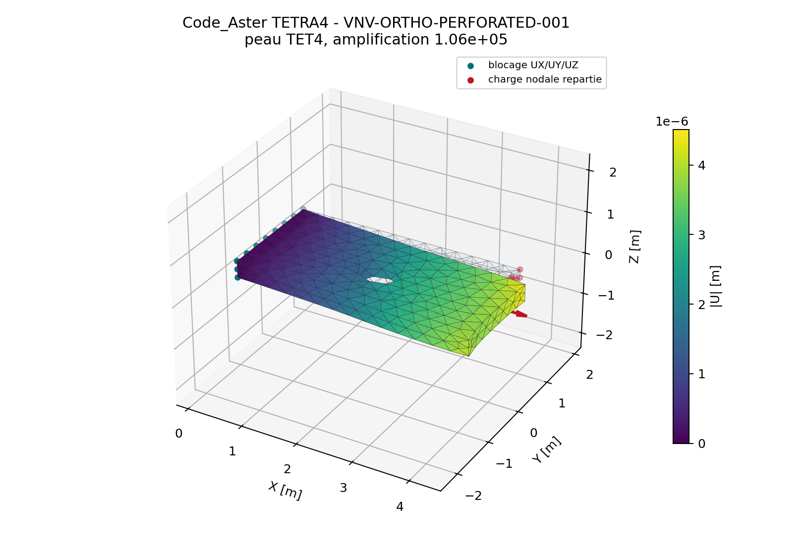
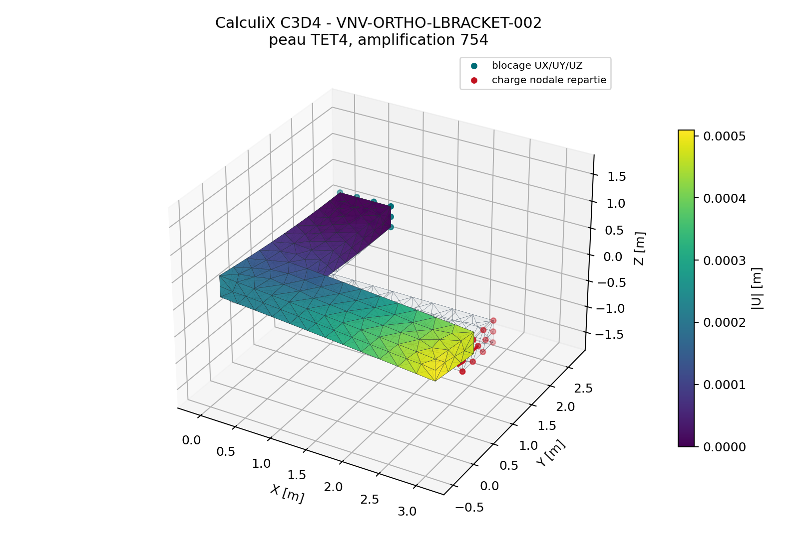
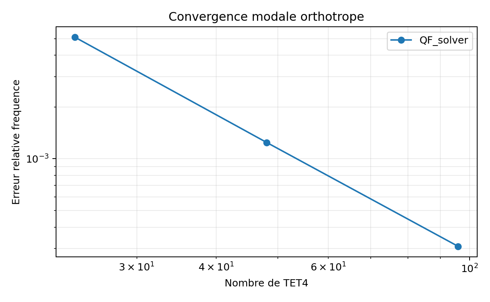
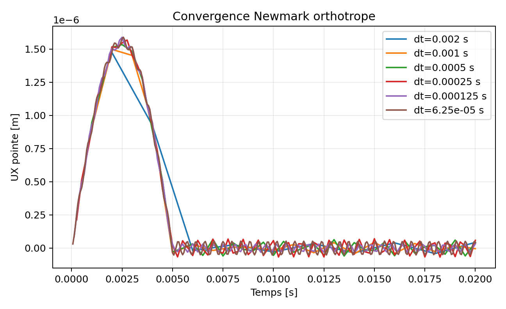
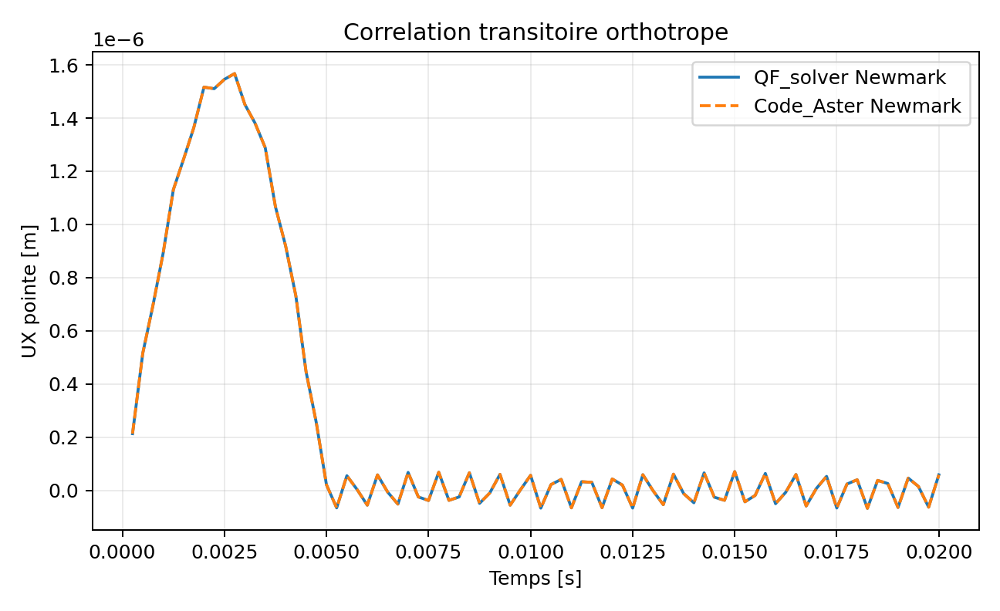

# Specification des solides orthotropes TET4 et TET10

## Objectif

Etendre les solides TET4 et TET10 a une elasticite orthotrope tridimensionnelle
orientee. Ce perimetre vise les materiaux homogenises 3D, les bois, les
structures imprimees anisotropes et les zones composites modelisees en solide.
Il ne remplace pas une modelisation pli par pli avec interfaces de delaminage.

La premiere tranche est implementee pour TET4 et TET10 en statique lineaire.
Les huit specifications automatiques passent. La decision Owner du 22 juillet
2026 accepte le scope pour l'usage engineering interne borne, avec
recommandations. Il ne constitue ni une certification ni une qualification
externe.

Deux usages devront etre distingues dans l'entree et dans l'audit :

- `orthotropic_3d` pour un materiau orthotrope homogene;
- `composite_orthotropic_3d` pour un composite homogeneise, avec empilement,
  methode d'homogeneisation, fraction volumique et allowables tracables.

Les deux utilisent la meme loi elastique 3D. Le second ajoute la provenance
composite et des indicateurs de premier pli ou de rupture homogeneisee. Une
modelisation pli par pli restera possible en affectant des regions solides
distinctes, mais les interfaces, le delaminage et les elements cohesifs
constituent un autre perimetre.

## Constantes constitutives

Le materiau doit definir neuf constantes independantes positives :

```text
E1, E2, E3,
nu12, nu13, nu23,
G12, G13, G23.
```

Les coefficients reciproques sont imposes par la symetrie energetique :

\[
\nu_{21}=\nu_{12}\frac{E_2}{E_1},\qquad
\nu_{31}=\nu_{13}\frac{E_3}{E_1},\qquad
\nu_{32}=\nu_{23}\frac{E_3}{E_2}.
\]

La matrice de souplesse 3D dans les axes materiau doit etre symetrique et
definie positive. La rigidite est obtenue par resolution ou factorisation de
la souplesse, sans inverse explicite dans les boucles elementaires.

## Orientation materiau

Chaque region materielle doit fournir un repere orthonorme direct `e1/e2/e3`.
Les orientations autorisees sont :

- repere global implicite;
- matrice de rotation `3x3` explicite;
- direction principale `e1` et direction auxiliaire `e2_hint`;
- groupe physique Gmsh associe a une orientation constante.
- champ `cylindrical_tangent` evalue au centroide de chaque TET4/TET10.

La construction doit rejeter les vecteurs nuls, colineaires, non finis et les
matrices de determinant negatif. La loi est evaluee dans les axes materiau,
puis contraintes et tangentes sont retournees dans les axes globaux avec une
transformation de Voigt testee sur les cisaillements d'ingenieur.

Convention implementee : les **colonnes** de `orientation` sont les vecteurs
unitaires materiau `e1`, `e2`, `e3` exprimes dans le repere global. Avec
`e1/e2_hint`, `e2` est obtenu par Gram-Schmidt et `e3=e1 x e2`.

Le champ `cylindrical_tangent` est une premiere orientation geometrique
continue. A partir de `origin` et `axis`, il construit au centroide de chaque
element un repere direct : `e1` est circonferentiel, `e2` est axial et `e3`
radial sortant. Ainsi, une meme definition materielle suit la geometrie d'un
solide cylindrique maille sans creer une region par element.

```json
"orientation_field": {
  "type": "cylindrical_tangent",
  "origin": [0.0, 0.0, 0.0],
  "axis": [0.0, 0.0, 1.0]
}
```

Le repere reste constant a l'interieur d'un TET4 et entre les points de Gauss
d'un TET10. L'approximation converge donc avec le raffinement du maillage. Les
fibres a courbure arbitraire, les champs nodaux interpoles et les orientations
variees a chaque point d'integration restent hors scope jusqu'a une campagne
V&V specifique.

## Entree JSON implementee

```json
{
  "type": "orthotropic_3d",
  "E1": 135000000000.0,
  "E2": 10000000000.0,
  "E3": 8000000000.0,
  "nu12": 0.28,
  "nu13": 0.22,
  "nu23": 0.35,
  "G12": 5200000000.0,
  "G13": 4100000000.0,
  "G23": 3300000000.0,
  "density": 1580.0,
  "e1": [0.7071067812, 0.7071067812, 0.0],
  "e2_hint": [0.0, 0.0, 1.0]
}
```

`orientation` peut remplacer `e1/e2_hint` par une matrice orthonormale directe
`3x3`. Le type `composite_orthotropic_3d` accepte la meme loi mais exige
`homogenization` et un objet `provenance`; ces informations sont conservees
dans le post-traitement. Aucun critere de rupture 3D n'est encore calcule.

## Integration TET4

Le TET4 conserve sa deformation constante et son volume oriente. La matrice
elementaire cible est :

\[
K_e=V B^T C_{global} B.
\]

L'orientation peut etre constante ou provenir du champ cylindrique evalue au
centroide. Le chemin grand modele ne prend pas encore en charge ce champ, car
son noyau vectorise doit etre etendu et verifie separement.

## Integration TET10

Le TET10 utilise la meme loi 3D aux points d'integration. La regle automatique
Hammer/Duffy existante reste pilotee par la geometrie. Les contraintes doivent
etre disponibles aux points d'integration et recuperees aux noeuds dans les
axes global et materiau.

Une orientation variable par point d'integration, une texture issue d'un champ
et les plis solides courbes restent hors du premier perimetre.

## Extensions modale, dynamique et grand modele

Le noyau lineaire orthotrope est maintenant branche sur trois chemins
supplementaires :

1. `modal` avec masse coherente TET4 et TET10;
2. `transient_dynamic` avec Newmark moyenne acceleree
   (`beta=0,25`, `gamma=0,5`) pour TET4 et TET10;
3. `linear_static` grand modele TET4 avec assemblage SciPy par blocs,
   PETSc/MPI et operateur matrix-free homogene.

La densite doit etre strictement positive pour le modal et Newmark. Les
matrices de rigidite utilisent la loi orthotrope orientee globale et les
matrices de masse conservent la formulation coherente existante. Les tests
comparent une loi orthotrope mathematiquement equivalente a l'isotropie :
frequences, champs Newmark, rigidites et deplacements doivent etre identiques
aux tolerances numeriques. Une vraie loi anisotrope tournee est aussi resolue
par les chemins standard, assemble large et matrix-free.

Le support technique ne vaut pas encore acceptation mecanique de ces trois
scopes. Ils restent `development` jusqu'aux benchmarks independants, aux
etudes de convergence modale/temporelle et a la Owner review.

### Grand modele

Le format HDF5/NPZ conserve les neuf constantes, la densite, l'orientation et
la provenance de `composite_orthotropic_3d`. Le constructeur commun
`solveur.large.materials.create_large_material` est utilise par l'assemblage
SciPy/PETSc, le matrix-free, l'audit et le post-traitement. Les lois
non lineaires sont refusees.

Le premier scope grand modele est volontairement limite a
`linear_static + TET4 + orthotropic_3d/composite_orthotropic_3d`. Le modal
distribue et Newmark distribue ne sont pas revendiques.

La campagne `VNV-ORTHOTROPIC-LARGE-STATIC-009` a execute un bloc oriente sur
deux rangs PETSc/MPI : `107 811` DDL en `3,097 s`, puis `1 029 000` DDL en
`32,111 s`. Les deux calculs ont un audit `PASS`, des residus inferieurs a
`5e-18` et des manifestes verifies. Le rapport controle reste volontairement
classe comme preuve technique : le scope doit encore recevoir sa Owner review
et ne couvre aucune analyse distribuee modale ou transitoire.

```powershell
python .\qf_solver.py generate-large-tet4-block `
  --output .\results_large\orthotropic_block.h5 --target-dofs 1000000 `
  --material-json .\qualification\vnv\orthotropic_large_static\orthotropic_material.json

docker run --rm -v "${PWD}:/workspace" -w /workspace qf-solver-large:0.2.0 `
  mpiexec -n 2 python3 qf_solver.py benchmark-large `
  --input /workspace/results_large/orthotropic_block.h5 `
  --output /workspace/results_large/orthotropic_benchmark `
  --solver-backend petsc --preconditioner gamg --matrix-format baij
```

### Exemples executables

```powershell
python .\qf_solver.py solve --input .\examples\tet4_orthotropic_modal.json `
  --output .\results\tet4_orthotropic_modal.json

python .\qf_solver.py solve --input .\examples\tet10_orthotropic_newmark.json `
  --output .\results\tet10_orthotropic_newmark.json
```

Les preuves automatiques sont dans
`tests/unit/test_orthotropic_dynamic_large.py`. Elles couvrent TET4/TET10
modal, TET4/TET10 Newmark, la persistance NPZ, l'accord standard/large,
l'accord assemble/matrix-free et le refus des lois non lineaires.

## Resultats obligatoires

- deformation et contrainte dans les axes globaux;
- deformation et contrainte dans les axes materiau;
- contraintes principales et invariants globaux;
- orientation effectivement utilisee par element;
- indicateurs maximum stress/strain 3D lorsque les neuf allowables sont fournis;
- provenance des proprietes et des orientations dans l'audit.

Pour `composite_orthotropic_3d`, l'audit devra aussi conserver la methode
d'homogeneisation, la sequence de plis ou le jeu de donnees materiau source,
ainsi que les neuf resistances `Xt/Xc/Yt/Yc/Zt/Zc/S12/S13/S23` lorsqu'elles
sont disponibles. Aucun indice de rupture ne devra etre calcule silencieusement
si une resistance manque.

## Programme V&V minimal

| Identifiant | Verification |
| --- | --- |
| `SPEC-COMP-SOLID-001` | positivite, reciprocite et symetrie de la loi 3D |
| `SPEC-COMP-SOLID-002` | cube unitaire en traction selon les axes 1, 2 et 3 |
| `SPEC-COMP-SOLID-003` | cisaillements purs 12, 13 et 23 |
| `SPEC-COMP-SOLID-004` | patch affine TET4/TET10 avec repere tourne |
| `SPEC-COMP-SOLID-005` | invariance de la reponse sous rotation globale |
| `SPEC-COMP-SOLID-006` | convergence TET4/TET10 sur poutre hors axe |
| `SPEC-COMP-SOLID-007` | comparaison meme maillage avec Code_Aster ou CalculiX |
| `SPEC-COMP-SOLID-008` | non-regression memoire et temps du chemin isotrope |

## Etat de verification

La campagne `VNV-ORTHOTROPIC-SOLID-KERNEL-001` couvre actuellement les
specifications `001..005` :

| Preuve | TET4 | TET10 | Verdict |
| --- | ---: | ---: | --- |
| erreur patch affine deformation | `0` | `6,06e-17` | PASS |
| erreur patch affine contrainte | `0` | `2,16e-16` | PASS |
| residu maximal des six modes rigides | `4,23e-17` | `3,46e-17` | PASS |

Les six etats unitaires de traction/cisaillement, la symetrie, la positivite,
la transformation de contrainte et l'invariance energetique passent aussi sous
`1e-12`. Le rapport reproductible est genere avec :

```powershell
python .\scripts\run_orthotropic_solid_vnv.py `
  --output .\results\VNV-ORTHOTROPIC-SOLID-KERNEL-001
```

Exemples API/CLI : `examples/tet4_orthotropic_static.json` et
`examples/tet10_orthotropic_static.json`.

## Correlation externe sur geometries complexes

La campagne `VNV-ORTHOTROPIC-SOLID-EXTERNAL-002` compare le TET4 orthotrope
sur exactement les memes noeuds, tetraedres, blocages et charges avec :

- Code_Aster `18.1.0`, element `TETRA4`, loi `ELAS_ORTH` et axes locaux
  `AFFE_CARA_ELEM/MASSIF`;
- CalculiX `2.20`, element `C3D4`, constantes elastiques de type
  `ENGINEERING CONSTANTS` et orientation locale.

Deux modeles non triviaux sont utilises :

| Cas | Maillage | Orientation | Chargement |
| --- | ---: | ---: | --- |
| eprouvette 3D perforee | 941 TET4, 363 noeuds | 30 deg autour de Z | traction repartie 10 kN |
| equerre 3D a angle rentrant | 579 TET4, 237 noeuds | 25 deg autour de Z | effort transversal -5 kN |

### Resultats chiffres

| Cas | Ecart champ U CalculiX | Ecart champ U Code_Aster | Ecart pic von Mises Code_Aster |
| --- | ---: | ---: | ---: |
| eprouvette perforee | 0,000132 % | 3,60e-11 % | 2,59e-12 % |
| equerre | 0,000116 % | 3,42e-10 % | 5,78e-10 % |

Les ecarts CalculiX sont compatibles avec la precision du champ nodal ecrit
dans le fichier FRD. L'accord Code_Aster est au voisinage de la precision
machine, ce qui confirme la matrice orthotrope, la rotation des axes, les
conditions aux limites et l'assemblage. Cette correlation couvre
`SPEC-COMP-SOLID-007`.

### Eprouvette perforee




### Equerre 3D





Reproduction complete :

```powershell
python .\scripts\run_orthotropic_external_vnv.py `
  --output .\results\VNV-ORTHOTROPIC-SOLID-EXTERNAL-002 `
  --mesh-size 0.30
```

Les fichiers `.msh`, decks Code_Aster/CalculiX, sorties brutes, JSON,
figures et manifeste SHA-256 sont conserves dans le dossier de preuve. Les
pics au bord du trou et a l'angle rentrant restent sensibles au maillage :
ils ne remplacent pas l'etude de convergence separee.

## Convergence structurelle hors axes

`VNV-ORTHOTROPIC-SOLID-CONVERGENCE-003` utilise un porte-a-faux massif
`2,0 x 1,0 x 0,5 m`, une orientation materiau de 30 deg et une traction
terminale transverse de `-1 MPa`. Quatre tailles sont calculees pour chaque
famille et deux niveaux TET4 supplementaires visent environ `5 000` et
`10 000` elements. Un maillage TET10 independant, `h=0,09 m`, `7 715`
elements et `12 625` noeuds, sert de reference numerique.

| Famille | Elements grossier -> fin | Ecart fleche grossier -> fin | Ecart energie fin | Reduction erreur |
| --- | ---: | ---: | ---: | ---: |
| TET4 | 215 -> 9 820 | 62,07 % -> 11,75 % | 11,99 % | x5,28 |
| TET10 | 215 -> 2 607 | 3,55 % -> 0,292 % | 0,303 % | x12,17 |

Les deux familles convergent sans inversion de tendance. Les points TET4 a
`4 951` et `9 820` elements donnent respectivement `16,83 %` et `11,75 %`
d'ecart de fleche. Le TET4 reste nettement trop raide en flexion sur les
maillages courants : le PASS prouve sa convergence, pas une precision de
conception inferieure a 5 %. Le TET10 atteint moins de `0,31 %` sur les deux
observables. Le residu libre maximal vaut `6,96e-12`.


```powershell
python .\scripts\run_orthotropic_convergence_vnv.py `
  --output .\results\VNV-ORTHOTROPIC-SOLID-CONVERGENCE-003
```

## Non-regression isotrope

`VNV-ORTHOTROPIC-ISOTROPIC-NONREGRESSION-004` compare le chemin historique
`SolidMaterial` a une loi orthotrope mathematiquement isotrope, tournee de
27 deg. Les matrices de rigidite et contraintes TET4/TET10 restent identiques
a moins de `2,50e-16` relatif.

La matrice constitutive isotrope est maintenant mise en cache. Sur la baseline
Windows de reference, les ratios temps isotrope/orthotrope valent `0,961`
pour TET4 et `1,025` pour TET10; les ratios de memoire Python valent `1,000`.
Les temps absolus ne sont pas des criteres portables : seul le ratio mesure
dans le meme processus est bloque a `1,25`.

```powershell
python .\scripts\run_orthotropic_performance_vnv.py `
  --output .\results\VNV-ORTHOTROPIC-ISOTROPIC-NONREGRESSION-004
```

## Modal et Newmark orthotropes

`VNV-ORTHOTROPIC-MODAL-NEWMARK-010` isole la direction materiau 1 d'un
barreau TET4 3D orthotrope. Tous les `UY/UZ` sont bloques afin que la premiere
frequence soit comparable a la solution axiale fermee :

\[
f_1=\frac{1}{4L}\sqrt{\frac{C_{11}}{\rho}}.
\]

Trois maillages de `24`, `48` et `96` TET4 sont utilises. La frequence du
maillage fin est a `0,0309 %` de cette reference, avec un residu propre de
`5,43e-13` et une erreur d'orthogonalite de masse de `5,32e-16`.

La reponse Newmark moyenne acceleration (`beta=0,25`, `gamma=0,5`) a une
impulsion demi-sinus est ensuite calculee avec six pas, de `2 ms` a
`62,5 us`. L'ecart RMS normalise entre les deux pas les plus fins est
`2,89 %`; cette tolerance `5 %` tient compte de la table de charge
discretisee. Elle demontre une stabilisation numerique, mais ne doit pas etre
confondue avec une validation de chargements brusques generiques.

{ .result-figure }

{ .result-figure }

La correlation externe sur le meme maillage, la meme masse coherente et le
meme pas `0,25 ms` utilise Code_Aster `18.1.0` / `3D TETRA4` :

| Mesure | Ecart QF_solver / Code_Aster |
| --- | ---: |
| deux premieres frequences | `2,00e-12 %` |
| histoire Newmark, RMS normalise | `9,00e-13 %` |
| pic de deplacement UX | `1,07e-12 %` |

Cet accord est une correlation d'implementation tres forte, pas une
independance complete : les deux calculs ont la meme discretisation et un
chargement axial uniaxial. Les orientations curvilignes, les sollicitations
multiaxiales et une structure complexe sont toujours a verifier avant toute
extension du domaine d'emploi.

{ .result-figure }

```powershell
python .\scripts\run_orthotropic_modal_newmark_vnv.py `
  --output .\results\VNV-ORTHOTROPIC-MODAL-NEWMARK-010
```

Les resultats controles sont dans
`qualification/vnv/orthotropic_modal_newmark/reference/` : rapport Markdown,
figures PNG, JSON et manifeste SHA-256.

## Criteres d'acceptation initiaux

- erreurs des patchs affines inferieures a `1e-10`;
- symetrie relative de `C` et `K` inferieure a `1e-12`;
- energie identique dans les axes materiau et global a `1e-12` relatif;
- six modes rigides elementaires preserves;
- convergence monotone sur au moins quatre maillages;
- ecart meme maillage au code externe inferieur a `2e-4` sur le champ de
  deplacement des structures complexes;
- aucune regression des snapshots isotropes TET4/TET10.

Les huit specifications automatiques sont couvertes. Le scope est
`engineering_internal_validated_with_recommendations` : il reste interdit de
le presenter comme certifie ou qualifie par une autorite externe.

La revue signee est publiee dans
[`docs/verification/revue_solides_orthotropes.md`](../verification/revue_solides_orthotropes.md).
