# Verification des composites

## Campagne VNV-COMP-ANALYTIC-001

La campagne est relancee avec :

```powershell
python .\scripts\run_composite_analytic_vnv.py `
  --output .\results\VNV-COMP-ANALYTIC-001
```

Elle produit `summary.json`, `report.md`, une figure et un manifeste SHA-256.
Son statut courant est `PASS_TECHNICAL_VERIFICATION`, avec maturite
`experimental`.

| Cas | Oracle independant | Erreur mesuree | Seuil | Verdict |
| --- | --- | ---: | ---: | --- |
| `[0]` | `A=Qt`, `B=0`, `D=Qt^3/12` | `3,48e-18` | `1e-12` | PASS |
| `[0/90]s` | symetrie, `B=0` | `3,30e-18` | `1e-12` | PASS |
| `[+45/-45]s` | `A16=A26=0` | `0` | `1e-12` | PASS |
| traction `[30]` | transformation fermee des contraintes | `4,03e-16` | `1e-12` | PASS |
| flexion `[0/90]s` | $\varepsilon^0=0$; $\kappa=D^{-1}M$ | `3,70e-18` | `1e-12` | PASS |
| intercepts de rupture | indices unitaires analytiques | `4,44e-16` | `1e-12` | PASS |

Les cinq intercepts verifies correspondent a $X_t$, $X_c$, $Y_t$, $Y_c$ et
$S_{12}$; ils sont detailles hors du tableau pour conserver une largeur A4
lisible.

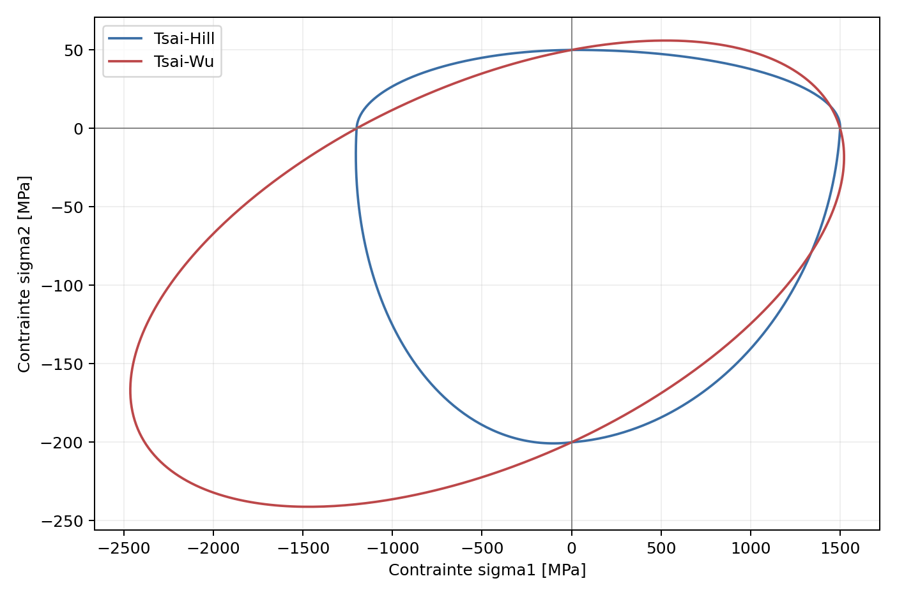

## Ce que cette campagne prouve

- integration analytique `A/B/D` pour les empilements canoniques;
- annulation des couplages attendus par symetrie et equilibre;
- transformation correcte d'une traction hors axe;
- decouplage membrane-flexion d'un stratifie symetrique;
- intercepts exacts des surfaces de rupture sur les cinq allowables.

## Ce qu'elle ne prouve pas

- convergence en maillage du MITC4 multicouche;
- comportement d'une plaque trouee, d'un panneau courbe ou d'un assemblage;
- correlation avec NAFEMS, Abaqus, Ansys, Code_Aster ou CalculiX;
- precision d'un `f12_star` non mesure;
- Hashin, Puck, delaminage, endommagement ou rupture progressive.

## Campagne structurelle

Identifiant : `VNV-COMP-STRUCTURAL-CONVERGENCE-002`.

La campagne structurelle utilise de vrais maillages MITC4 et se relance avec :

```powershell
python .\scripts\run_composite_structural_vnv.py `
  --output .\results\VNV-COMP-STRUCTURAL-CONVERGENCE-002
```

| Cas | Maillage fin | Indicateur | Valeur | Seuil | Verdict |
| --- | ---: | --- | ---: | ---: | --- |
| membrane `[0/90]s` | `16x8` | erreur maximale au champ CLT | `7,70e-15` | `1e-10` | PASS |
| flexion `[0/90]s` | `32x8` | erreur a la poutre Reissner-Mindlin | `5,25e-4` | `2e-3` | PASS |
| flexion `[+45/-45]s` | `64x16` | increment `48x12 -> 64x16` | `1,64e-3` | `2e-3` | PASS |
| ensemble | tous | residu libre maximal | `6,22e-9` | `1e-8` | PASS |

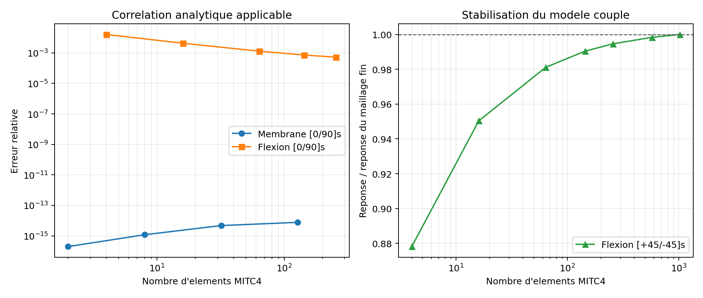

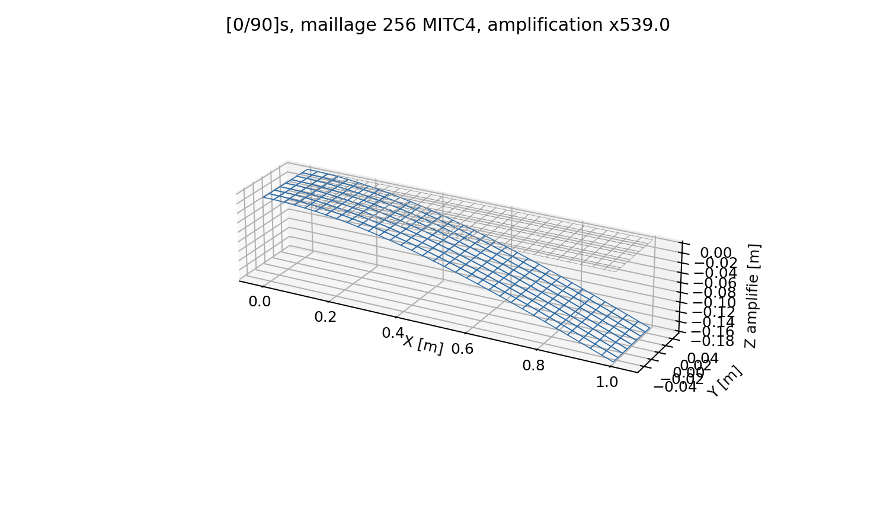

La reference poutre 1D est un oracle d'acceptation pour le `[0/90]s`. Elle
n'est qu'informative pour le `[+45/-45]s`, car elle ne represente pas tout le
couplage flexion-torsion du panneau. L'ecart final de `7,75 %` a cette formule
n'est donc pas masque : il reste publie comme limite de modele, tandis que
l'acceptation repose sur la stabilisation en maillage.

## Correlation CalculiX VNV-COMP-CALCULIX-S8R-003

```powershell
python .\scripts\run_calculix_composite_vnv.py `
  --output .\results\VNV-COMP-CALCULIX-S8R-003
```

La geometrie, l'empilement `[0/90]s`, l'encastrement et la force ponctuelle
sont identiques. L'interpolation differe volontairement : MITC4 lineaire dans
QF_solver, S8R quadratique composite dans CalculiX 2.20. CalculiX ne propose
pas son composite multicouche sur un quadrangle lineaire a quatre noeuds.

| Maillage | Ecart relatif de `UZ` |
| --- | ---: |
| `8x2` | `0,204 %` |
| `16x4` | `0,000941 %` |
| `32x8` | `0,0310 %` |

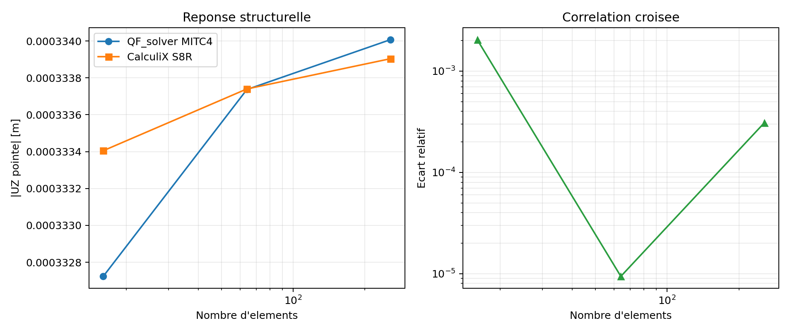

Le verdict externe est `PASS_EXTERNAL_CORRELATION`. Cette preuve porte sur la
reponse globale d'un panneau plat symetrique; elle ne valide ni les contraintes
interlaminaires, ni les panneaux courbes, ni l'endommagement progressif.

## Benchmark NAFEMS R0031/1 et Code_Aster VNV-COMP-NAFEMS-R0031-CODEASTER-004

La bande stratifiee en flexion trois points reprend le benchmark public
NAFEMS R0031/1 : quart de modele `25 x 5 mm`, sept plis
`[0/90/0/90/0/90/0]`, epaisseur totale `1 mm` et reference
`UZ(E)=-1,06 mm`. Le meme maillage et les memes conditions aux limites sont
resolus par QF_solver MITC4 et Code_Aster 18.1.0 DST/DSQ.

```powershell
python .\scripts\run_composite_nafems_code_aster_vnv.py `
  --output .\results\VNV-COMP-NAFEMS-R0031-CODEASTER-004
```

| Maillage | Elements | `UZ(E)` QF [mm] | `UZ(E)` Aster [mm] | Ecart QF/ref. | Ecart Aster/ref. | Ecart QF/Aster |
| --- | ---: | ---: | ---: | ---: | ---: | ---: |
| `10x2` | 20 | `-1,050640` | `-1,059952` | `0,8830 %` | `0,00452 %` | `0,8785 %` |
| `20x4` | 80 | `-1,059397` | `-1,063727` | `0,0569 %` | `0,3516 %` | `0,4071 %` |
| `40x8` | 320 | `-1,062388` | `-1,065414` | `0,2253 %` | `0,5108 %` | `0,2841 %` |
| `80x16` | 1 280 | `-1,063822` | `-1,066547` | `0,3606 %` | `0,6177 %` | `0,2555 %` |
| `160x32` | 5 120 | `-1,064851` | `-1,067529` | `0,4576 %` | `0,7103 %` | `0,2509 %` |

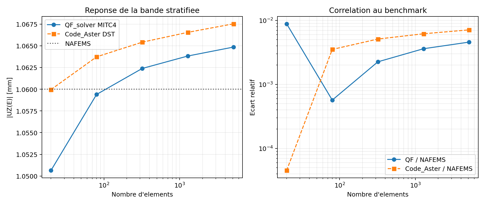

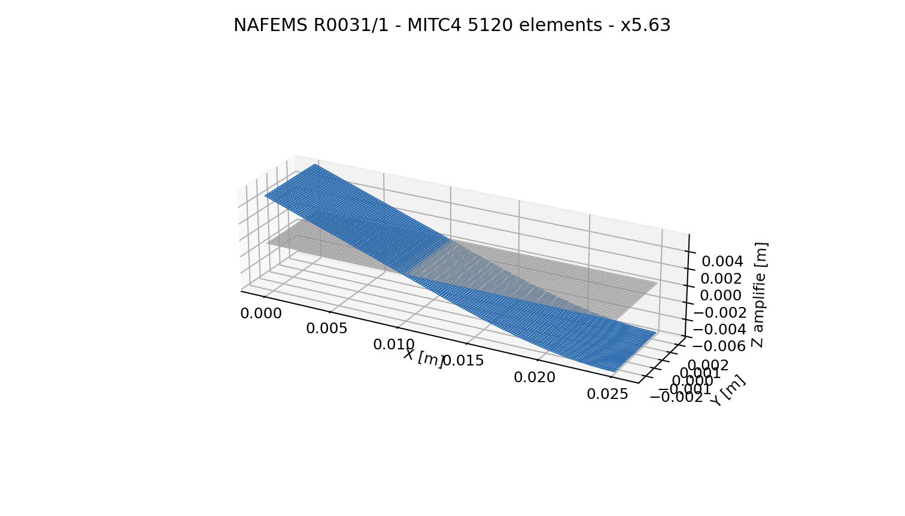

Le verdict est `PASS_EXTERNAL_CORRELATION`. Les seuils de `2 %` sur la
reference NAFEMS et entre solveurs sont respectes. Entre les deux derniers
maillages, la variation vaut `0,0967 %` pour QF_solver et `0,0920 %` pour
Code_Aster, sous le seuil de stabilisation `0,2 %`. L'eloignement leger et
commun de la valeur historique NAFEMS n'est donc pas une divergence. Le residu
libre maximal de QF_solver vaut `1,08e-9`, sous le seuil `1e-8`.

La valeur publique NAFEMS de `S11(E)=684 MPa` est conservee comme indicateur.
La sonde QF_solver au centre de l'element adjacent atteint `689,81 MPa` sur le
maillage fin, soit `0,850 %` d'ecart, mais elle n'est pas un critere
d'acceptation car sa localisation ne correspond pas exactement a la sortie
nodale du benchmark. La recuperation de `S13(D)=-4,1 MPa` reste ouverte : elle
necessite un post-traitement interlaminaire specifique.

La valeur NAFEMS utilisee ici est celle reproduite publiquement dans le guide
de verification Abaqus. Le rapport NAFEMS complet reste une source externe
controlee qui devra etre archivee si elle est acquise.

## Contraintes par pli hors singularites VNV-COMP-PLY-STRESS-005

Cette campagne repond a la recommandation de la revue mecanique du
`2026-07-26`. Elle compare les contraintes dans les axes materiau, aux faces
et au milieu de chaque pli, avec la theorie classique des stratifies.
L'acceptation exclut volontairement l'encastrement, le bord charge et les
bords lateraux : `0,2 <= x/L <= 0,8` et `|y|/W <= 0,4`.

```powershell
python .\scripts\run_composite_ply_stress_vnv.py `
  --output .\results\VNV-COMP-PLY-STRESS-005
```

| Cas fin `32x8` | Erreur L2 | Seuil | Verdict |
| --- | ---: | ---: | --- |
| membrane | `0,00389 %` | `0,01 %` | PASS |
| flexion | `0,254 %` | `0,5 %` | PASS |
| membrane + flexion | `0,0379 %` | `0,1 %` | PASS |
| combine, maillage interieur distordu de `15 %` | `1,056 %` | `2 %` | PASS |

Le residu libre maximal vaut `2,62e-10`, sous le seuil `1e-8`. Les erreurs
restent publiees : la distorsion degrade la recuperation locale, mais sans
instabilite ni perte d'equilibre sur le domaine teste.

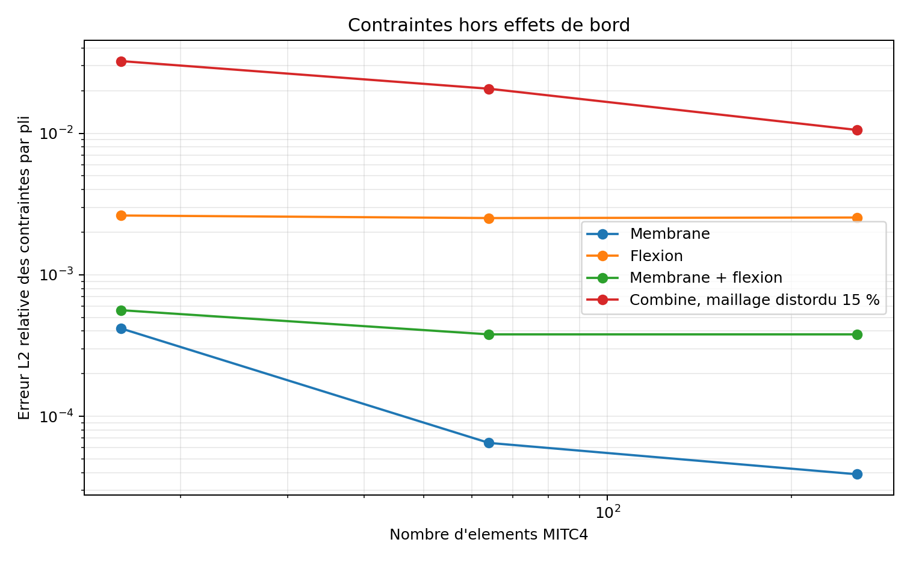

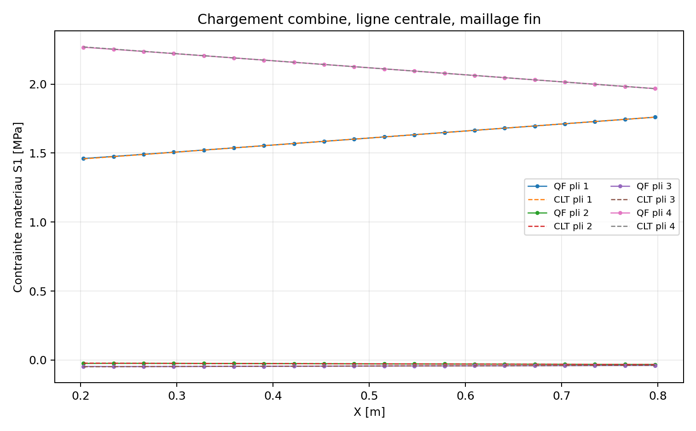

Cette preuve ne qualifie pas `S13`, les singularites de bord libre, le dommage
ou le transport continu d'une direction de fibre sur une coque courbe.

## Contraintes par pli coniques comparees a CalculiX

`VNV-COMP-CONICAL-CUTOUT-PLY-STRESS-CALCULIX-S8R-012` prolonge le panneau
conique `[0/+45/-45/90]` en dehors des deux zones non regulieres : bord libre
interieur et encastrement exterieur. La coordonnee de chemin est
`eta=(r-0,20)/0,55`; seules les facettes telles que `0,38 <= eta <= 0,62`
contribuent a la moyenne. QF_solver fournit `S11`, `S22`, `S12` au milieu de
chaque pli dans ses axes materiau. CalculiX 2.20 S8R fournit les memes axes par
la sortie d'orientation aux points d'integration, qui sont ensuite moyennes
par pli sur le meme chemin.

```powershell
python .\scripts\run_calculix_composite_conical_ply_stress_vnv.py `
  --output .\results\VNV-COMP-CONICAL-CUTOUT-PLY-STRESS-CALCULIX-S8R-012
```

| Maillage | Ecart L2 QF/CalculiX | Increment QF | Increment CalculiX |
| --- | ---: | ---: | ---: |
| `8x24` | `0,419 %` | - | - |
| `12x36` | `0,302 %` | - | - |
| `16x48` | `0,298 %` | `0,611 %` | `0,480 %` |

Le verdict est `PASS_EXTERNAL_CORRELATION` sous le seuil borne de `10 %`.
L'accord couvre les contraintes tangentielles de pli sur la couronne definie;
il ne couvre ni `S13`, ni les singularites de bord libre, ni delaminage,
endommagement ou rupture.

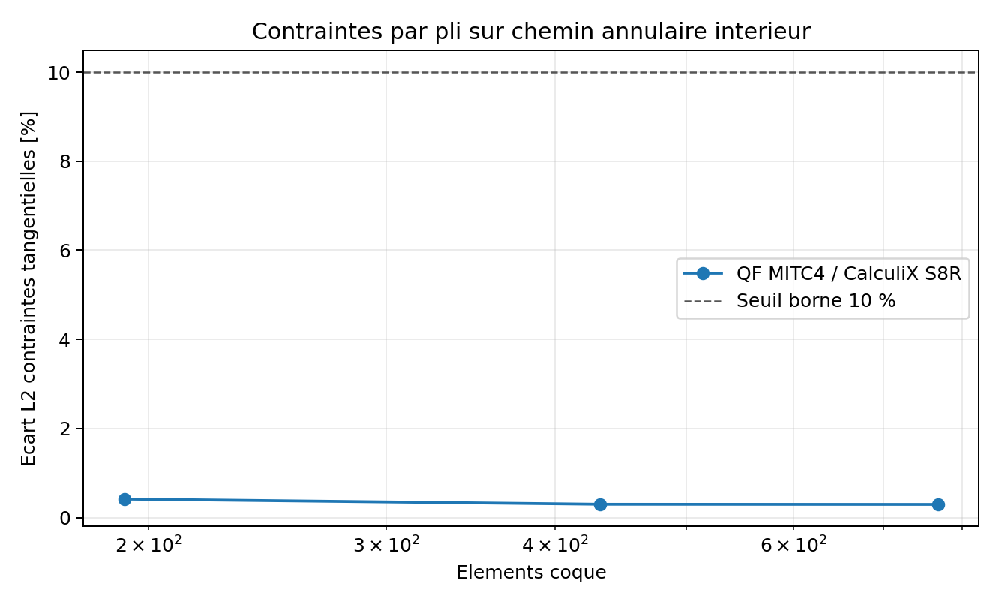

## Coque courbe et assemblage VNV-COMP-CURVED-ASSEMBLY-006

Le champ directeur optionnel `reference_direction` est projete sur chaque
facette. La campagne utilise un panneau cylindrique, une version perturbee et
un assemblage plie a deux faces sous traction et flexion combinees.

```powershell
python .\scripts\run_composite_curved_assembly_vnv.py `
  --output .\results\VNV-COMP-CURVED-ASSEMBLY-006
```

| Verification | Valeur | Seuil | Verdict |
| --- | ---: | ---: | --- |
| erreur de l'angle projete sur cylindre | `1,4e-14 deg` | `1e-10 deg` | PASS |
| increment final du cylindre | `1,063 %` | `2 %` | PASS |
| increment final de l'assemblage plie | `0,875 %` | `2 %` | PASS |
| ecart brut avec perturbation de `10 %` | `0,0485 %` | `5 %` | PASS |
| facettes gauches en profil qualifiable | `FAIL` attendu | `FAIL` | PASS politique |
| residu libre maximal | `1,79e-10` | `1e-8` | PASS |

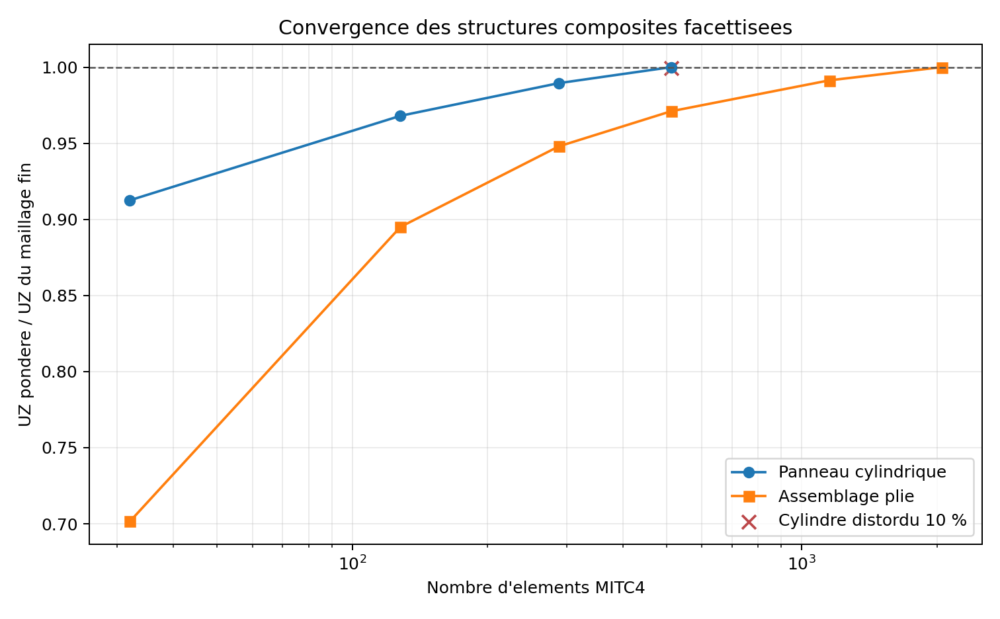

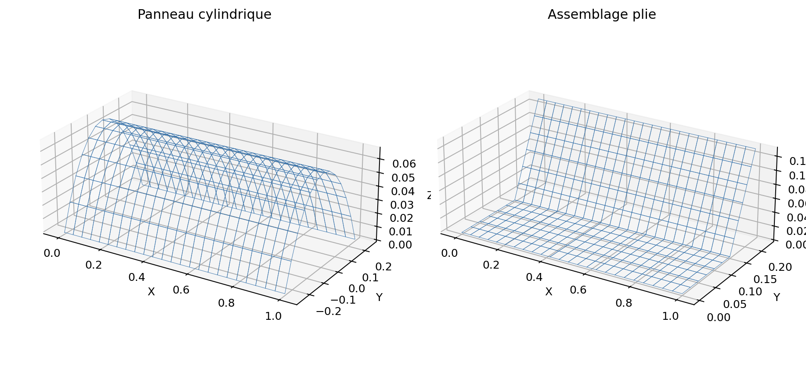

Le resultat brut du maillage perturbe est conserve comme diagnostic, mais il
n'est pas accepte : l'audit refuse l'equilibre global des moments sur ces
facettes gauches.

## Correlation courbe CalculiX VNV-COMP-CURVED-CALCULIX-S8R-007

La correlation externe reprend la meme surface moyenne cylindrique, un
empilement symetrique `[0/90/90/0]`, une direction materiau parallele a la
generatrice, le meme encastrement et les memes resultantes de bord. QF_solver
emploie MITC4 et CalculiX 2.20 son element composite quadratique S8R.

```powershell
python .\scripts\run_calculix_curved_composite_vnv.py `
  --output .\results\VNV-COMP-CURVED-CALCULIX-S8R-007
```

| Maillage | Ecart UX | Ecart UZ | Ecart vectoriel UX/UZ |
| --- | ---: | ---: | ---: |
| `8x4` | `0,377 %` | `0,656 %` | `0,655 %` |
| `16x8` | `0,193 %` | `0,506 %` | `0,506 %` |
| `24x12` | `0,184 %` | `0,225 %` | `0,225 %` |

Les increments entre les deux derniers maillages valent `0,245 %` pour
QF_solver et `0,0376 %` pour CalculiX. Tous les criteres passent et le verdict
est `PASS_EXTERNAL_CORRELATION`.

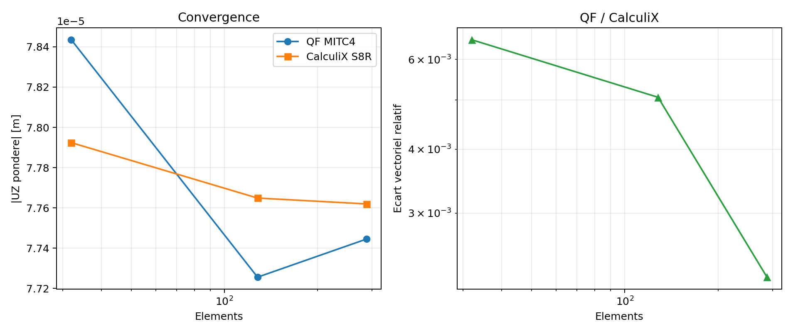

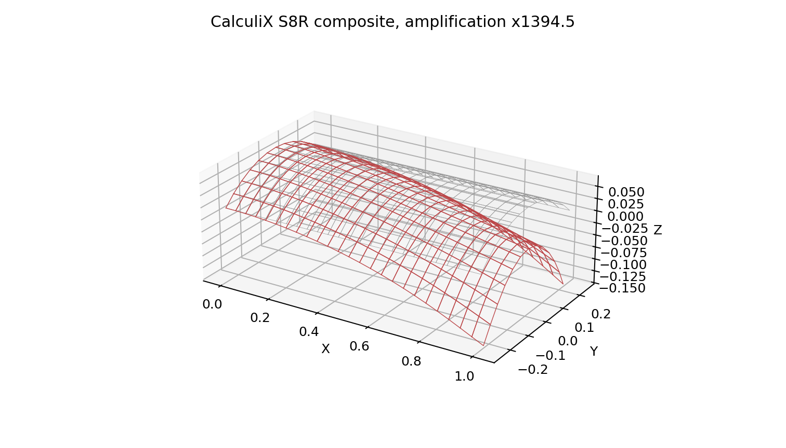

Cette preuve est volontairement bornee a l'axe longitudinal. Le premier jeu
exploratoire oblique tournait les reperes CalculiX en 3D avant leur projection,
ce qui ne representait pas la meme convention que QF_solver. Cette anomalie de
comparaison est traitee dans la campagne suivante.

## Orientation oblique courbe VNV-COMP-CURVED-ORIENTATION-008

La campagne applique la convention physique commune suivante :

1. projection de `reference_direction=[1,1,0]` dans le plan tangent;
2. rotation de chaque pli dans ce plan autour de la normale;
3. transmission directe a CalculiX des deux axes tangents obtenus.

Les orientations CalculiX sont definies par rangee circonferentielle et par
pli. Cela evite l'operation non equivalente consistant a tourner un repere 3D
avant de le projeter sur une surface courbe.

```powershell
python .\scripts\run_calculix_curved_orientation_vnv.py `
  --output .\results\VNV-COMP-CURVED-ORIENTATION-008
```

| Maillage | Elements | Ecart UX | Ecart UZ | Ecart vectoriel |
| --- | ---: | ---: | ---: | ---: |
| `8x4` | 32 | `0,0971 %` | `9,033 %` | `9,017 %` |
| `16x8` | 128 | `0,0118 %` | `3,069 %` | `3,064 %` |
| `24x12` | 288 | `0,115 %` | `0,839 %` | `0,838 %` |
| `48x24` | 1 152 | `0,133 %` | `1,152 %` | `1,150 %` |
| `96x48` | 4 608 | `0,0142 %` | `1,843 %` | `1,839 %` |

L'increment final vaut `0,730 %` pour QF_solver et `0,0473 %` pour
CalculiX. Le verdict est `PASS_EXTERNAL_CORRELATION` sous un seuil externe
borne de `3 %`. `ANOM-COMP-CURVED-ORIENTATION-001` est fermee : l'ecart
initial proche de `70 %` provenait d'un jeu d'orientation non equivalent.

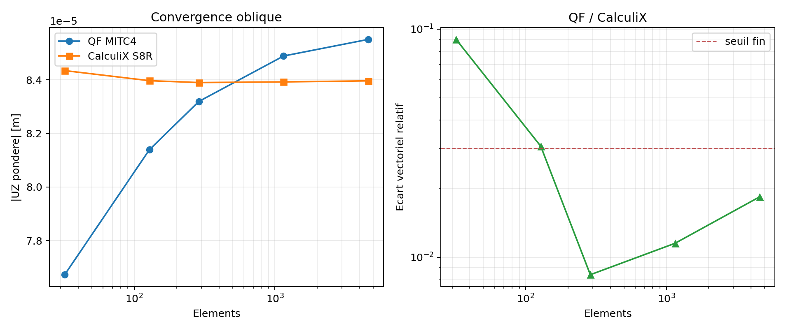

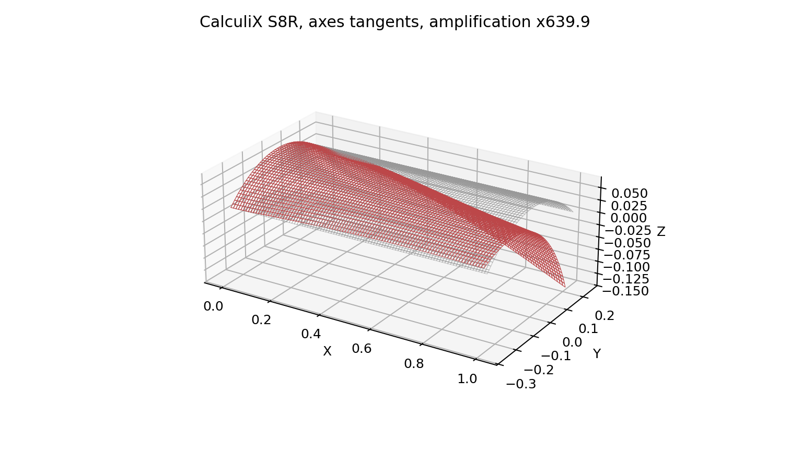

La recommandation `REC-COMP-CURVED-MODELFORM-001` conserve l'ecart residuel
MITC4 facettise/S8R quadratique comme limite de modele. Le seuil de `3 %`
n'est pas une tolerance generale pour toutes les coques composites.

## Decision actuelle

Le socle composite passe les preuves analytiques, la convergence structurelle,
les correlations externes planes et courbes, y compris l'orientation oblique,
ainsi que la comparaison des contraintes par pli hors singularites. La revue
mecanique a accepte le scope engineering interne avec recommandations le
`2026-07-26`. La maturite reste `experimental` : les facettes gauches, les
contraintes par pli sur coque courbe et les assemblages industriels complexes
ne sont pas encore acceptes.
