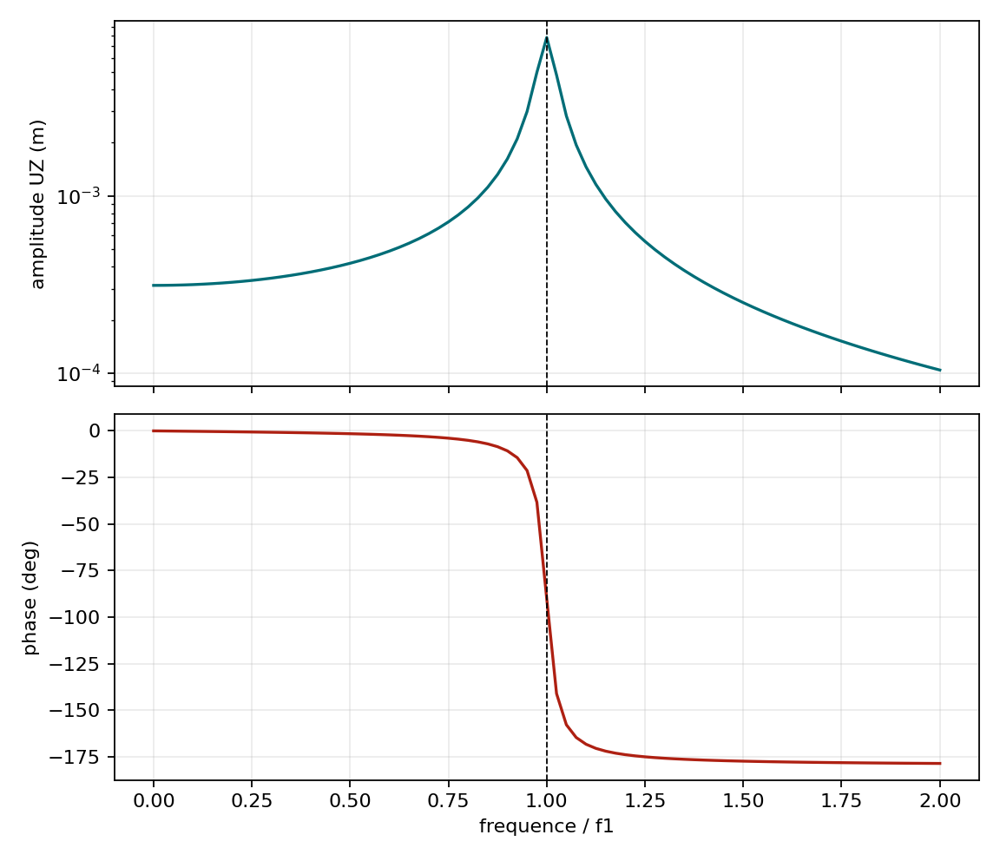
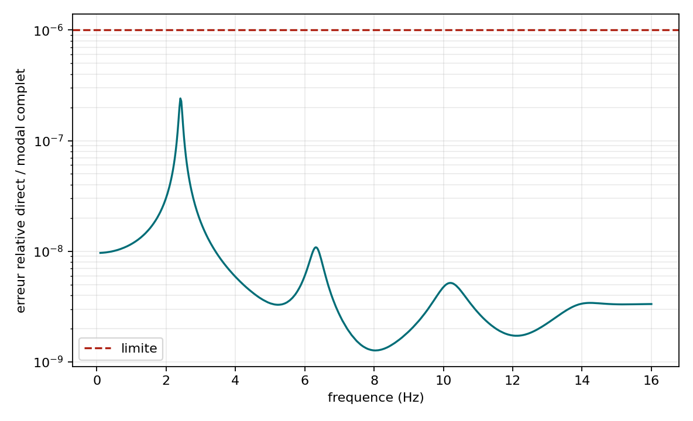

# Demonstrations harmoniques et non lineaires

## Reponse harmonique 1 ddl

Pour $m\ddot u+c\dot u+ku=F_0e^{i\omega t}$:

$$
\hat u=\frac{F_0}{k-m\omega^2+i c\omega}.
$$

La campagne compare amplitude et phase a plusieurs frequences, verifie la
limite statique a 0 Hz et observe la limitation du pic par l'amortissement.

{ .result-figure }

--8<-- "docs/generated/harmonic_results.md"

## Reponse harmonique MITC4

La campagne `VNV-MITC4-HARMONIC-MODAL-001` excite le premier mode d'un
porte-a-faux MITC4 par la charge modale $\mathbf f=\mathbf M\boldsymbol\phi_1$.
La reponse complexe numerique est comparee, sur 81 frequences, a

$$
\hat u_{tip}(\Omega)=
\frac{\phi_{1,tip}}
{\omega_1^2-\Omega^2+i\alpha\Omega}.
$$

La limite a 0 Hz, l'amplitude, la phase, le pic de resonance, le residu et la
sensibilite aux amortissements modaux de 1, 2 et 5 % sont controles. Les
rotations de drilling sans masse sont condensees puis reconstruites dans la
reponse complexe complete.

{ .result-figure }

{ .result-figure }

--8<-- "docs/generated/mitc4_harmonic_results.md"

### Preuve de condensation avec amortissement de rigidite

`VNV-MITC4-HARMONIC-CONDENSATION-002` compare l'algorithme condense au
systeme complexe complet sur 20 combinaisons de frequence et de
`rayleigh_beta`. Le chargement contient volontairement un moment `RZ`, afin de
tester le facteur $1/(1+i\omega\beta_R)$ de la reconstruction du drilling.

{ .result-figure }

--8<-- "docs/generated/mitc4_harmonic_condensation_results.md"

Le sous-perimetre technique `mitc4-harmonic-condensation` est `candidate`.
Cette decision porte sur l'identite algebrique et son implementation, pas sur
la validation complete de toutes les reponses harmoniques MITC4.

!!! info "Niveau de preuve"
    La condensation est `PASS`; les preuves large bande et externe ci-dessous
    sont egalement `PASS`. Le scope reste en `development` jusqu'a la revue
    mecanique formelle.

### Excitation large bande et quatre resonances

`VNV-MITC4-HARMONIC-BROADBAND-003` excite une plaque MITC4 par une force
decentree entre `0,1` et `16 Hz`. La resolution directe est comparee a une
superposition complete de `175` modes. L'accord est controle sur le champ
complexe entier, et pas uniquement sur une sonde.

{ .result-figure }

{ .result-figure }

{ .result-figure }

--8<-- "docs/generated/mitc4_harmonic_broadband_results.md"

### Correlation externe NAFEMS 13H

`VNV-MITC4-HARMONIC-NAFEMS13H-004` reproduit le cas publie par
Abaqus/Standard avec le meme maillage `8x8`, les memes blocages, la meme
pression, les memes coefficients de Rayleigh et le meme balayage de `200`
frequences. Les marqueurs Abaqus S4R et NAFEMS sont issus de la table
officielle.

{ .result-figure }

{ .result-figure }

{ .result-figure }

{ .result-figure }

--8<-- "docs/generated/mitc4_nafems13h_results.md"

La [fiche de revue mecanique](../verification/revue_mitc4_harmonique.md)
regroupe les quatre preuves et la decision `accepted_with_recommendations`.

## Non-linearite materielle

Le cas elastoplastique suit chargement, decharge et rechargement. Les criteres
portent sur le residu, la variable plastique cumulee, la continuite de la
contrainte et la tangente par differences finies.

Le meme protocole est execute sur une barre TET4 et sur une barre TET10. Pour
le TET10, les quatre etats plastiques de Hammer sont committes a chaque
increment. `VNV-J2-TET10-CYCLIC-001` controle le chemin plastique uniaxial,
la contrainte moyenne, le residu et les deux inversions de charge. Cette preuve
reste en developpement : la correlation structurelle externe et la decision
Owner sont encore ouvertes.

{ .result-figure }

{ .result-figure }

--8<-- "docs/generated/nonlinear_results.md"

!!! danger "Demonstration experimentale"
    Le passage des criteres programmes ne transforme pas la loi materiau en
    modele aeronautique qualifie. Une identification et une correlation
    experimentale independantes restent obligatoires.
