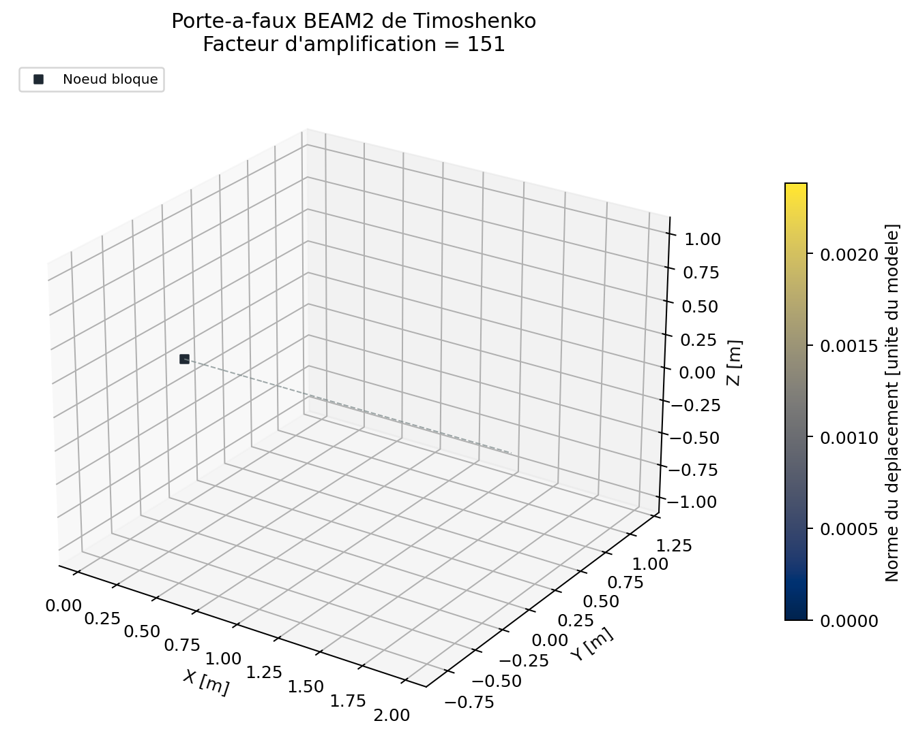
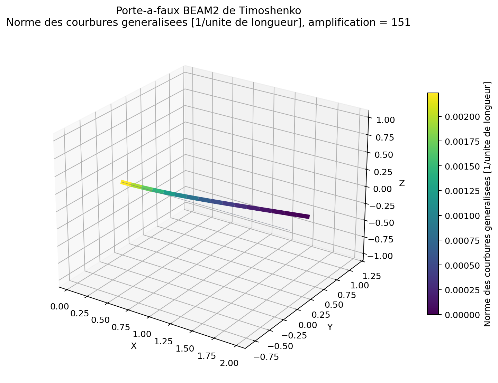
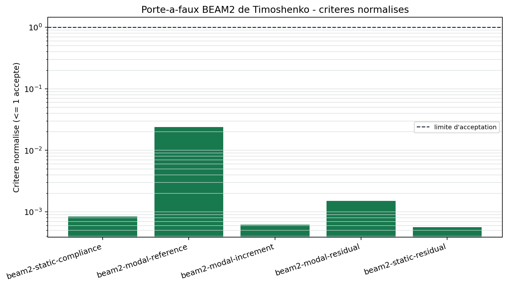

# Porte-a-faux BEAM2 statique et modal

## Objet

`BM-BEAM2-CANTILEVER-001` verifie la compliance statique et la convergence de
la premiere frequence propre d'une poutre droite encastree. Il contient des
modeles assembles de `1`, `2`, `4`, `8` et `16` elements. La preuve externe
complementaire `VNV-BEAM2-CODEASTER-POUDE-001` couvre la statique, et
`VNV-BEAM2-MODAL-CODEASTER-POUDE-002` couvre les six modes d'un porte-a-faux
elance avec la masse corrigee.

Le statut reste `experimental`. Les preuves actuelles ne couvrent pas encore
les poutres epaisses, l'amortissement, les sections variables, les articulations
ou les assemblages dynamiques.

## Modele

La poutre a une longueur de `2 m`, une section constante et un materiau
isotrope. Son noeud d'origine est bloque sur les six degres de liberte. La
statique utilise une charge lineique uniforme dans l'axe local `y`; le calcul
modal est non charge et emploie la masse coherente.

| Grandeur | Valeur |
| --- | ---: |
| Module d'Young | `210 GPa` |
| Coefficient de Poisson | `0.3` |
| Aire | `0.01 m2` |
| `Iy` | `2e-6 m4` |
| `Iz` | `3e-6 m4` |
| `J` | `5e-6 m4` |
| Masse volumique | `7800 kg/m3` |
| Charge lineique | `750 N/m` |

## Champs et resultats regeneres

{ .result-figure }

{ .result-figure }

La seconde figure localise la courbure elementaire sur la deformee amplifiee.
Elle ne remplace pas les six efforts generalises locaux, conserves dans le
resultat JSON.

{ .result-figure }

--8<-- "docs/generated/benchmarks/bm-beam2-cantilever-001_results.md"

## References

Pour une poutre de Timoshenko sous charge repartie uniforme `q`, la fleche de
bout est :

\[
u_y(L) = \frac{q L^4}{8 E I_z} + \frac{q L^2}{2 \kappa G A}.
\]

La premiere frequence est comparee a la limite elancee Euler-Bernoulli :

\[
f_1 = \frac{\beta_1^2}{2 \pi L^2}\sqrt{\frac{E I_{min}}{\rho A}},
\qquad \beta_1 = 1.8751040687.
\]

Cette formule est une reference asymptotique. Elle n'inclut ni cisaillement ni
inertie rotatoire. La campagne externe utilise un cas elance dedie afin
d'isoler les conventions de masse et de repere : l'ecart maximal sur six modes
avec Code_Aster 18.1.0 `POU_D_E` est `0,0265 %`.

## Criteres automatiques

- erreur statique maximale : `1e-10`;
- erreur modale finale : `2 %`;
- increment relatif entre les deux derniers maillages : `0.5 %`;
- residu modal relatif : `1e-8`;
- residu statique libre : `1e-8`;
- correlation modale externe elancee : `1 %` par mode.

## Execution

```powershell
python .\qf_solver.py benchmark --case BM-BEAM2-CANTILEVER-001 --output results\benchmarks
python .\scripts\run_code_aster_beam2_modal_vnv.py --output results\VNV-BEAM2-MODAL-CODEASTER-POUDE-002
```

Le premier dossier contient modeles, resultats JSON, deformees VTU, resume de
campagne et manifeste d'empreintes. Le second necessite Docker et l'image
Code_Aster epinglee; il produit les jeux `mail` et `comm`, les frequences,
le rapport Markdown et son manifeste.

## Limites

Cette demonstration ne valide pas les poutres courbes, offsets, flambement,
grandes rotations ou non-linearites. Une etude distincte est requise avant
toute utilisation dynamique de poutre epaisse ou d'assemblage.

Reference principale : S. P. Timoshenko, *On the correction for shear of the
differential equation for transverse vibrations of prismatic bars*, 1921,
[DOI](https://doi.org/10.1080/00423114.1921.10731255).
