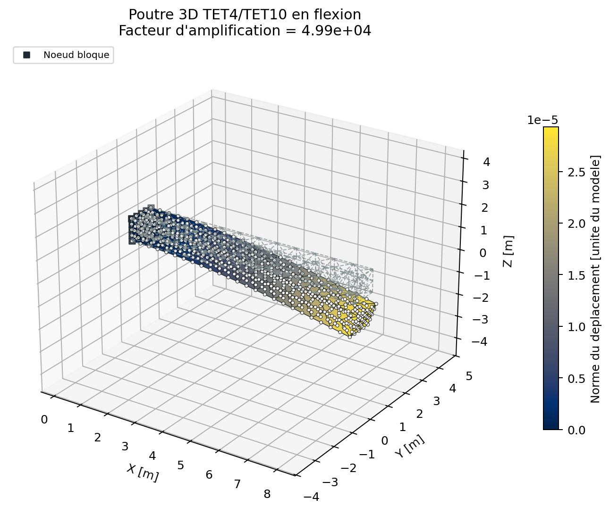
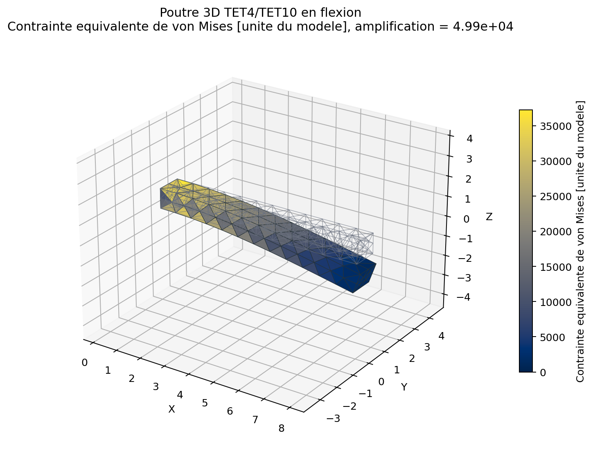
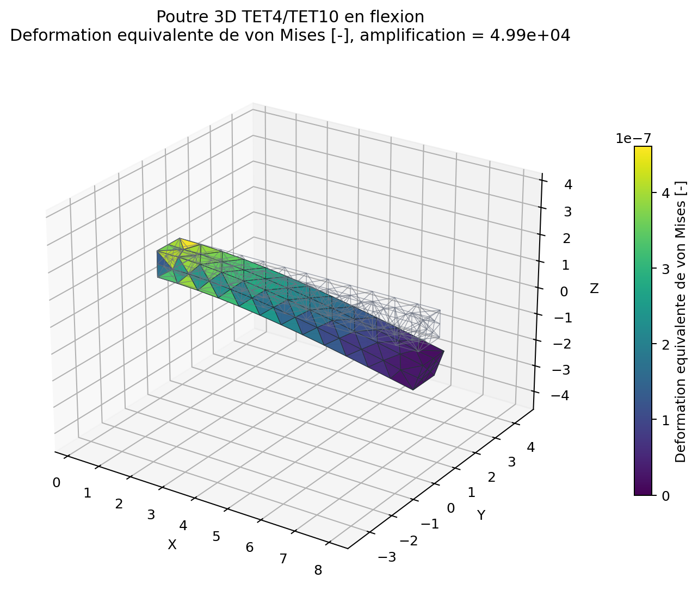
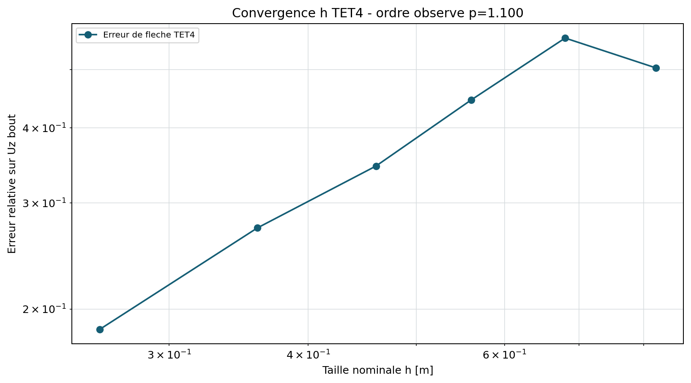
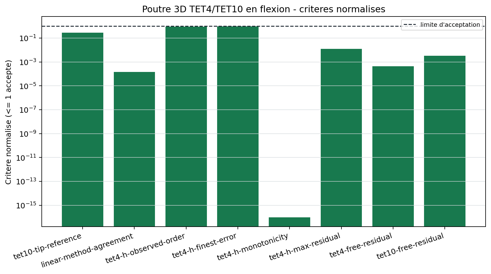

# Poutre 3D TET4/TET10 en flexion

<span class="maturity reinforced">stable apres tests renforces</span>

`BM-SOL-CANTILEVER-001` compare deux discretisations volumiques du meme
porte-a-faux, puis confronte les cinq solveurs lineaires au resultat direct.

## Reference mecanique

Pour une force terminale $F$, la fleche de reference inclut flexion et
cisaillement de Timoshenko:

$$
w(L)=\frac{FL^3}{3EI}+\frac{FL}{\kappa GA},
\qquad \kappa=\frac56.
$$

Cette expression est une reference asymptotique de poutre, pas la solution
fermee exacte du continuum 3D. Le critere porte donc sur le maillage TET10 fin
et reste borne a la geometrie publiee.

## Maillages et conditions aux limites

Deux maillages Gmsh de meme taille nominale sont generes: tetraedres lineaires
et tetraedres quadratiques. La face $x=0$ est encastree. Une traction uniforme
sur $x=L$ donne la force et le moment attendus sans dependance au nombre de
noeuds de bord.

Six maillages TET4 supplementaires, de tailles nominales decroissantes,
sont resolus avec les memes donnees. L'ordre observe est la pente de la
regression lineaire de $\log(e_h)$ sur $\log(h)$ sur les trois derniers
niveaux. Les maillages grossiers non structures peuvent osciller avant la zone
asymptotique; ils restent publies dans le tableau, mais ne pilotent pas le
critere de monotonie. La reference de Timoshenko n'etant pas la solution exacte
du continuum 3D encastre, ce controle qualifie une tendance sur l'intervalle
publie et non un ordre asymptotique universel.

{ .result-figure }

{ .result-figure }

{ .result-figure }

{ .result-figure }

## Comparaison algebrique

`direct`, `CG`, `GMRES`, `BiCGSTAB` et `MINRES` utilisent la meme matrice et le
meme second membre. Les methodes iteratives emploient Jacobi ou ILU selon leurs
hypotheses. La norme relative des differences de deplacement doit rester sous
la limite du registre.

{ .result-figure }

## Conclusion de convergence

La conclusion numerique est regeneree avec le tableau ci-dessous. Elle porte
sur la fleche moyenne de la face libre et sur la zone asymptotique des niveaux
4 a 6. La reference de Timoshenko n'est pas une solution exacte du continuum
3D; la preuve ne doit donc pas etre etendue automatiquement aux contraintes
locales de l'encastrement.

--8<-- "docs/generated/benchmarks/bm-sol-cantilever-001_results.md"

## Reproduction et portee

```powershell
qf-solver benchmark --case BM-SOL-CANTILEVER-001 --output results/benchmarks
```

Le cas detecte aussi les erreurs de permutation des noeuds d'arete TET10 et
de transformation $J^{-T}$. References:
[REF-FEM-BATHE](../../reference/references.md#ref-fem-bathe),
[REF-CG-1952](../../reference/references.md#ref-cg-1952),
[REF-GMRES-1986](../../reference/references.md#ref-gmres-1986).
