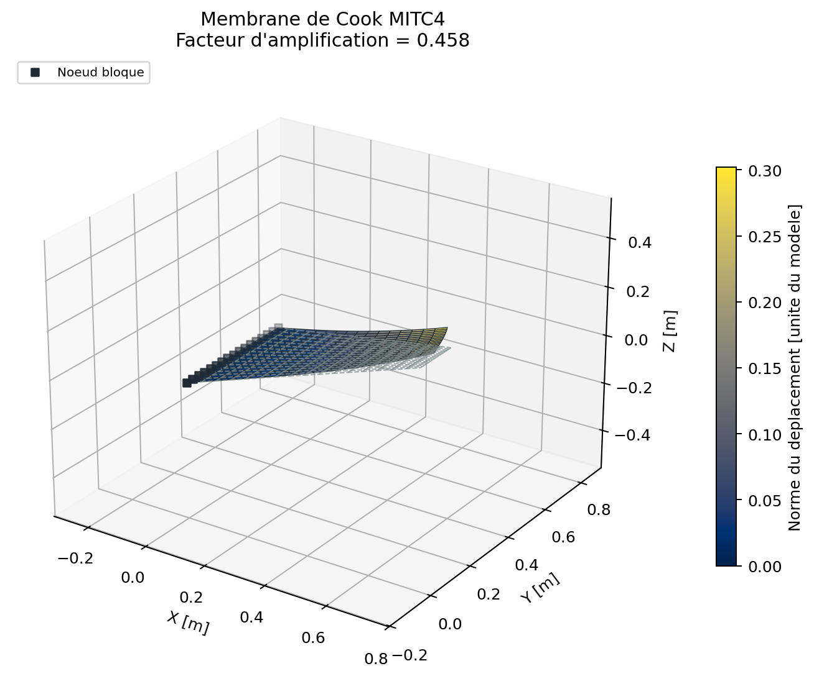
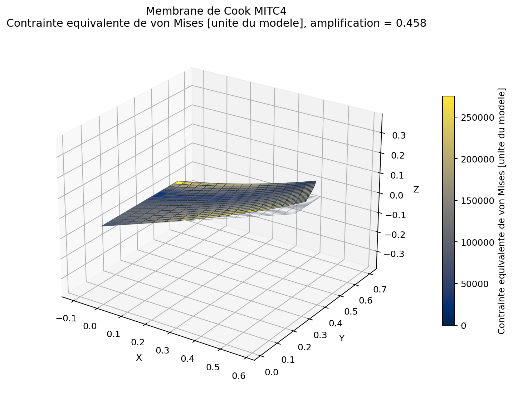
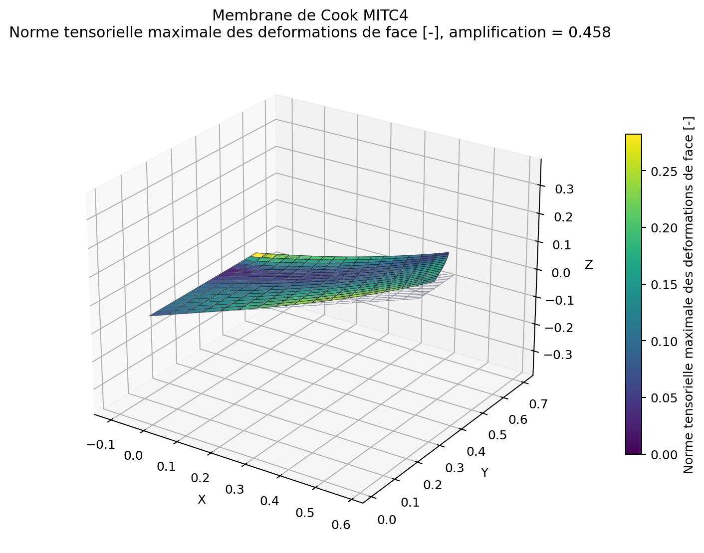
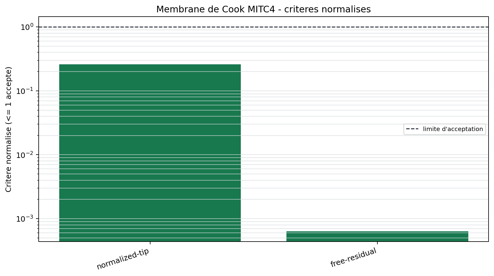

# Membrane de Cook MITC4

<span class="maturity stable">stable</span>

`BM-SHL-COOK-001` est un obstacle course de membrane fortement distordue. Il
teste le repere local, le mapping bilineaire, l'assemblage des ddl de coque et
la traction coherente sur une arete physique.

## Modele

La geometrie trapezoidale est encastree sur l'arete gauche et chargee en
cisaillement sur l'arete droite. La grandeur d'interet est le deplacement
vertical du coin charge. La valeur normalisee de reference vient de la
campagne MacNeal-Harder.

Le cas est essentiellement membranaire. Il ne constitue donc pas, seul, une
preuve du comportement en flexion ou du traitement du cisaillement transverse.

{ .result-figure }

{ .result-figure }

{ .result-figure }

## Acceptation

Le deplacement est normalise par $F/(Et)$ puis compare a la valeur de
reference. Le residu des ddl libres verifie que l'ecart mecanique n'est pas
masque par une resolution algebrique incomplete.

{ .result-figure }

--8<-- "docs/generated/benchmarks/bm-shl-cook-001_results.md"

## Reproduction

```powershell
qf-solver benchmark --case BM-SHL-COOK-001 --output results/benchmarks
```

Reference: [REF-SHELL-OBSTACLE](../../reference/references.md#ref-shell-obstacle).
Code: `solveur/benchmarks/shell.py`, `mitc4/element.py`. Exigences:
`REQ-SOL-002`, `REQ-MESH-002`, `REQ-CMP-003`.
