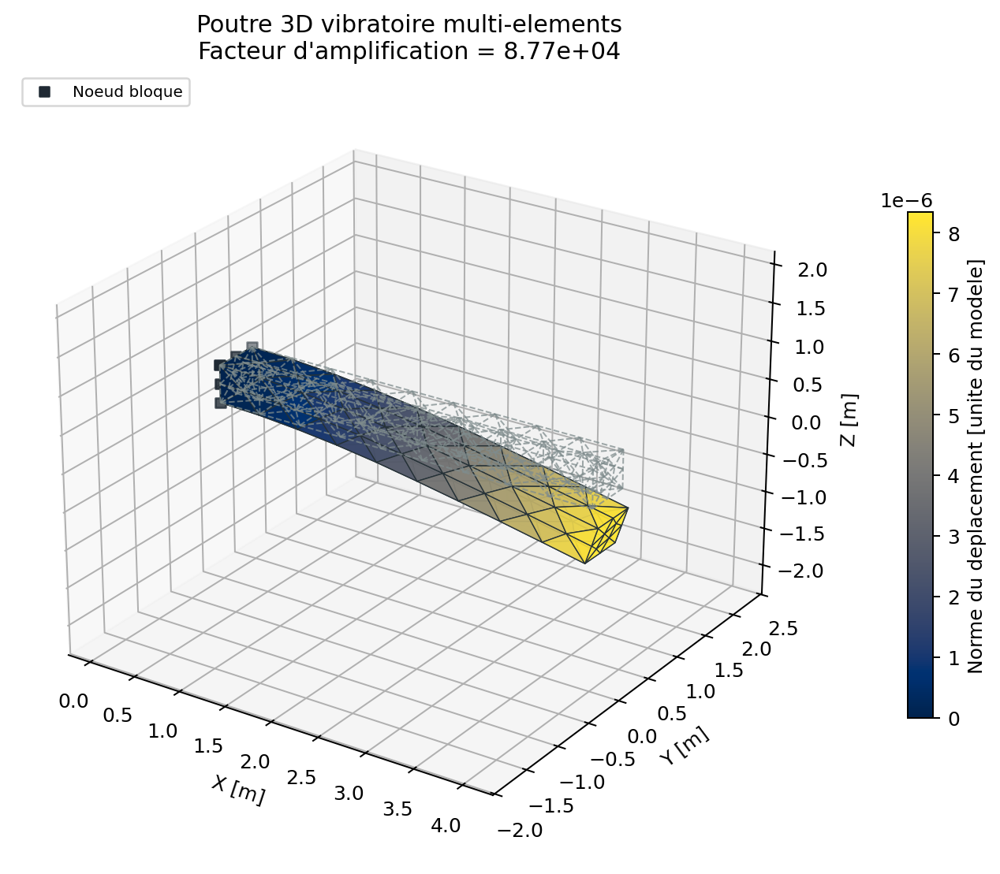
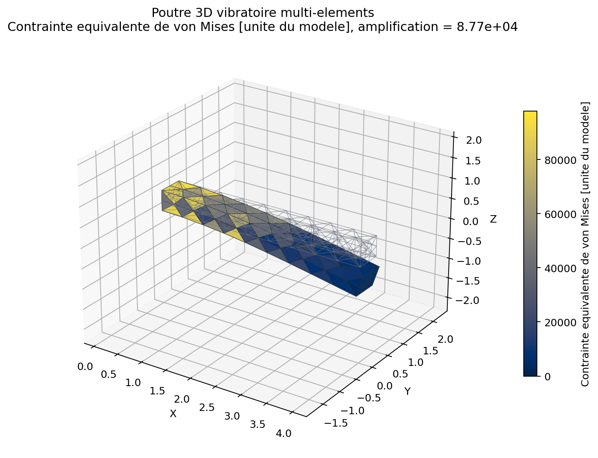
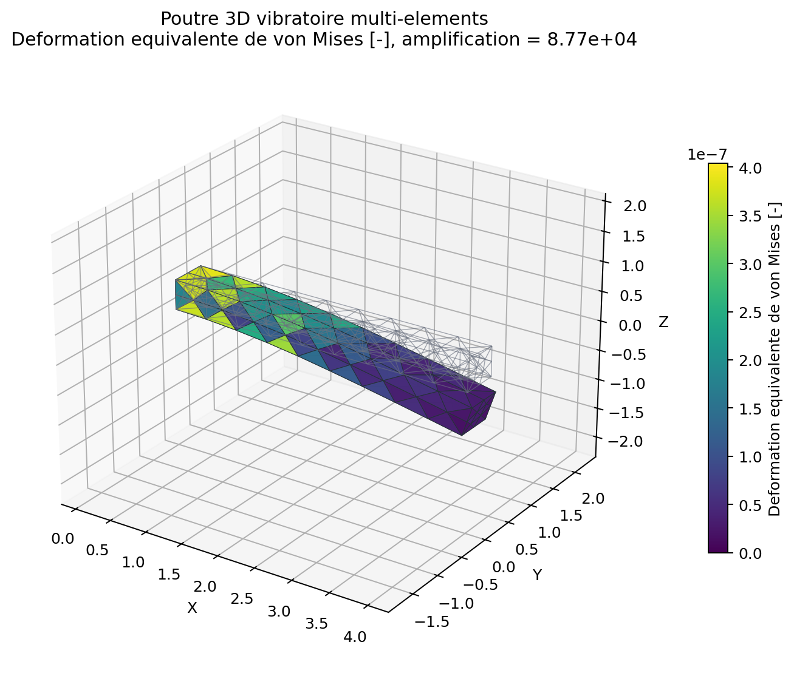
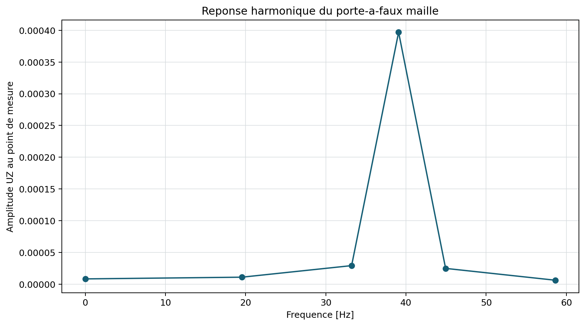
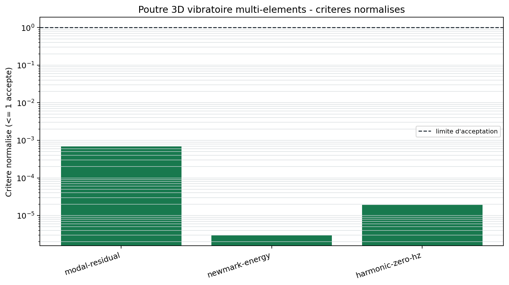

# Porte-a-faux 3D modal, Newmark et harmonique

<span class="maturity reinforced">stable apres tests renforces</span>

`BM-DYN-CANTILEVER-001` reutilise une unique matrice de rigidite et une masse
coherente TET4 pour trois analyses vibratoires independantes.

## Modal

Le probleme generalise est

$$
\mathbf K\boldsymbol\phi_i=\omega_i^2\mathbf M\boldsymbol\phi_i.
$$

Chaque paire propre est controlee par son residu relatif. Les orthogonalites
de masse et de rigidite ainsi que les masses modales effectives sont exportees.
La premiere frequence est comparee a Euler-Bernoulli a titre indicatif.

## Newmark

Le premier mode initialise une vibration libre. Le schema moyen constant
$(\beta,\gamma)=(1/4,1/2)$ doit conserver l'energie mecanique en absence
d'amortissement, a la tolerance numerique du calcul.

## Harmonique

La reponse complexe resout

$$
(\mathbf K+i\omega\mathbf C-\omega^2\mathbf M)\hat{\mathbf u}=\hat{\mathbf f}.
$$

Le point a 0 Hz doit retrouver la solution statique. Le balayage traverse la
premiere resonance avec un amortissement de Rayleigh explicite.

{ .result-figure }

{ .result-figure }

{ .result-figure }

{ .result-figure }

{ .result-figure }

--8<-- "docs/generated/benchmarks/bm-dyn-cantilever-001_results.md"

## Reproduction

```powershell
qf-solver benchmark --case BM-DYN-CANTILEVER-001 --output results/benchmarks
```

Reference: [REF-NEWMARK-1959](../../reference/references.md#ref-newmark-1959).
Exigences: `REQ-MOD-001`, `REQ-DYN-001`, `REQ-DYN-002`, `REQ-HAR-001`.
