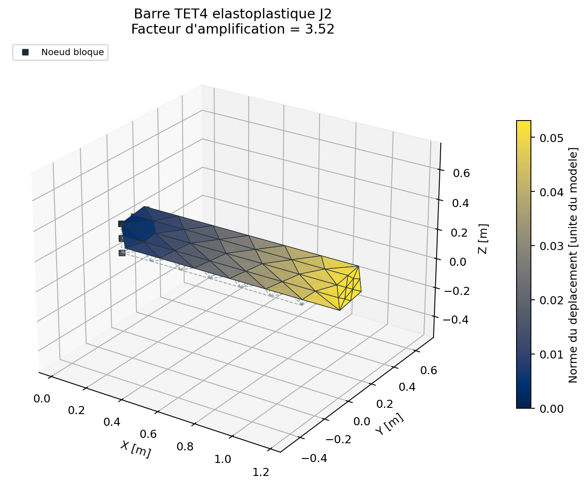
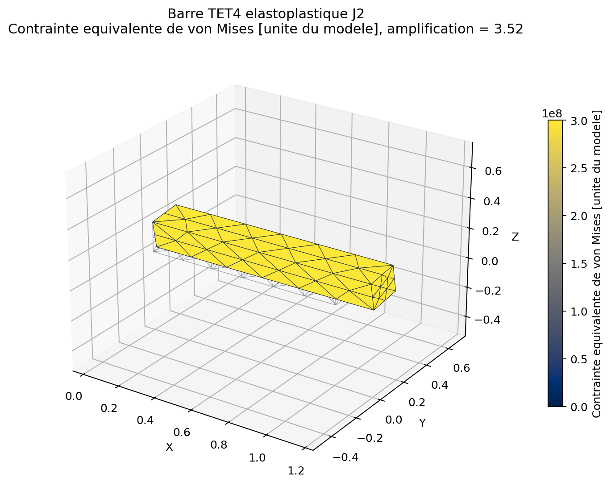
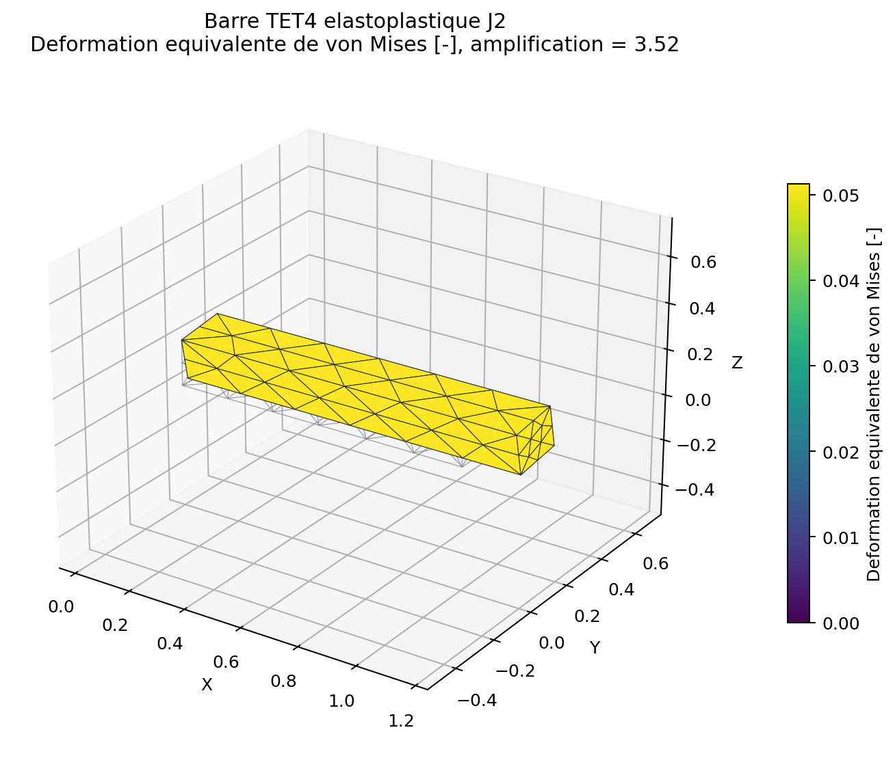
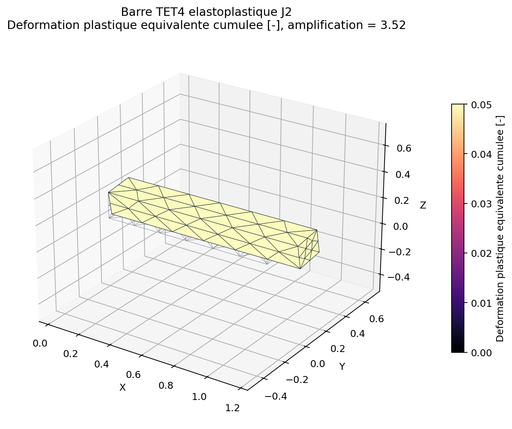
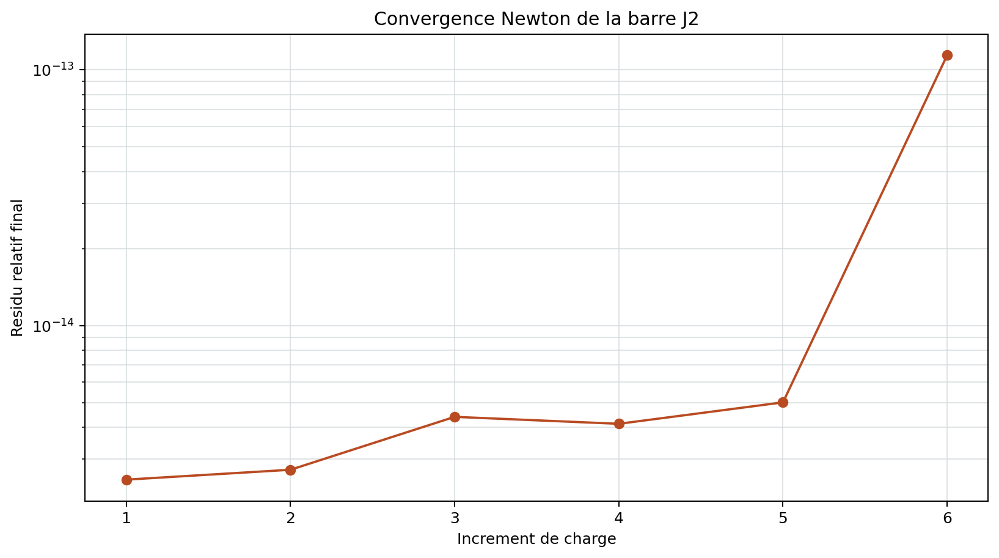
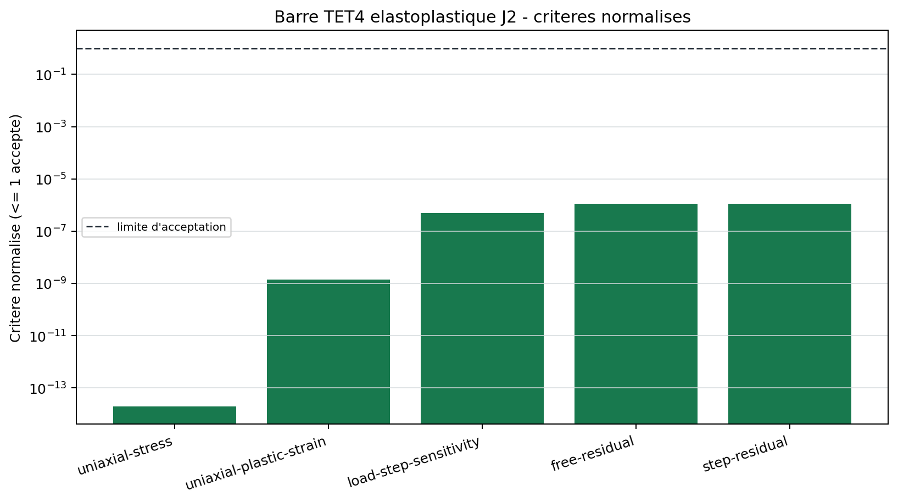

# Barre multi-elements elastoplastique J2

<span class="maturity experimental">experimental</span>

`BM-NL-J2-BAR-001` verifie un trajet de chargement monotone au-dela de la
limite elastique avec retour radial J2 et ecrouissage isotrope.

## Conditions uniaxiales

La face d'entree bloque uniquement le deplacement axial. Trois contraintes
ponctuelles minimales retirent les translations et rotations rigides sans
empecher la contraction de Poisson. Cette condition remplace un encastrement
complet, qui introduirait un etat triaxial parasite.

Sous traction imposee $\sigma$, la loi bilineaire de reference donne apres
plastification une evolution de deformation plastique gouvernee par le module
d'ecrouissage. La contrainte moyenne des elements est comparee a la traction
appliquee; l'equilibre et chaque pas de Newton sont controles separement.

{ .result-figure }

{ .result-figure }

{ .result-figure }

{ .result-figure }

{ .result-figure }

{ .result-figure }

--8<-- "docs/generated/benchmarks/bm-nl-j2-bar-001_results.md"

## Reproduction et restriction

```powershell
qf-solver benchmark --case BM-NL-J2-BAR-001 --output results/benchmarks
```

Le cas reste `WARNING`: petits deplacements, chargement monotone et modele J2
simple ne couvrent ni grandes transformations, ni contact, ni endommagement.
Reference: [REF-J2-SIMO-1985](../../reference/references.md#ref-j2-simo-1985).

## Verification au point materiel

La campagne `VNV-J2-MATERIAL-CYCLIC-001` complete le benchmark de structure.
Elle compare la loi locale a une solution uniaxiale bilineaire sur 81 niveaux
de contrainte. L'erreur relative maximale mesuree sur la deformation totale est
inferieure a `1e-10`. Cinq tangentes, elastiques et plastiques, sont aussi
comparees par differences finies; l'erreur maximale observee vaut environ
`2.01e-11` pour une limite de `1e-6`.

La campagne verifie en plus :

- la condition de charge `q = sigma_y + H p` apres retour plastique ;
- la croissance monotone de la deformation plastique equivalente ;
- la dissipation plastique non negative ;
- la plasticite parfaite et l'ecrouissage isotrope ;
- le chargement, la decharge, la recharge et un changement de direction dans
  l'espace des contraintes.

Le rapport reproductible est genere par :

```powershell
python .\scripts\run_j2_material_vnv.py --output .\results\VNV-J2-MATERIAL-CYCLIC-001
```

## Correlation Abaqus publiee

Les quatre premiers increments monotones du benchmark officiel Abaqus
[Uniformly loaded, elastic-plastic plate](https://docs.software.vt.edu/abaqusv2024/English/SIMACAEBMKRefMap/simabmk-c-elasticplasticplate.htm)
sont compares aux deformations plastiques exactes publiees.

| Increment | Contrainte [MPa] | Deformation plastique exacte | QF_solver | Ecart absolu |
| ---: | ---: | ---: | ---: | ---: |
| 1 | 68.947573 | 0.000000 | 0.000000 | < 1e-15 |
| 2 | 103.421359 | 0.000500 | 0.000500 | < 1e-15 |
| 3 | 137.895146 | 0.001000 | 0.001000 | < 1e-15 |
| 4 | 172.368932 | 0.001500 | 0.001500 | < 1e-15 |

Cette correlation est volontairement limitee aux increments 1 a 4. Le
[fichier d'entree Abaqus officiel](https://docs.software.vt.edu/abaqusv2024/English/SIMAINPRefResources/elasticplasticplate_cps8r_uni.inp)
emploie `HARDENING=KINEMATIC`; les increments 5 a 10 avec inversion du
chargement ne sont donc pas physiquement equivalents a l'ecrouissage isotrope
de QF_solver. Les valeurs sont des resultats publies, pas une execution Abaqus
locale. L'alias Abaqus 2019 trouve sur la machine pointe vers un lanceur absent.

Une correlation CalculiX `2.20` avec ecrouissage isotrope est maintenant
executee sur un C3D8 homogene. A `0,242857 %` de deformation axiale, CalculiX,
QF_solver et la theorie donnent `S11=300 MPa` et `PEEQ=0,001`. L'ecart relatif
de deformation CalculiX/theorie vaut `1,76e-7`; l'ecart d'energie vaut
`0,1317 %`, sous la limite de `0,5 %`.

```powershell
python .\scripts\run_calculix_j2_vnv.py --output .\results\VNV-J2-CALCULIX-ISOTROPIC-002
```

Le dossier contient l'entree `.inp`, la sortie `.dat`, le journal Docker, le
rapport Markdown, le resume JSON et une figure de la geometrie/deformee.

## Correlation Code_Aster VMIS_ISOT_LINE

`VNV-J2-CODEASTER-VMIS-ISOT-LINE-004` execute Code_Aster `18.1.0` dans
l'image Docker epinglee sur un cube maille par cinq `TETRA4`. Le champ de
deplacement affine impose l'etat uniaxial exact a `S11=300 MPa`. Code_Aster
utilise `VMIS_ISOT_LINE`, `DEFORMATION="PETIT"` et dix increments.

La convention de parametre est traitee explicitement : QF_solver emploie le
module d'ecrouissage plastique `H=50 000 MPa`, tandis que `ECRO_LINE` attend
la pente contrainte-deformation totale :

```text
Et = E H / (E + H) = 40 384,615 MPa
```

| Indicateur | Ecart relatif |
| --- | ---: |
| Code_Aster / theorie, contrainte axiale | `3,79e-16` |
| Code_Aster / theorie, deformation plastique equivalente | `4,34e-16` |
| Contrainte laterale / contrainte axiale | `2,94e-16` |
| Heterogeneite maximale du champ | `3,79e-16` |

```powershell
python .\scripts\run_code_aster_j2_vnv.py
```

Le digest public est
`qualification/external_reference_digests/code_aster_j2.json`. Les journaux
Docker et fichiers de travail restent dans `results/` et ne sont pas publies.
Cette preuve couvre un chargement monotone affine; le cycle structurel reste
couvert separement par QF_solver.

## Verification structurelle TET4

La barre maillee `BM-NL-J2-BAR-001` impose des faces libres lateralement et une
traction uniforme de `300 MPa`. La reference bilineaire donne une deformation
plastique equivalente de `0.05`. La campagne controle maintenant cette grandeur
directement et repete la resolution avec `3`, `6` et `12` increments.

| Indicateur | Valeur mesuree | Limite |
| --- | ---: | ---: |
| Erreur moyenne de contrainte axiale | `3.97e-16` | `2e-2` |
| Erreur de deformation plastique | proche precision machine | `1e-6` |
| Sensibilite 3/6/12 increments | `4.96e-13` | `1e-6` |
| Residu relatif sur DDL libres | `1.12e-13` | `1e-7` |

Ce resultat verifie le passage point materiel vers une structure TET4
multi-elements en chargement monotone. Le cycle et la restauration des
variables internes sont traites par la campagne distincte ci-dessous.

## Cycle structurel et rollback

`VNV-J2-TET4-CYCLIC-003` emploie une barre de `140` TET4 et un cycle de charge
d'amplitude croissante `+300 MPa`, `-360 MPa`, puis `+420 MPa`. Cette amplitude
est necessaire avec l'ecrouissage isotrope : revenir seulement a `-300 MPa`
atteint la surface agrandie sans produire de nouvel ecoulement plastique.

| Indicateur | Valeur | Limite |
| --- | ---: | ---: |
| Ecart maximal barre/oracle material-point | `5,02e-11` | `1e-8` |
| Ecart de contrainte finale | `1,68e-11` | `1e-8` |
| Residu maximal | `2,41e-8` | `1e-7` |
| Croissance plastique pendant l'inversion | `0,0012` | `> 1e-6` |
| Croissance plastique pendant la recharge | `0,0012` | `> 1e-6` |

Le test transactionnel injecte volontairement un premier essai contamine avec
`u=123` et `p=999`, puis force son rejet. La tentative suivante retrouve
exactement `u=0` et `p=0`; le resultat final compte un rejet et ne contient
aucune valeur contaminee.

La baseline publiee utilise Newton complet. La recherche lineaire Armijo franchit
desormais les inversions et les passages par charge nulle sur le meme chemin :
le residu y est normalise par la norme de la charge de reference, et non par la
charge cible instantanee qui s'annule au croisement. Un test de regression isole
explicitement ce cas de bruit numerique.

```powershell
python .\scripts\run_j2_structural_vnv.py --output .\results\VNV-J2-TET4-CYCLIC-003
```

## Sensibilite aux increments

`VNV-J2-STEP-SENSITIVITY-005` subdivise chacune des trois branches du cycle
`0 -> +300 -> -360 -> +420 MPa` en `4`, `8` puis `16` intervalles, soit
`12`, `24` et `48` increments. Les valeurs aux retournements, le deplacement
axial final, la contrainte finale, la deformation plastique equivalente et les
travaux incrementaux sont compares au chemin le plus fin.

La campagne impose une sensibilite d'etat inferieure a `1e-8`; elle mesure
`9,49e-11`. Le travail trapezoidal est volontairement controle separement :
l'ecart `24 -> 48` increments vaut environ `1,93 %` pour une limite de `2 %`.
Le niveau 12 increments reste grossier pour l'integration du travail.
Cette preuve concerne la loi J2 isotrope en petites deformations et ce chemin
proportionnel; elle ne s'etend pas aux chargements non proportionnels, a
l'endommagement ou aux grandes transformations.

```powershell
python .\scripts\run_j2_step_sensitivity_vnv.py --output .\results\VNV-J2-STEP-SENSITIVITY-005
```
