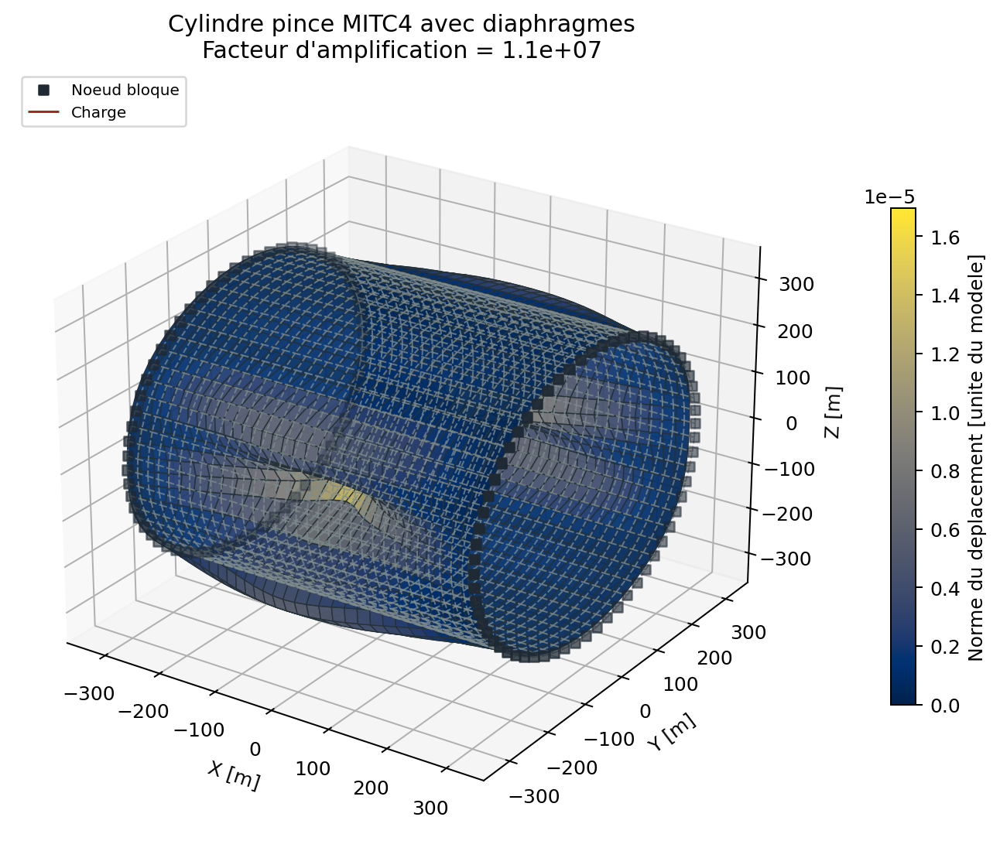
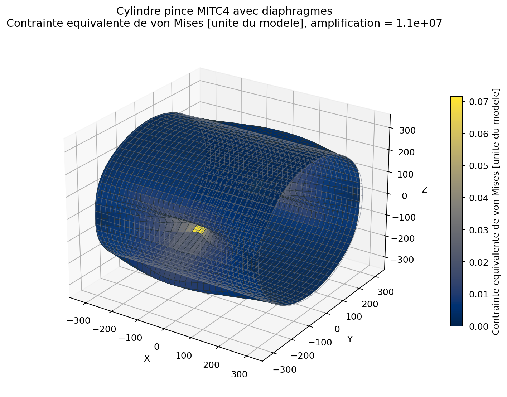
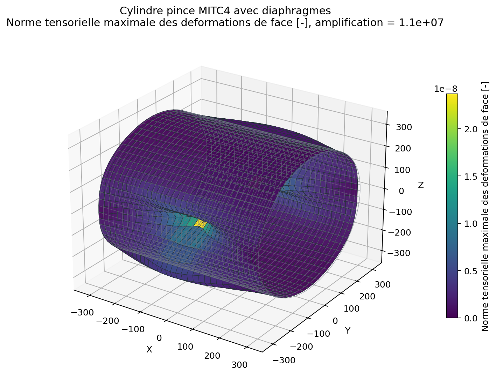
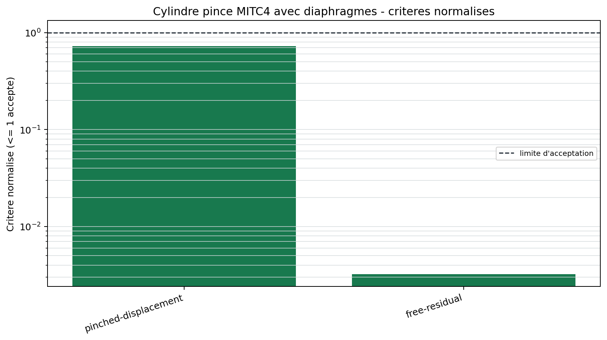

# Cylindre pince MITC4

<span class="maturity reinforced">stable apres tests renforces</span>

`BM-SHL-PINCHED-001` est un cas severe de flexion de coque avec action
membranaire. Deux forces radiales opposees pincent un cylindre ferme au
milieu; des diaphragmes rigidifient les extremites.

## Maillage et convergence

Le maillage periodique ne duplique pas la couture circonferentielle. Les
quadrangles gardent une orientation coherente et une normale continue. Le
maillage publie est le premier niveau de l'etude interne qui respecte la
tolerance de la valeur MacNeal-Harder; les niveaux plus grossiers ne sont pas
utilises pour conclure.

Les charges sont appliquees sur deux groupes physiques ponctuels. Leur somme
et leur premier moment sont controles dans l'audit d'assemblage.

{ .result-figure }

{ .result-figure }

{ .result-figure }

## Grandeur d'interet

Le deplacement radial au point pince est compare a la valeur publiee. Le
critere relativement plus large que Cook tient compte de la sensibilite au
maillage, aux diaphragmes et a la representation facettee de la courbure.

{ .result-figure }

--8<-- "docs/generated/benchmarks/bm-shl-pinched-001_results.md"

## Reproduction

```powershell
qf-solver benchmark --case BM-SHL-PINCHED-001 --output results/benchmarks
```

Reference: [REF-SHELL-OBSTACLE](../../reference/references.md#ref-shell-obstacle).
Exigences: `REQ-SOL-002`, `REQ-MESH-002`, `REQ-CMP-003`.
