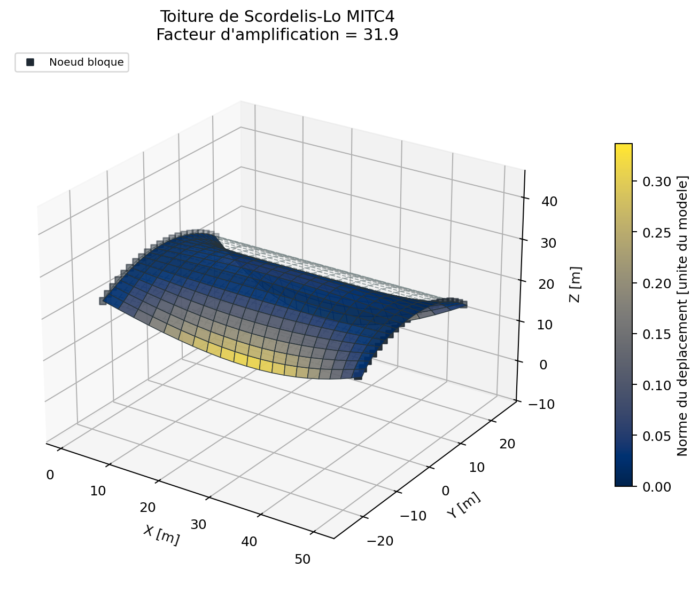
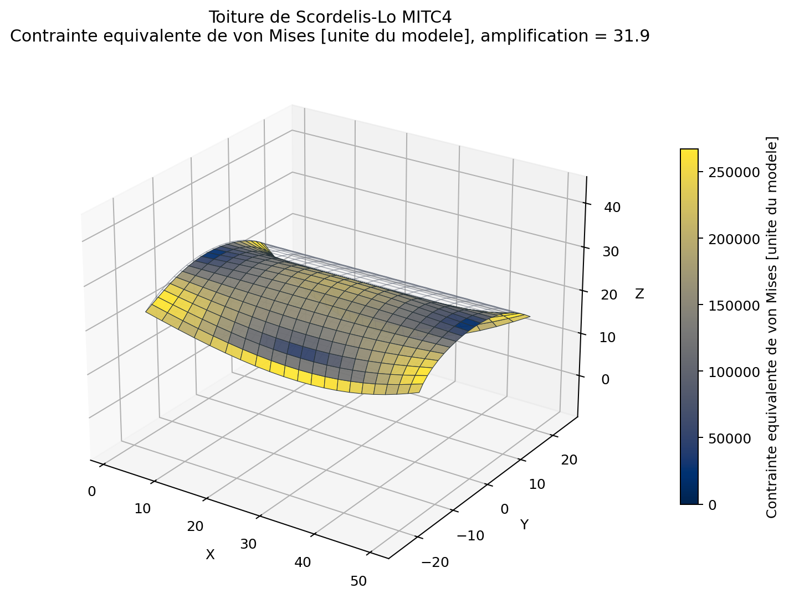
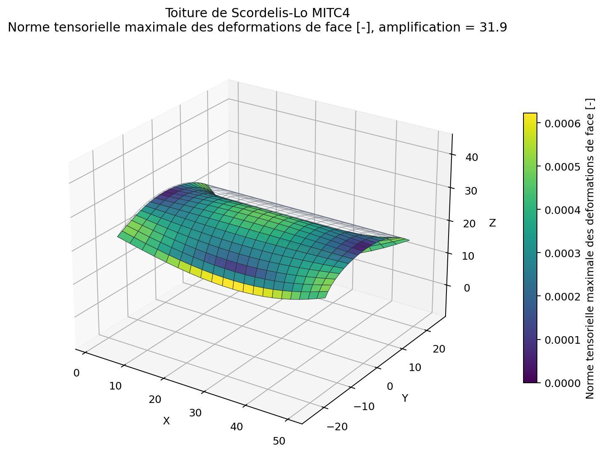
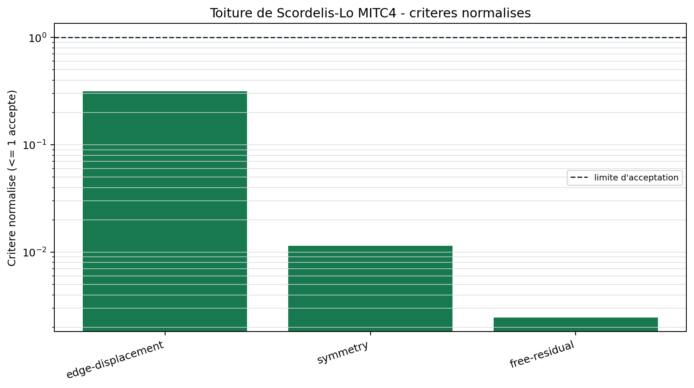

# Toiture de Scordelis-Lo MITC4

<span class="maturity stable">stable</span>

`BM-SHL-SCORDELIS-001` sollicite simultanement membrane, flexion et
cisaillement d'une coque cylindrique mince. Le maillage courbe est constitue
de facettes MITC4 planes dont les reperes locaux varient d'un element a
l'autre.

## Probleme mecanique

La toiture cylindrique couvre un angle total de 80 degres. Les diaphragmes aux
deux extremites bloquent les translations transverses; un ancrage minimal
retire les modes restants. Une charge verticale uniforme agit sur la surface.

Le deplacement vertical au milieu des deux bords longitudinaux est compare a
la valeur historique. La difference entre les deux bords mesure la symetrie
du maillage, des reperes locaux et de l'assemblage.

{ .result-figure }

{ .result-figure }

{ .result-figure }

## Interpretation prudente

La valeur historique est utile pour la non-regression, mais sa provenance et
les conventions de diaphragme doivent etre relues avant toute qualification.
Le site publie donc separement l'erreur de deplacement, l'erreur de symetrie et
le residu libre.

{ .result-figure }

--8<-- "docs/generated/benchmarks/bm-shl-scordelis-001_results.md"

## Reproduction

```powershell
qf-solver benchmark --case BM-SHL-SCORDELIS-001 --output results/benchmarks
```

References: [REF-MITC4-DVORKIN](../../reference/references.md#ref-mitc4-dvorkin),
[REF-SHELL-OBSTACLE](../../reference/references.md#ref-shell-obstacle).
