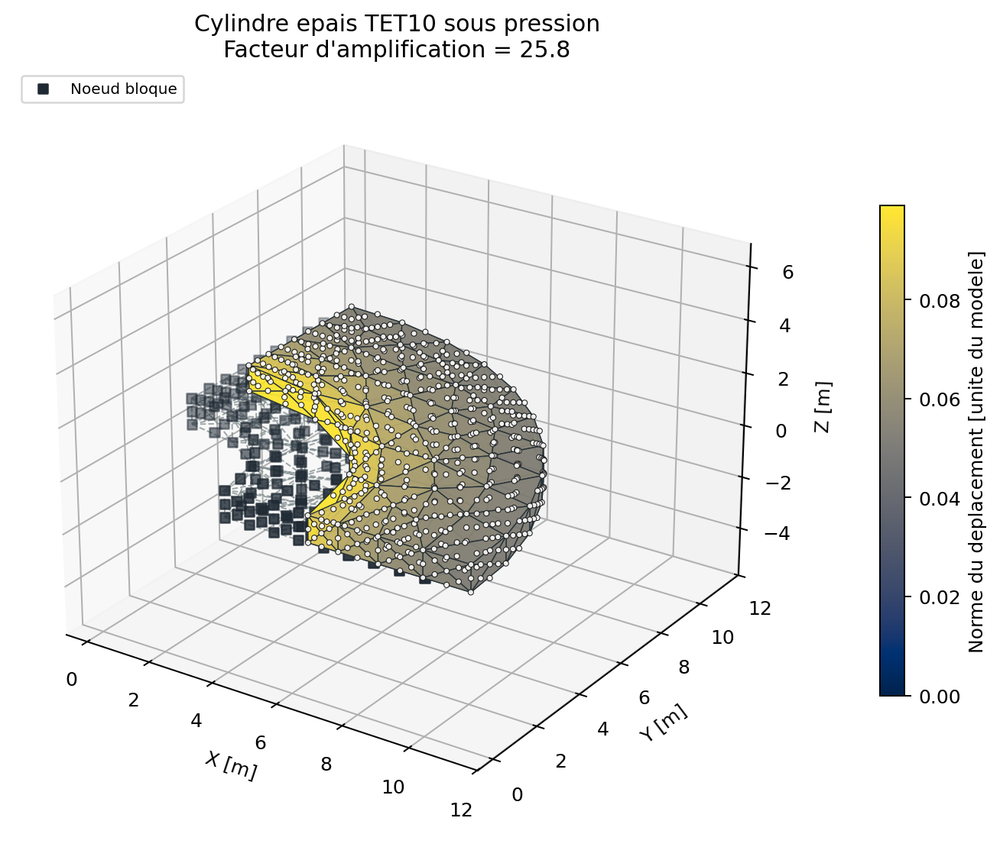
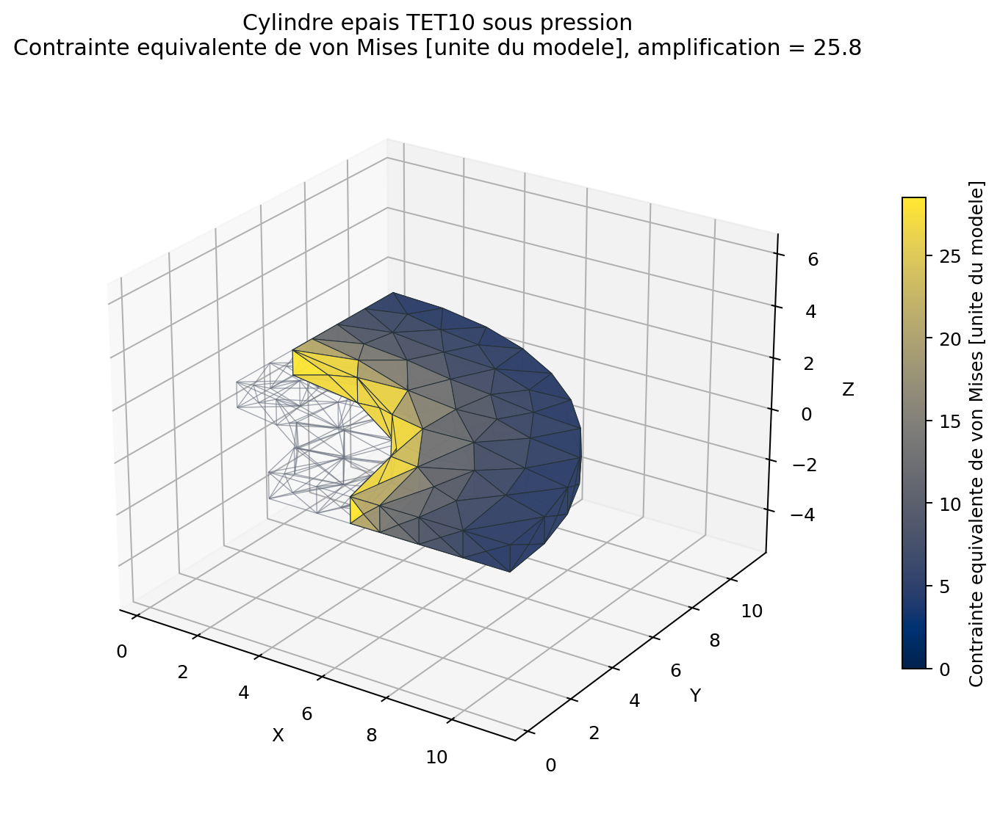
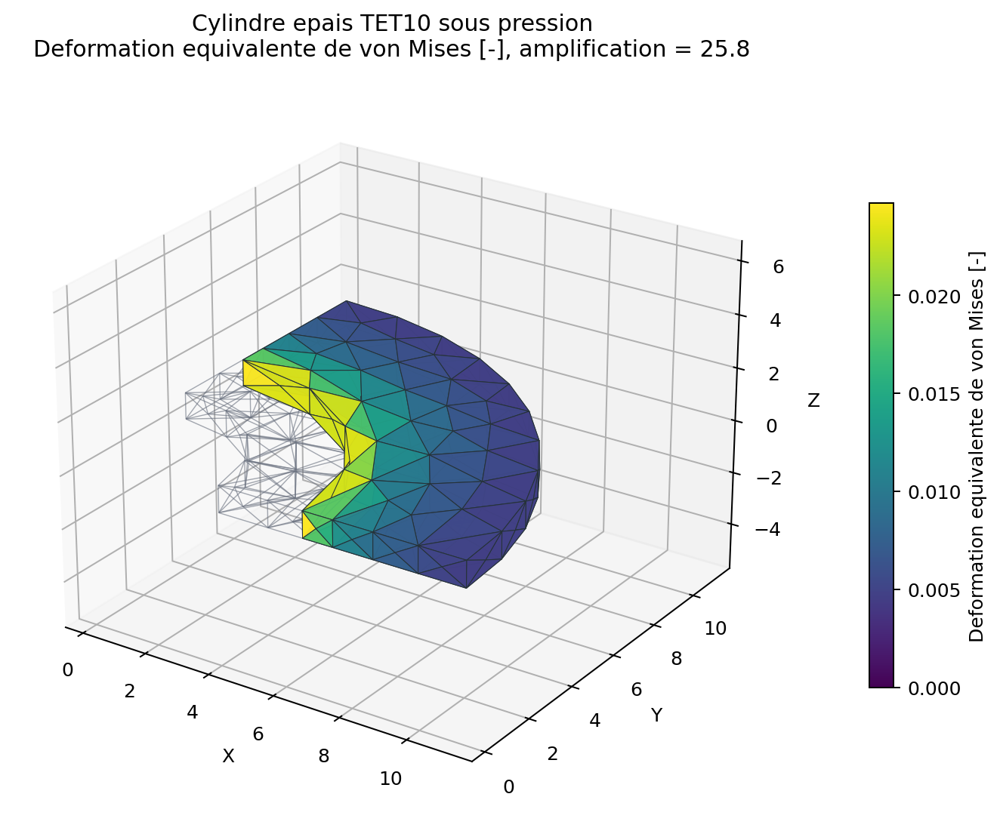
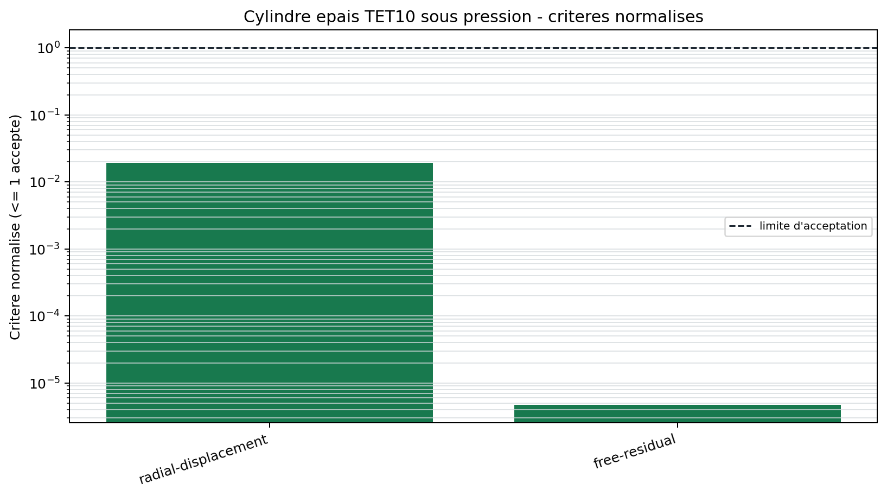

# Quart de cylindre epais TET10

<span class="maturity experimental">experimental</span>

`BM-SOL-TET10-LAME-001` exerce les faces quadratiques courbes, la pression
suiveuse de la normale initiale et le Jacobien variable du TET10.

## Probleme de Lame

Un quart d'anneau epais est soumis a une pression interne $p_i$. Les plans
$x=0$ et $y=0$ portent les symetries et les deux faces axiales imposent la
deformation plane. Pour $p_o=0$, le deplacement radial analytique utilise

$$
u_r(r)=\frac{p_i a^2(1+\nu)}{E(b^2-a^2)}
\left(\frac{b^2}{r}+(1-2\nu)r\right).
$$

## Geometrie et import

Gmsh construit l'anneau par operations OCC, eleve le maillage a l'ordre deux
et conserve les groupes `inner_pressure`, `symmetry_x`, `symmetry_y` et
`plane_strain_z`. QF_solver remappe l'ordre natif Gmsh vers la convention
interne avant toute verification de Jacobien.

{ .result-figure }

{ .result-figure }

{ .result-figure }

## Mesure d'erreur

Les deplacements nodaux sont projetes sur $\mathbf e_r$. L'erreur $L_2$
relative compare tous les noeuds a la solution de Lame. Un residu libre borne
protege independamment la resolution algebrique.

{ .result-figure }

--8<-- "docs/generated/benchmarks/bm-sol-tet10-lame-001_results.md"

## Reproduction et limite

```powershell
qf-solver benchmark --case BM-SOL-TET10-LAME-001 --output results/benchmarks
```

Le verdict reste `WARNING`: la positivite du Jacobien courbe est verifiee sur
un ensemble fini de points, sans preuve globale sur tout le volume. Exigences:
`REQ-SOL-003`, `REQ-MESH-001`, `REQ-CMP-003`.
