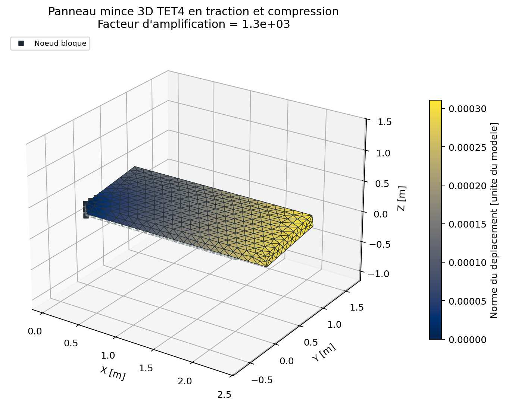
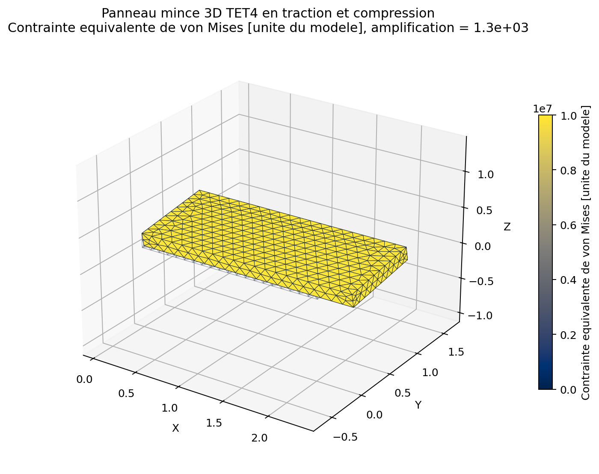
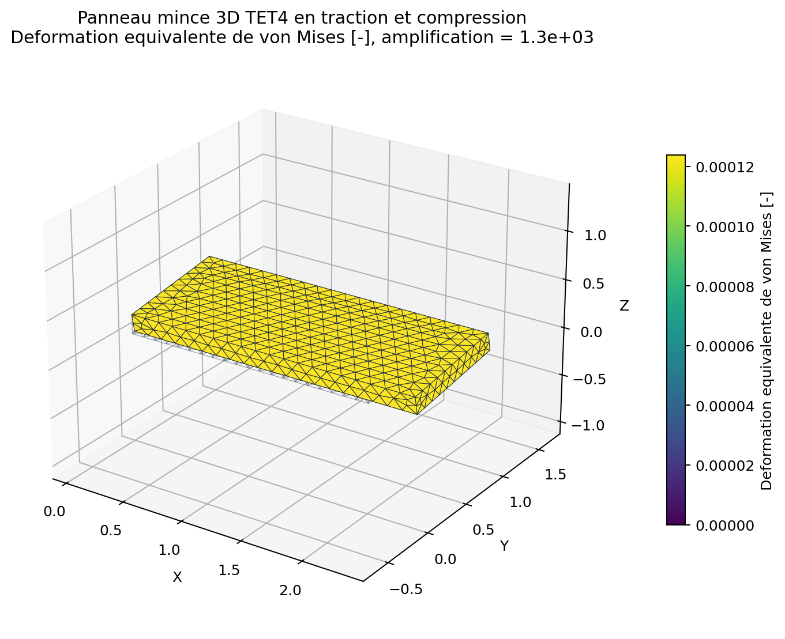
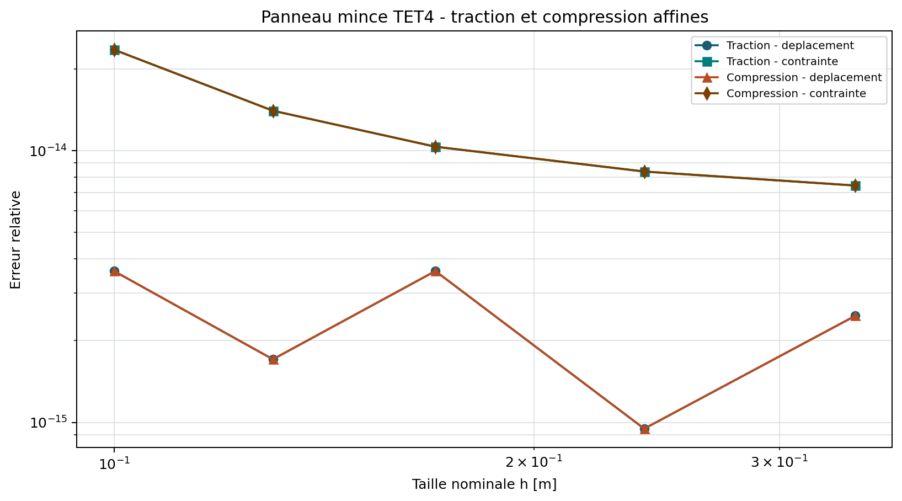
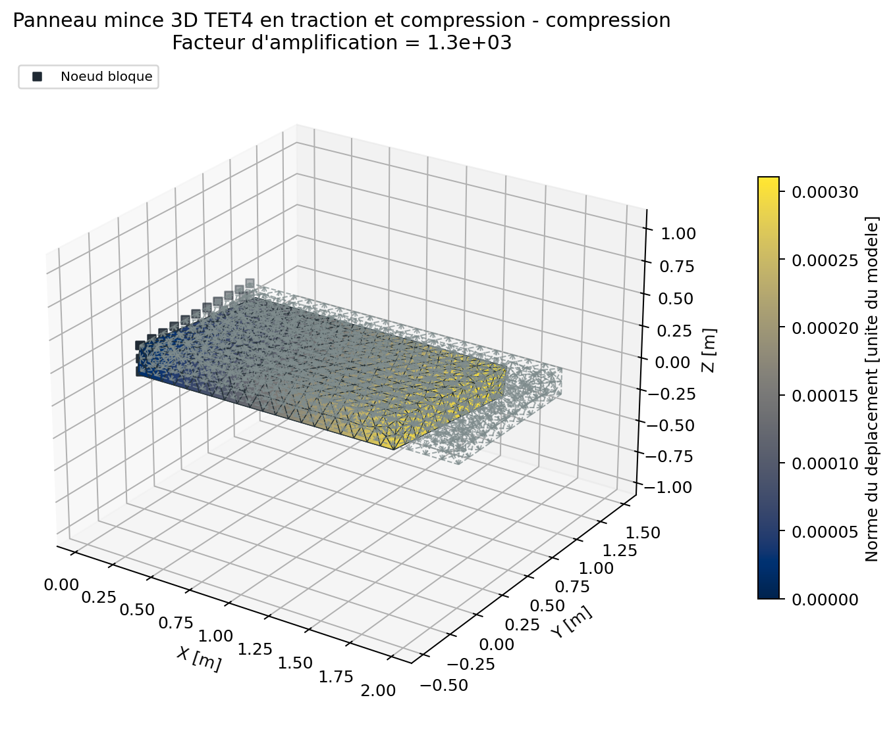
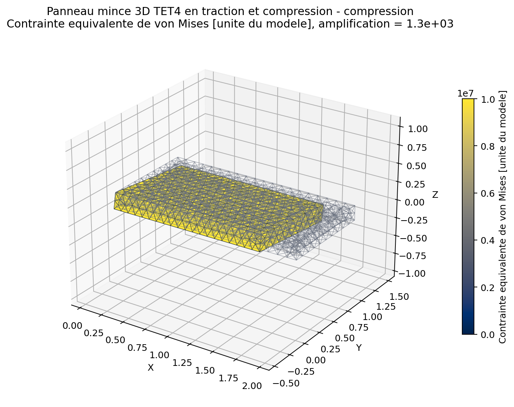
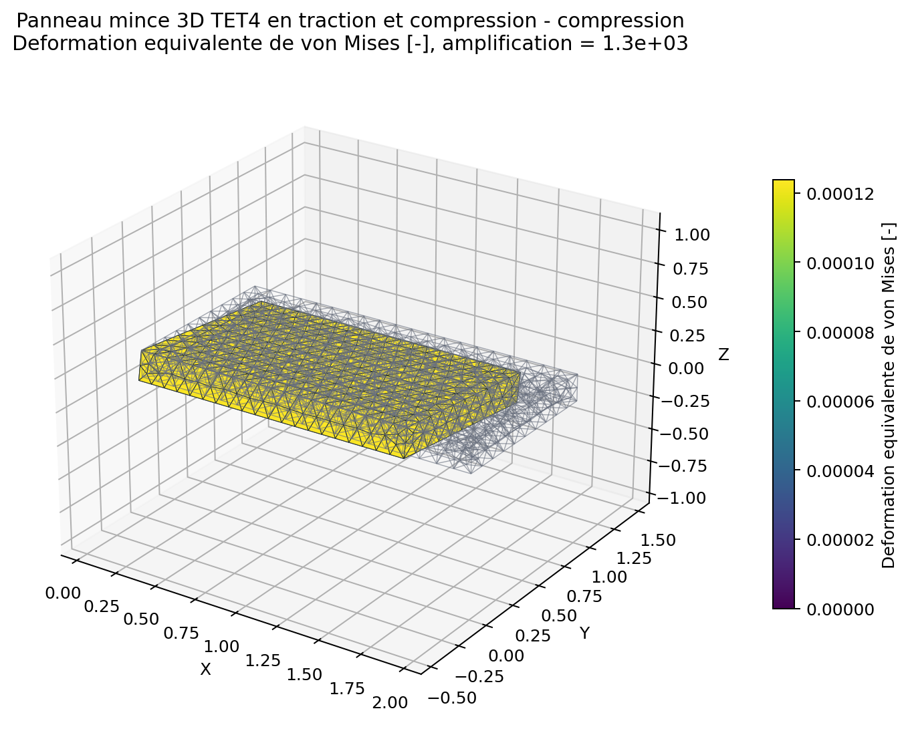

# Panneau mince 3D TET4 en traction et compression

<span class="maturity reinforced">stable apres tests renforces</span>

`BM-SOL-TET4-MEMBRANE-001` complete la verification du TET4 isotrope par des
champs de traction puis de compression dans le plan d'un panneau mince. Il
s'agit d'un solide 3D d'epaisseur finie, et non d'un element de membrane en
contrainte plane.

## Reference analytique

Une contrainte uniforme signee $\sigma$ suivant $x$ produit le champ affine
exact. Une valeur positive donne la traction; une valeur negative donne la
compression:

$$
\varepsilon_{xx}=\frac{\sigma}{E},\qquad
\varepsilon_{yy}=\varepsilon_{zz}=-\nu\frac{\sigma}{E},
$$

$$
u_x=\frac{\sigma}{E}x,\qquad
u_y=-\nu\frac{\sigma}{E}y,\qquad
u_z=-\nu\frac{\sigma}{E}z.
$$

La resultante membranaire equivalente vaut $N_x=\sigma t$. Le TET4 doit
reproduire ce champ a l'arrondi pres, car ses fonctions lineaires representent
exactement tout deplacement affine.

## Modele et blocages

Le panneau mesure $2\times1\times0{,}2$ m. La face $x=0$ bloque `UX`; deux
points suppriment seulement les translations rigides restantes. Les
contractions de Poisson restent libres. La face $x=L$ recoit une traction
uniforme de `+10 MPa`, puis de `-10 MPa`, sur les memes cinq maillages.

[Ouvrir directement le PNG de la deformee](../../assets/generated/benchmarks/bm-sol-tet4-membrane-001_deformation.png)



[Ouvrir directement le PNG de von Mises](../../assets/generated/benchmarks/bm-sol-tet4-membrane-001_von_mises.png)



[Ouvrir directement le PNG de deformation equivalente](../../assets/generated/benchmarks/bm-sol-tet4-membrane-001_strain_measure.png)



[Ouvrir directement le PNG de convergence](../../assets/generated/benchmarks/bm-sol-tet4-membrane-001_response.png)



[Ouvrir directement le PNG de compression](../../assets/generated/benchmarks/bm-sol-tet4-membrane-001_compression_deformation.png)



[Ouvrir directement le PNG de von Mises en compression](../../assets/generated/benchmarks/bm-sol-tet4-membrane-001_compression_von_mises.png)



[Ouvrir directement le PNG de deformation en compression](../../assets/generated/benchmarks/bm-sol-tet4-membrane-001_compression_strain_measure.png)



## Critere et limite de la preuve

Les erreurs de deplacement et de contrainte doivent rester sous $10^{-9}$ et
le residu libre sous $10^{-8}$ pour les deux signes. Cette etude detecte les erreurs d'interpolation,
d'assemblage, de materiau et de traction. Comme la solution appartient a
l'espace d'approximation, elle ne mesure pas un ordre asymptotique; elle doit
etre completee par les cas de flexion et de torsion. La symetrie des resultats
en traction et compression confirme aussi le comportement lineaire attendu.

--8<-- "docs/generated/benchmarks/bm-sol-tet4-membrane-001_results.md"

## Reproduction

```powershell
qf-solver benchmark --case BM-SOL-TET4-MEMBRANE-001 --output results/benchmarks
```

Reference: [REF-FEM-BATHE](../../reference/references.md#ref-fem-bathe).
