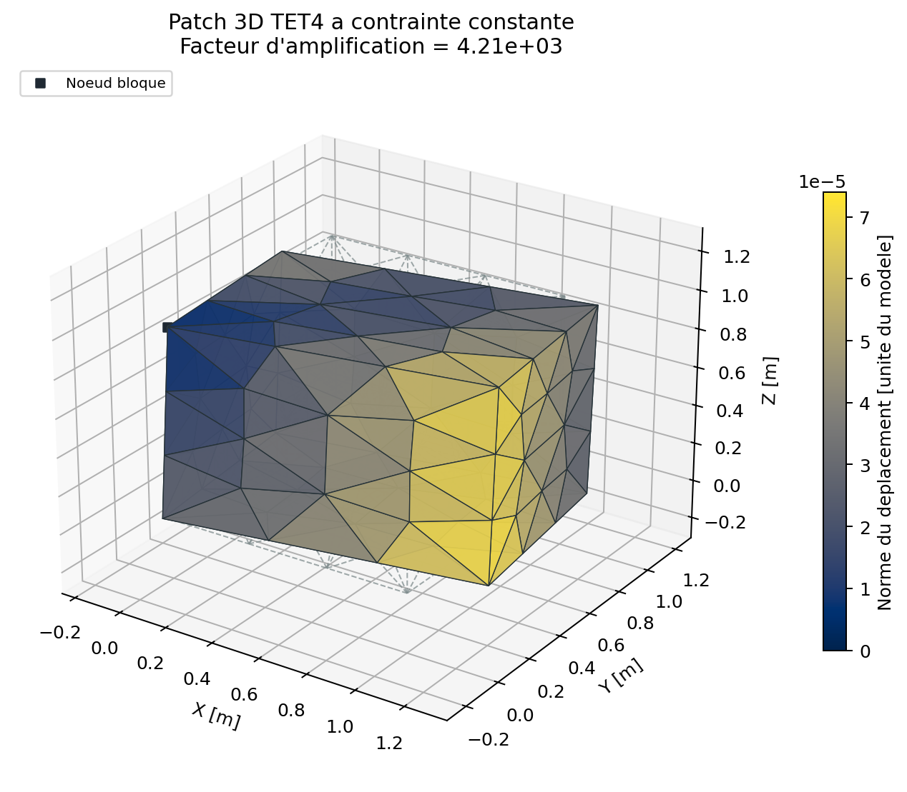
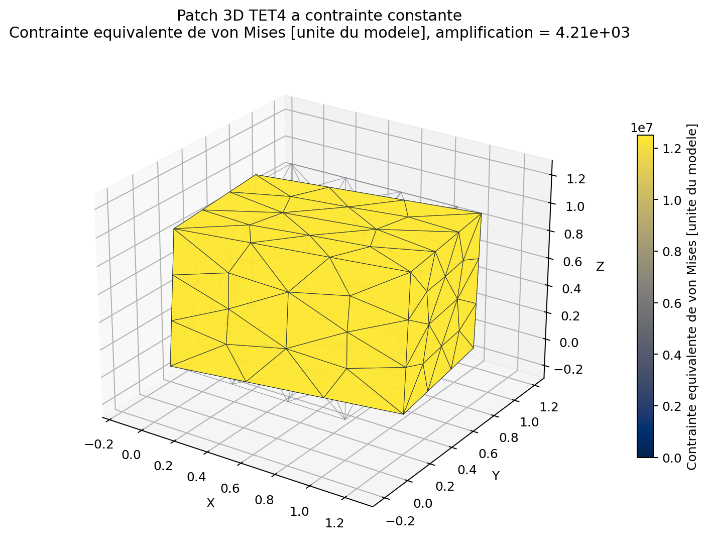
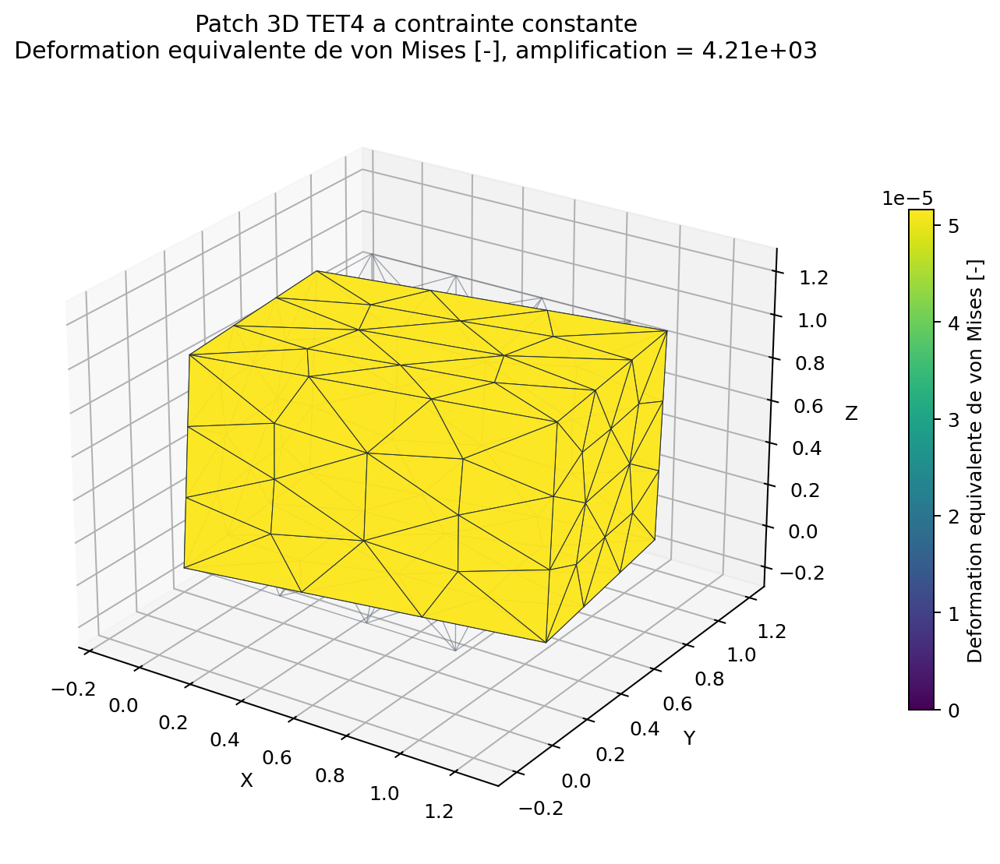
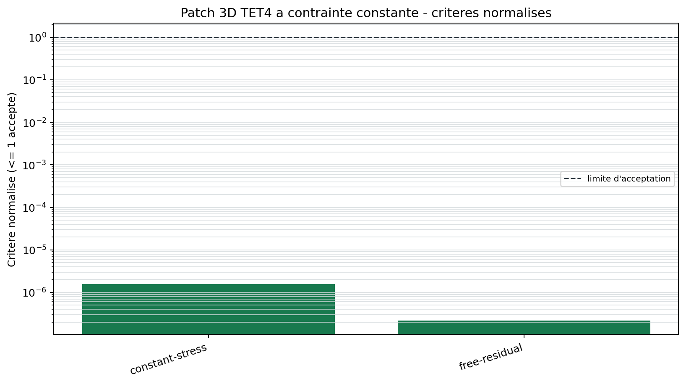

# Patch 3D TET4 a contrainte constante

<span class="maturity stable">stable</span>

`BM-SOL-TET4-PATCH-001` verifie qu'un bloc tetraedrique non structure
reproduit un champ affine, une contrainte constante et l'equilibre global. Le
maillage est produit par Gmsh, importe par l'API publique puis resolu sans
acces direct aux classes elementaires.

## Modele mecanique

Le cube utilise un materiau elastique isotrope. Deux tractions surfaciques
opposees imposent l'etat cible

$$
\boldsymbol\sigma^{\mathrm{ref}}=
\begin{bmatrix}\sigma_0&0&0\\0&0&0\\0&0&0\end{bmatrix}.
$$

Les six modes rigides sont retires par un blocage minimal: trois translations
sur un sommet, deux sur un second et une sur un troisieme. Cette construction
n'empeche pas la contraction de Poisson.

## Maillage, groupes et chargement

Les groupes physiques `domain`, `x_min`, `x_max`, `anchor_origin`,
`anchor_x` et `anchor_xy` portent respectivement le materiau, les tractions et
les blocages. Les triangles de frontiere sont associes exactement a une face
TET4 par leurs identifiants de noeuds.

{ .result-figure }

{ .result-figure }

{ .result-figure }

## Preuve et tolerance

L'erreur est la norme de Frobenius des contraintes elementaires par rapport a
la contrainte cible, normalisee par la norme du champ cible. Le second critere
est la norme du residu sur les ddl libres. Les limites sont lues dans
`qualification/benchmarks.json`.

{ .result-figure }

--8<-- "docs/generated/benchmarks/bm-sol-tet4-patch-001_results.md"

## Reproduction

```powershell
qf-solver benchmark --case BM-SOL-TET4-PATCH-001 --output results/benchmarks
```

Artefacts: MSH 4.1, setup, modele JSON, rapport d'import, resultat JSON, VTU,
resume et manifeste SHA-256. Reference theorique:
[REF-FEM-BATHE](../../reference/references.md#ref-fem-bathe). Exigences:
`REQ-SOL-001`, `REQ-MESH-001`, `REQ-CMP-003`.
