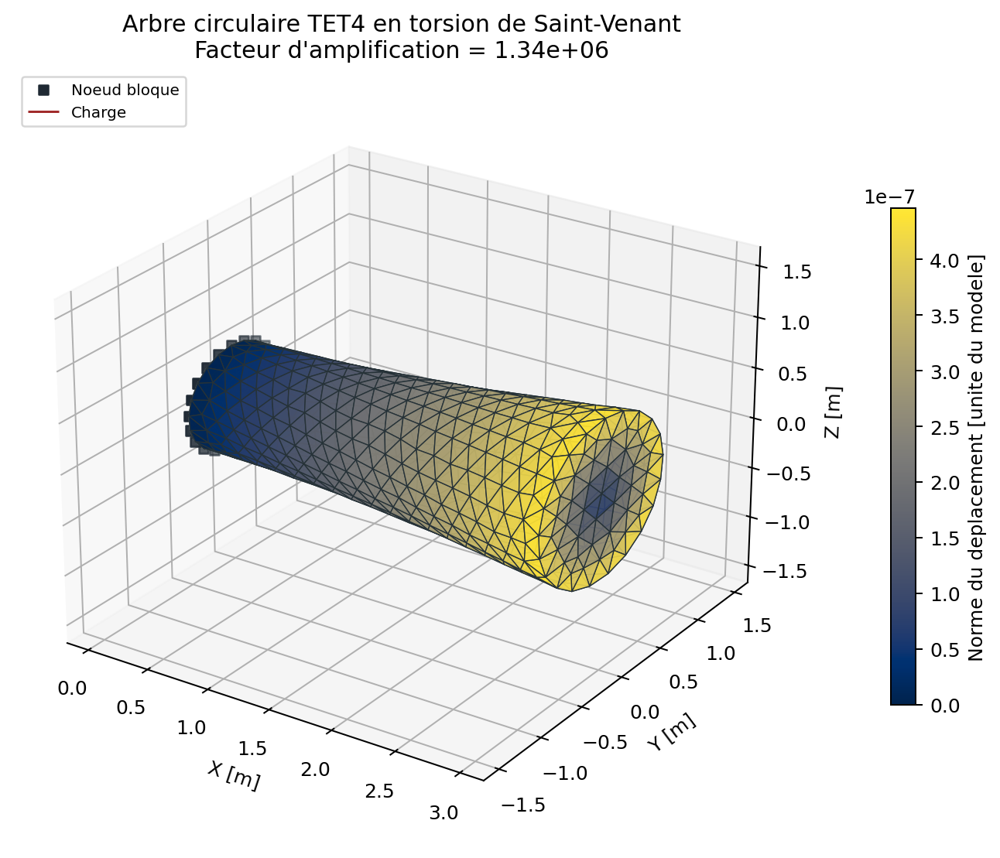

# Arbre circulaire TET4 en torsion de Saint-Venant

<span class="maturity reinforced">stable apres tests renforces</span>

`BM-SOL-TET4-TORSION-001` verifie une sollicitation de cisaillement 3D qui
n'est couverte ni par le patch axial ni par la flexion du porte-a-faux.

## Solution fermee, lisible directement dans le Markdown

L'arbre est oriente suivant l'axe `X`. Une section droite est donc reperee par
sa position `x`; un point de cette section a pour coordonnees `(y, z)`.

Les grandeurs utilisees sont:

| Symbole | Signification |
| --- | --- |
| `T` | couple applique autour de l'axe X, en N.m |
| `E` | module de Young, en Pa |
| `nu` | coefficient de Poisson |
| `G = E / (2 * (1 + nu))` | module de cisaillement, en Pa |
| `R` | rayon de l'arbre, en m |
| `J = pi * R^4 / 2` | moment quadratique polaire de la section, en m^4 |

La rotation d'une section augmente lineairement avec `x`:

```text
phi(x) = T * x / (G * J)
```

Pour un arbre circulaire, la section tourne comme un disque rigide et ne
gauchit pas. Pour une petite rotation `phi`, le point `(y, z)` se deplace dans
le plan de la section suivant:

```text
u_x = 0
u_y = -phi(x) * z = -T * x * z / (G * J)
u_z =  phi(x) * y =  T * x * y / (G * J)
```

Ces deux composantes sont simplement le mouvement tangentiel provoque par la
rotation autour de `X`:

- au centre, `y = 0` et `z = 0`, donc le deplacement est nul;
- sur le cote `y > 0, z = 0`, le point se deplace vers `+Z`;
- sur le cote `y = 0, z > 0`, le point se deplace vers `-Y`;
- le signe s'inverse de l'autre cote de l'axe.

La traction appliquee sur la face terminale `x = L` possede les trois
composantes suivantes:

```text
t_x = 0
t_y = -T * z / J
t_z =  T * y / J
```

Il n'y a donc aucune traction axiale. Les composantes `t_y` et `t_z` sont
tangentielles au cercle, nulles au centre et maximales sur le bord. Leur
resultante est nulle, mais leur moment autour de `X` vaut exactement `T`.

Sur chaque triangle terminal de noeuds `i`, `j`, `k`, cette traction lineaire
est convertie en forces nodales coherentes:

```text
f_i = A / 12 * (2 * t_i + t_j + t_k)
```

Ici, `A` est l'aire du triangle et `t_i`, `t_j`, `t_k` sont les tractions
evaluees aux trois noeuds.

La normalisation discrete impose exactement le couple demande et permet de
controler separement la resultante parasite.

## Maillages et extraction

Huit maillages TET4 construisent la courbe engineering reproductible. La
monotonie et l'ordre sont evalues sur les trois derniers, qui constituent la
zone asymptotique des maillages non structures. La face `x = 0` est encastree.
La rotation terminale est extraite par projection aux moindres carres:

```text
phi_h = somme(y_a * u_z,a - z_a * u_y,a)
        / somme(y_a^2 + z_a^2)
```

Cette formule cherche la rotation rigide qui explique au mieux les
deplacements de tous les noeuds de la face terminale.

{ .result-figure }

{ .result-figure }

{ .result-figure }

Les images ci-dessus proviennent du niveau h8 regenere par le catalogue public.
Une sonde h9 de contrainte peut etre ajoutee dans un checkout local controle,
mais elle n'est pas necessaire pour construire cette documentation et ses
resultats ne sont pas presents dans la baseline publique.

## Acceptation et lecture

Le critere impose une erreur de rotation inferieure a `15 %` sur le maillage
fin, une convergence monotone dans la zone asymptotique, un ordre observe au
moins egal a `0,5`, un couple relatif exact a `1e-12` et un residu libre
inferieur a `1e-8`. Les valeurs sont regenerees dans le tableau de resultats
ci-dessous; aucun chiffre du sweep engineering n'est recopie manuellement.

La contrainte L2 converge plus lentement que la rotation car le TET4 produit
une contrainte constante par element et approche le bord circulaire par des
facettes planes. Elle est donc evaluee dans une campagne V&V distincte plus
fine et n'est pas le critere d'acceptation du sweep documentaire.

## Sonde h9 optionnelle

La sonde h9 a quatre fois plus d'elements est une campagne V&V locale
optionnelle. Elle n'est pas embarquee dans le checkout public, car son maillage
et ses sorties sont volumineux. Le build documentaire verifie ses empreintes
et publie ses chiffres lorsqu'elle est disponible; sinon il publie explicitement
le dernier niveau h8 et marque la sonde h9 comme non disponible.

--8<-- "docs/generated/benchmarks/torsion_h9_stress_probe.md"

Le rapport inclus ci-dessous distingue donc toujours la sonde h9 controlee du
dernier niveau public. Aucune valeur h9 n'est recopiee manuellement dans cette
page et aucune acceptance de contrainte locale n'est deduite de la campagne
h1-h8 seule.

Lorsqu'elle est disponible, l'etude V&V controlee dans
`VNV-TET4-TORSION-ANALYTIC-001/STUDY.md` compare les deformees QF_solver et
Saint-Venant niveau par niveau, avec le meme maillage, la meme vue et le meme
facteur d'amplification. Le rapport formel est regenere par `qf-solver
vnv-compare`.

## Reproduction

```powershell
qf-solver benchmark --case BM-SOL-TET4-TORSION-001 --output results/benchmarks
python .\scripts\run_torsion_stress_probe.py `
  --output .\VNV-TET4-TORSION-ANALYTIC-001\stress_probe_h9 `
  --overwrite
```

Reference: [REF-FEM-BATHE](../../reference/references.md#ref-fem-bathe).
