# Demonstrations de coque MITC4

## Patch membrane

Un champ affine dans le plan doit produire une deformation de membrane
constante, independante de la distorsion admissible du quadrangle. Le bilan
compare les resultantes $\mathbf N$ a la loi plane.

## Flexion et cisaillement

Des champs construits imposent une courbure constante puis un cisaillement
transverse constant. Les energies obtenues sont comparees aux integrales
fermees. Ces tests protegent les signes des rotations et la transformation de
la base locale.

## Etude du shear locking

La meme plaque mince est calculee avec l'interpolation MITC et avec une Q4 a
cisaillement complet maintenue uniquement comme element comparatif. Lorsque
$t/L$ diminue, la Q4 complete se raidit artificiellement tandis que MITC4
conserve une reponse exploitable.

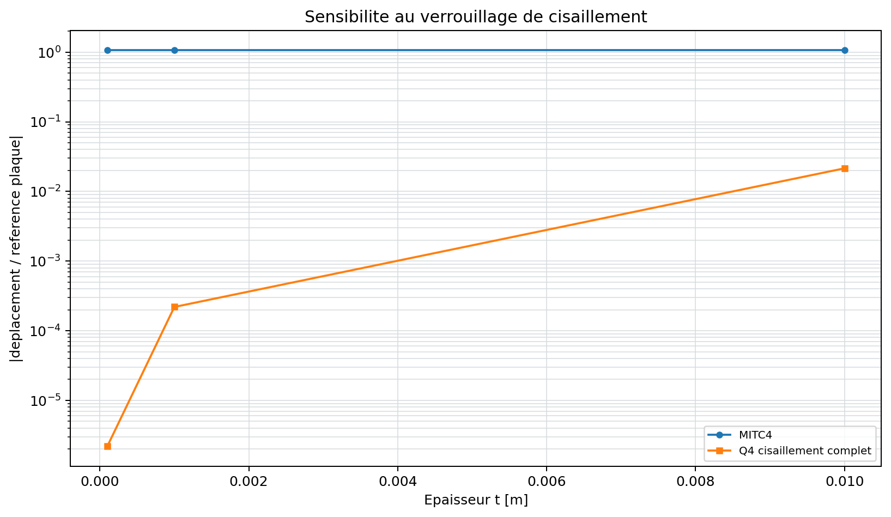{ .result-figure }

--8<-- "docs/generated/mitc4_locking_results.md"

## Scordelis-Lo

Le toit cylindrique Scordelis-Lo sollicite simultanement membrane et flexion.
La campagne suit le deplacement de reference, la convergence et la qualite du
maillage. La reference, les hypotheses de symetrie et la convention de signe
sont consignees avec le tableau.

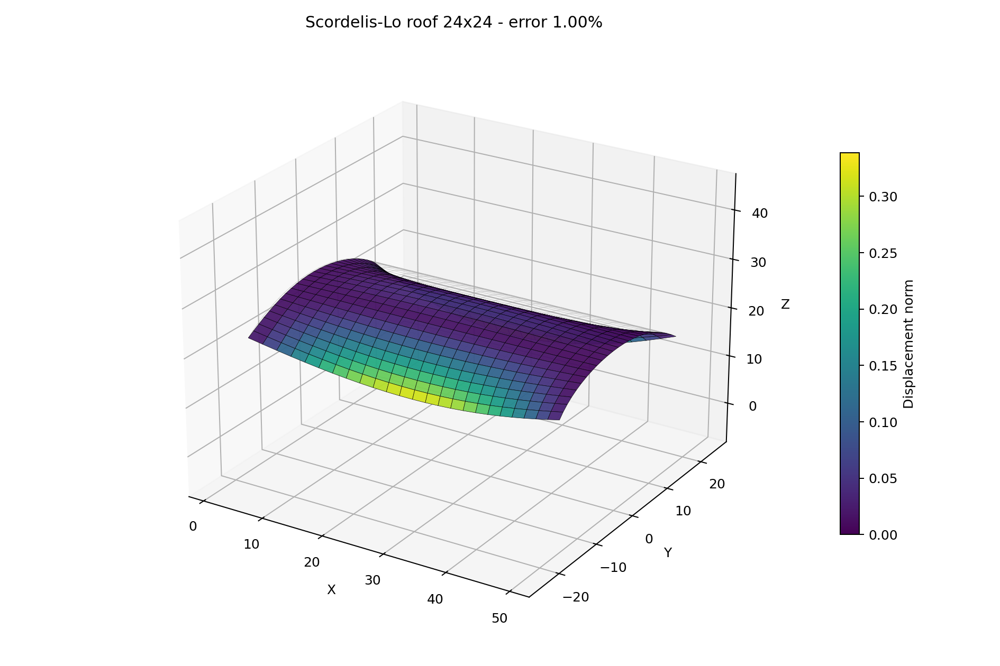{ .result-figure }

--8<-- "docs/generated/scordelis_results.md"

## Panneau conique ajoure

`VNV-MITC4-CONICAL-CUTOUT-STATIC-012` ajoute une geometrie plus proche d'un
panneau d'acces ou d'une transition de nacelle : une coque annulaire conique,
avec une ouverture centrale libre et un bord exterieur encastre. La pression
est integree suivant la normale initiale de chaque facette. Les quadrangles
sont plans par construction; cette demonstration ne pretend donc pas valider
une interpolation MITC4 courbe.

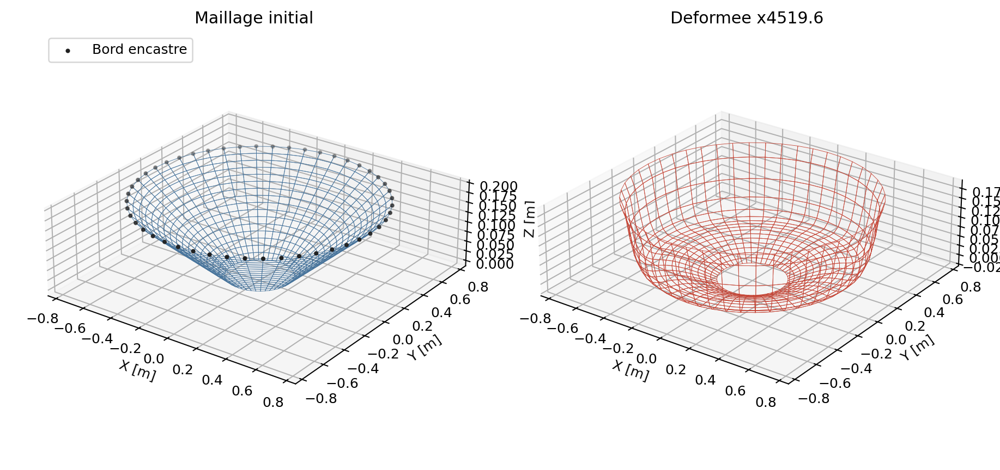{ .result-figure }

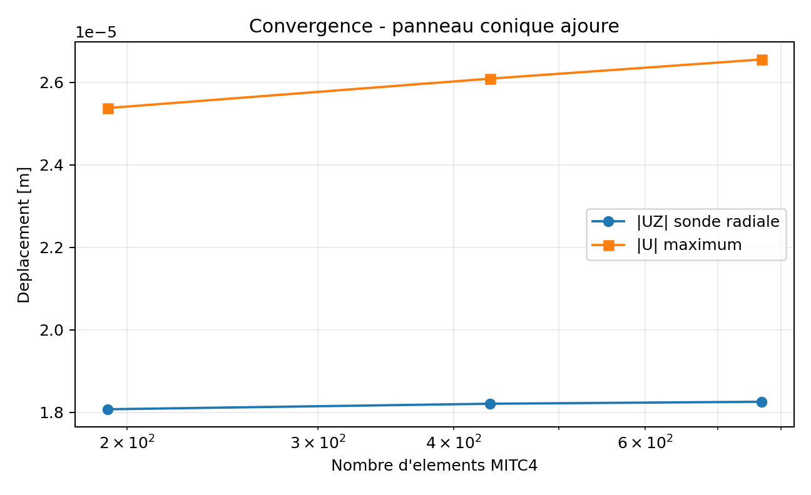{ .result-figure }

La convergence de la sonde radiale et le VTU sont produits par le script :

```powershell
python .\scripts\run_mitc4_conical_cutout_vnv.py
```

Le pic de contrainte au bord de l'ouverture est une zone de bord libre : il est
visible dans le VTU mais n'est pas utilise seul comme critere d'acceptation.

La correlation `VNV-MITC4-CONICAL-CUTOUT-CALCULIX-S4-013` utilise exactement
les memes coordonnees, connectivites, epaisseur et appuis dans CalculiX 2.20
`S4`. Le vecteur de pression coherent QF est transfere explicitement en
charges nodales CalculiX. Au niveau fin, l'ecart de la sonde vaut `0,0249 %`
et l'ecart du vecteur deplacements vaut `0,629 %`. Le maillage grossier
presente `4,16 %`, puis l'ecart decroit avec le raffinement : ce resultat est
une evidence cinematique croisee, pas une assertion d'identite entre `S4` et
`MITC4`.

La colonne de reaction CalculiX `RF` demeure un diagnostic, pas un critere :
sa convention de sortie avec des `CLOAD` poses sur les appuis melange forces
externes et reactions. Cette ambiguite est fermee pour la resultante par la
correlation `VNV-MITC4-CONICAL-CUTOUT-CODEASTER-DKQ-014` : Code_Aster 18.1.0
`DKQ` reprend le meme maillage et le meme vecteur de charge. Au maillage fin,
l'ecart de sonde est `0,3436 %`, l'ecart vectoriel `1,7565 %` et l'ecart de
resultante `2,26e-11 %`. Les contraintes de face et les energies restent un
chantier distinct, car les formulations MITC4 et DKQ ne les reconstruisent pas
aux memes points.

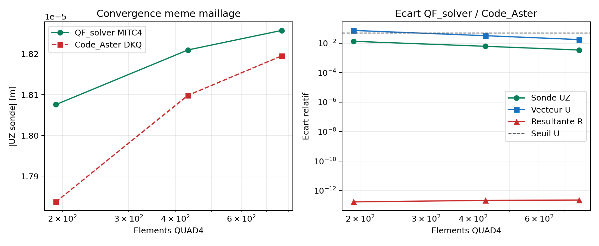{ .result-figure }

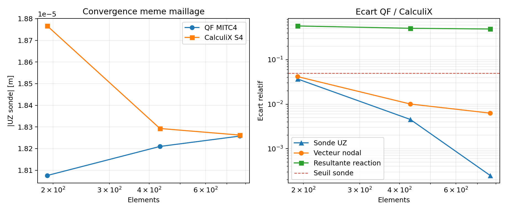{ .result-figure }

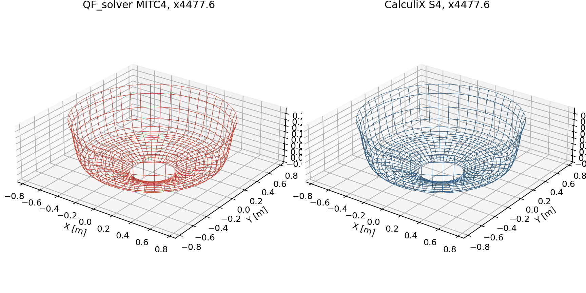{ .result-figure }

## Panneau conique composite

La campagne `VNV-COMP-CONICAL-CUTOUT-009` applique l'empilement
`[0/+45/-45/90]` sur la meme coque conique ajouree. La direction globale
`[1,0,0]` est projetee dans le plan de chaque facette, puis les angles de pli
sont appliques autour de la normale locale. Les fleches se stabilisent a
`0,0588 %` entre les deux niveaux fins; les resultats de contraintes et de
criteres par pli sont exportes dans le VTU et le JSON.

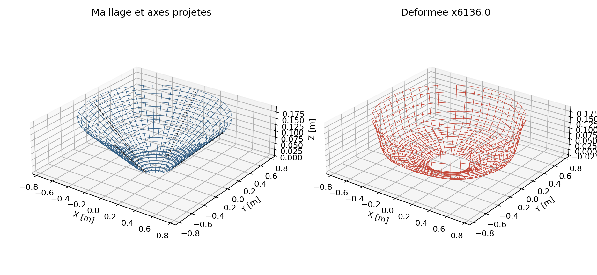{ .result-figure }

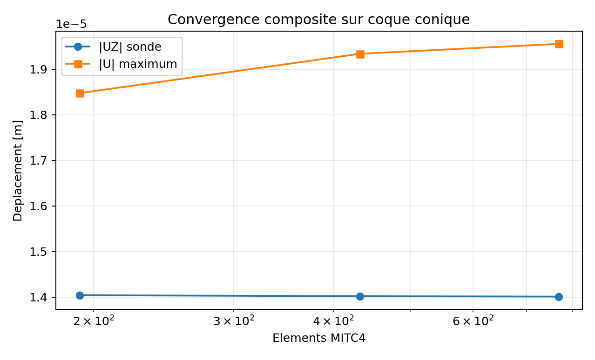{ .result-figure }

La valeur maximale de contrainte sur le bord libre est seulement un indicateur
d'inspection. La prochaine preuve composite sera une correlation externe sur
la meme geometrie, avec extraction des contraintes par pli a distance fixee du
bord de l'ouverture.

### Correlation externe reguliere CalculiX S8R

`VNV-COMP-CONICAL-CUTOUT-CALCULIX-S8R-011` reprend les memes noeuds de coin,
l'empilement `[0/+45/-45/90]`, les axes projetes et l'encastrement. Pour
isoler la reponse de coque et les axes materiaux, le vecteur de pression
coherent integre par QF_solver est transfere tel quel sous forme de `CLOAD`
aux noeuds communs du modele CalculiX `S8R COMPOSITE`. Ce n'est donc pas une
verification de la quadrature de pression native de CalculiX.

Sur le maillage `16x48` (768 elements MITC4 / S8R), l'ecart de fleche `UZ`
de la sonde est de `0,728 %` et l'ecart relatif du vecteur de deplacements est
de `1,608 %`. Les deux increments finaux restent inferieurs a `0,3 %`. La
campagne est ainsi une evidence externe cinematique `experimental` qui passe
le seuil borne de `3 %`; les contraintes par pli a proximite de l'ouverture
etaient initialement hors acceptation. La campagne de contraintes par pli
ci-dessous ferme cette comparaison loin du bord libre; les pics de bord libre
et les composantes interlaminaires restent exclus.

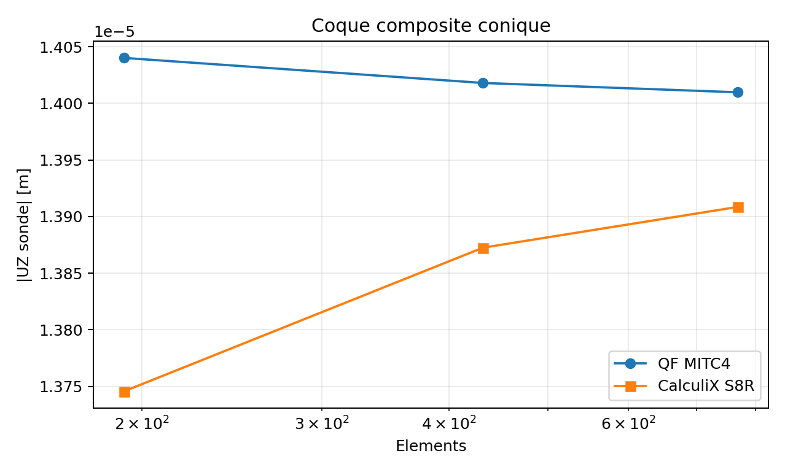{ .result-figure }

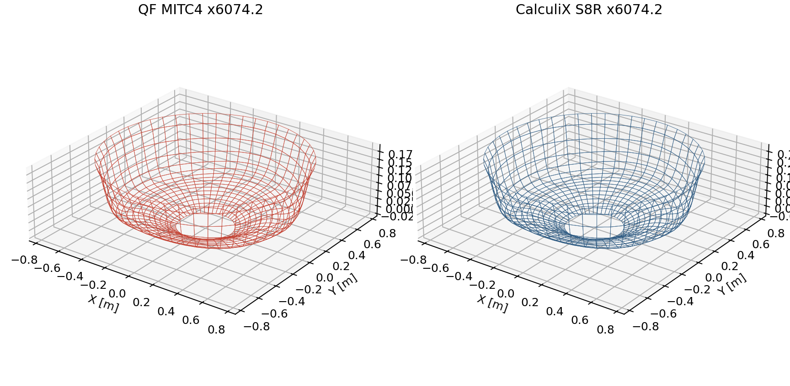{ .result-figure }

### Contraintes par pli sur chemin controle

`VNV-COMP-CONICAL-CUTOUT-PLY-STRESS-CALCULIX-S8R-012` compare les contraintes
`S11`, `S22` et `S12` dans les axes materiau de chaque pli. La couronne
`eta=(r-0,20)/0,55` est bornee a `0,38 <= eta <= 0,62` : elle exclut a la fois
l'ouverture libre et l'encastrement exterieur. QF_solver evalue les valeurs au
milieu de chaque pli; la sortie CalculiX S8R est lue aux points d'integration,
puis moyennee par pli sur les memes elements.

| Maillage | Ecart L2 QF/CalculiX | Increment QF | Increment CalculiX |
| --- | ---: | ---: | ---: |
| `8x24` | `0,419 %` | - | - |
| `12x36` | `0,302 %` | - | - |
| `16x48` | `0,298 %` | `0,611 %` | `0,480 %` |

La correlation externe passe le seuil borne de `10 %`; elle ne constitue pas
une acceptance de `S13`, de pics au bord libre, de delaminage ou de rupture.

{ .result-figure }
