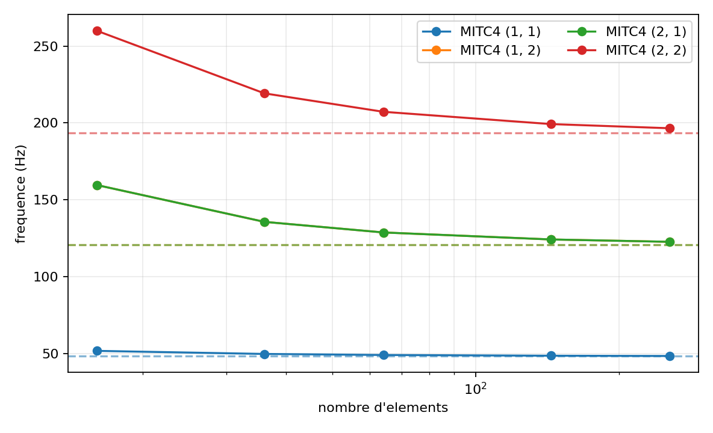
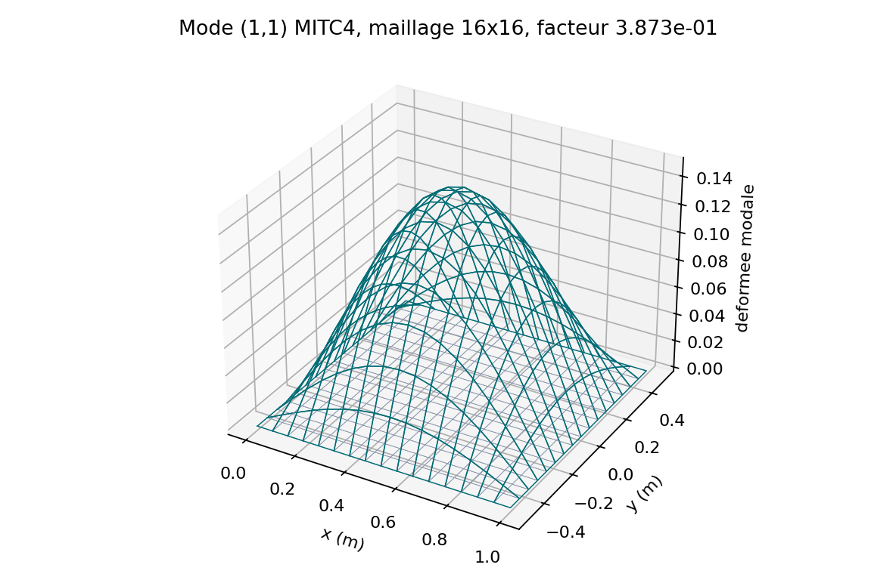
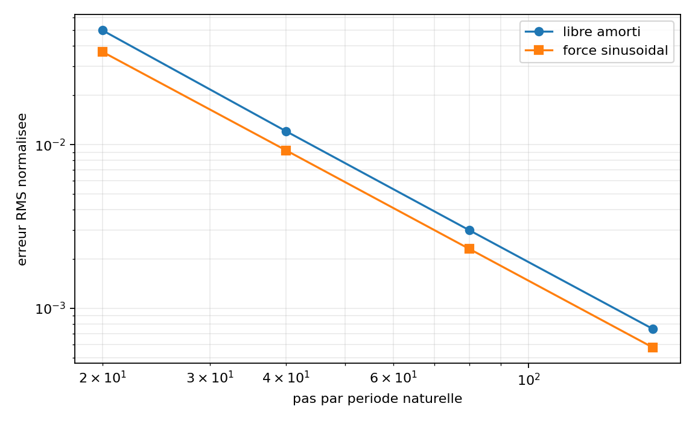

# Demonstrations modales et dynamiques

## Mode propre TET4

Le cas unitaire contraint possede une frequence de cisaillement fermee. La
demonstration compare la frequence, le residu propre et les orthogonalites.

{ .result-figure }

--8<-- "docs/generated/modal_results.md"

## Oscillateur libre Newmark

Un seul ddl `UX` reste libre. La pulsation est extraite des coefficients
$K_{xx}$ et $M_{xx}$, puis la solution analytique non amortie:

$$
u(t)=u_0\cos(\omega_nt)+\frac{v_0}{\omega_n}\sin(\omega_nt)
$$

est comparee pas a pas au schema. L'energie totale doit rester constante a la
precision du calcul pour $\beta=1/4$, $\gamma=1/2$ et $\mathbf C=0$.

{ .result-figure }

--8<-- "docs/generated/newmark_results.md"

## Chargement tabule et amortissement

Le chargement tabule verifie l'interpolation temporelle. Un second run avec
amortissement controle que l'energie mecanique decroit et que la puissance
$\dot u^T\mathbf C\dot u$ reste non negative.

## Plaque MITC4 simplement appuyee

`VNV-MITC4-MODAL-PLATE-003` compare les quatre premiers modes de flexion a la
solution de Navier. Pour la plaque carree, les modes `(1,2)` et `(2,1)` ont la
meme frequence analytique : leurs vecteurs propres peuvent tourner librement
dans le sous-espace double. La verification utilise donc un MAC de sous-espace,
invariant vis-a-vis de cette rotation.

{ .result-figure }

{ .result-figure }

--8<-- "docs/generated/mitc4_modal_plate_results.md"

Les criteres sont une erreur maximale de 5 % sur les quatre frequences du
maillage fin, un MAC minimal de 0,995, un residu modal inferieur a $10^{-7}$
et une orthogonalite masse inferieure a $10^{-7}$. La correlation Abaqus S4R
a maillage identique reste une preuve externe a fournir.

La correlation externe etendue utilise desormais `32x32` elements et compare
les dix premiers modes a Navier et Code_Aster. L'ecart maximal QF_solver/
Code_Aster vaut `1,609 %` et le MAC de sous-espace minimal `0,999998493`.

Trois complements sont disponibles dans `VNV-MITC4-MODAL-EXTENDED-005`:

- structure assemblee libre-libre avec exactement six modes rigides;
- coque cylindrique avec convergence, distorsion de `20 %` et rotation rigide;
- `eigsh` sur `2304` elements et `7011` DDL actifs, sans conversion dense.

{ .result-figure }

{ .result-figure }

## Convergence temporelle Newmark MITC4

`VNV-MITC4-NEWMARK-FREE-002` initialise le porte-a-faux avec son premier mode
MITC4 verifie, puis compare la sonde signee a
$u(t)=u_0\cos(2\pi f_1t)$ sur trois periodes. Les pas sont `T/20`, `T/40`,
`T/80` et `T/160`.

{ .result-figure }

{ .result-figure }

--8<-- "docs/generated/mitc4_newmark_results.md"

La pente observee doit rester superieure a 1,8, l'erreur RMS fine sous 1 %,
l'erreur de retour sous 2 % et la derive energetique sous $10^{-4}$.

## Newmark amorti et force

`VNV-MITC4-NEWMARK-DAMPED-FORCED-003` ajoute deux oracles. Le premier utilise
un amortissement de Rayleigh proportionnel a la masse, calibre a 2 % sur le
premier mode. Le second applique le vecteur modal $F_0=M\phi_1$ a la frequence
$0,7f_1`; la reponse reste alors monomodale et possede une solution fermee.

{ .result-figure }

{ .result-figure }

--8<-- "docs/generated/mitc4_newmark_extended_results.md"

Cette campagne controle l'ordre deux, la decroissance energetique, le signe de
la puissance dissipee et le residu dynamique. Elle ne couvre pas encore une
excitation large bande ni une correlation Abaqus temporelle.
