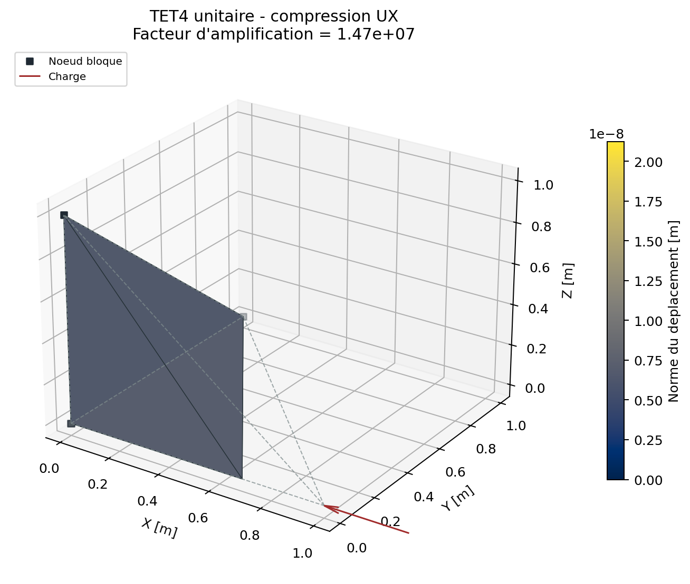
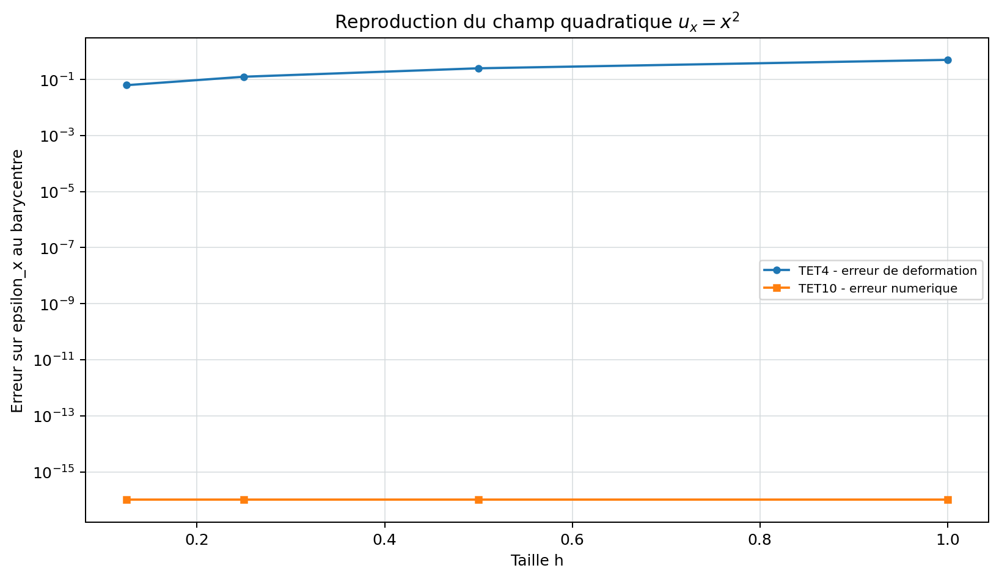

# Demonstrations solides TET4 et TET10

## TET4 en traction uniaxiale contrainte

Le tetraedre unite est bloque sur trois noeuds et charge suivant `UX` au
quatrieme. La solution fermee est calculee a partir de la raideur locale, sans
utiliser l'assemblage global. La campagne compare deplacement, von Mises,
residu libre et identite energetique.

{ .result-figure }

--8<-- "docs/generated/tet4_results.md"

## TET4 en compression signee

Le meme tetraedre canonique recoit cette fois $F_x=-1000$ N. La preuve ne se
contente pas de la norme du deplacement : elle verifie le signe de $u_x$, la
contrainte $\sigma_{xx}=-6000$ Pa, von Mises et la reaction globale
$R_x=+1000$ N.

{ .result-figure }

--8<-- "docs/generated/tet4_compression_results.md"

## Force volumique coherente TET4

Pour le tetraedre de volume $V=1/6$ m3, la densite de force constante
$b_x=6000$ N/m3 donne la resultante $F_x=b_xV=1000$ N. L'interpolation
lineaire repartit cette force a parts egales entre les quatre noeuds. Le bilan
publie compare separement charge, reactions, force residuelle et moment
residuel.

--8<-- "docs/generated/tet4_body_force_results.md"

## Pression coherente TET4

Sur la face opposee a l'origine du tetraedre unite, $A=\sqrt3/2$ et
$\mathbf n=(1,1,1)/\sqrt3$. Une pression compressive $p=1000$ Pa produit:

$$
\mathbf F=-pA\mathbf n=[-500,-500,-500]^T\ \mathrm N.
$$

La ligne d'action traverse l'origine, donc le premier moment ferme est nul.

--8<-- "docs/generated/tet4_pressure_results.md"

## Patch affine et convergence

Le patch impose $\mathbf u=\mathbf H\mathbf x+\mathbf c$. TET4 doit recuperer
exactement la partie symetrique de $\mathbf H$. Une petite poutre
multi-elements montre ensuite l'evolution du deplacement sous raffinement; la
valeur ne doit pas etre presentee comme une reference analytique de poutre
tant que les conditions aux limites 3D ne sont pas equivalentes.

{ .result-figure }

--8<-- "docs/generated/solid_convergence_results.md"

## TET10

Le patch affine protege la partition de l'unite, le Jacobien, la quadrature et
l'assemblage. Un champ de deplacement quadratique verifie que TET10 recupere
un gradient lineaire et converge plus vite que TET4 sur le cas construit.

{ .result-figure }

--8<-- "docs/generated/tet10_results.md"
