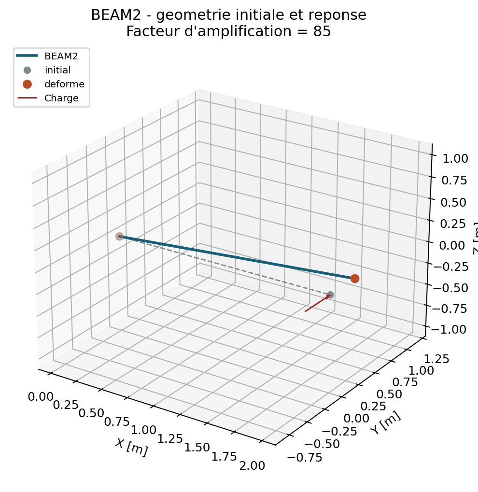

# BEAM2 - Poutre de Timoshenko 3D

## Chapitres detailles

- [Formulation forte et formulation faible](beam2/formulation_forte_faible.md)
- [Interpolation, matrices et repere](beam2/interpolation_matrices.md)
- [Verification, convergence et limites](beam2/verification_limites.md)

## Correlation externe statique

`VNV-BEAM2-CODEASTER-POUDE-001` execute Code_Aster 18.1.0 dans l'image Docker
epinglee et compare une poutre a section generale identique. Les observables
axial `UX`, torsion `RX` et flexion `UY` d'un porte-a-faux elance passent sous
`1 %`. L'oracle `POU_D_E` est Euler-Bernoulli : la flexion est donc choisie
elancee pour rendre le cisaillement Timoshenko negligeable. Cette preuve ne
qualifie ni les poutres epaisses, ni les charges reparties, ni la dynamique.

## Perimetre

`BEAM2` est un element droit a deux noeuds destine aux poutres elastiques
isotropes en petites transformations. Chaque noeud porte les six DDL globaux
`UX`, `UY`, `UZ`, `RX`, `RY`, `RZ`. La formulation comprend traction,
cisaillement transverse, torsion et flexion dans les deux plans locaux.

Cette premiere implementation accepte une section constante par element. Les
relachements, offsets, sections variables, plasticite de section et grandes
rotations restent hors scope.

## Repere local

L'axe local `e1` va du noeud 1 vers le noeud 2. La direction
`reference_vector` est projetee dans le plan normal a `e1` pour construire
`e2`, puis `e3 = e1 x e2`. Une direction de reference parallele a la poutre est
refusee. Sans direction explicite, le solveur choisit un axe global non
parallele de maniere deterministe.

La transformation nodale est appliquee de la meme maniere aux translations et
aux rotations. La matrice globale est donc obtenue par

\[
K_e^{g}=T^{T}K_e^{l}T.
\]

## Proprietes de section

Le materiau `beam_isotropic` definit `E`, `G` ou `nu`, l'aire `A`, les moments
quadratiques `Iy`, `Iz`, la constante de torsion `J`, la densite et les
facteurs de cisaillement `kappa_y`, `kappa_z`.

Pour la flexion associee au deplacement local `v` et a la rotation `rz`, le
parametre de Timoshenko est

\[
\phi_y=\frac{12 E I_z}{\kappa_y G A L^2}.
\]

Le bloc de rigidite utilise alors le facteur
`E Iz / (L^3 (1 + phi_y))`. Le second plan emploie de la meme facon `Iy` et
`kappa_z`. Lorsque les termes de cisaillement deviennent tres rigides, la
solution tend vers la poutre d'Euler-Bernoulli.

## Masse et dynamique

La masse coherente n'utilise pas une interpolation lineaire independante des
deplacements transverses et des rotations : celle-ci serait incompatible avec
le champ de flexion de la rigidite et fausserait les premieres frequences. Pour
chaque plan de flexion, QF_solver emploie la matrice de masse Hermite
Euler-Bernoulli pour `v/rz` ou `w/ry`, puis ajoute l'inertie rotatoire physique
Timoshenko `rho Iz` ou `rho Iy` des rotations independantes. Les termes axiaux
et de torsion utilisent les fonctions lineaires a deux noeuds avec `rho A` et
`rho J`.

La campagne `VNV-BEAM2-MODAL-CODEASTER-POUDE-002` compare les six modes d'un
porte-a-faux elance a Code_Aster 18.1.0 `POU_D_E`. L'ecart maximal observe est
`0,0265 %`; cette preuve couvre les signes locaux, l'ordre des modes et la
masse sur ce cas borne. Elle ne qualifie pas la dynamique de poutres epaisses,
la convergence modale multi-elements, l'amortissement, l'inertie repartie ou
les assemblages avec liaisons.

La masse concentree reste une entite discrete separee de la feuille de route
V1.

## Resultats

Le post-traitement fournit le repere local, la longueur, les douze DDL locaux,
les deformations generalisees et les efforts nodaux locaux dans l'ordre
`N`, `Vy`, `Vz`, `T`, `My`, `Mz`. Les efforts nodaux suivent la convention des
forces internes elementaires; les deux extremites sont donc opposees a
l'equilibre.

## Charges lineiques

Une charge `line_load` constante peut etre exprimee dans le repere global ou
local. Le vecteur nodal coherent conserve la force et le moment globaux et
inclut les couples d'extremite `q L^2 / 12` pour les composantes transverses.

## Verification initiale

Le cas `examples/beam2_cantilever.json` est un porte-a-faux de longueur `2 m`
charge par `1000 N`. Sa fleche est comparee a

\[
v(L)=\frac{P L^3}{3 E I_z}+\frac{P L}{\kappa_y G A}.
\]

Les tests couvrent egalement traction, torsion, flexion dans les deux plans,
six modes rigides, masse totale, invariance de repere et rejets de geometrie.

## References

- `REF-FEM-BATHE` pour la formulation variationnelle et l'assemblage.
- `REF-BEAM-TIMOSHENKO-1921` pour la deformation de cisaillement.

Le statut reste `experimental` : les correlations statique, modale elancee et
Newmark et harmonique axiaux sont acquises. `VNV-BEAM2-NEWMARK-CODEASTER-POUDE-003` compare
l'histoire complete `UX(t)` du meme porte-a-faux `POU_D_E` a Code_Aster 18.1.0
avec `beta=0.25`, `gamma=0.5` et une impulsion lisse; il compare aussi quatre
frequences harmoniques complexes hors resonance. Les ecarts RMS normalises
sont au niveau de la precision machine. Le cisaillement epais, les charges
reparties dynamiques et les assemblages restent a verifier.

## Contrat documentaire et demonstration

| Rubrique exigee | Contenu et preuve |
| --- | --- |
| Geometrie et DDL | Segment droit a 2 noeuds, repere local et 6 DDL/noeud. |
| Formulation mathematique | Timoshenko 3D : traction, torsion, deux flexions et cisaillements. |
| Integration et algorithme | Matrice locale analytique, transformation globale et assemblage sparse. |
| Exemple executable | `python .\qf_solver.py solve --input .\examples\beam2_cantilever.json --output .\results\beam2.json` |
| Maillage | Porte-a-faux a un element puis benchmark multi-elements. |
| Chargement et conditions limites | Encastrement du noeud 0, force transverse de `1000 N`. |
| Tableau de resultats | Tableau genere ci-dessous. |
| Figure de deformee | Geometrie initiale, charge et deformee amplifiee. |
| Invariants | Six modes rigides, symetrie, masse, invariance de repere et conservation force/moment. |
| Convergence | Benchmark multi-elements et correlation Code_Aster `POU_D_E`. |
| Limites | Section constante, petites rotations, pas d'offset ni plasticite. |
| References | `REF-FEM-BATHE`, `REF-BEAM-TIMOSHENKO-1921`. |

--8<-- "docs/generated/assembly_element_results.md"

{ .result-figure }

Owner review requise avant tout changement de maturite.
