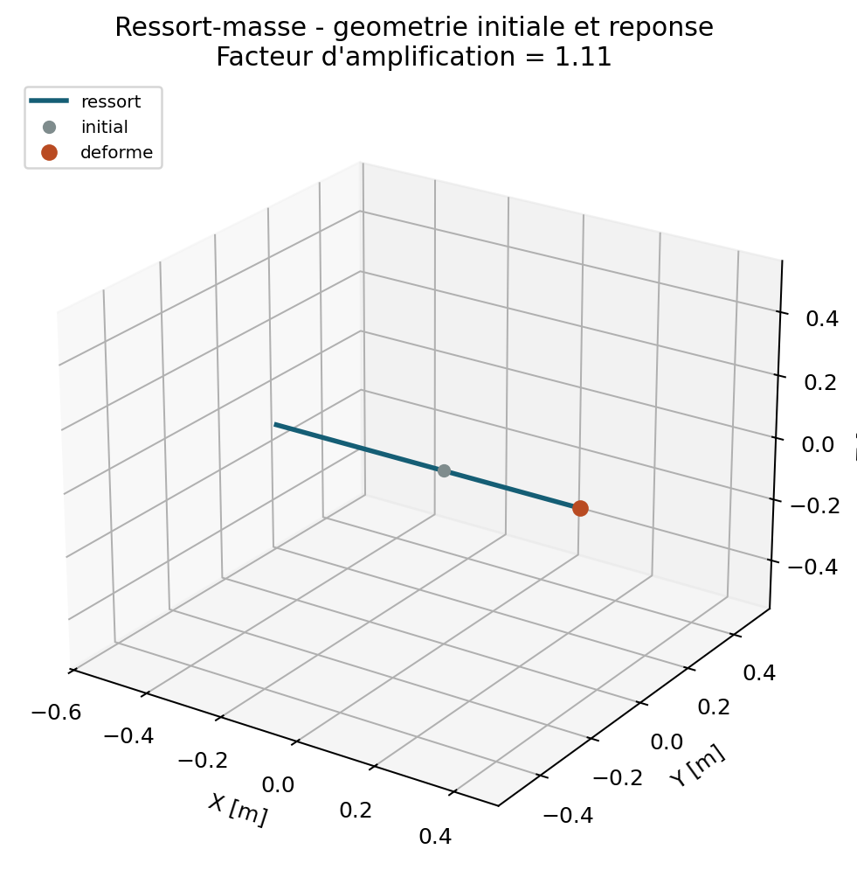

# Ressorts et masses concentrees

## Perimetre

QF_solver accepte des ressorts lineaires reliant un noeud au sol ou deux
noeuds, ainsi que des masses concentrees nodales. Le chemin SDOF
translationnel est accepte par l'Owner apres correlation Code_Aster; les
entites restent `experimental` hors de ce domaine borne. Elles peuvent
etre associees aux elements TET4, TET10, MITC4 et BEAM2, ou former un petit
modele discret autonome.

## Ressort a deux noeuds

Dans les degres de liberte selectionnes, un ressort entre les noeuds `a` et
`b` produit :

$$
\mathbf K_{\mathrm{ressort}}=
\begin{bmatrix}
\mathbf K & -\mathbf K\\
-\mathbf K & \mathbf K
\end{bmatrix}.
$$

Le vecteur de deplacement rigide identique aux deux noeuds appartient donc au
noyau de la matrice. Les efforts internes sont egaux et opposes. Pour un
ressort au sol, seul le bloc `K` du noeud `a` est assemble.

La raideur peut etre :

- un scalaire applique a tous les DDL listes ;
- un vecteur diagonal, une valeur par DDL ;
- une matrice symetrique positive semi-definie.

Une matrice locale est projetee dans le repere global avec la matrice
d'orientation `R`. Pour une partie translationnelle ou rotationnelle :

$$
\mathbf K_{\mathrm{global}}
=\mathbf R\,\mathbf K_{\mathrm{local}}\,\mathbf R^{T}.
$$

Le repere doit etre orthonorme et direct. Une raideur negative est refusee
dans le perimetre V1.

## Masse concentree excentree

Une masse simple sans inertie active seulement `UX`, `UY`, `UZ` et ajoute
`m I3` a la matrice de masse. Lorsqu'un centre de masse excentre `r` ou un
tenseur d'inertie au centre de masse `Ic` est donne, la matrice spatiale au
noeud d'attache est :

$$
\mathbf M=
\begin{bmatrix}
m\mathbf I_3 & -m\mathbf S(\mathbf r)\\
m\mathbf S(\mathbf r) &
\mathbf I_c+m\mathbf S(\mathbf r)^T\mathbf S(\mathbf r)
\end{bmatrix}.
$$

`S(r)` est la matrice antisymetrique telle que `S(r) x = r cross x`. Cette
forme provient directement de l'energie cinetique :

$$
T=\frac{1}{2}m
\left\lVert\mathbf v-\mathbf S(\mathbf r)\boldsymbol\omega\right\rVert^2
+\frac{1}{2}\boldsymbol\omega^T\mathbf I_c\boldsymbol\omega.
$$

Le tenseur `Ic` est exprime dans le repere global. Il doit etre symetrique,
positif semi-defini et respecter l'inegalite triangulaire des moments
principaux. Une masse purement translationnelle n'ajoute aucun DDL de
rotation, ce qui evite les singularites artificielles sur un noeud solide.

## Verification analytique

Le fichier `examples/spring_mass_oscillator.json` definit trois directions
decouplees. La premiere frequence est :

$$
f_1=\frac{1}{2\pi}\sqrt{\frac{k_x}{m}}
=\frac{1}{2\pi}\sqrt{\frac{1000}{10}}
=1{,}5915494309\ \mathrm{Hz}.
$$

Les tests automatiques controlent aussi :

- energie elastique et compliance statique ;
- forces opposees d'un ressort a deux noeuds ;
- projection d'un ressort local ;

La campagne `VNV-DISCRETE-CODEASTER-SDOF-001` compare aussi Newmark et la
reponse harmonique complexe sur le meme ressort au sol, la meme masse et les
memes grilles temporelle et frequentielle. Les inerties excentrees, matrices
couplees, orientations locales et assemblages multi-noeuds restent hors de
cette correlation et exigent une preuve distincte.
- symetrie, positivite et invariance par rotation de la masse spatiale ;
- conservation de la masse translationnelle ;
- rejet des donnees non physiques ;
- aller-retour du schema JSON strict.

## Correlation externe bornee

`VNV-DISCRETE-CODEASTER-SDOF-001` execute Code_Aster 18.1.0 `DIS_T` dans
l'image Docker epinglee sur le meme ressort au sol `k = 1000 N/m`, la meme
masse ponctuelle `m = 10 kg` et la meme charge `F = 25 N`. QF_solver et
Code_Aster donnent respectivement une fleche de `0.025 m` avec un ecart relatif
de `1.39e-14 %`; la premiere frequence est `1.5915494309 Hz` dans les deux
codes, a la precision machine. Le meme deck applique ensuite une impulsion
sinusoidale lisse et resout `0.20 s` par Newmark moyenne acceleration
(`beta=0.25`, `gamma=0.5`, `dt=0.002 s`). L'ecart RMS normalise sur toute
l'histoire `UX(t)` est `3.05e-9 %`.

```powershell
python .\scripts\run_code_aster_discrete_vnv.py --output results\VNV-DISCRETE-CODEASTER-SDOF-001
```

Cette preuve couvre le statique, le premier mode, le transitoire Newmark et
quatre frequences harmoniques complexes hors resonance d'une masse
translationnelle avec un ressort global au sol. Les centres de masse excentres,
inerties de rotation, matrices couplees, orientations locales et assemblages
multi-noeuds restent `experimental` sans correlation externe dediee.

## Format JSON

```json
{
  "springs": [
    {
      "node_a": 4,
      "node_b": 8,
      "dofs": ["UX", "RY"],
      "stiffness_matrix": [[1000000.0, 0.0], [0.0, 500.0]],
      "coordinate_system": "global"
    }
  ],
  "concentrated_masses": [
    {
      "node": 8,
      "mass": 2.5,
      "center_of_mass": [0.0, 0.02, 0.0],
      "inertia": [[0.01, 0.0, 0.0], [0.0, 0.02, 0.0], [0.0, 0.0, 0.02]]
    }
  ]
}
```

## Limites V1

Les lois non lineaires, jeux, butees, amortisseurs, raideurs dependantes de
la frequence et matrices non symetriques sont hors perimetre. Les liaisons
MPC/RBE sont traitees separement en P7.3.

## Contrat documentaire et demonstration

| Rubrique exigee | Contenu et preuve |
| --- | --- |
| Geometrie et DDL | Entites nodales ou a deux noeuds, composantes translation/rotation selectionnees. |
| Formulation mathematique | Blocs ressort, masse et inertie concentrees, transport excentre. |
| Integration et algorithme | Aucune quadrature; insertion directe dans $K$ ou $M$. |
| Exemple executable | `python .\qf_solver.py solve --input .\examples\spring_mass_oscillator.json --output .\results\spring_mass.json` |
| Maillage | Deux noeuds relies dans le cas modal autonome. |
| Chargement et conditions limites | Noeud de reference bloque; masse libre portee par le ressort. |
| Tableau de resultats | Tableau genere ci-dessous, observable en hertz. |
| Figure de deformee | Mode propre amplifie ci-dessous. |
| Invariants | Action-reaction, mode rigide commun, symetrie, positivite et frequence analytique. |
| Convergence | Pas de h-convergence propre; correlation analytique et externe. |
| Limites | Linearite, pas de jeu, butee ou amortisseur generalise en V1. |
| References | `REF-FEM-BATHE` et exigences des entites discretes. |

--8<-- "docs/generated/assembly_element_results.md"

{ .result-figure }

Le scope `discrete-linear-dynamics` a ete accepte par l'Owner le `2026-08-02`
pour le domaine SDOF translationnel sans amortissement ni couplage multi-DDL.
Une Owner review distincte reste requise avant toute extension de ce domaine.
