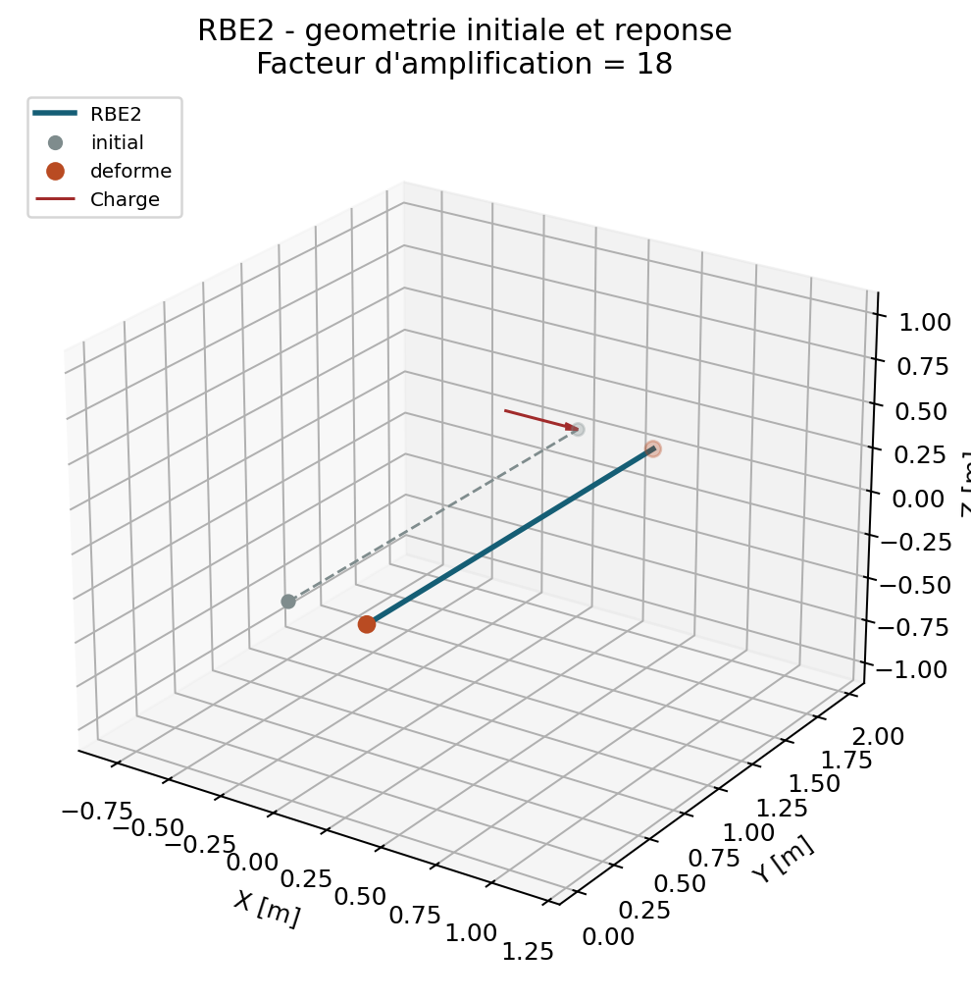

# Liaisons MPC et RBE

## Perimetre V1

Les liaisons sont disponibles seulement en `linear_static`. Elles sont
`experimental` : elles ont des tests analytiques internes, une verification
croisee elimination/multiplicateurs de Lagrange et une correlation externe
bornee du bras rigide RBE2. Les autres geometries, RBE3 et les analyses hors
statique lineaire restent ouverts.

`RBE2` et `RBE3` sont des noms fonctionnels courants. Ils decrivent ici le
comportement implemente par QF_solver, sans pretendre reproduire une syntaxe ou
un format proprietaire.

## MPC affine

Une contrainte multipoint est l'equation :

$$
\sum_i a_i q_i = b.
$$

Le premier terme JSON est le DDL dependant. Il definit seulement l'ordre
d'elimination ; l'equation complete reste celle affichee ci-dessus. Le solveur
construit une transformation affine :

$$
u = u_0 + Tz,\qquad K_r = T^TKT,\qquad f_r = T^T(f-Ku_0),
$$

puis resout $K_rz=f_r$. Cette reduction conserve la symetrie de $K_r$ quand
$K$ est symetrique. Les cycles, DDL repetes, pivots nuls et contraintes
conflictuelles sont refuses avant la resolution.

La formulation a multiplicateurs de Lagrange

$$
\begin{bmatrix}K&C^T\\C&0\end{bmatrix}
\begin{bmatrix}u\\lambda\end{bmatrix}
=
\begin{bmatrix}f\\b\end{bmatrix}
$$

est conservee comme oracle de verification sur les petits systemes. Elle n'est
pas le chemin nominal, car elle transforme le systeme en matrice selle.

## RBE2 : bras rigide

Pour un noeud esclave $s$, un maitre $m$ et le bras
$r=x_s-x_m$, QF_solver impose les trois relations globales :

$$
u_s = u_m + \theta_m \times r.
$$

Les rotations du maitre sont donc activees meme si le maitre est raccorde a
des solides. L'option `tie_rotations: true` ajoute seulement
$\theta_s=\theta_m$ ; elle est a utiliser lorsque les rotations esclaves ont
un sens mecanique, typiquement avec BEAM2 ou MITC4.

## RBE3 : distribution par projection rigide

Le mode par defaut `rigid_body_projection` relie les translations des noeuds
independants aux six coordonnees generalisees de reference. Avec
$r_i=x_i-x_r$, le bloc cinematique au noeud $i$ est :

$$
A_i = \begin{bmatrix} I & -S(r_i) \end{bmatrix},
\qquad u_i=A_iq_r.
$$

Le solveur construit la projection ponderee :

$$
H=(A^TWA)^{-1}A^TW,\qquad q_r=H u_I.
$$

Les poids sont strictement positifs et les noeuds independants doivent porter
les six mouvements rigides. Par travail virtuel, un torseur applique a la
reference est redistribue par $f_I=H^Tp$. La resultante et le moment sont donc
conserves. Cette liaison ajoute des equations cinematiques, jamais une
raideur.

Le mode explicite `weighted` reste disponible pour un cas scalaire ou 1D :

$$
q_r - \sum_i \frac{w_i}{\sum_j w_j}q_i = 0.
$$

Il normalise les poids mais ne garantit pas le moment pour une geometrie 3D;
il ne doit pas etre employe comme distributeur spatial de charge.

## Reactions et controles

Apres la resolution, QF_solver recupere les multiplicateurs par :

$$
K u-f+C^T\lambda=0.
$$

L'audit publie les vingt multiplicateurs les plus importants, la compatibilite
$\lVert Cu-b\rVert$, la fermeture de l'equilibre en espace complet et les
fermetures globales de force et moment. Les reactions legacy sur blocages
conservent leur convention historique `Ku-f`; elles ne doivent pas etre
confonduees avec $C^T\lambda$.

## JSON

```json
{
  "multipoint_constraints": [
    {
      "name": "tie_x",
      "terms": [
        {"node": 4, "dof": "UX", "coefficient": 1.0},
        {"node": 2, "dof": "UX", "coefficient": -1.0}
      ],
      "value": 0.0
    }
  ],
  "rbe2": [{"master": 0, "slaves": [1, 2], "tie_rotations": false}],
  "rbe3": [{
    "mode": "rigid_body_projection",
    "reference": 3,
    "independents": [
      {"node": 4, "weight": 1.0},
      {"node": 5, "weight": 1.0},
      {"node": 6, "weight": 1.0}
    ]
  }]
}
```

Voir aussi `examples/rbe2_rigid_arm.json` et
`tests/unit/test_mpc_reduction.py`, `tests/unit/test_rbe_links.py`.

## Correlation externe RBE2

`VNV-RBE2-CODEASTER-RIGID-ARM-001` compare un bras de longueur `2 m`, relie
par les six relations cinematques exactes du RBE2 a un maitre ressorti en
translation `UX`. Une force `FX = 20 N` est appliquee a l'esclave. Le jeu de
reference Code_Aster 18.1.0 emploie `LIAISON_DDL`, pas un format RBE
proprietaire :

$$
u_{x,s}-u_{x,m}+2\theta_{z,m}=0,
\quad u_{y,s}-u_{y,m}=0,
\quad u_{z,s}-u_{z,m}-2\theta_{x,m}=0.
$$

Le resultat deplace `UX` est `0.02 m` dans les deux solveurs, avec un ecart
relatif mesure de `3.47e-18`. La commande reproductible est :

```powershell
python .\scripts\run_code_aster_rbe_vnv.py
```

Le rapport et son manifeste sont ecrits dans
`results/VNV-RBE2-CODEASTER-RIGID-ARM-001`. Cette campagne valide la
cinematique de transfert en statique. `REAC_NODA` de Code_Aster ne restitue
pas la reaction associee a la liaison duale dans cette configuration : le
moment de `40 N.m` reste donc verifie en interne par l'audit QF_solver et par
la comparaison elimination/multiplicateurs, non par cette colonne externe.

## Limites et precautions

- Les MPC/RBE ne sont pas encore composes avec modal, Newmark, harmonique,
  non-lineaire ou contact.
- Une liaison peut masquer un mecanisme de modele ; le rapport de rang et les
  warnings de maillage restent a examiner.
- Les multiplicateurs sont recuperes pour l'audit statique, mais modal,
  Newmark, harmonique, non-lineaire et contact ne les composent pas encore.
- Aucun RBE ne corrige un maillage insuffisant, une singularite ou un mauvais
  choix d'element.
- La preuve Code_Aster courante ne couvre ni RBE3, ni plusieurs bras, ni les
  reactions de multiplicateurs, ni les noeuds raccordes a une structure
  deformable.

## Contrat documentaire et demonstration

| Rubrique exigee | Contenu et preuve |
| --- | --- |
| Geometrie et DDL | Maitre, esclaves et bras geometriques; composantes actives explicites. |
| Formulation mathematique | Contraintes $Cq=d$, cinematique rigide RBE2 et projection RBE3. |
| Integration et algorithme | Pas de quadrature; elimination affine et controle par multiplicateurs. |
| Exemple executable | `python .\qf_solver.py solve --input .\examples\rbe2_rigid_arm.json --output .\results\rbe2.json` |
| Maillage | Bras rigide minimal a trois noeuds. |
| Chargement et conditions limites | Maitre bloque selon le JSON, charge sur un noeud lie. |
| Tableau de resultats | Tableau genere ci-dessous. |
| Figure de deformee | Bras initial, charge et mouvement contraint. |
| Invariants | Rang, compatibilite, mouvement rigide, resultante et moment transmis. |
| Convergence | Comparaison elimination/Lagrange et correlation Code_Aster. |
| Limites | V1 statique lineaire et conflits de contraintes refuses. |
| References | `REF-FEM-BATHE`, exigences MPC/RBE et preuves Code_Aster. |

--8<-- "docs/generated/assembly_element_results.md"

{ .result-figure }

Owner review requise avant tout changement de maturite.
