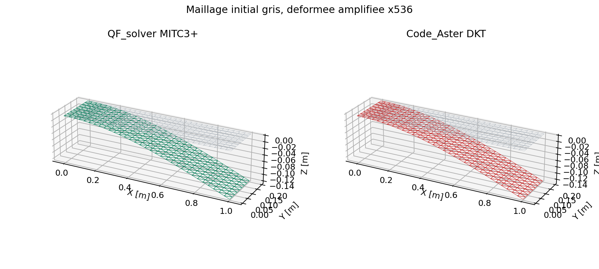

# MITC3+ - Synthese

`MITC3` designe dans QF_solver le triangle de coque MITC3+ lineaire de Lee,
Lee et Bathe. Il possede trois noeuds et six DDL nodaux, soit 18 DDL
assembles. Deux rotations internes de bulle enrichissent l'element avant
condensation statique.

| Propriete | Valeur |
| --- | --- |
| Theorie | Reissner-Mindlin, petits deplacements |
| Surface | facette triangulaire plane |
| DDL nodaux | `UX, UY, UZ, RX, RY, RZ` |
| DDL internes | deux rotations de bulle, non assemblees |
| Interpolation | translations P1; rotations P1 corrigees + bulle cubique |
| Cisaillement | champ covariant suppose MITC3+ |
| Quadrature | Dunavant a 7 points, degre 5 |
| Materiaux | isotrope et stratifies `shell_laminate` |
| Analyses | statique, modal, Newmark, harmonique |
| Maturite | `experimental` tant que la campagne complete n'est pas revue |

## Parcours de lecture

1. [Geometrie, DDL et reperes](mitc3/geometrie_ddl.md)
2. [Interpolation, bulle et tying](mitc3/interpolation_tying.md)
3. [Formulation forte et faible](mitc3/formulation_forte_faible.md)
4. [Matrices, masse, charges et condensation](mitc3/matrices_charges.md)
5. [Post-traitement et qualite](mitc3/post_traitement_qualite.md)
6. [Verification, locking et limites](mitc3/verification_limites.md)

## Decision d'usage

Le triangle rend possibles les maillages surfaciques non structures et les
transitions avec MITC4. Il ne doit pas etre choisi uniquement parce qu'il est
moins couteux: sa convergence en flexion peut demander davantage
d'elements. Les résultats de la campagne rapide sont des preuves de
developpement; ils ne constituent pas encore une qualification.

## Exemple executable

Le cas de coque triangulaire est execute par l'API publique :

```powershell
python .\qf_solver.py solve --input .\examples\mitc3_shell_static.json --output .\results\mitc3_shell_static.json
```

Le maillage est triangulaire, le chargement est applique dans le repere
global puis projete dans le repere local de chaque facette. Les conditions
limites bloquent les DDL prescrits avant la condensation des deux rotations
internes de bulle.



## Contrat documentaire et demonstration

| Rubrique exigee | Contenu et preuve |
| --- | --- |
| Geometrie et DDL | Triangle plan a trois noeuds, 18 DDL assembles et deux rotations internes condensees. |
| Formulation mathematique | Reissner-Mindlin, interpolation P1 enrichie et cisaillement suppose MITC3+. |
| Integration et algorithme | Dunavant a sept points, assemblage local puis condensation statique. |
| Exemple executable | Commande `qf_solver.py solve` donnee ci-dessus. |
| Maillage | Triangles structures et non structures; controle d'orientation et de qualite. |
| Chargement et conditions limites | Charges nodales ou reparties, projection locale et blocages compatibles avec six DDL nodaux. |
| Tableau de resultats | Les campagnes MITC3 publient deplacements, reactions, energies et ecarts aux references. |
| Figure de deformee | Maillage initial, forme amplifiee et comparaison Code_Aster ci-dessus. |
| Invariants | Modes rigides, symetrie, patchs, bilan d'energie, equilibre et resistance au shear locking. |
| Convergence | Scordelis-Lo, cylindre pince et hemisphere pince sur plusieurs raffinements. |
| Limites et references | Petites rotations, facettes planes et maturite experimentale; references Lee-Lee-Bathe et Code_Aster. |

Cette page attend une Owner review documentaire. Une demonstration documentee
ne vaut pas qualification et ne change pas seule la maturite de l'element.
