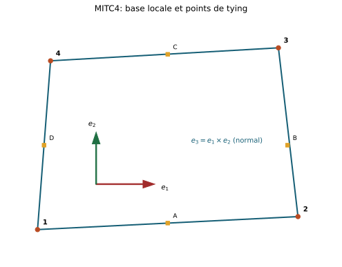
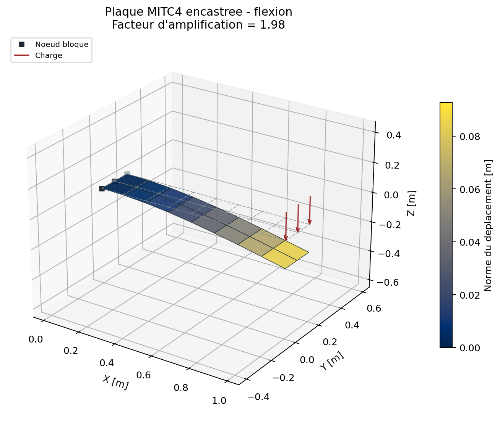

# Element de coque MITC4

## Chapitres detailles

- [Geometrie, ddl et repere local](mitc4/geometrie_ddl.md)
- [Interpolation, Jacobien et points de tying](mitc4/interpolation_tying.md)
- [Matrices, charges et rotation de drilling](mitc4/matrices_charges.md)
- [Derivation complete : cinematique et tying MITC](mitc4/formulation_complete.md)
- [Formulation forte, faible et interpolation mixte](mitc4/formulation_forte_faible.md)
- [Resultantes, faces et qualite](mitc4/post_traitement_qualite.md)
- [Verification, locking et limites](mitc4/verification_limites.md)

stable - statique lineaire bornee

MITC4 est une facette quadrangulaire a quatre noeuds fondee sur la theorie de
Reissner-Mindlin. Chaque noeud porte trois translations et trois rotations.

{ .result-figure }

## Cinematique

Dans le repere local $(x,y,z)$ de la surface moyenne:

$$
\boldsymbol\varepsilon_m=
[u_{,x},v_{,y},u_{,y}+v_{,x}]^T,
$$

$$
\boldsymbol\kappa=
[r_{y,x},-r_{x,y},r_{y,y}-r_{x,x}]^T,
$$

$$
\boldsymbol\gamma_s=
[w_{,x}+r_y,w_{,y}-r_x]^T.
$$

La rotation de la normale est independante de la pente, ce qui autorise le
cisaillement transverse.

## Construction de la base locale

Les diagonales sont $\mathbf d_1=\mathbf x_3-\mathbf x_1$ et
$\mathbf d_2=\mathbf x_4-\mathbf x_2$. La normale vaut:

$$
\mathbf e_3=\frac{\mathbf d_1\times\mathbf d_2}
{\|\mathbf d_1\times\mathbf d_2\|}.
$$

Le code cherche ensuite une arete non nulle $\mathbf a$, la projette dans le
plan:

$$
\widetilde{\mathbf e}_1=\mathbf a-(\mathbf a\cdot\mathbf e_3)\mathbf e_3,
\quad
\mathbf e_1=\widetilde{\mathbf e}_1/\|\widetilde{\mathbf e}_1\|,
\quad
\mathbf e_2=\mathbf e_3\times\mathbf e_1.
$$

La matrice $\mathbf R=[\mathbf e_1^T;\mathbf e_2^T;\mathbf e_3^T]$ transforme
translations et rotations. Pour les quatre noeuds:
$\mathbf T=\mathbf I_4\otimes\operatorname{diag}(\mathbf R,\mathbf R)$ et
$\mathbf K_g=\mathbf T^T\mathbf K_l\mathbf T$.

## Interpolation Q4 et Jacobien

Sur $[-1,1]^2$:

$$
N_1=\tfrac14(1-\xi)(1-\eta),\quad
N_2=\tfrac14(1+\xi)(1-\eta),
$$

$$
N_3=\tfrac14(1+\xi)(1+\eta),\quad
N_4=\tfrac14(1-\xi)(1+\eta).
$$

Le Jacobien plan $\mathbf J=\mathbf D_N^T\mathbf X_{2D}$ doit etre positif
aux quatre points $(\pm1/\sqrt3,\pm1/\sqrt3)$. La facette est projetee sur un
plan local; le gauchissement est mesure mais pas represente comme une coque
courbe.

## Membrane et flexion

Les matrices $\mathbf B_m$ et $\mathbf B_b$ reproduisent respectivement
$\boldsymbol\varepsilon_m$ et $\boldsymbol\kappa$. Elles sont integrees en
$2\times2$. Les lois generalisees sont:

$$
\mathbf N=\mathbf A\boldsymbol\varepsilon_m,\qquad
\mathbf M=\mathbf D\boldsymbol\kappa,
$$

avec $\mathbf A=t\mathbf D_p$ et $\mathbf D=t^3\mathbf D_p/12$.

## Interpolation MITC du cisaillement

Une interpolation Q4 directe de $w_{,x}+r_y$ et $w_{,y}-r_x$ verrouille les
plaques minces. MITC4 echantillonne les composantes covariantes:

| Point | Coordonnees | Composante |
| --- | --- | --- |
| A | $(0,-1)$ | $\xi$ |
| C | $(0,+1)$ | $\xi$ |
| B | $(+1,0)$ | $\eta$ |
| D | $(-1,0)$ | $\eta$ |

$$
\gamma_\alpha=w_{,\alpha}+r_yx_{,\alpha}-r_xy_{,\alpha}.
$$

Les valeurs liees sont interpolees par:

$$
g_\xi(\eta)=\tfrac12[(1-\eta)g_A+(1+\eta)g_C],\qquad
g_\eta(\xi)=\tfrac12[(1-\xi)g_D+(1+\xi)g_B],
$$

puis transformees par $\mathbf J^{-1}$. Cette operation relache les contraintes
parasites sans utiliser une integration reduite non controlee.

## Rotation de percage

$r_z$ ne porte pas d'energie dans la theorie classique. Le code ajoute:

$$
\gamma_d=r_z-\tfrac12(v_{,x}-u_{,y}),\qquad
\mathbf K_d=\int_A k_d\mathbf B_d^T\mathbf B_d\,dA,
$$

avec $k_d=s_dEt$ et $s_d=10^{-4}$ par defaut. Cette penalisation est numerique;
une analyse de sensibilite est requise si $r_z$ influence la reponse.

## Rigidite et post-traitement

$$
\mathbf K_l=\mathbf K_m+\mathbf K_b+\mathbf K_s+\mathbf K_d.
$$

Au centre, $\boldsymbol\varepsilon(z)=\boldsymbol\varepsilon_m+z\boldsymbol
\kappa$. Les faces sont $z=\pm t/2$ et la contrainte plane utilise
$\mathbf D_p$. Le post-traitement est centre-element et ne constitue pas un
champ extrapole complet.

{ .result-figure }

La base locale, la normale et le facteur d'amplification sont reportes avec la deformee.

--8<-- "docs/generated/mitc4_results.md"

## Domaine de validite et limites

- coque plane isotrope lineaire en statique;
- pas de masse MITC4 dans le solveur generique, donc pas de modal/dynamique;
- pas de grandes rotations ni pression suiveuse;
- sensibilite possible au gauchissement et a la penalisation de percage;
- reduction du shear locking demontree, mais convergence toujours obligatoire.

## Tracabilite

Code: `mitc4/element.py`, adapte par `solveur/elements/shell/mitc4.py`.
Verification: `tests/verification/test_mitc4_verification.py`, Scordelis-Lo,
patchs membrane/cisaillement/flexion et etude de locking. Exigence:
`REQ-SOL-002`.

| Bloc d'equations | Reference primaire | Code | Preuve | Exigence |
| --- | --- | --- | --- | --- |
| Cinematique coque et base locale | [REF-MITC4-DVORKIN](../reference/references.md#ref-mitc4-dvorkin) | `mitc4/element.py` | modes rigides, patch membrane | `REQ-SOL-002` |
| Tying du cisaillement tensoriel | [REF-MITC-BATHE](../reference/references.md#ref-mitc-bathe) | `mitc4/element.py` | patch cisaillement, locking | `REQ-SOL-002` |
| Obstacle course Scordelis-Lo | [REF-SHELL-OBSTACLE](../reference/references.md#ref-shell-obstacle) | `mitc4/benchmarks.py` | convergence Scordelis-Lo | `REQ-CMP-003` |

## Contrat documentaire et demonstration

| Rubrique exigee | Contenu et preuve |
| --- | --- |
| Geometrie et DDL | Facette Q4, repere local, normale orientee et 6 DDL/noeud; [geometrie et DDL](mitc4/geometrie_ddl.md). |
| Formulation mathematique | Reissner-Mindlin, membrane, flexion, cisaillement MITC et drilling; [derivation](mitc4/formulation_complete.md). |
| Integration et algorithme | Quadrature $2x2$, tying et transformation; [matrices et charges](mitc4/matrices_charges.md). |
| Exemple executable | `python .\mitc4_solver.py solve --input .\examples\mitc4_shell_static.json --output .\results\mitc4.json` |
| Maillage | Quadrangles plans et coques facettisees dans les limites de qualite documentees. |
| Chargement et conditions limites | Charges nodales, pression, tractions et blocages a 6 DDL. |
| Tableau de resultats | [Resultats coques generes](../demonstrations/coques.md). |
| Figure de deformee | Maillage initial et deforme amplifie ci-dessous. |
| Invariants | Modes rigides, symetrie, patchs, equilibre et energies separees. |
| Convergence | [Cook, Scordelis-Lo, cylindre pince et shear locking](mitc4/verification_limites.md). |
| Limites | Petites transformations, facettes bornees et sensibilite au drilling. |
| References | `REF-MITC4-DVORKIN`, `REF-MITC-BATHE`, exigences MITC4. |

{ .result-figure }

Les acceptations existantes restent inchangees. Cette page attend sa propre
Owner review documentaire.
