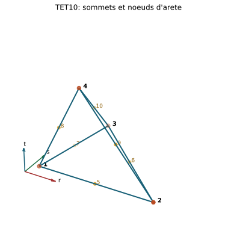
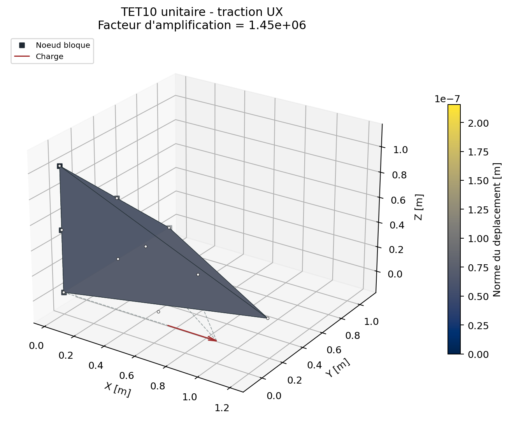

# Element solide TET10

## Chapitres detailles

- [Geometrie, ordre des noeuds et ddl](tet10/geometrie_ddl.md)
- [Interpolation isoparametrique et Jacobien](tet10/interpolation_jacobien.md)
- [Rigidite, masse et charges](tet10/matrices_charges.md)
- [Derivation complete : interpolation quadratique et quadrature](tet10/formulation_complete.md)
- [Formulation forte, faible et isoparametrique](tet10/formulation_forte_faible.md)
- [Post-traitement et qualite](tet10/post_traitement_qualite.md)
- [Verification et domaine de confiance](tet10/verification_limites.md)

experimental

Le TET10 est un tetraedre isoparametrique quadratique a trente ddl. Les quatre
premiers noeuds sont les sommets; les six suivants portent les aretes.

{ .result-figure }

## Numerotation locale

| Noeud | Position |
| ---: | --- |
| 1 a 4 | Sommets $L_1$ a $L_4$ |
| 5 | Arete 1-2 |
| 6 | Arete 2-3 |
| 7 | Arete 3-1 |
| 8 | Arete 1-4 |
| 9 | Arete 2-4 |
| 10 | Arete 3-4 |

Cette convention fait partie du format d'entree. Une permutation des noeuds
milieux change la geometrie et peut inverser le Jacobien.

## Fonctions de forme

Pour les coordonnees barycentriques $L_i$:

$$
N_i=L_i(2L_i-1),\quad i=1,\ldots,4,
$$

$$
N_5=4L_1L_2,\quad N_6=4L_2L_3,\quad N_7=4L_3L_1,
$$

$$
N_8=4L_1L_4,\quad N_9=4L_2L_4,\quad N_{10}=4L_3L_4.
$$

Elles verifient $\sum_iN_i=1$ et permettent un champ de deplacement
quadratique. La geometrie suit la meme interpolation, donc une position de
noeud milieu hors de l'arete produit une face courbe.

## Jacobien et matrice B

En notant $\mathbf D_r=\partial\mathbf N/\partial(r,s,t)$:

$$
\mathbf J=\mathbf D_r^T\mathbf X,
\qquad
\mathbf D_x=\mathbf D_r\mathbf J^{-T}.
$$

Les gradients physiques alimentent la meme construction de $\mathbf B$ que
pour TET4, avec dix blocs nodaux. Le determinant varie dans un element courbe.
Le code controle l'orientation des quatre coins, tous les points d'integration
et un lattice ferme deterministe; ce controle par echantillonnage ne prouve
pas la positivite globale du polynome $\det\mathbf J$.

## Integration de la rigidite

La regle de Hammer utilise quatre permutations de $(a,b,b,b)$ avec

$$
a=\frac{5+3\sqrt{5}}{20},\qquad
b=\frac{5-\sqrt{5}}{20},\qquad
w=\frac{1}{24}.
$$

Cette ecriture exacte evite une accumulation de decimales sans signification
physique. Les quatre poids somment au volume $1/6$ du tetraedre de reference.

$$
\mathbf K_e=\sum_{g=1}^4w\,\det(\mathbf J_g)
\mathbf B_g^T\mathbf D\mathbf B_g.
$$

Quatre etats materiau sont conserves en non-lineaire.

## Masse coherente

La masse est integree par transformation de Duffy et Gauss-Legendre d'ordre
5, soit 125 points:

$$
\mathbf M_e=\sum_g\rho w_g\det\mathbf J_g
[(\mathbf N_g\mathbf N_g^T)\otimes\mathbf I_3].
$$

Cette regle conserve la masse totale et prend en compte un Jacobien variable,
au prix d'un cout superieur au TET4.

## Recuperation des contraintes

Les quatre points de Hammer sont exportes. En elasticite, un champ lineaire
est ajuste sur ces points et extrapole aux dix noeuds. Pour un materiau a
memoire, les contraintes utilisent les etats committes et les variables
internes ne sont pas extrapolees afin d'eviter des valeurs plastiques nodales
non physiques.

{ .result-figure }

Les noeuds d'arete sont visibles. La geometrie initiale et la deformee utilisent la meme convention de connectivite.

--8<-- "docs/generated/tet10_results.md"

## Domaine de validite et limites

- meilleure representation de la flexion et des gradients que TET4;
- faces et aretes courbes possibles;
- controle de Jacobien seulement echantillonne;
- quadrature et recuperation a justifier pour geometries fortement courbes;
- cout de masse important;
- campagne de convergence industrielle encore insuffisante: l'element reste
  experimental meme si ses tests unitaires passent.

## Tracabilite

Code: `solveur/elements/solid/tet10.py`. Tests:
`tests/unit/test_tet10_element.py`, `tests/verification/test_tet10_verification.py`.
Exigence: `REQ-SOL-003`.

| Bloc d'equations | Reference | Code | Preuve | Exigence |
| --- | --- | --- | --- | --- |
| Fonctions quadratiques et mapping isoparametrique | [REF-FEM-BATHE](../reference/references.md#ref-fem-bathe) | `tet10.py` | partition, patch affine/quadratique | `REQ-SOL-003` |
| Quadrature, $B(\xi)$, $K_e$ et $M_e$ | [REF-FEM-BATHE](../reference/references.md#ref-fem-bathe) | `tet10.py` | energie, masse, convergence | `REQ-SOL-003` |
| Domaine d'emploi TET10 | [REF-SOLID-INDUSTRIAL](../reference/references.md#ref-solid-industrial) | documentation | comparaison TET4/TET10 | `REQ-CMP-003` |

## Contrat documentaire et demonstration

| Rubrique exigee | Contenu et preuve |
| --- | --- |
| Geometrie et DDL | Tetraedre quadratique, 10 noeuds et 30 translations; [geometrie et DDL](tet10/geometrie_ddl.md). |
| Formulation mathematique | Fonctions barycentriques quadratiques, Jacobien variable et $B$; [derivation](tet10/formulation_complete.md). |
| Integration et algorithme | Quadrature tetraedrique et boucle de Gauss; [matrices et charges](tet10/matrices_charges.md). |
| Exemple executable | `python .\qf_solver.py solve --input .\examples\tet10_static.json --output .\results\tet10.json` |
| Maillage | Connectivite avec ordre fixe des noeuds medians, geometries droites et courbes bornees. |
| Chargement et conditions limites | Charges nodales, volumiques et pressions coherentes; blocages du JSON. |
| Tableau de resultats | [Resultats solides generes](../demonstrations/solides.md). |
| Figure de deformee | Maillage initial et deforme amplifie ci-dessous. |
| Invariants | Symetrie, six modes rigides, patch affine, masse, residu et equilibre. |
| Convergence | [Quadrature, patch et structure](tet10/verification_limites.md). |
| Limites | Qualite geometrique, ordre nodal, geometries courbes et cout. |
| References | `REF-FEM-BATHE`, formules et exigences TET10 tracees. |

{ .result-figure }

Cette page reste `experimental` et attend une Owner review documentaire.
