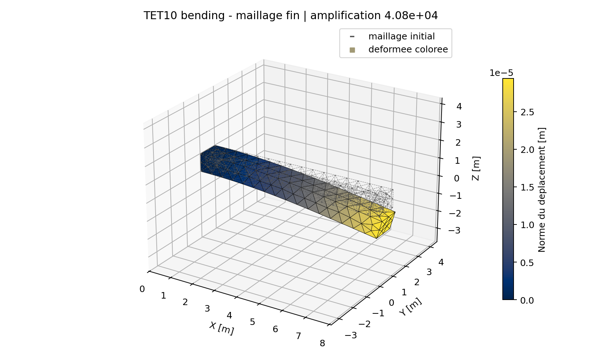
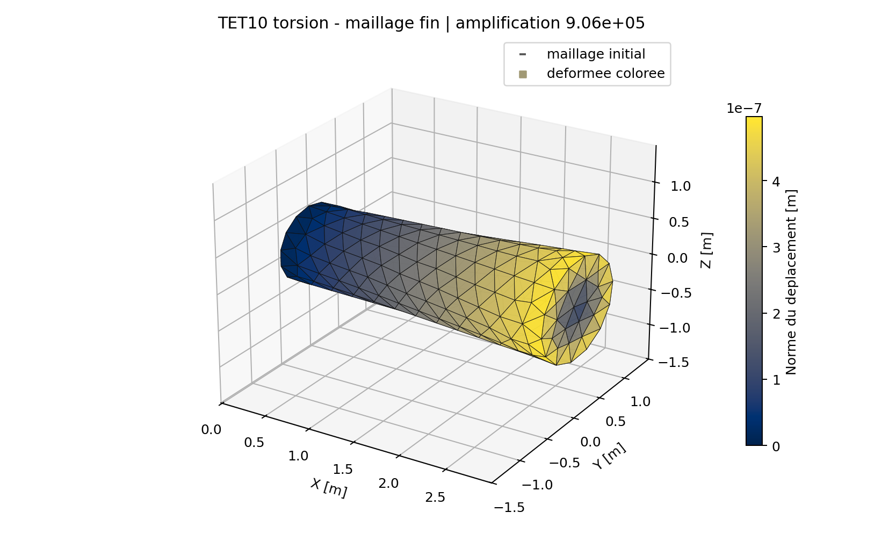
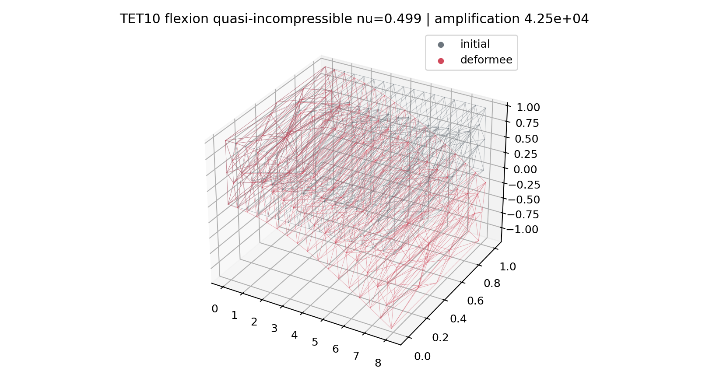

# TET10 - Verification et domaine de confiance

## Verifications elementaires

La campagne protege:

- partition de l'unite et derivees;
- six modes rigides;
- symetrie et energie de la rigidite;
- masse totale, symetrie et positivite;
- patch affine sur tetraedres aligne et oblique;
- recuperation d'un champ de deplacement quadratique;
- positivite echantillonnee du Jacobien;
- permutation Gmsh et reorientation complete.

## Benchmarks structures

[La poutre TET4/TET10](../../demonstrations/benchmarks/cantilever.md)
verifie la flexion et compare les solveurs. Le
[quart de cylindre de Lame](../../demonstrations/benchmarks/tet10_lame.md)
verifie une geometrie courbe, une pression et un champ radial analytique.

## Campagne Jacobien Et Quadrature

La campagne `VNV-TET10-GEOMETRY-QUADRATURE-011` est reproductible avec :

```powershell
python .\scripts\run_tet10_geometry_quadrature_vnv.py
```

| Cas | Courbure relative | Ratio min/max detJ | Erreur regle automatique | Erreur Hammer |
| --- | ---: | ---: | ---: | ---: |
| droit | 0 | 1 | $1,29\times10^{-15}$ | $1,29\times10^{-15}$ |
| courbe admissible | 0,0412 | 0,890 | $7,51\times10^{-7}$ | $9,28\times10^{-3}$ |
| proche limite qualite | 0,0495 | 0,870 | $1,57\times10^{-6}$ | $1,12\times10^{-2}$ |
| fortement distordu | 0,2886 | 0,0378 | $5,99\times10^{-3}$ | $7,54\times10^{-2}$ |

La reference est une quadrature Duffy positive d'ordre 8. Dans le domaine
courbe actuellement admis, la regle automatique reduit l'erreur matricielle de
plus de quatre ordres de grandeur par rapport aux quatre points de Hammer. Le
cas fortement distordu est conserve comme cas d'avertissement et non comme
domaine recommande. Un cinquieme cas dont le Jacobien echantillonne devient
negatif est rejete avant assemblage.


## Convergence Structurelle TET4/TET10

La campagne `VNV-TET10-STRUCTURAL-CONVERGENCE-012` execute quatre tailles de
maillage pour chaque famille et chaque probleme :

```powershell
python .\scripts\run_tet10_structural_convergence_vnv.py
```

| Probleme | Reference | TET4 fin | TET10 fin | Observation TET10 |
| --- | --- | ---: | ---: | --- |
| traction | Hooke uniaxial | $2,09\times10^{-15}$ | $2,09\times10^{-15}$ | patch affine exact |
| flexion | poutre de Timoshenko | 45,75 % | 1,179 % | erreur monotone, increment final 0,216 % |
| torsion | Saint-Venant circulaire | 18,68 % | 0,00250 % | contrainte L2 0,991 % |

La flexion TET10 est 38,8 fois plus proche de la reference que le TET4 au
dernier niveau. En torsion, le TET10 reproduit presque exactement la rotation
et abaisse l'erreur de contrainte sous 1 %. Les ordres ajustes ne doivent pas
etre interpretes seuls : le patch de traction atteint le bruit machine et la
torsion TET10 presente une convergence tres rapide liee a l'interpolation
quadratique et a la geometrie circulaire d'ordre deux.

La traction de torsion est integree sur les faces T3/T6, puis une correction
discrete de resultante est appliquee avant la normalisation du couple. Le
couple final est exact a $2,27\times10^{-16}$ relatif et la correction ne
modifie pas le moment demande.






## Masse, Modal, Charges Et Recuperation

La campagne `VNV-TET10-MASS-MODAL-LOADS-013` ferme la chaine lineaire restante :

```powershell
python .\scripts\run_tet10_mass_modal_loads_vnv.py
```

| Verification | Resultat | Critere |
| --- | ---: | ---: |
| masse totale sur geometrie courbe | $3,57\times10^{-16}$ | $\leq10^{-10}$ |
| resultante de pression T6 courbe | $9,10\times10^{-18}$ | $\leq10^{-10}$ |
| moment de pression T6 courbe | $4,71\times10^{-16}$ | $\leq10^{-10}$ |
| contrainte nodale affine recuperee | $8,72\times10^{-16}$ | $\leq10^{-11}$ |
| premiere paire modale TET10 | 12,7961 / 12,7965 Hz | 12,8519 Hz analytique |
| erreur modale maximale | 0,434 % | $\leq2$ % |
| residu propre maximal | $9,74\times10^{-11}$ | $\leq10^{-8}$ |

La section carree produit deux premiers modes de flexion presque doubles; leur
ecart relatif vaut $3,26\times10^{-5}$. L'orthogonalite masse vaut
$4,93\times10^{-16}$ et l'erreur de diagonalisation en raideur
$8,18\times10^{-14}$.

La recuperation sur geometrie courbe exploite 64 points Duffy et ajuste un
champ lineaire en coordonnees barycentriques par moindres carres. Elle est
exacte pour le patch affine, mais une recuperation de contraintes generales
reste une approximation de post-traitement et ne doit pas masquer les
singularites.


## Correlation Externe Sur Le Meme Maillage

La campagne `VNV-TET10-CALCULIX-C3D10-014` reprend le dernier arbre circulaire
courbe de torsion avec exactement les memes 1 992 noeuds, 1 063 elements
quadratiques, blocages et charges nodales dans QF_solver et CalculiX 2.20 :

```powershell
python .\scripts\run_calculix_tet10_vnv.py
```

| Comparaison | Ecart relatif | Critere |
| --- | ---: | ---: |
| champ de deplacement nodal complet | $6,84\times10^{-5}$ | $\leq10^{-4}$ |
| rotation terminale de torsion | $6,45\times10^{-5}$ | $\leq10^{-4}$ |

L'accord est obtenu sans projection entre maillages. La precision d'ecriture du
fichier FRD limite la mesure de l'ecart; cette campagne ne compare pas encore
les contraintes aux points d'integration.


## Caracterisation Quasi-Incompressible

`VNV-TET10-NEAR-INCOMPRESSIBLE-015` soumet une poutre 3D en flexion a trois
raffinements et a `nu = 0,30 / 0,45 / 0,49 / 0,499`. La compliance est
normalisee par la reference de Timoshenko adaptee au module de cisaillement.

| Element fin, maillage fin | nu=0,30 | nu=0,45 | nu=0,49 | nu=0,499 |
| --- | ---: | ---: | ---: | ---: |
| TET4 | 54,25 % | 38,82 % | 21,33 % | 8,48 % |
| TET10 | 98,82 % | 96,93 % | 95,71 % | 94,83 % |

Le TET4 lineaire sert ici de temoin de verrouillage volumique. Le TET10 est
beaucoup moins sensible et conserve 11,18 fois plus de compliance a
`nu=0,499`. Son erreur finale de `5,17 %` reste toutefois une caracterisation
sur un seul type de structure, pas une qualification de l'incompressibilite.
Une formulation mixte de type deplacement-pression est necessaire pour viser
`nu=0,5` de maniere generale.

```powershell
python .\scripts\run_tet10_near_incompressible_vnv.py
```




## Defaut historique maintenant protege

Une transformation $\mathbf D_x=\mathbf D_\xi\mathbf J^{-1}$ passait sur le
tetraedre unite car son Jacobien etait diagonal, mais rendait un maillage
oblique artificiellement raide. La formulation utilise maintenant
$\mathbf J^{-T}$ et le test oblique est obligatoire. Cet exemple illustre
pourquoi un test de reference canonique ne suffit pas.

## Maturite

Le TET10 lineaire isotrope est `stable_after_reinforced_tests` pour l'usage
engineering interne borne depuis la revue du 18 juillet 2026.
La rigidite elastique, la convergence structurelle, la masse coherente, le
modal, les charges de face courbes, le patch de recuperation nodale et la
correlation externe C3D10 et la sensibilite quasi-incompressible possedent
maintenant des preuves et une revue mecanique acceptee avec recommandations.
La limite exactement incompressible demeure explicitement exclue. Une campagne
finale sur pieces complexes et correlations multi-solveurs reste requise avant
acceptation totale ou qualification externe.

Tests: `tests/unit/test_tet10_element.py`,
`tests/integration/test_gmsh_import_cli.py`,
`tests/verification/test_meshed_benchmarks.py`,
`tests/verification/test_tet10_geometry_quadrature_vnv.py`,
`tests/verification/test_tet10_structural_convergence_vnv.py`,
`tests/verification/test_tet10_mass_modal_loads_vnv.py`,
`tests/unit/test_calculix_tet10.py`,
`tests/unit/test_tet10_near_incompressible.py`. Exigences:
`REQ-SOL-003`, `REQ-MESH-001`, `REQ-CMP-003`.
