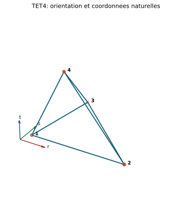
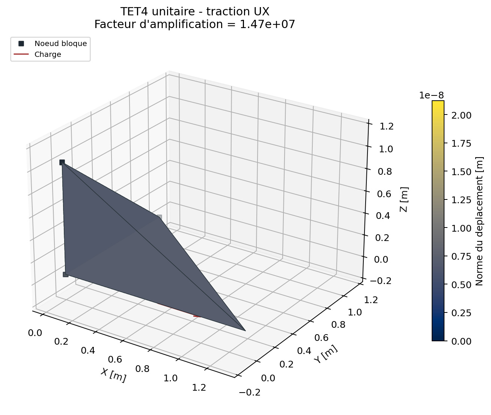

# Element solide TET4

## Chapitres detailles

- [Geometrie, orientation et ddl](tet4/geometrie_ddl.md)
- [Interpolation et Jacobien](tet4/interpolation_jacobien.md)
- [Matrices elementaires et charges](tet4/matrices_charges.md)
- [Derivation complete : de la base barycentrique a la rigidite](tet4/formulation_complete.md)
- [Formulation forte, faible et tests variationnels](tet4/formulation_forte_faible.md)
- [Post-traitement et qualite](tet4/post_traitement_qualite.md)
- [Verification, convergence et limites](tet4/verification_limites.md)

stable - statique lineaire bornee

Cette fiche technique est un document historique detaille. Le mot `stable`
est un raccourci de cette fiche et ne remplace pas le statut combinaison-
niveau du registry v2 0.2.7, qui borne la qualification TET4 par element,
analyse, materiau et route.

Le TET4 est un tetraedre lineaire a quatre sommets et douze ddl de translation.
Il reproduit exactement un deplacement affine et une deformation constante.

{ .result-figure }

## Geometrie et orientation

Pour les sommets $\mathbf x_1,\ldots,\mathbf x_4$:

$$
V=\frac16\det\left[
\mathbf x_2-\mathbf x_1\quad
\mathbf x_3-\mathbf x_1\quad
\mathbf x_4-\mathbf x_1\right].
$$

La connectivite est directe si $V>0$. Le code refuse $V\le10^{-14}$ dans les
unites du modele. Ce seuil absolu rend indispensable une echelle geometrique
coherente; la validation ajoute des indicateurs relatifs de qualite.

## Interpolation barycentrique

Dans le tetraedre de reference $(r,s,t)$:

$$
L_1=1-r-s-t,\quad L_2=r,\quad L_3=s,\quad L_4=t,
\qquad N_i=L_i.
$$

La geometrie et le deplacement sont interpoles par les memes fonctions:

$$
\mathbf x=\sum_{i=1}^4N_i\mathbf x_i,
\qquad
\mathbf u=\sum_{i=1}^4N_i\mathbf u_i.
$$

Le code forme la matrice

$$
\mathbf A=
\begin{bmatrix}
1&x_1&y_1&z_1\\
1&x_2&y_2&z_2\\
1&x_3&y_3&z_3\\
1&x_4&y_4&z_4
\end{bmatrix}
$$

et extrait $\nabla N_i$ de $\mathbf A^{-1}$. Ces gradients sont constants.

## Matrice deformation-deplacement

Pour $\nabla N_i=[N_{i,x},N_{i,y},N_{i,z}]$ et l'ordre de Voigt du solveur:

$$
\mathbf B_i=
\begin{bmatrix}
N_{i,x}&0&0\\
0&N_{i,y}&0\\
0&0&N_{i,z}\\
N_{i,y}&N_{i,x}&0\\
0&N_{i,z}&N_{i,y}\\
N_{i,z}&0&N_{i,x}
\end{bmatrix},\qquad
\mathbf B=[\mathbf B_1\ \mathbf B_2\ \mathbf B_3\ \mathbf B_4].
$$

Ainsi $\boldsymbol\varepsilon=\mathbf B\mathbf u_e$ est constant dans
l'element.

## Rigidite, masse et efforts internes

Pour une elasticite homogene:

$$
\mathbf K_e=V\mathbf B^T\mathbf D\mathbf B.
$$

La matrice est symetrisee numeriquement. Un element libre valide presente six
modes rigides et six modes deformables.

La masse coherente utilise des blocs $3\times3$:

$$
\mathbf M_{ij}=\frac{\rho V}{20}
\begin{cases}2\mathbf I_3&i=j,\\\mathbf I_3&i\ne j.\end{cases}
$$

Pour une loi non lineaire locale:

$$
\mathbf f_{int,e}=V\mathbf B^T\boldsymbol\sigma,
\qquad
\mathbf K_{T,e}=V\mathbf B^T\mathbf D_T\mathbf B.
$$

Un seul etat materiau est necessaire, le champ de deformation etant constant.

## Chargements

Les forces volumiques et la gravite utilisent l'integration de $\mathbf N^T$.
Une traction ou pression constante sur une face triangulaire conduit a une
force nodale coherente repartie sur les trois sommets. L'audit verifie la
resultante et le premier moment.

## Post-traitement

La deformation, la contrainte et von Mises sont elementaires et constants.
Les contraintes principales sont les valeurs propres du tenseur symetrique
reconstruit. Les valeurs nodales exportees sont des moyennes des elements
adjacents; elles ne doivent pas etre confondues avec une nouvelle solution EF.

{ .result-figure }

Forme initiale en gris, deformee amplifiee et coloree par la norme du deplacement. Les valeurs sont regenerees par le solveur.

--8<-- "docs/generated/tet4_results.md"

## Domaine de validite et limites

- efficace pour maillages 3D non structures et grands volumes de calcul;
- convergence lente en flexion et pour les gradients de contrainte;
- fort impact des elements aplatis;
- verrouillage volumique attendu lorsque $\nu$ approche $0.5$;
- contraintes discontinues, donc convergence locale a etudier;
- aucune valeur au voisinage d'une singularite ne doit etre acceptee sur un
  seul maillage.

## Tracabilite

Code: `solveur/elements/solid/tet4.py`. Tests principaux:
`tests/unit/test_tet4_element.py`, `tests/unit/test_distributed_loads.py` et
`tests/integration/test_qualification_campaign.py`. Exigence: `REQ-SOL-001`.

| Bloc d'equations | Reference | Code | Preuve | Exigence |
| --- | --- | --- | --- | --- |
| Travaux virtuels, $B$, $K_e$, $M_e$ | [REF-FEM-BATHE](../reference/references.md#ref-fem-bathe) | `tet4.py` | patch affine, modes rigides, energie | `REQ-SOL-001` |
| Volume oriente et mapping | [REF-FEM-BATHE](../reference/references.md#ref-fem-bathe) | `tet4.py`, `mesh/quality.py` | element inverse/degenere | `REQ-MESH-001` |
| Domaine d'emploi TET4 | [REF-SOLID-INDUSTRIAL](../reference/references.md#ref-solid-industrial) | documentation | convergence h | `REQ-CMP-003` |

## Contrat documentaire et demonstration

| Rubrique exigee | Contenu et preuve |
| --- | --- |
| Geometrie et DDL | Tetraedre oriente, 4 noeuds et 12 translations; [geometrie et DDL](tet4/geometrie_ddl.md). |
| Formulation mathematique | Interpolation barycentrique, $B$ constante, rigidite et masse; [derivation](tet4/formulation_complete.md). |
| Integration et algorithme | Rigidite exacte par volume constant, assemblage et charges; [matrices et charges](tet4/matrices_charges.md). |
| Exemple executable | `python .\qf_solver.py solve --input .\examples\tet4_static.json --output .\results\tet4.json` |
| Maillage | Tetraedre de reference puis familles raffinees des benchmarks. |
| Chargement et conditions limites | Charges nodales/pression et blocages supprimant les modes rigides. |
| Tableau de resultats | [Resultats solides generes](../demonstrations/solides.md). |
| Figure de deformee | Maillage initial et deforme amplifie ci-dessous. |
| Invariants | Volume positif, symetrie, six modes rigides, patch affine, residu, equilibre et energie. |
| Convergence | [Traction, flexion, torsion et patch](tet4/verification_limites.md). |
| Limites | Verrouillage volumique, contrainte constante et sensibilite aux elements aplatis. |
| References | `REF-FEM-BATHE`, formules et exigences TET4 tracees. |

{ .result-figure }

Cette page attend une Owner review documentaire. Sa demonstration ne change
ni la maturite actuelle ni le statut de qualification.
