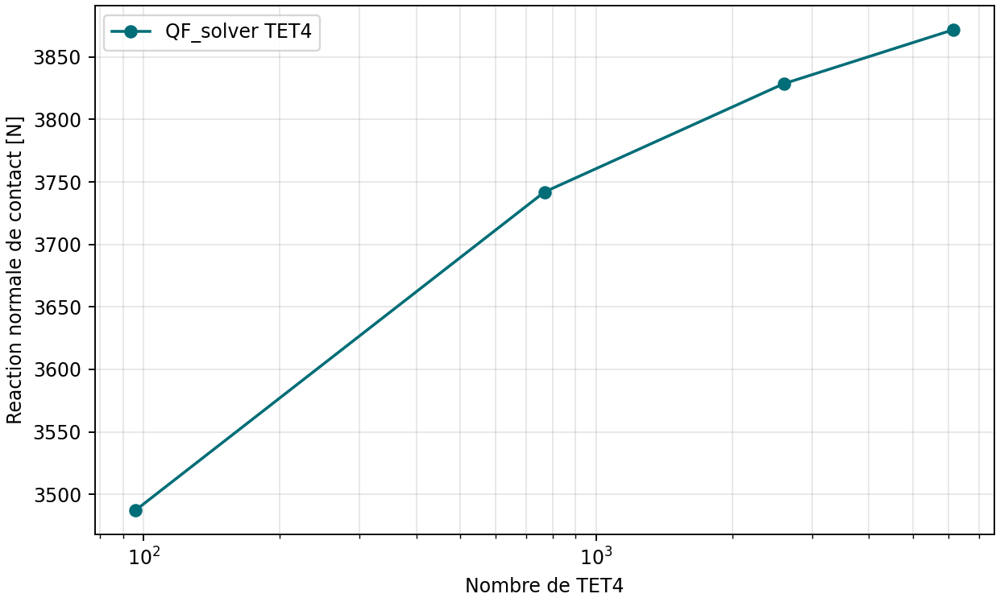
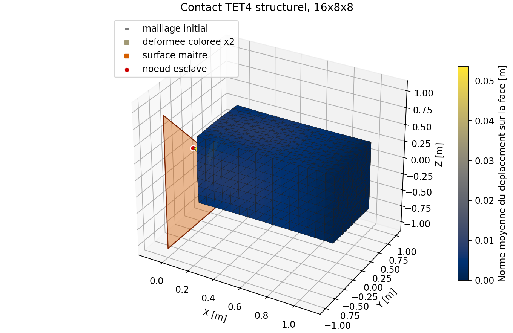

# V&V contact unilateral : convergence structurelle TET4

- Etude : `VNV-CONTACT-TET4-STRUCTURAL-001`
- Verdict interne : `PASS_INTERNAL`
- Maturite : `experimental`
- Reference : convergence interne d'une barre deformable TET4 contre un plan rigide.

## Resultats de raffinement

| Maillage | TET4 | DDL | Gap [m] | Reaction [N] | Variation | Residu |
| --- | ---: | ---: | ---: | ---: | ---: | ---: |
| 4x2x2 | 96 | 144 | 2.776e-17 | 3487.297256 | - | 2.962e-16 |
| 8x4x4 | 768 | 684 | 5.551e-17 | 3741.972397 | 6.81 % | 3.026e-16 |
| 12x6x6 | 2592 | 1920 | 5.690e-16 | 3828.590642 | 2.26 % | 2.166e-16 |
| 16x8x8 | 6144 | 4140 | -4.857e-16 | 3871.825557 | 1.12 % | 1.970e-16 |

## Interpretation

Le gap normal est impose exactement quand le contact est actif. La reaction depend en revanche de la compliance de la structure TET4 et doit donc se stabiliser sous raffinement. Ce test ne remplace ni une correlation externe, ni un test de contact surface-a-surface.

