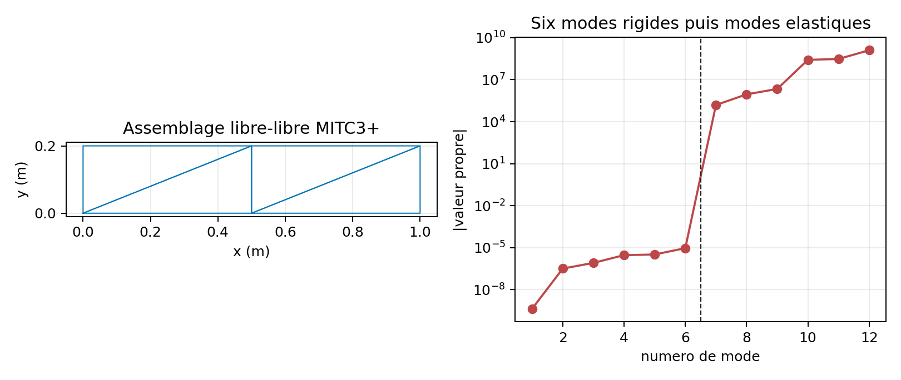
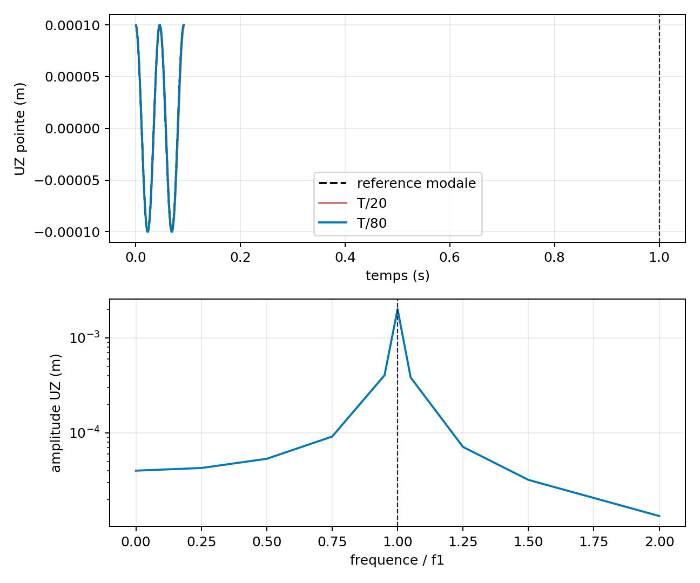

# VNV-MITC3-DYNAMIC-EXTENDED-001

## Objet

Verification interne MITC3+ isotrope pour une structure libre-libre, une coque cylindrique facettisee et les routes Newmark/harmonique. Il ne s'agit pas d'une correlation externe.

## Libre-libre

Six valeurs propres rigides restent separees du premier mode elastique avec un ratio `5.938e-11`. Le residu analytique maximal des mouvements rigides est `2.106e-17`.

## Coque courbe et eigsh

| Maillage | Elements | DDL retenus | Premier mode (Hz) | Residu |
| --- | ---: | ---: | ---: | ---: |
| 16 x 4 | 128 | 448 | 21.747691 | 2.186e-09 |
| 24 x 6 | 288 | 960 | 19.178202 | 6.304e-09 |
| 32 x 8 | 512 | 1664 | 18.121073 | 1.366e-08 |

## Newmark et harmonique

| Pas/periode | Erreur RMS | Derive energie | Residu dynamique |
| ---: | ---: | ---: | ---: |
| 20 | 4.162e-02 | 7.780e-12 | 1.518e-10 |
| 40 | 1.048e-02 | 1.778e-11 | 1.396e-10 |
| 80 | 2.623e-03 | 2.299e-11 | 1.361e-10 |

Erreur harmonique complexe maximale : `1.014e-08`. Limite statique : `3.437e-12`.

## Limites ouvertes

- All temporal and harmonic references are the first computed mode of the same assembled model; they prove algorithmic consistency, not an external element correlation.
- The curved shell uses planar MITC3+ facets. It does not claim a curved isoparametric triangular mapping.
- No same-mesh Code_Aster or CalculiX correlation is supplied for modal, Newmark or harmonic MITC3+ response.
- Nodal shell-stress histories are excluded when adjacent MITC3+ local frames are not aligned. Element-level harmonic stresses remain available.
