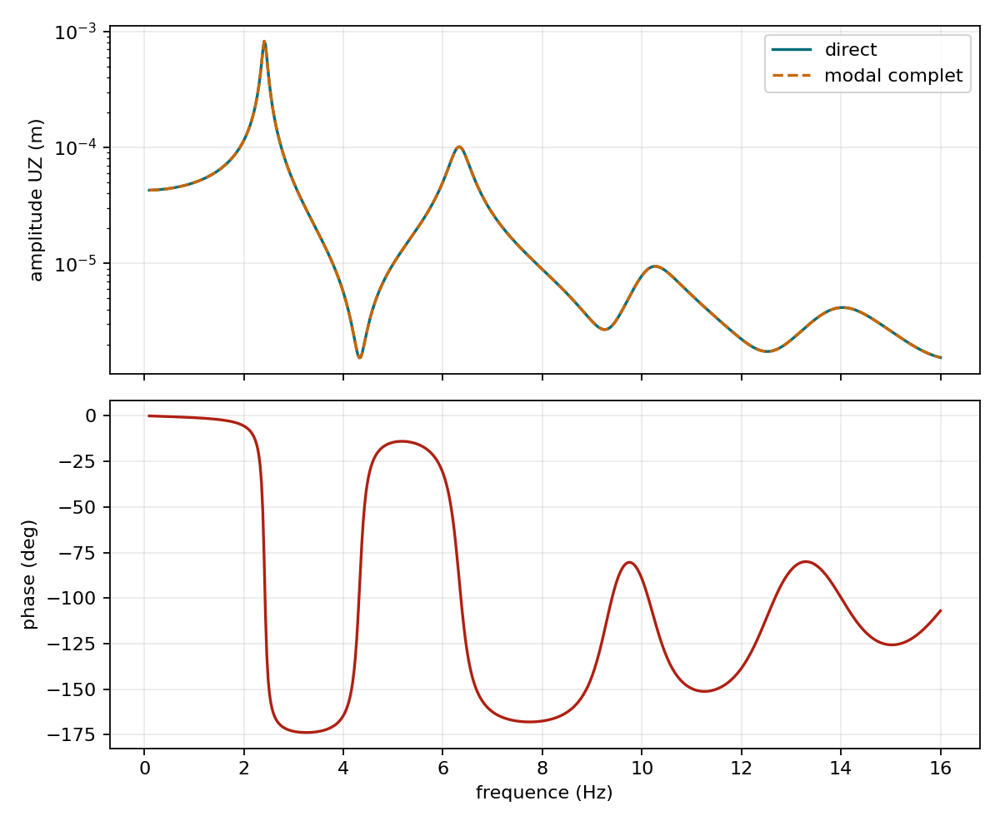

# VNV-MITC4-HARMONIC-BROADBAND-003

## Objet

Balayage direct de 0,1 a 16 Hz sous force `UZ` decentree. Une decomposition
modale complete de 175 modes fournit un second
algorithme de reference sur le meme systeme discret.

| Famille | Frequence modale (Hz) | Pic direct (Hz) | Amplitude (m) | Ecart |
| ---: | ---: | ---: | ---: | ---: |
| 1 | 2.417888 | 2.409349 | 8.226494e-04 | 0.353 % |
| 2 | 6.332087 | 6.337896 | 1.011525e-04 | 0.092 % |
| 3 | 10.192141 | 10.266444 | 9.428069e-06 | 0.729 % |
| 4 | 13.991183 | 14.035726 | 4.161410e-06 | 0.318 % |

- erreur complexe plein champ maximale: `2.411e-07`;
- erreur complexe a la sonde maximale: `2.404e-07`;
- residu relatif maximal: `8.251e-11`.

Statut : **PASS**.

