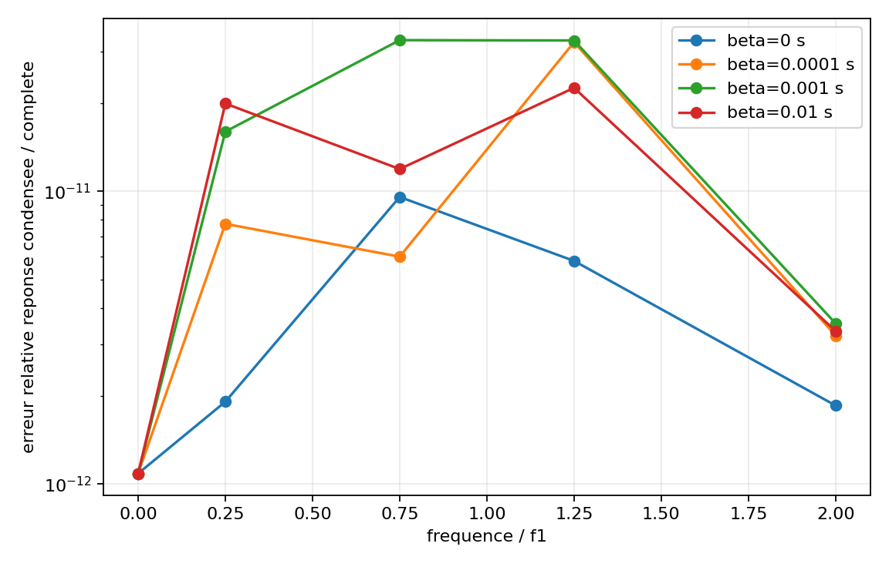

# VNV-MITC4-HARMONIC-CONDENSATION-002

## Objet

Verifier la condensation harmonique exacte des rotations de drilling MITC4
sans masse, y compris avec amortissement de Rayleigh proportionnel a la
rigidite et moment harmonique applique directement sur `RZ`.

## Demonstration

Avec `Z=a*K+b*M`, les blocs de masse du drilling sont nuls. Le complement de
Schur devient exactement `Zc=a*(Kpp-Kpd*Kdd^-1*Kdp)+b*Mpp`, et la rotation
eliminee est `ud=Kdd^-1*(fd/a-Kdp*up)`.

| Controle | Erreur maximale | Limite |
| --- | ---: | ---: |
| Complement de Schur | 7.922e-17 | 1.0e-11 |
| Charge condensee | 1.248e-16 | 1.0e-11 |
| Reponse condensee / systeme complet | 3.283e-11 | 1.0e-09 |
| Equilibre complexe complet | 7.828e-11 | 1.0e-08 |

Statut : **PASS**.

