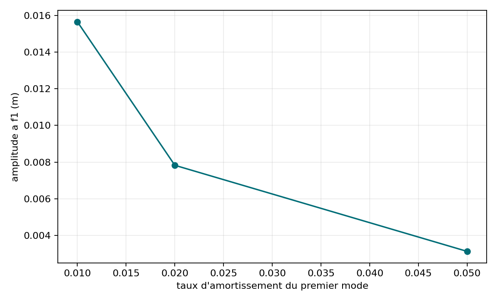

# VNV-MITC4-HARMONIC-MODAL-001

## Objet

Balayage harmonique du premier mode MITC4 avec charge `F0=M*phi1`.

- erreur complexe maximale : `1.901e-07`;
- erreur limite statique : `4.500e-11`;
- pic : `8.363501 Hz`;
- residu maximal : `1.490e-09`.

| Amortissement | Amplitude a f1 (m) | Phase (deg) | Erreur analytique |
| ---: | ---: | ---: | ---: |
| 0.010 | 1.564734e-02 | -90.000 | 3.799e-07 |
| 0.020 | 7.823669e-03 | -90.000 | 1.901e-07 |
| 0.050 | 3.129467e-03 | -90.000 | 7.600e-08 |

Statut : **PASS**.

