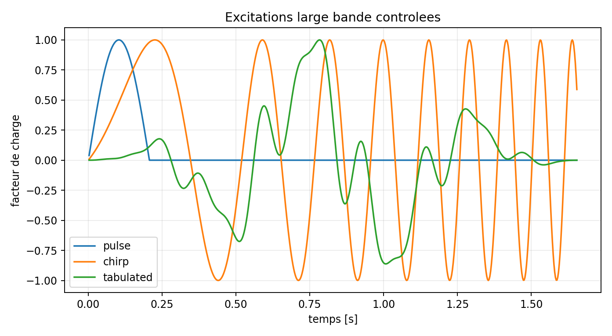

# VNV-MITC4-NEWMARK-BROADBAND-004

## Objet

Verification MITC4/Newmark sous impulsion demi-sinus, chirp lineaire et table arbitraire.
La reference temporelle est une propagation modale exacte par exponentielle de matrice.

| Cas | Pas/periode | RMS UZ | RMS S11 | Bilan energie | Residu relatif |
| --- | ---: | ---: | ---: | ---: | ---: |
| pulse | 40 | 1.7316 % | 4.4524 % | 0.2721 % | 8.243e-12 |
| pulse | 80 | 0.9603 % | 3.7631 % | 0.0720 % | 9.787e-12 |
| pulse | 160 | 0.2976 % | 1.3899 % | 0.0177 % | 9.472e-12 |
| chirp | 40 | 1.2155 % | 1.3922 % | 0.5691 % | 1.757e-11 |
| chirp | 80 | 0.3061 % | 0.3944 % | 0.1352 % | 2.060e-11 |
| chirp | 160 | 0.0775 % | 0.1194 % | 0.0337 % | 2.057e-11 |
| tabulated | 40 | 0.5893 % | 0.5284 % | 0.3379 % | 1.207e-11 |
| tabulated | 80 | 0.1470 % | 0.1321 % | 0.0843 % | 1.389e-11 |
| tabulated | 160 | 0.0368 % | 0.0332 % | 0.0211 % | 1.439e-11 |

Verdict automatique : **PASS**.

## Portee

L'oracle partage les matrices EF et isole donc l'erreur temporelle. La correlation spatiale
independante Code_Aster est conduite dans une etude externe separee.
