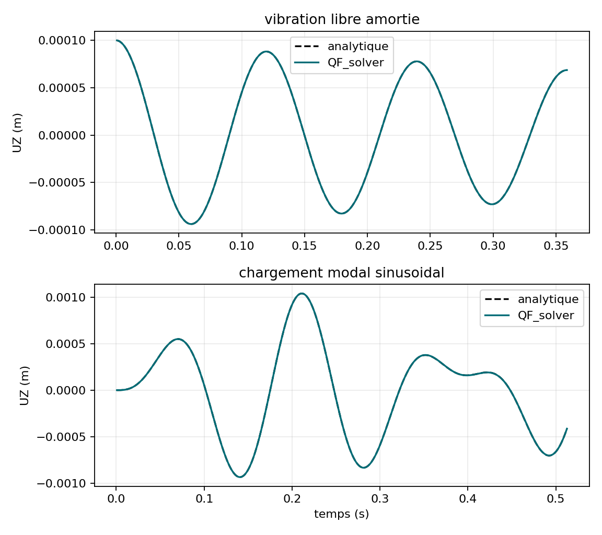

# VNV-MITC4-NEWMARK-DAMPED-FORCED-003

## Objet

Verification analytique de Newmark MITC4 en vibration libre amortie et sous
chargement modal sinusoidal non resonant.

| Cas | Pas/periode | Delta t (s) | Erreur RMS | Residu max |
| --- | ---: | ---: | ---: | ---: |
| amorti | 20 | 5.978358e-03 | 4.9915 % | 1.889e-11 |
| amorti | 40 | 2.989179e-03 | 1.2082 % | 2.283e-11 |
| amorti | 80 | 1.494589e-03 | 0.2996 % | 2.420e-11 |
| amorti | 160 | 7.472947e-04 | 0.0748 % | 2.349e-11 |
| force | 20 | 5.978358e-03 | 3.6888 % | 2.182e-10 |
| force | 40 | 2.989179e-03 | 0.9236 % | 2.774e-10 |
| force | 80 | 1.494589e-03 | 0.2304 % | 3.031e-10 |
| force | 160 | 7.472947e-04 | 0.0576 % | 2.416e-10 |

Statut : **PASS**.

