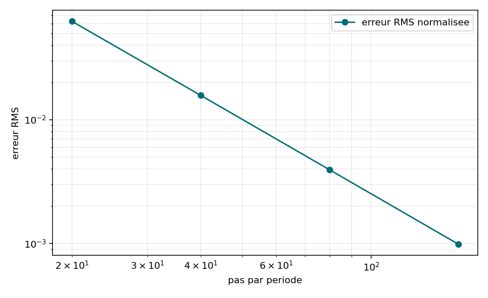
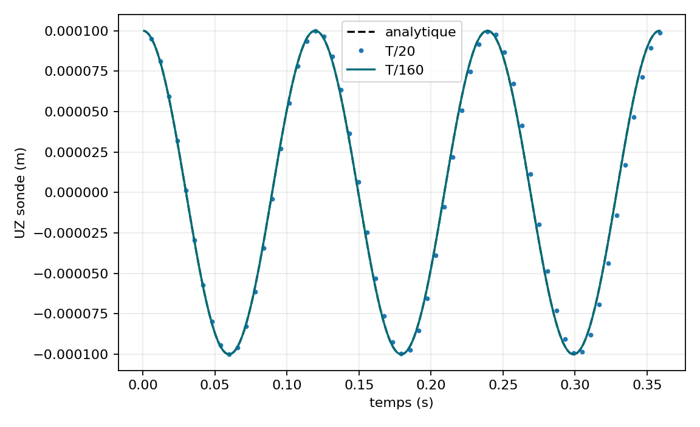

# VNV-MITC4-NEWMARK-FREE-002

## Objet

Vibration libre MITC4 initialisee par le premier mode verifie. La sonde signee
est comparee a `u0*cos(2*pi*f1*t)` sur trois periodes.

| Pas/periode | Delta t (s) | Erreur RMS | Erreur retour | Derive energie | Residu absolu max |
| ---: | ---: | ---: | ---: | ---: | ---: |
| 20 | 5.978358e-03 | 6.2578 % | 1.1648 % | 8.318e-11 | 3.495e-11 |
| 40 | 2.989179e-03 | 1.5755 % | 0.0745 % | 9.615e-11 | 2.893e-11 |
| 80 | 1.494589e-03 | 0.3945 % | 0.0047 % | 4.394e-11 | 2.561e-11 |
| 160 | 7.472947e-04 | 0.0987 % | 0.0003 % | 3.848e-11 | 2.173e-11 |

Ordres observes : `1.9899, 1.9976, 1.9994`. Statut : **PASS**.

