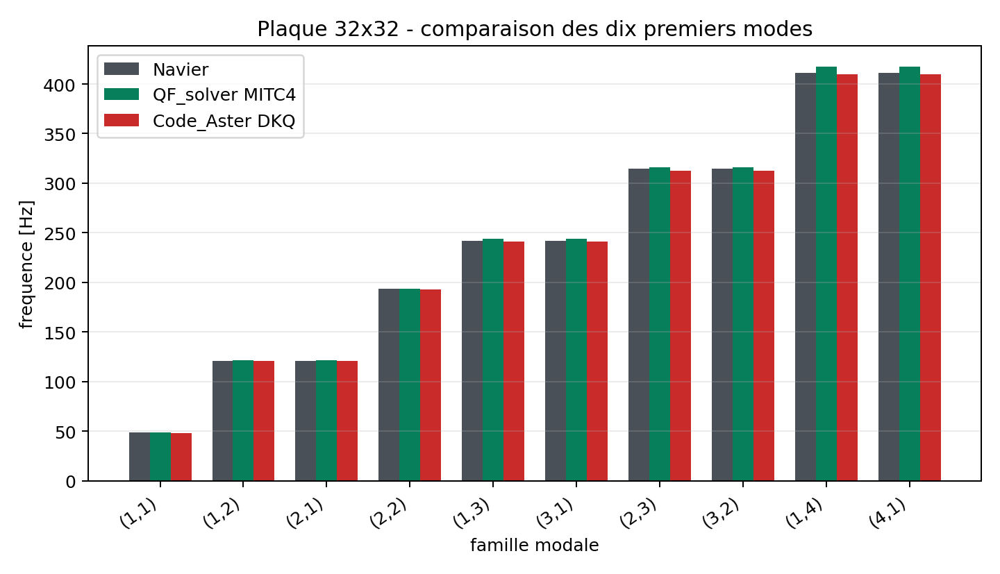
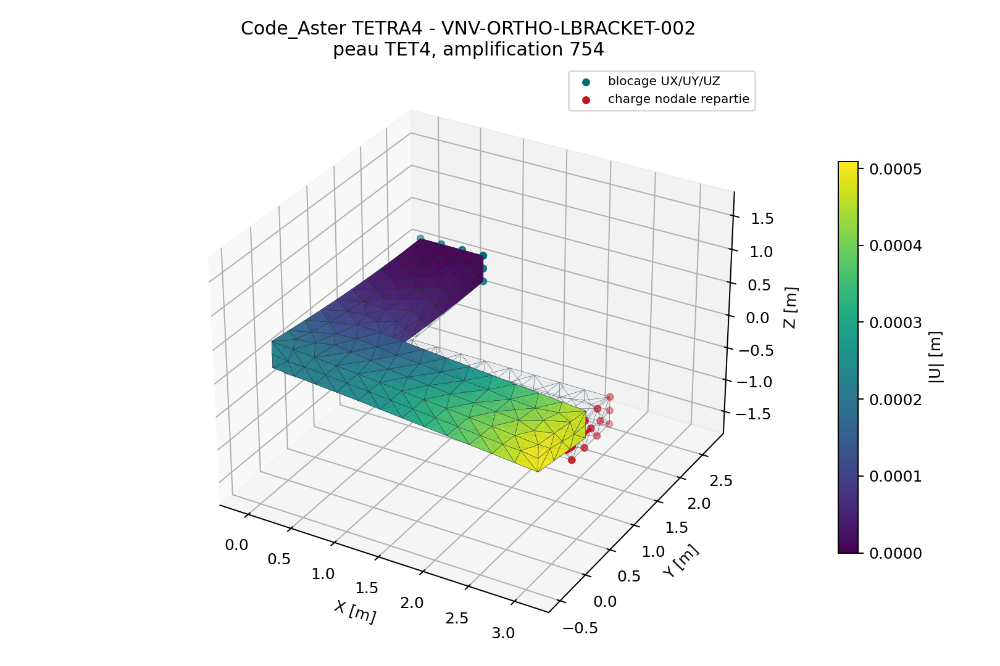
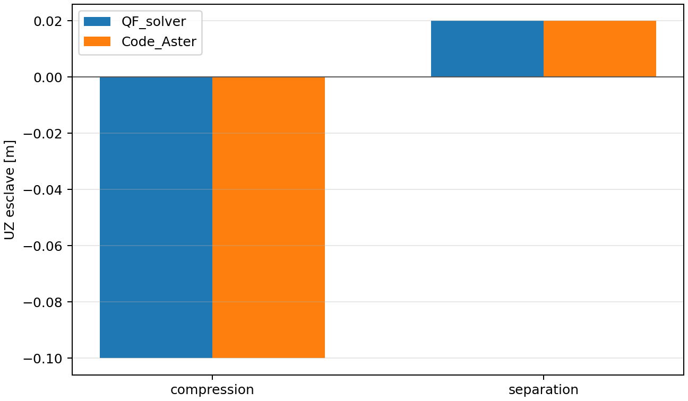
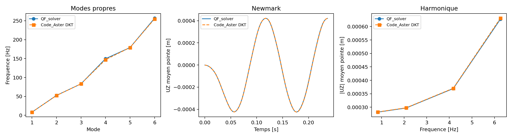
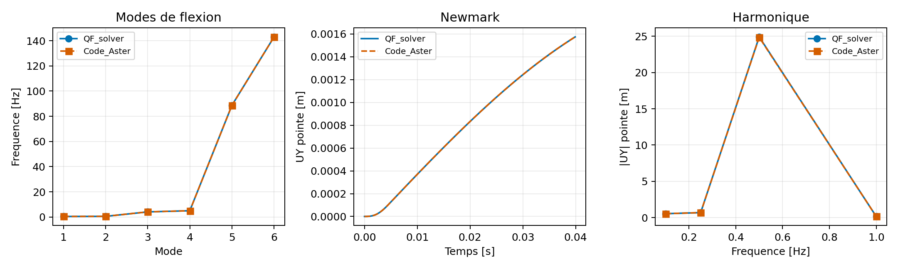
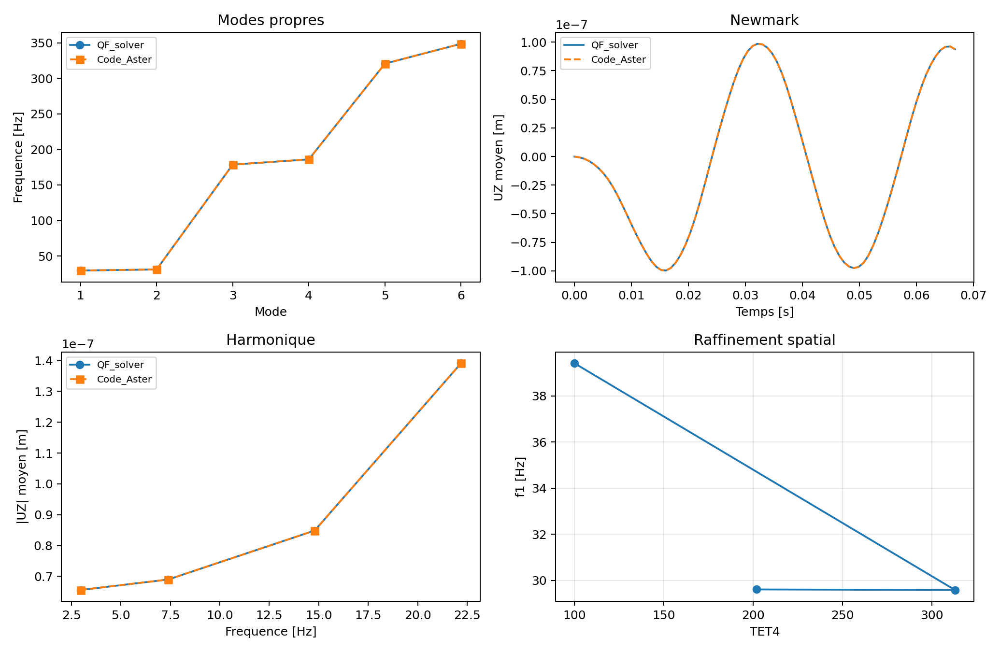
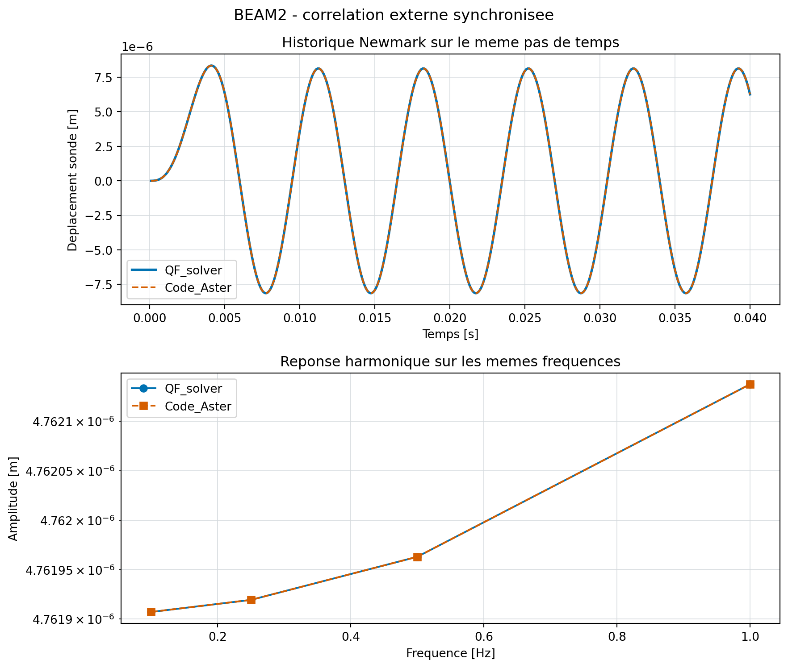
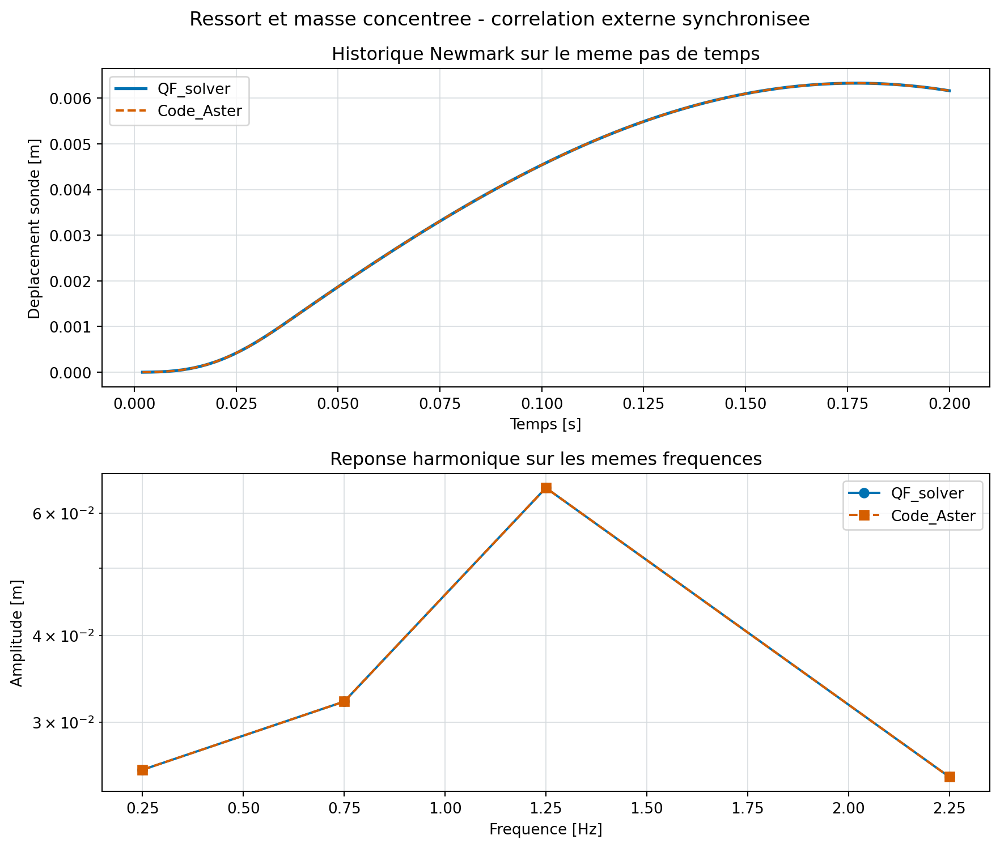

## Couverture technique regeneree

Cette table ferme la lacune documentaire en distinguant une preuve disponible d'un ecart V&V documente.
Un ecart documente n'est jamais transforme en validation mecanique.

- couples element-analyse declares : **34** ;
- contrats de chargement : **7** ;
- methodes correlees : **12** ;
- ecarts V&V explicites : **0**.

### Contrats de chargement

| Famille | Actions supportees | Documentation |
| --- | --- | --- |
| TET4 | nodal_load, pressure, surface_traction, gravity, body_force | `docs/elements/tet4/matrices_charges.md` |
| TET10 | nodal_load, pressure, surface_traction, gravity, body_force | `docs/elements/tet10/matrices_charges.md` |
| MITC4 | nodal_load, pressure, surface_traction, edge_traction, gravity, body_force | `docs/elements/mitc4/matrices_charges.md` |
| MITC3 | nodal_load, pressure, surface_traction, edge_traction, gravity, body_force | `docs/elements/mitc3/matrices_charges.md` |
| BEAM2 | nodal_load, beam_distributed | `docs/elements/beam2/interpolation_matrices.md` |
| SPRING_MASS | nodal_load, grounded_spring, concentrated_mass | `docs/elements/entites_discretes.md` |
| CONTACT | contact_normal, coulomb_regularized | `docs/elements/contact_sans_frottement.md` |

### Couples element-analyse et oracles

| Couple | Statut mecanique conserve | Oracle | Etat de preuve | Conclusion bornee |
| --- | --- | --- | --- | --- |
| TET4 / linear_static | `owner_accepted` | analytical | `available` | Affine patch, traction/compression, pressure, body force, membrane and Saint-Venant torsion. |
| TET4 / modal | `owner_accepted` | code_aster | `available` | Eigen residuals, first-mode oscillator reduction and same-mesh Code_Aster TETRA4 modes were accepted by the Owner on 2026-08-02. |
| TET4 / transient_newmark | `owner_accepted` | code_aster | `available` | Closed-form first-mode response, energy invariant and same-time-grid Code_Aster TETRA4 history were accepted by the Owner on 2026-08-02. |
| TET4 / harmonic | `owner_accepted` | code_aster | `available` | Static limit, resonance checks and same-frequency-grid Code_Aster TETRA4 response were accepted by the Owner on 2026-08-02. |
| TET4 / material_nonlinear_static | `experimental` | analytical | `available` | Uniaxial J2 path and CalculiX comparison; bounded small-strain scope. |
| TET4 / geometric_nonlinear_static | `owner_accepted` | code_aster | `available` | Total-Lagrangian structural paths correlated with Code_Aster within the reviewed scope. |
| TET10 / linear_static | `owner_accepted` | internal_reference | `available` | Affine, bending, torsion, curved geometry and h-convergence evidence; same-mesh external linear TET10 static correlation remains recommended. |
| TET10 / modal | `owner_accepted` | analytical | `available` | Consistent mass, modal residuals and bending mode convergence. |
| TET10 / transient_newmark | `owner_accepted` | code_aster | `available` | Internal first-mode response and a structural time-step study are complemented by the same-mesh Code_Aster TETRA10 Newmark history; accepted by the Owner on 2026-08-02. |
| TET10 / harmonic | `owner_accepted` | code_aster | `available` | Static limit, resonance checks, spatial frequency convergence and a same-mesh Code_Aster TETRA10 sweep were accepted by the Owner on 2026-08-02. |
| TET10 / material_nonlinear_static | `owner_accepted_experimental_bounded_use` | code_aster | `available` | The straight-bar monotone TET10/TETRA10 correlation was accepted by the Owner for experimental internal use. A re-entrant combined-load campaign also passes automatically, but its Owner review remains open; general maturity stays experimental. |
| MITC4 / linear_static | `owner_accepted` | code_aster | `available` | Patch, locking, Cook, Scordelis, pinched cylinder and same-mesh conical-cutout correlations; Code_Aster closes the resultant check. |
| MITC4 / modal | `owner_accepted` | code_aster | `available` | Consistent mass and ten-mode Code_Aster correlation. |
| MITC4 / transient_newmark | `owner_accepted` | analytical | `available` | Exact modal oscillator is the accepted temporal oracle; refined external structural correlation remains recommended. |
| MITC4 / harmonic | `owner_accepted` | published_benchmark | `available` | NAFEMS/theory and direct/modal-superposition checks within the reviewed band. |
| MITC4 / laminate_linear_static | `owner_accepted` | code_aster | `available` | ABD, ply stresses and bounded curved laminate comparisons; NAFEMS R0031 is the controlled external reference. |
| MITC4 / laminate_dynamic | `owner_accepted_experimental_bounded_use` | code_aster | `available` | Planar symmetric four-ply modal/Newmark/harmonic use is Owner-accepted as experimental and bounded. Dynamic curved shells, non-symmetric coupling, damage and delamination remain excluded; the 10 000 QUAD4 modal reservation remains open. |
| MITC3 / linear_static | `owner_accepted` | code_aster | `available` | Membrane, bending, hemisphere, Scordelis and pinched-shell evidence; active Code_Aster archive replaces obsolete versioned folder aliases. |
| MITC3 / modal | `owner_accepted` | code_aster | `available` | Modal invariants, free-free modes, curved-shell h-refinement, eigsh and same-mesh Code_Aster DKT six-mode correlation were accepted by the Owner on 2026-08-02; mesh-frequency refinement remains recommended. |
| MITC3 / transient_newmark | `owner_accepted` | code_aster | `available` | First-mode time-history, energy, curved-shell time-step convergence and same-mesh Code_Aster DKT transient history were accepted by the Owner on 2026-08-02; mesh-frequency refinement remains recommended. |
| MITC3 / harmonic | `owner_accepted` | code_aster | `available` | Static limit, resonance, curved-shell broadband stress output and same-mesh sub-resonant Code_Aster DKT sweep were accepted by the Owner on 2026-08-02; mesh-frequency refinement remains recommended. |
| MITC3 / laminate_linear_static | `verified_development_external_correlation` | code_aster | `available` | The flat symmetric [0/90/90/0] affine membrane patch is correlated with Code_Aster. The separate curved projected static scope is Owner-accepted with recommendations. |
| MITC3 / laminate_dynamic | `verified_development_external_correlation` | code_aster | `available` | Planar symmetric [0/90/90/0] modal/Newmark/harmonic responses are externally correlated on the same TRIA3 mesh with Code_Aster DST. Curved projected orientation remains outside the dynamic scope. |
| MITC3 / laminate_linear_static_curved | `owner_accepted_experimental_bounded_use` | code_aster | `available` | The Owner accepted the same faceted curved geometry with Code_Aster DST/TRIA3 and projected global reference vector as an experimental bounded static scope with recommendations. Ply stress, S13, damage, delamination and curved dynamic use remain outside the evidence. |
| BEAM2 / linear_static | `verified_development` | analytical | `available` | Timoshenko closed form and Code_Aster POU_D_E test route. |
| BEAM2 / modal | `owner_accepted` | code_aster | `available` | Six-mode axial and slender-transverse comparisons were accepted by the Owner on 2026-08-02. |
| BEAM2 / transient_newmark | `owner_accepted` | code_aster | `available` | Same mesh/time-grid axial and slender-transverse histories were accepted by the Owner on 2026-08-02. |
| BEAM2 / harmonic | `owner_accepted` | code_aster | `available` | Same-mesh axial and slender-transverse frequency responses were accepted by the Owner on 2026-08-02. |
| SPRING_MASS / linear_static | `verified_development` | code_aster | `available` | Grounded spring displacement. |
| SPRING_MASS / modal | `owner_accepted` | code_aster | `available` | Single-degree-of-freedom frequency is externally correlated and was accepted by the Owner on 2026-08-02. |
| SPRING_MASS / transient_newmark | `owner_accepted` | code_aster | `available` | Same time-grid transient response is externally correlated and was accepted by the Owner on 2026-08-02. |
| SPRING_MASS / harmonic | `owner_accepted` | code_aster | `available` | Same frequency-grid response is externally correlated and was accepted by the Owner on 2026-08-02. |
| CONTACT / linear_static | `owner_accepted` | code_aster | `available` | Bounded small-sliding normal-contact scope. |
| CONTACT / frictional_static | `experimental` | code_aster | `available` | Saturated sliding is correlated; adhesion remains non-comparable. |

### Correlation des methodes

| Methode | Base de comparaison | Preuve |
| --- | --- | --- |
| `direct` | assembled residual and energy balance | `tests/unit/test_solver.py` |
| `cg` | direct sparse solution | `tests/unit/test_solver.py` |
| `minres` | direct sparse solution | `tests/unit/test_solver.py` |
| `gmres` | direct sparse solution | `tests/unit/test_solver.py` |
| `bicgstab` | direct sparse solution | `tests/unit/test_solver.py` |
| `modal` | eigen residual, M/K orthogonality and analytical/external frequencies | `tests/unit/test_analysis_features.py` |
| `newmark` | closed-form oscillator, energy and external histories | `tests/unit/test_analysis_features.py` |
| `harmonic` | zero-frequency static limit, phase and external sweeps | `tests/unit/test_analysis_features.py` |
| `newton_j2` | uniaxial return mapping and external material paths | `tests/verification/test_j2_material_vnv.py` |
| `arc_length` | elastica reference; structural breadth remains experimental | `tests/unit/test_elastica_reference.py` |
| `total_lagrangian` | Code_Aster and CalculiX structural paths | `qualification/reviews/tet4_total_lagrangian_structural_v2_2026-07-18.json` |
| `large_model` | SciPy/PETSc small-model equivalence and MPI diagnostics | `tests/integration/test_large_model.py` |

### Vues comparees et convergences

{ .result-figure }

*Convergence structurelle TET10. Empreinte SHA-256 : `577d9384ca2c54d84af899fe6355c9453899d6e5a675f51b6b8dafa16fee91bd`.*

{ .result-figure }

*Deformee CalculiX C3D10 de reference. Empreinte SHA-256 : `ce463693e78cc14e99ccd8a20b665f2476925cd2d94329072ddfc5393b32ce02`.*

{ .result-figure }

*Panneau conique ajoure QF_solver. Empreinte SHA-256 : `0a80a6ed13678f33811c20dc69514063212e78573a34ce43ec78855ffb7c5749`.*

{ .result-figure }

*Panneau conique ajoure CalculiX. Empreinte SHA-256 : `0a67ff93d8a5070059dbf1950181a13158774cd4fec9ac941a01eaf9814a2e1c`.*

{ .result-figure }

*Frequences MITC4 et Code_Aster. Empreinte SHA-256 : `1f659da2ab95e6e9cb64d26e3e5a5ffbf79f817a1dac0a95ec30f42234b6f459`.*

{ .result-figure }

*Hemisphere MITC3, vues QF_solver et Code_Aster. Empreinte SHA-256 : `8230fa9f036fd09120c1b2cd8b15eee942a3bad33fba1bc62a540de0d3763d76`.*

{ .result-figure }

*Convergence de l'hemisphere MITC3. Empreinte SHA-256 : `2a77ec2a35ba0966eca3e689ac72da4fcdd1e916b41c469615adaf7e2a97883d`.*

{ .result-figure }

*Convergence composite NAFEMS/Code_Aster. Empreinte SHA-256 : `3dfca83b0833bc7d94056b1eab88226816a01e1b306c01c7f9b786381844331f`.*

{ .result-figure }

*Equerre orthotrope QF_solver. Empreinte SHA-256 : `abcddc44d6aa681cbff95243d21b12ec1d9db09776ce23721523f3db7e2c48a4`.*

{ .result-figure }

*Equerre orthotrope Code_Aster. Empreinte SHA-256 : `3a18ce8e78cdab4876f7f20f7c3a975c091235579c728e64160fb780a7802cdf`.*

{ .result-figure }

*Equerre orthotrope CalculiX. Empreinte SHA-256 : `e4f642beff0f8e4e9a160885ddfe9dc974f58f4ff6b571596334c93adcf156a2`.*

{ .result-figure }

*Contraintes Total-Lagrangian comparees a Code_Aster. Empreinte SHA-256 : `701e36818b0ba8b12644f70464e7f387599efd5fe8ae6df78c315784c76814d9`.*

{ .result-figure }

*Contact normal compare a Code_Aster. Empreinte SHA-256 : `30ee4a8bcede5f61c0e044b9ef66447878cf296de00af483b29a8b9dfd329e84`.*

{ .result-figure }

*MITC3+ modal, Newmark et harmonique compares a Code_Aster DKT. Empreinte SHA-256 : `509f2d148a0cbb0c523a9cc1e937d8310b79bdd3ab3968576f6e06b6b3180408`.*

{ .result-figure }

*TET10 modal, Newmark et harmonique compares a Code_Aster TETRA10. Empreinte SHA-256 : `514142cde42ef7b832916ca9429e88fbd9327037fc1e01cadeede384dd55465c`.*

{ .result-figure }

*BEAM2 transverse modal, Newmark et harmonique compares a Code_Aster POU_D_E. Empreinte SHA-256 : `bd7003929f148678bc9f3791c51a93a2913a09ff959087b77110ce110ce61646`.*

{ .result-figure }

*TET4 modal, Newmark et harmonique compares a Code_Aster TETRA4. Empreinte SHA-256 : `1d7ac0968c5d6d2c5f38b86d71f7403faec4c2d40abe48b9532469162a1531a7`.*

{ .result-figure }

*BEAM2: QF_solver et Code_Aster. Empreinte SHA-256 : `78c936387d1c39e1b3750514755f6e0a1e7cf36f424071a516653d73e9434907`.*

{ .result-figure }

*Ressort et masse concentree: QF_solver et Code_Aster. Empreinte SHA-256 : `93e30e9f5cf4efa0df79677c95f8e5219abd1c77281ad8e339cf6460931c0747`.*

### Ecarts V&V maintenus ouverts

Ces ecarts ne bloquent pas la lisibilite du manuel, mais interdisent toute extrapolation de maturite.
