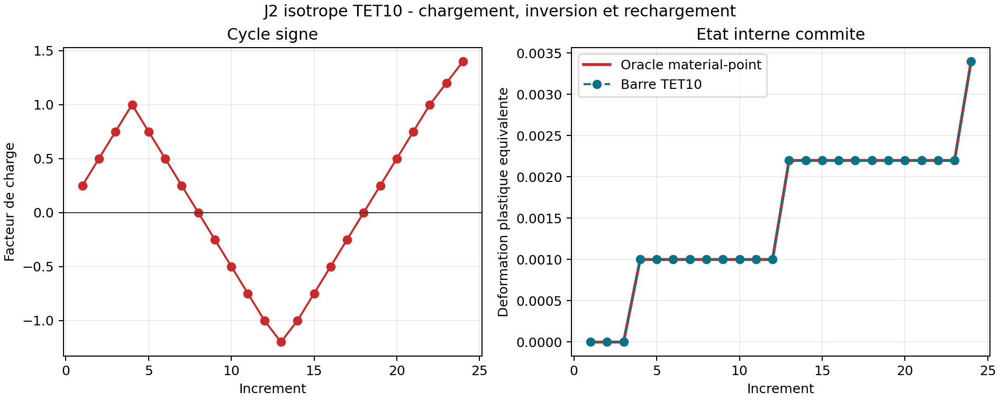

# VNV-J2-TET10-CYCLIC-001

Statut : **PASS_INTERNAL**

Maillage : 341 noeuds, 140 TET10, 4 points d'integration par element.

| Verification | Valeur | Limite | Statut |
| --- | ---: | ---: | --- |
| material_point_path_error | 8.734876e-10 | 1.000000e-08 | PASS |
| final_axial_stress_error | 5.955966e-11 | 1.000000e-08 | PASS |
| maximum_step_residual | 4.135550e-09 | 1.000000e-07 | PASS |
| plastic_strain_monotonicity | 0.000000e+00 | 1.000000e-14 | PASS |
| reverse_plastic_flow | 1.200000e-03 | 1.000000e-06 | PASS |
| reload_plastic_flow | 1.200000e-03 | 1.000000e-06 | PASS |

Le rollback est verifie par injection d'un increment rejete dans le test unitaire reference par le resume JSON.
