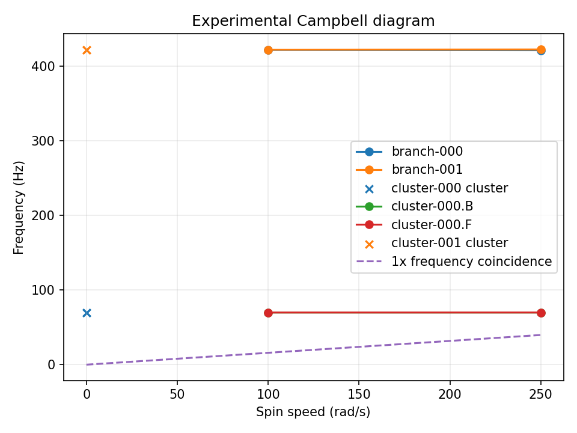

# Experimental Campbell diagrams

The `campbell` route orchestrates a set of single-speed `rotating_modal`
analyses and associates their complex modes. It is experimental and limited to
the same straight, collinear BEAM2 shaft and centered rigid axisymmetric disk
scope documented for [rotating modal analysis](rotating-modal.md). Each speed
must be supplied explicitly in strictly increasing rad/s. The sweep does not
create a speed grid, change the model, or introduce a new physical formulation.

## Tracking and ambiguity

Modes are associated with a complex, Hermitian mass-weighted MAC and a global
one-to-one assignment. Eigenvector phase and nonzero scaling do not change the
MAC. Near-degenerate modes are compared as mass-weighted subspaces; an
individual vector identity is not claimed inside a degenerate eigenspace.
When the evidence does not support one clear association, the result retains
candidate matches, a branch gap, or an explicit ambiguity. The plot is only a
projection of the structured result and cannot repair or decide branch
continuity.

Transverse polarization can be reported as forward, backward, weakly
polarized, undefined, or inconsistent when the mode shape supports that
classification. It is not inferred at zero speed or when stations disagree.

## Reading the diagram

A Campbell diagram plots natural frequency against signed spin speed. A
missing or ambiguous point remains a visible gap; the plot does not interpolate
through it. An optional `1x` line is `abs(Omega)/(2*pi)`. An intersection is
only a frequency coincidence or candidate critical-speed location within the
linear modal model. It is not a forced-response amplitude, an unbalance
response prediction, an operational-risk assessment, or evidence of
instability.

The following reproducible internal BEAM2/disk example shows the sampled
branches and the optional 1× line. A missing point at 100 rad/s is an explicit
tracking ambiguity for the high-frequency pair, not an interpolated or forced
connection. The figure is a projection; the structured record is authoritative.

*Figure: internal convergence evidence only, not independent physical
validation. The structured record is `qualification/0_2_11/gyro_06_beam2_convergence.json`; the model and thresholds are defined in the frozen WP06 case contract.*

The initial implementation uses a serial dense SciPy QEP at every speed and
does not support distributed shaft gyroscopic terms, speed-dependent
stiffness/mass/bearing properties, general damping, centrifugal stiffening,
unbalance forcing, contact, nonlinear rotor response, PETSc, SLEPc, sparse QEP,
or MPI. GYRO-05 supplies independent analytical tracking evidence; GYRO-06 is
internal mesh-convergence evidence, not independent physical validation. Both
the numerical result and maturity decision remain distinct; maturity stays
**EXPERIMENTAL**.
