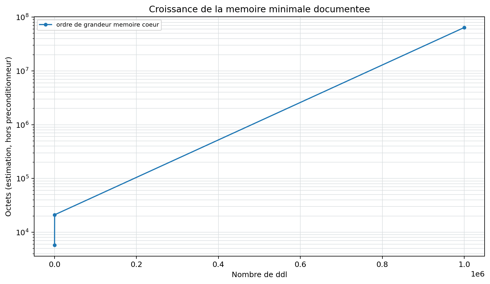

# Resolution des grands modeles

<span class="maturity experimental">experimental</span>

Cette page conserve des resultats historiques des campagnes P4, notamment
les mesures realisees sur quatre rangs. Pour les claims actifs 0.2.7, utiliser
les pages de verification et les manifestes 0.2.7 : les resultats 1.029M, 3M
et 5M sont bornes par leur workload, leur machine et leur configuration et ne
constituent pas une loi de scalabilite universelle.

Le chemin large-scale est separe du solveur standard. Son perimetre v1 est
`linear_static + TET4 + isotropic_3d` avec trois ddl par noeud et index direct
$3n+c$.

## Donnees et memoire

Les noeuds, connectivites, blocages et charges sont stockes en tableaux HDF5
ou NPZ. En PETSc multi-rangs, chaque rang lit un hyperslab d'elements et ne
conserve que les coordonnees des noeuds references par sa partition. Les
charges sont distribuees par plage de DDL possedee, tandis que les blocages
sont conserves uniquement lorsqu'ils affectent le halo elementaire local ou une
ligne PETSc possedee. Les comptes globaux restent traces dans l'audit.
L'audit publie aussi les noeuds compacts, noeuds possedes et noeuds de halo par
rang pour diagnostiquer le cout des echanges. Le bloc `mpi_communication`
ajoute des estimations en octets pour les coordonnees de halo, les blocages,
les charges et les faces coupees du graphe.
Les deplacements sont ecrits collectivement par MPI-IO dans `displacements.bin`,
avec forme, type et ownership ranges dans `displacements_metadata.json`. Ils
ne sont ni rassembles sur le rang racine ni places dans un JSON monolithique.
L'audit est agrege et echantillonne.

## Backends

| Backend | Cible | Limite principale |
| --- | --- | --- |
| SciPy chunked | Comparaison et modeles intermediaires | Garde explicite a 200 000 ddl par defaut |
| PETSc AIJ/KSP | Millions de ddl | Depend de `petsc4py`, MPI et du partitionnement |
| Matrix-free | Blocs TET4 structures generes | Pas un backend general de maillage arbitraire |

Le defaut PETSc vise `CG + GAMG`, `rtol=1e-8`, `max_it=10000`. La matrice AIJ
est preallouee et les conditions de Dirichlet sont appliquees sans extraire
une matrice dense. A partir de quatre rangs, QF_solver active par defaut le
repartitionnement des grilles grossieres GAMG, sauf option PETSc explicite.
Le rapport separe temps de setup du preconditionneur et temps d'iteration KSP.
Il ajoute aussi `preconditioner_diagnostics`: type KSP, type PC, niveaux
multigrilles PETSc quand disponibles, taille globale/locale de matrice et
informations `matrix_info`.

## Accord SciPy / PETSc

Avant toute lecture de performance, `VNV-LARGE-PETSC-SCIPY-001` resout un meme
bloc TET4 HDF5 (`420` DDL, `432` elements) par la route SciPy et par
PETSc/GAMG sur deux rangs MPI dans le conteneur epingle. L'ecart relatif de
deplacement est `1,02e-12`; les deux residus restent inferieurs a `1e-7`.
Cette preuve controle l'equivalence numerique et le chemin MPI-IO, non la
vitesse d'un modele industriel. Les campagnes P4 a un million de DDL restent
la seule source pour la memoire et la scalabilite.

```powershell
python .\scripts\run_large_petsc_scipy_vnv.py --output .\results\VNV-LARGE-PETSC-SCIPY-001 --ranks 2
```

Le profilage detaille est active par la campagne PowerShell `-Action profile`.
PETSc ecrit `ascii_info_detail`; la commande `petsc-profile-report` transforme
ensuite les journaux en JSON et Markdown traces. Les evenements critiques sont
`PCSetUp`, `KSPSolve`, `PCApply`, `MatMult`, `VecScatterBegin/End` et les etapes
GAMG. Le rapport compare bloc, poutre et plaque sans supposer que leurs temps
d'evenements sont additifs.

## Algorithme distribue et parametres

PETSc prealloue AIJ a partir de la connectivite, assemble par blocs et applique
Dirichlet sans matrice reduite Python. `ksp_type`, `pc_type`, `rtol`, `atol`,
`max_it`, taille de bloc et dictionnaire `petsc_options` sont traces. Le
mapping homogene vaut directement $dof=3n+c$.

## Audit scalable

Le rapport contient qualite min/max/moyenne, elements invalides, ddl
libres/bloques, norme des charges, residu, energie, temps et estimation
memoire. Les conversions `toarray()` et les listes completes de resultats
elementaires sont interdites.

## Campagne multi-echelle P4

La commande `large-campaign` orchestre une serie strictement croissante de
tailles. Sans `--execute`, elle ne genere aucun modele : elle controle les
dependances et publie les dimensions, le disque et la memoire estimes. Avec
`--execute`, chaque niveau reutilise le pipeline `qualify-large` et agrege :

- temps de lecture, assemblage, resolution et pipeline ;
- iterations et residu final ;
- debit en elements et ddl par seconde ;
- pic Python `tracemalloc` et pic RSS du processus ;
- rapports de readiness, qualification et manifestes SHA-256.

```powershell
python .\qf_solver.py large-campaign --output .\results_large\P4-CAMPAIGN-PLAN-001 --targets 100000 1000000 3000000 --solver-backend petsc
python .\qf_solver.py large-campaign --output .\results_large\P4-CAMPAIGN-PETSC-001 --targets 100000 1000000 3000000 --solver-backend petsc --preconditioner gamg --execute
```

Cette serie mesure la montee en taille sur une configuration. Elle ne constitue
pas encore une etude de scalabilite forte ou faible, qui exige plusieurs
nombres de rangs MPI sur une infrastructure figee.

{ .result-figure }

--8<-- "docs/generated/large_model_results.md"

## Limites

La demonstration documentaire utilise un bloc representatif regenerable. Les
jalons PETSc a un et trois millions de ddl sont executes sur quatre rangs avec
entree HDF5 partitionnee et sortie MPI-IO collective. Les scalabilites forte
et faible 1/2/4 sont mesurees; le point faible a quatre rangs reste en
`WARNING`. Le HDF5 parallele natif reste un chantier distinct. L'absence de
PETSc ne doit jamais etre masquee par une valeur simulee.

L'assemblage par defaut utilise BAIJ avec blocs nodaux `3x3`, puis convertit
collectivement en AIJ car PETSc `3.25.1` ne fournit pas `MatCreateGraph` pour
GAMG sur `MPIBAIJ`. Le repli `--matrix-format aij` reste disponible.

Sur le cas 1M/4 rangs, GAMG donne `24,41 s` et `0,759 GB/rang`; Hypre avec
BoomerAMG donne `52,30 s` et `2,47 GB/rang`. Les deplacements s'accordent a
`3,40e-12`. Hypre converge en moins d'iterations (`18` contre `53`) mais son
setup et chaque cycle sont plus couteux. Cette conclusion est locale au modele
et a la machine mesures.

La campagne faible conserve environ `257k` DDL/rang. Elle mesure des
efficacites de `72,6 %` a deux rangs et `41,6 %` a quatre rangs. Le dernier
point est `WARNING`. Le partitionnement de graphe PETSc/PT-Scotch avec
redistribution reelle est maintenant disponible en mode experimental via
`--partition-strategy graph`; il est verifie sur petit cas MPI, cas
intermediaire et jalon 1M. L'audit trace les temps du graphe dual, du
partitionneur, des faces coupees, de la redistribution et de la lecture HDF5
des noeuds compactes.

Le premier jalon graphe 1M/4 rangs est `PASS`: cut-face ratio `0,514 %`,
imbalance `1,009`, accord deplacement graphe/contigu `2,24e-13`. Le pipeline
solve est legerement plus court (`23,93 s` contre `24,56 s`), mais le
preprocessing et la memoire pic augmentent. Le graphe reste donc une option
d'etude, pas encore la politique par defaut.

La campagne de tuning multi-topologie compare cinq presets sur bloc, poutre et
plaque. `pc_gamg_threshold=0.01` est le plus rapide sur les trois modeles, avec
des gains de `18,0/5,3/7,3 %`. La politique impose au moins `10 %` sur chaque
topologie et moins de `20 %` de memoire supplementaire avant tout changement
global. Ce seuil n'est pas atteint: `gamg-default` reste le defaut, tandis que
le seuil `0.01` est une option engineering explicite.

## Complexite, diagnostics et echecs

Le stockage attendu est $O(nnz)$ par rang, auquel s'ajoutent les vecteurs KSP
et le preconditionneur. GAMG peut dominer la memoire. L'audit publie temps
d'assemblage/resolution, iterations, residu, norme RHS et estimation memoire.
Dependance absente, HDF5 corrompu, partition invalide, non-convergence KSP ou
resultat non fini produisent un code de sortie non nul.

Une solution PETSc terminee peut etre rechargee comme estimation initiale. Le
benchmark exige la meme empreinte de modele, puis lit directement la tranche
MPI possedee. Le post-traitement TET4 est separe du KSP: il opere par blocs,
ecrit cinq datasets HDF5 prealloues et checkpoint chaque frontiere de bloc. Il
n'existe aucune liste Python globale de contraintes ou deformations.

## Tracabilite

| Mecanisme | Reference | Code | Preuve | Exigence |
| --- | --- | --- | --- | --- |
| AIJ, KSP, CG et GAMG | [REF-PETSC-KSP](../reference/references.md#ref-petsc-ksp) | `large/solver.py` | comparaison petit modele | `REQ-LRG-003` |
| Assemblage et stockage distribues | [REF-PETSC-KSP](../reference/references.md#ref-petsc-ksp) | `large/assembler.py`, `large/io.py` | audit sans dense | `REQ-LRG-004` |
| Campagne multi-echelle et RSS | [REF-PETSC-KSP](../reference/references.md#ref-petsc-ksp) | `large/campaign.py`, `large/memory.py` | plan et execution miniature testes | `REQ-LRG-008` |
| Partition MPI et KSP distribue | [REF-PETSC-KSP](../reference/references.md#ref-petsc-ksp) | `large/assembler.py`, `large/solver.py` | 100k et 1M sur deux rangs | `REQ-LRG-009` |
| Accord SciPy/PETSc | [REF-PETSC-KSP](../reference/references.md#ref-petsc-ksp) | `verification/large_petsc_scipy.py` | `VNV-LARGE-PETSC-SCIPY-001` | `REQ-LRG-003` |
| Profilage PETSc multi-topologie | [REF-PETSC-KSP](../reference/references.md#ref-petsc-ksp) | `large/profiling.py` | parseur, rapport et campagne Docker | `REQ-LRG-009` |

## Contrat documentaire de la methode

| Rubrique exigee | Contenu et preuve |
| --- | --- |
| Geometrie et DDL | TET4 isotrope, 3 DDL/noeud et index direct distribue. |
| Formulation mathematique | Statique lineaire sparse identique au chemin standard. |
| Integration et algorithme | Assemblage par lots, PETSc AIJ, partition MPI et CG/GAMG. |
| Exemple executable | `python .\qf_solver.py solve-large --input .\model.h5 --output .\results_large --solver-backend petsc` |
| Maillage, chargement et conditions limites | Blocs 100 k a plusieurs millions de DDL; tableaux distribues et Dirichlet PETSc. |
| Tableau de resultats et figure | Tableau plus haut et resume ci-dessous. |
| Invariants | Aucun dense, residu distribue, energie et comptages globaux. |
| Convergence | Iterations KSP, scaling, preconditionneurs et comparaison SciPy/PETSc. |
| Limites et references | V1 TET4 statique isotrope; `REF-PETSC-KSP`, `REQ-LRG-*`. |

{ .result-figure }

La figure de deformee complete n'est pas materialisee en memoire : elle est
reconstruite par blocs depuis les sorties XDMF/HDF5.

Owner review documentaire requise; performance et qualification mecanique
restent distinctes.
