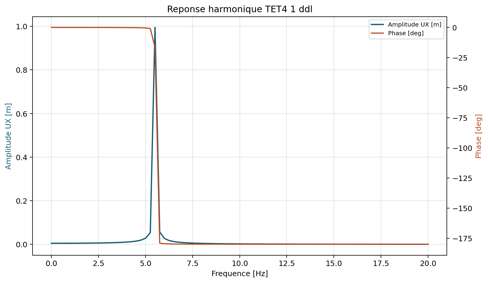

# Reponse harmonique directe

stable apres tests renforces

Pour une excitation $\mathbf f(t)=\Re(\hat{\mathbf f}e^{i\omega t})$, la
reponse permanente verifie:

$$
[\mathbf K-\omega^2\mathbf M+i\omega\mathbf C]\hat{\mathbf u}
=\hat{\mathbf f}.
$$

Le solveur factorise directement la rigidite dynamique complexe a chaque
frequence. Il ne calcule ni la montee transitoire, ni un amortissement modal
non proportionnel.

## Forme reelle equivalente

En ecrivant $\hat u=u_R+iu_I$ et une charge reelle de reference, le systeme
complexe est equivalent a

$$
\begin{bmatrix}
K-\omega^2M&-\omega C\\
\omega C&K-\omega^2M
\end{bmatrix}
\begin{bmatrix}u_R\\u_I\end{bmatrix}
=\begin{bmatrix}f\\0\end{bmatrix}.
$$

Cette ecriture explique la phase non nulle d'une reponse amortie et le mauvais
conditionnement possible au voisinage d'une resonance peu amortie.

## Algorithme et parametres

Chaque frequence en Hz est convertie en pulsation, la matrice complexe est
assemblee puis factorisee. Les parametres sont la liste strictement finie de
frequences et les coefficients de Rayleigh `rayleigh_alpha` et
`rayleigh_beta`, tous deux non negatifs. Les charges restent celles du modele
et representent l'amplitude complexe reelle de reference.

Le resultat publie `solver.linear_selection.samples`, un echantillon de la
politique de resolution pour chaque frequence. Il rend visible le caractere
reel a $0$ Hz puis complexe des rigidites dynamiques amorties, la symetrie
transposee, l'estimation de memoire directe et le depassement eventuel du
budget. `solver.linear_execution` contient le temps par frequence et le temps
cumulatif. Dans ce premier perimetre, le solveur utilise explicitement
`spsolve` complexe; aucun Krylov complexe n'est selectionne silencieusement.

Le couple `direct_memory_budget_mb` et `enforce_direct_memory_budget: true`
arrete le calcul avant factorisation si l'estimation est superieure au budget.
Cette garde est appliquee a chaque frequence et protege les balayages longs
contre un choix direct non maitrise; elle ne transforme pas encore la route
harmonique en solveur distribue.

## Amplitude et phase

Pour chaque ddl:

$$
A=|\hat u|,\qquad \varphi=\operatorname{atan2}(\Im\hat u,\Re\hat u).
$$

A $0$ Hz, la matrice devient $\mathbf K$; la reponse doit coincider avec la
statique sous la meme charge. Autour d'une resonance non amortie, le
conditionnement se degrade et une solution finie ne doit pas etre attendue
exactement sur la valeur propre.

{ .result-figure }

--8<-- "docs/generated/harmonic_results.md"

## Amortissement Rayleigh

$$
\mathbf C=\alpha\mathbf M+\beta_R\mathbf K,
\qquad
\zeta(\omega)=\frac12\left(\frac{\alpha}{\omega}+\beta_R\omega\right).
$$

Deux points de calage sont normalement necessaires. Une valeur arbitraire peut
deplacer et ecraser le pic; les coefficients et la plage valide doivent etre
consignes dans le dossier de calcul.

## Coques MITC4 et drilling sans masse

Pour MITC4, les rotations de drilling sans inertie sont eliminees avant la
resolution. La condensation reste exacte avec l'amortissement de Rayleigh
complet, y compris lorsque $\beta_R>0$.

## Demonstration de la condensation harmonique exacte

Dans les coordonnees physiques $p$ et de drilling $d$, la masse d'une
direction effectivement condensee verifie

$$
\mathbf M=
\begin{bmatrix}\mathbf M_{pp}&0\\0&0\end{bmatrix},
\qquad
\mathbf K=
\begin{bmatrix}\mathbf K_{pp}&\mathbf K_{pd}\\
\mathbf K_{dp}&\mathbf K_{dd}\end{bmatrix}.
$$

Pour $\mathbf C=\alpha\mathbf M+\beta_R\mathbf K$, posons

$$
a=1+i\omega\beta_R,
\qquad b=-\omega^2+i\omega\alpha,
\qquad \mathbf Z=a\mathbf K+b\mathbf M.
$$

Les equations du bloc drilling donnent

$$
a\mathbf K_{dp}\hat{\mathbf u}_p+
a\mathbf K_{dd}\hat{\mathbf u}_d=\hat{\mathbf f}_d,
$$

donc, puisque $a\ne0$ et $\mathbf K_{dd}$ est inversible,

$$
\hat{\mathbf u}_d=\mathbf K_{dd}^{-1}
\left(\frac{\hat{\mathbf f}_d}{a}-
\mathbf K_{dp}\hat{\mathbf u}_p\right).
$$

La substitution dans le bloc physique conduit exactement a

$$
\left[a\left(\mathbf K_{pp}-
\mathbf K_{pd}\mathbf K_{dd}^{-1}\mathbf K_{dp}\right)
+b\mathbf M_{pp}\right]\hat{\mathbf u}_p
=\hat{\mathbf f}_p-
\mathbf K_{pd}\mathbf K_{dd}^{-1}\hat{\mathbf f}_d.
$$

Ainsi, la rigidite condensee reelle est reutilisable et simplement multipliee
par $a$. La charge condensee est independante de la frequence; seul le terme
de charge directe intervenant dans la reconstruction de $\hat u_d$ porte le
facteur $1/a$. Le code controle que la ligne de masse condensee est nulle et
que $K_{dd}$ est factorisable.

La campagne `VNV-MITC4-HARMONIC-CONDENSATION-002` compare cette expression au
complement de Schur complexe et a la resolution du systeme complet. Elle
couvre quatre valeurs de $\beta_R$, cinq frequences et un moment applique
directement sur `RZ`. Elle ne justifie pas un amortissement general non
proportionnel, qui necessiterait une condensation complexe par frequence.

La campagne `VNV-MITC4-HARMONIC-MODAL-001` utilise une charge modale et une
solution fermee massiquement normalisee. L'erreur complexe maximale est
bornee a $10^{-6}$; ce seuil tient compte de l'amplification du residu du mode
propre au voisinage exact de la resonance. La limite statique reste controlee
separement a $10^{-8}$.

## Superposition modale complete comme oracle large bande

Pour les modes massiquement orthonormes
$\boldsymbol\Phi^T\mathbf M\boldsymbol\Phi=\mathbf I$ et
$\boldsymbol\Phi^T\mathbf K\boldsymbol\Phi=\boldsymbol\Lambda$, on pose
$\hat{\mathbf u}=\boldsymbol\Phi\hat{\mathbf q}$. La projection de l'equation
harmonique avec amortissement de Rayleigh donne, mode par mode,

$$
\hat q_j(\omega)=
\frac{\boldsymbol\phi_j^T\hat{\mathbf f}}
{\lambda_j-\omega^2+i\omega(\alpha+\beta_R\lambda_j)}.
$$

La reconstruction est

$$
\hat{\mathbf u}_{modal}(\omega)=
\sum_{j=1}^{n_r}\boldsymbol\phi_j\hat q_j(\omega).
$$

Si les $n_r$ modes du systeme reduit sont conserves, cette expression est une
seconde resolution exacte du meme probleme discret, aux erreurs numeriques
pres. Elle verifie l'algorithme direct sur toute une bande, mais ne constitue
pas a elle seule une validation physique independante puisque les deux voies
partagent les matrices assemblees $K$ et $M$.

`VNV-MITC4-HARMONIC-BROADBAND-003` utilise les `175` modes du systeme reduit,
une force `UZ` decentree et `600` frequences entre `0,1` et `16 Hz`. Quatre
familles de resonance sont retrouvees. L'erreur complexe plein champ maximale
est `2,411e-7`, l'erreur de frequence maximale `0,729 %` et le residu relatif
maximal `8,251e-11`.

## Contraintes harmoniques MITC4 par frequence

Pour chaque reponse complexe $\hat{\mathbf u}(\omega)$, les deformations de
membrane et courbures complexes sont recuperees dans le repere local:

$$
\hat{\boldsymbol\varepsilon}_m=\mathbf B_m\hat{\mathbf u}_e,
\qquad
\hat{\boldsymbol\kappa}=\mathbf B_b\hat{\mathbf u}_e.
$$

La contrainte complexe a la cote $z=\pm t/2$ vaut:

$$
\hat{\boldsymbol\sigma}(z,\omega)=
\mathbf C_{ps}
\left(\hat{\boldsymbol\varepsilon}_m+z\hat{\boldsymbol\kappa}\right).
$$

Le resultat publie separe parties reelle et imaginaire, amplitude
$|\hat\sigma|$ et phase $\arg(\hat\sigma)$ pour `S11`, `S22` et `S12`, sur
les faces superieure et inferieure. Le maximum global ne remplace pas le champ:
les contraintes centrales de chaque element restent disponibles a chaque
frequence dans `shell_stress_response`.

Pour NAFEMS 13H, `S11` est evalue au noeud central puis moyenne dans le plan
complexe sur les quatre facettes adjacentes. Cette convention reproduit la
demande Abaqus `POSITION=AVERAGED AT NODES, ELSET=EMID`; moyenner les amplitudes
separement donnerait une grandeur differente.

## Correlation externe NAFEMS 13H

La campagne `VNV-MITC4-HARMONIC-NAFEMS13H-004` reproduit le Test 13H publie
par Abaqus/Standard: plaque carree `10 m x 10 m`, epaisseur `0,05 m`, maillage
`8x8`, pression `100 Pa`, amortissement de Rayleigh et `200` frequences. Le pic
QF_solver vaut `44,2719 mm` et `30,8186 N/mm2` a `2,42583 Hz`. Les ecarts a
Abaqus S4R sont `2,442 %` en deplacement, `1,477 %` en `S11` et `0,866 %` en
frequence. Les ecarts de contrainte valent `1,412 %` par rapport a Abaqus S4,
`2,626 %` par rapport a NAFEMS et `3,730 %` par rapport a la serie classique
de Navier en face superieure.

La serie de Navier donne `32,0127 N/mm2`, tandis que la reference NAFEMS
publiee par Abaqus vaut `30,03 N/mm2`. Cette difference de convention de
recuperation est conservee dans le dossier au lieu d'etre masquee.

## Complexite, diagnostics et echecs

Une factorisation complexe est effectuee par frequence; le cout est donc
approximativement lineaire avec la taille du balayage, multiplie par le cout
du solveur creux. Sont publies residus, amplitude maximale, phase et frequence
du pic. Frequence negative, amortissement invalide, singularite de l'impedance
ou reponse non finie sont bloques.

## Demonstration structurelle

Le [porte-a-faux dynamique maille](../demonstrations/benchmarks/dynamic_cantilever.md)
verifie la limite statique a 0 Hz et traverse la premiere resonance amortie.
La [demonstration MITC4](../demonstrations/avancees.md#reponse-harmonique-mitc4)
publie aussi la comparaison complexe analytique et l'effet de l'amortissement.

## Tracabilite

| Equation | Reference | Code | Test/invariant | Exigence |
| --- | --- | --- | --- | --- |
| Impedance dynamique complexe | [REF-FEM-BATHE](../reference/references.md#ref-fem-bathe) | `core/harmonic.py` | limite statique 0 Hz | `REQ-HAR-001` |
| Amortissement de Rayleigh | [REF-FEM-BATHE](../reference/references.md#ref-fem-bathe) | `core/harmonic.py` | amplitude, phase, pic amorti | `REQ-HAR-001` |
| Condensation complexe MITC4 | [REF-FEM-BATHE](../reference/references.md#ref-fem-bathe) | `core/dynamic_reduction.py` | equilibre drilling reel/imaginaire | `REQ-HAR-001` |
| Complement de Schur Rayleigh MITC4 | [REF-FEM-BATHE](../reference/references.md#ref-fem-bathe) | `core/dynamic_reduction.py` | comparaison au systeme complexe complet | `REQ-HAR-001` |
| Superposition modale complete | [REF-FEM-BATHE](../reference/references.md#ref-fem-bathe) | `verification/mitc4_harmonic_broadband.py` | accord plein champ sur quatre resonances | `REQ-HAR-001` |
| Contrainte complexe aux faces | [REF-FEM-BATHE](../reference/references.md#ref-fem-bathe) | `post/harmonic_shell.py` | reel, imaginaire, amplitude et phase | `REQ-HAR-001` |
| Correlation NAFEMS 13H | [Abaqus/Standard 2024](https://docs.software.vt.edu/abaqusv2024/English/SIMACAEBMKRefMap/simabmk-c-forcedvibrationtest13h.htm) | `verification/mitc4_harmonic_nafems.py` | deplacement, S11, frequence et residu | `REQ-HAR-001` |

## Contrat documentaire de la methode

| Rubrique exigee | Contenu et preuve |
| --- | --- |
| Geometrie et DDL | Elements actifs et condensation des directions sans masse. |
| Formulation mathematique | $(K-\omega^2M+i\omega C)\hat u=\hat f$. |
| Integration et algorithme | Assemblage $K/M/C$, factorisation complexe par frequence. |
| Exemple executable | `python .\qf_solver.py solve --input .\examples\tet4_harmonic_response.json --output .\results\harmonic.json` |
| Maillage, chargement et conditions limites | TET4/MITC4; amplitude, frequences, Rayleigh et blocages JSON. |
| Tableau de resultats et figure | Tableau plus haut et amplitude ci-dessous. |
| Invariants | Limite 0 Hz, finitude, residu complexe, phase et pic amorti. |
| Convergence | Balayage, superposition modale et correlation NAFEMS/Code_Aster. |
| Limites et references | Reponse permanente lineaire; `REF-FEM-BATHE`, `REQ-HAR-001`. |

{ .result-figure }

La figure de deformee harmonique est definie par l'amplitude complexe au
point de phase choisi; la courbe ci-dessus localise les frequences critiques.

Owner review documentaire requise avant evolution de maturite.
