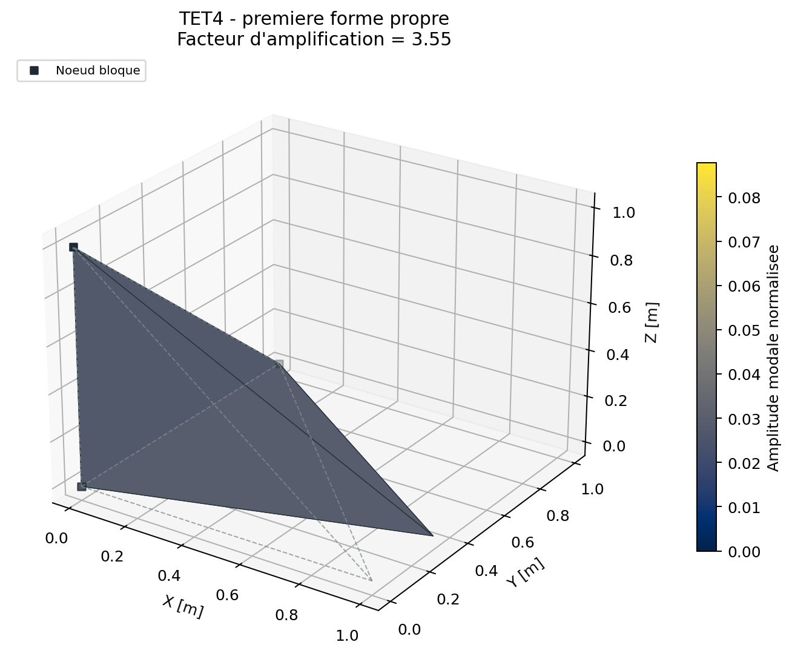
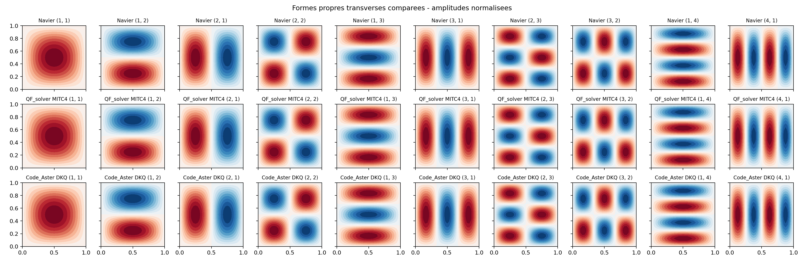
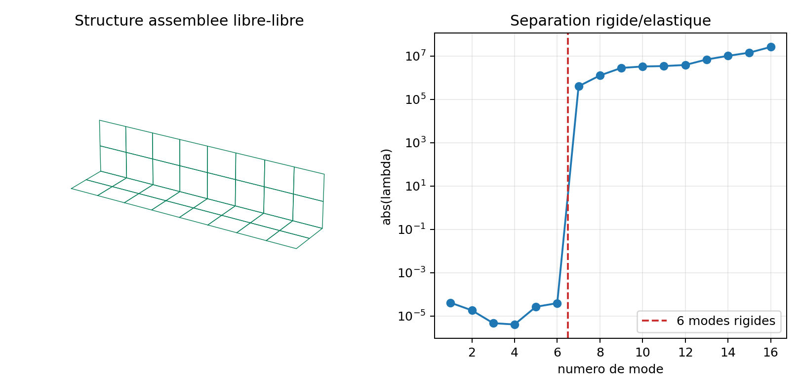
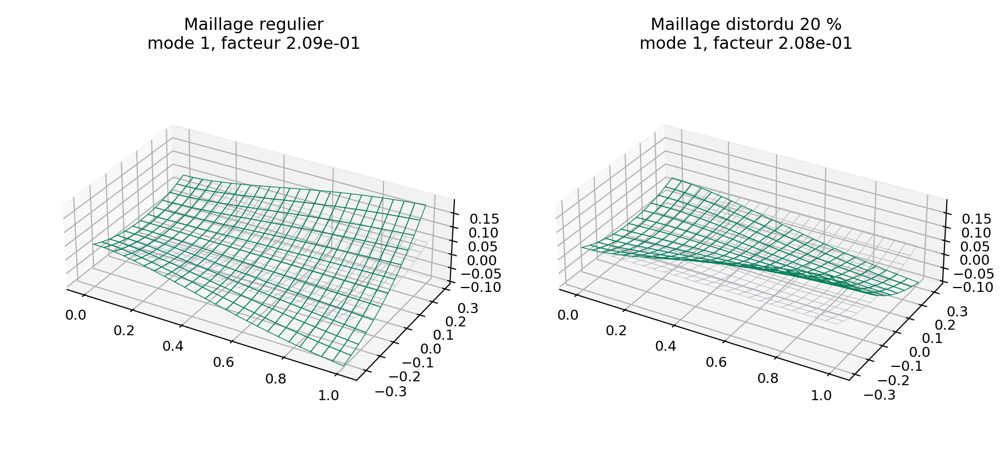
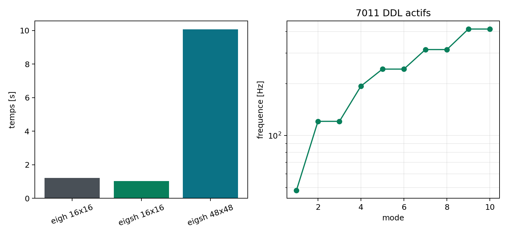

# Analyse modale

stable apres tests renforces

Le probleme propre contraint est:

$$
\mathbf K_{ff}\boldsymbol\phi_i
=\lambda_i\mathbf M_{ff}\boldsymbol\phi_i,
\qquad
f_i=\frac{\sqrt{\lambda_i}}{2\pi}.
$$

Une densite positive est obligatoire. Les valeurs propres non positives sont
ecartees apres resolution; leur presence doit toutefois conduire a examiner
les contraintes et les modes rigides.

Pour MITC4, $\mathbf M$ contient la masse surfacique et les inerties
rotatoires tangentielles. Les directions de drilling effectivement sans masse
sont condensees avant la resolution puis reconstruites dans les formes
modales. Le diagnostic `dynamic_reduction` publie leur nombre et la tolerance.

## Algorithmes

`eigsh` est la methode par defaut et appelle ARPACK sur les matrices creuses.
`lanczos` est un alias de cette voie. Un shift spectral peut cibler les modes
proches d'une frequence. `eigh` convertit en dense et est refuse au-dela de
`dense_modal_max_dofs`.

## Parametres et hypotheses

`modes`, `arpack_tolerance`, `maxiter`, `sigma` et
`dense_modal_max_dofs` controlent le calcul. $M$ doit etre symetrique definie
positive sur les ddl libres et $K$ symetrique. Une densite nulle, un nombre de
modes incoherent ou une conversion dense interdite produit une erreur claire.

## Normalisation et diagnostics

Les vecteurs propres sont normalises par la masse. Le solveur publie:

$$
r_i=\frac{\|\mathbf K\phi_i-\lambda_i\mathbf M\phi_i\|_2}
{\max(\|\mathbf K\phi_i\|_2,
|\lambda_i|\|\mathbf M\phi_i\|_2,1)},
$$

ainsi que l'orthogonalite masse $\Phi^T\mathbf M\Phi$, la diagonalisation de
$\Phi^T\mathbf K\Phi$ et les masses modales effectives selon X, Y et Z.

{ .result-figure }

--8<-- "docs/generated/modal_results.md"

## Interpretation

- une frequence propre n'est pas une reponse forcee;
- les signes et amplitudes absolues d'un vecteur propre sont arbitraires;
- une masse modale effective faible indique qu'une excitation uniforme dans
  la direction consideree couple peu avec le mode;
- les modes locaux de maillage doivent etre distingues des modes de structure;
- la convergence doit porter sur la frequence et la forme, pas seulement sur
  le nombre de modes demandes.

## Complexite, memoire et echecs

`eigsh` stocke les matrices creuses et une base de Lanczos; son cout depend du
nombre de modes, du gap spectral et du conditionnement. `eigh` coute
$O(n^3)$ en temps et $O(n^2)$ en memoire. Non-convergence ARPACK, valeur propre
non finie, residu modal trop eleve ou orthogonalite degradee interdisent un
verdict qualifiable.

## Demonstration structurelle

Le [porte-a-faux dynamique maille](../demonstrations/benchmarks/dynamic_cantilever.md)
publie frequences, residus, orthogonalites, masses effectives et comparaison
a une frequence de poutre.

## Verification MITC4 en cours

`VNV-MITC4-MODAL-CANTILEVER-002` ajoute une convergence specifique MITC4 sur
un porte-a-faux mince. Le premier mode hors-plan est compare a :

$$
f_1=\frac{\beta_1^2}{2\pi L^2}\sqrt{\frac{EI}{\rho A}},
\qquad \beta_1=1.8751040687,
$$

avec $A=bt$ et $I=bt^3/12$. La forme est egalement comparee avec le MAC :

$$
\mathrm{MAC}(\phi,\psi)=
\frac{|\phi^T\psi|^2}{(\phi^T\phi)(\psi^T\psi)}.
$$

Cette preuve est bornee au regime mince et au premier mode de flexion. Elle
est une etape de validation interne; elle ne remplace pas une correlation
commerciale a maillage identique.

La plaque carree `VNV-MITC4-MODAL-PLATE-003` complete cette preuve avec la
solution de Navier :

$$
f_{mn}=\frac{\pi}{2a^2}\sqrt{\frac{D}{\rho t}}(m^2+n^2),
\qquad D=\frac{Et^3}{12(1-\nu^2)}.
$$

La campagne de convergence historique verifie les quatre premiers modes. La
correlation externe etendue verifie les dix premiers. Pour chaque paire repetee,
le code compare les deux espaces propres par les angles principaux; cette
mesure reste valide lorsque l'algorithme retourne une combinaison lineaire
differente des deux formes analytiques.

## Correlation Code_Aster sur maillage identique

`VNV-MITC4-MODAL-CODEASTER-DKQ-004` reprend une plaque `1 x 1 x 0,01 m`,
le materiau aluminium controle et un maillage `32x32`. QF_solver emploie
MITC4 Reissner-Mindlin et Code_Aster `18.1.0` emploie DKQ Kirchhoff. Les
conditions aux limites et les noeuds sont identiques.

| Mode | Navier [Hz] | QF_solver [Hz] | Code_Aster [Hz] | Ecart QF/Aster |
| --- | ---: | ---: | ---: | ---: |
| `(1,1)` | `48,406724` | `48,370391` | `48,371263` | `0,002 %` |
| `(1,2)/(2,1)` | `121,016810` | `121,264781` | `120,875437` | `0,322 %` |
| `(2,2)` | `193,626896` | `193,893856` | `193,062528` | `0,431 %` |
| `(1,3)/(3,1)` | `242,033620` | `243,811` | `241,717151` | `0,867 %` |
| `(2,3)/(3,2)` | `314,643706` | `316,115359` | `313,378614` | `0,873 %` |
| `(1,4)/(4,1)` | `411,457153` | `417,510143` | `410,900114` | `1,609 %` |

L'ecart QF_solver/Code_Aster maximal des dix modes vaut `1,609 %`. Le MAC de
sous-espace minimal vaut `0,999998493` et le residu QF_solver maximal
`7,99e-11`. Le point `16x16`, trop raide de `7,26 %` sur la derniere paire,
a ete raffine plutot que masque par un assouplissement du critere.

{ .result-figure }

{ .result-figure }

La correlation externe est `PASS`. Le scope `mitc4-modal` reste `candidate`
avec une validation interne provisoire `accepted_with_recommendations` datee
du `2026-07-16`. La revue independante reste ouverte.

## Extensions modales de robustesse

Trois campagnes ferment les recommandations internes initiales:

| Campagne | Resultat principal | Verdict |
| --- | --- | --- |
| libre-libre assemble | 6 modes rigides, MAC minimal `0,999999999999998` | PASS |
| coque cylindrique distordue | convergence `3,153 %`, distorsion `0,226 %` | PASS |
| `eigsh` grand modele | `7011` DDL actifs, residu `2,49e-10`, aucun dense | PASS |

{ .result-figure }

{ .result-figure }

{ .result-figure }

La structure libre-libre est comparee au sous-espace analytique des six
mouvements rigides. La coque courbe apporte convergence, sensibilite a la
distorsion et objectivite, mais pas encore un oracle externe. Le cas `eigsh`
reste une preuve a quelques milliers de DDL, pas une preuve million de DDL.

La qualification modale MITC4 couvre uniquement la masse coherente. Une
demande explicite `mass_formulation: lumped` ou `concentrated` est rejetee;
aucun resultat utilisant une masse concentree ne doit etre rattache a ce scope.

## Tracabilite

| Equation | Reference | Code | Test/invariant | Exigence |
| --- | --- | --- | --- | --- |
| $K\phi=\lambda M\phi$ et normalisation masse | [REF-FEM-BATHE](../reference/references.md#ref-fem-bathe) | `core/modal.py` | residus propres, orthogonalites | `REQ-MOD-001` |
| Masse modale effective | [REF-FEM-BATHE](../reference/references.md#ref-fem-bathe) | `core/modal.py` | somme et direction d'excitation | `REQ-MOD-001` |
| Masse coherente MITC4 et drilling condense | [REF-FEM-BATHE](../reference/references.md#ref-fem-bathe) | `element.py`, `core/dynamic_reduction.py` | masse, objectivite, modes | `REQ-MOD-002` |
| Correlation modale de plaque | Navier et Code_Aster 18.1.0 | `verification/mitc4_modal_external.py` | frequences, MAC, sous-espace double | `REQ-MOD-002` |
| Libre-libre, courbure et solveur creux | mouvements rigides, objectivite, `eigh` | `verification/mitc4_modal_extended.py` | six modes, convergence, MAC et residus | `REQ-MOD-002` |

## Contrat documentaire de la methode

| Rubrique exigee | Contenu et preuve |
| --- | --- |
| Geometrie et DDL | Elements actifs, DDL imposes retires et drilling sans masse condense. |
| Formulation mathematique | $K\phi_i=\lambda_iM\phi_i$, $f_i=\sqrt{\lambda_i}/(2\pi)$. |
| Integration et algorithme | Matrices $K/M$, assemblage, `eigsh`/dense, tri et normalisation masse. |
| Exemple executable | `python .\qf_solver.py solve --input .\examples\tet4_modal_unit.json --output .\results\modal.json` |
| Maillage, chargement et conditions limites | TET4 unitaire et structures raffinees; densite positive. |
| Tableau de resultats et figure | Tableau plus haut et premier mode ci-dessous. |
| Invariants | Residus propres, orthogonalites $M/K$, masses modales et modes rigides. |
| Convergence | Raffinement spatial, theorie et correlation Code_Aster MITC4. |
| Limites et references | Petites vibrations, multiplicites; `REF-FEM-BATHE`, `REQ-MOD-*`. |

{ .result-figure }

Cette figure de deformee modale est normalisee; son amplitude n'est pas un
deplacement physique absolu.

Owner review documentaire requise; la demonstration ne vaut pas qualification.
