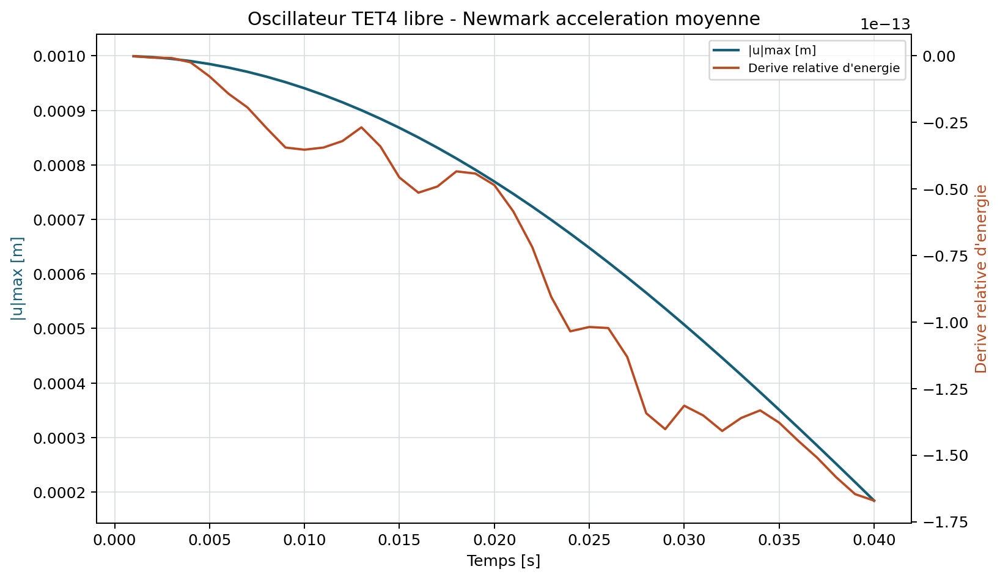
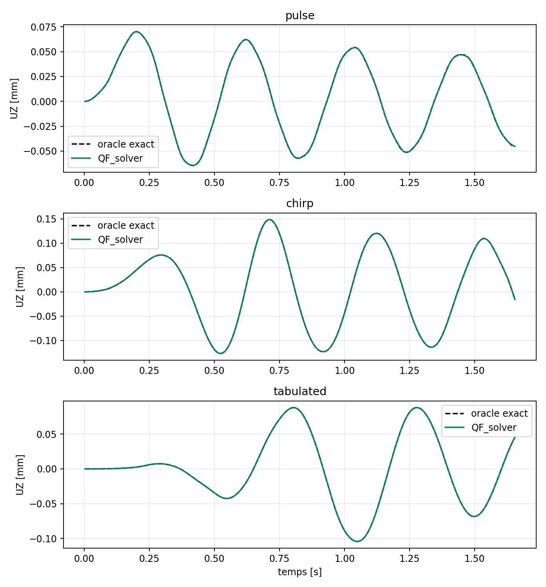
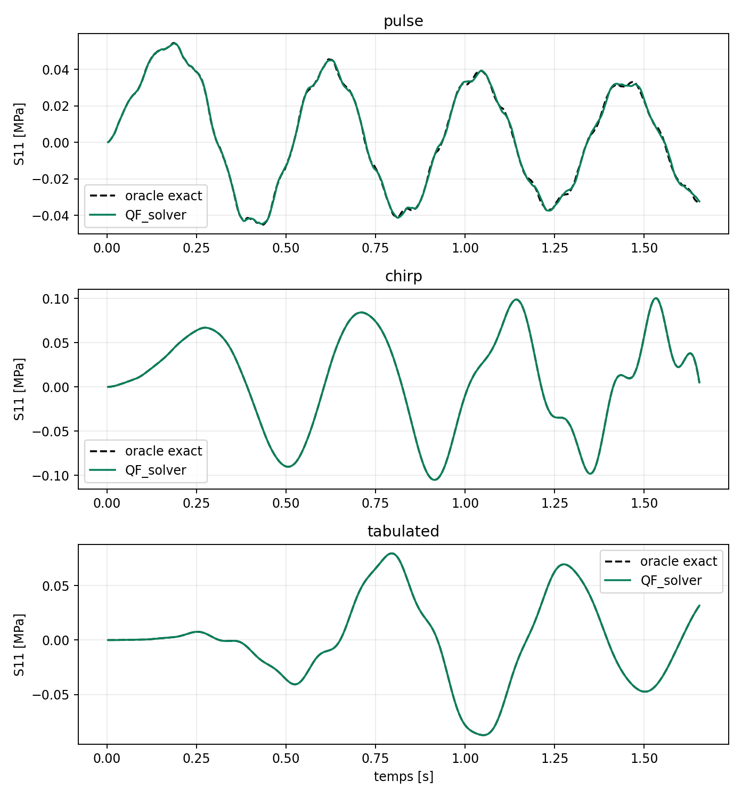
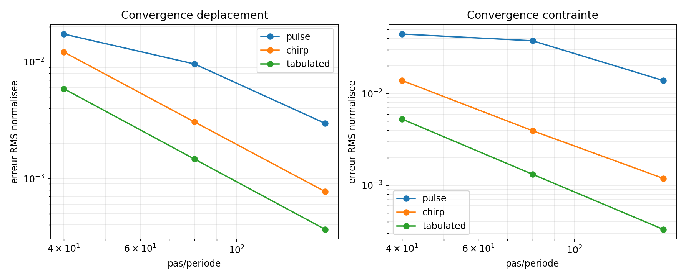
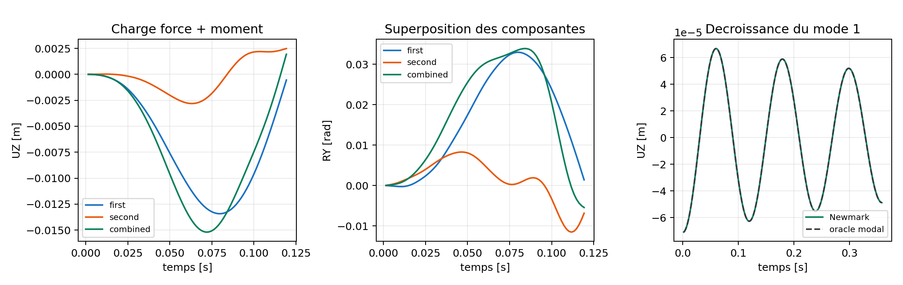
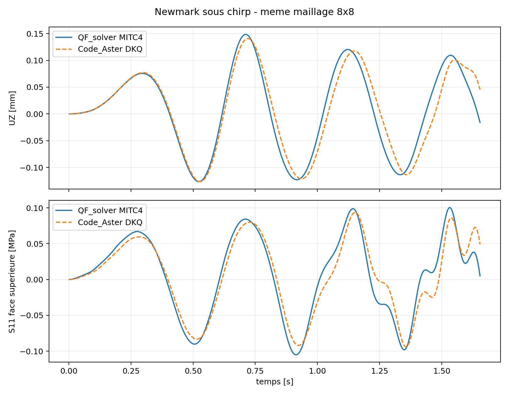

# Dynamique transitoire de Newmark

stable apres tests renforces

Le schema approxime sur un pas $\Delta t$:

$$
\mathbf u_{n+1}=\mathbf u_n+\Delta t\mathbf v_n
+\Delta t^2[(\tfrac12-\beta)\mathbf a_n+\beta\mathbf a_{n+1}],
$$

$$
\mathbf v_{n+1}=\mathbf v_n
+\Delta t[(1-\gamma)\mathbf a_n+\gamma\mathbf a_{n+1}].
$$

Le choix par defaut $\beta=1/4$, $\gamma=1/2$ correspond a l'acceleration
moyenne, stable sans condition pour un systeme lineaire. Le parseur impose:

$$
\gamma\ge\tfrac12,
\qquad
\beta\ge\tfrac14(\gamma+\tfrac12)^2.
$$

## Hypotheses et parametres

Le schema courant est lineaire en petits deplacements avec matrices $M$, $C$
et $K$ constantes. Les parametres principaux sont `time_step`, `steps`,
`newmark_beta`, `newmark_gamma`, les coefficients de Rayleigh, les conditions
initiales et la table de charge. Temps non croissants, pas nul, table de
longueur incoherente ou coefficient non fini sont refuses.

## Systeme effectif

Avec les coefficients de Newmark, la matrice constante est:

$$
\mathbf K_{eff}=\mathbf K+a_0\mathbf M+a_1\mathbf C.
$$

Les coefficients et le second membre utilises sont explicites :

$$
a_0=\frac{1}{\beta\Delta t^2},\quad a_1=\frac{\gamma}{\beta\Delta t},
\quad a_2=\frac{1}{\beta\Delta t},\quad a_3=\frac{1}{2\beta}-1,
$$

$$
a_4=\frac{\gamma}{\beta}-1,\qquad
a_5=\frac{\Delta t}{2}\left(\frac{\gamma}{\beta}-2\right),
$$

$$
\mathbf f_{eff,n+1}=\mathbf f_{n+1}
+\mathbf M(a_0\mathbf u_n+a_2\mathbf v_n+a_3\mathbf a_n)
+\mathbf C(a_1\mathbf u_n+a_4\mathbf v_n+a_5\mathbf a_n).
$$

Le pas resout $\mathbf K_{eff}\mathbf u_{n+1}=\mathbf f_{eff,n+1}$, puis les
recurrences precedentes donnent $\mathbf a_{n+1}$ et $\mathbf v_{n+1}$. Les
operations sont appliquees aux ddl libres apres traitement des blocages.

Sur MITC4, la recurrence est appliquee apres condensation des rotations de
drilling sans masse. Les six ddl nodaux sont reconstruits avant calcul des
reactions, energies et resultats de coque. Le premier perimetre qualifiable
impose `rayleigh_beta=0` lorsqu'une condensation est active; une composante
proportionnelle a la raideur demanderait un traitement algebro-differentiel
supplementaire.

Une factorisation directe est reutilisee sur tous les pas. Si une methode
iterative est demandee, aucune factorisation n'est creee et chaque second
membre est resolu separement.

## Politique de resolution de la matrice effective

Avant la premiere factorisation, QF_solver evalue $K_{eff}$ et publie
`solver.linear_selection` ainsi que `audit.solver_selection`. Ces champs
contiennent la symetrie, le caractere reel, le signe de la diagonale, le cout
creux estime et une estimation de memoire directe. `solver.linear_execution`
enregistre ensuite la methode effectivement utilisee et indique si la
factorisation a ete reutilisee. Il n'existe aucun basculement automatique en
cas de non-convergence.

Une demande `CG` est refusee si $K_{eff}$ n'est pas reel, symetrique et a
diagonale strictement positive; `CG` et `MINRES` n'acceptent que le
preconditionnement `none` ou `jacobi` dans la route standard. Le parametre
`direct_memory_budget_mb`, combine a `enforce_direct_memory_budget: true`,
refuse une factorisation directe dont la memoire estimee depasse le budget,
y compris si cette factorisation devait etre reutilisee sur plusieurs pas.

## Charges, reprise et controles

Les facteurs peuvent etre tabules en temps et interpoles lineairement. Les
checkpoints NPZ contiennent l'etat $(u,v,a)$, le pas acheve et une empreinte du
modele; toute reprise incompatible est refusee.

Chaque charge nodale ou repartie peut egalement recevoir une histoire
independante via `load_factors_by_load`. Les indices suivent l'ordre stable de
l'assemblage: charges nodales, puis charges reparties. Le vecteur applique est:

$$
\mathbf f(t_n)=\sum_j g_j(t_n)\mathbf f_j.
$$

La linearite est controlee par la comparaison entre une execution combinee et
la somme de deux executions mono-composante.

Deux taux d'amortissement cibles peuvent calibrer automatiquement Rayleigh:

$$
\zeta(\omega)=\frac{\alpha}{2\omega}+\frac{\beta_R\omega}{2}.
$$

`modal_damping_targets` contient exactement deux couples frequence/taux. Les
coefficients negatifs, les frequences confondues et le melange avec des
coefficients explicites sont refuses. Il s'agit d'un **calage de Rayleigh sur
deux modes**, et non de taux independants arbitraires pour tous les modes.

Sur MITC4, un calage donnant `beta_R > 0` est actuellement accepte seulement
si aucune direction de drilling ne doit etre condensee. La campagne de controle
fixe donc `RZ`; le domaine condense historique reste limite a `beta_R=0`.

Trois excitations reproductibles sont disponibles en plus de la constante,
de la rampe et du sinus. L'impulsion demi-sinus de duree $T_p$ vaut:

$$
g(t)=\begin{cases}
\sin(\pi t/T_p),&0\le t\le T_p,\\
0,&t>T_p,
\end{cases}
$$

et le chirp lineaire de $f_0$ a $f_1$ sur $T_c$ vaut:

$$
g(t)=\sin\left[2\pi\left(f_0t+
\frac{f_1-f_0}{2T_c}t^2\right)\right],\qquad 0\le t\le T_c.
$$

La table arbitraire conserve ses points d'origine et utilise une interpolation
affine entre deux instants. Les valeurs hors table restent constantes, ce qui
doit etre pris en compte explicitement lors de la definition du signal.

A chaque pas, le code controle:

$$
\mathbf r_n=\mathbf M\mathbf a_n+\mathbf C\mathbf v_n
+\mathbf K\mathbf u_n-\mathbf f_n,
$$

les valeurs finies, les energies cinetique et de deformation, et la derive
relative par rapport a l'energie initiale.

{ .result-figure }

--8<-- "docs/generated/newmark_results.md"

## Choix du pas de temps

La stabilite ne garantit pas la precision. Pour une frequence maximale
d'interet $f_{max}$, une etude de sensibilite doit confirmer le nombre de pas
par periode. Les discontinuites de chargement et les hautes frequences exigent
un pas plus petit, meme avec l'acceleration moyenne.

La campagne MITC4 `VNV-MITC4-NEWMARK-FREE-002` mesure cette precision sur un
mode propre deja verifie. Elle utilise une sonde temporelle signee declaree
par `history_probes`, puis calcule l'erreur RMS face au cosinus analytique.
L'ordre observe est voisin de deux, conformement au schema moyenne
acceleration. Une stabilite inconditionnelle ne doit donc jamais etre
interpretee comme une precision independante de $\Delta t$.

La campagne etendue `VNV-MITC4-NEWMARK-DAMPED-FORCED-003` verifie ensuite :

$$
u(t)=u_0e^{-\zeta\omega t}
\left[\cos(\omega_dt)+\frac{\zeta}{\sqrt{1-\zeta^2}}
\sin(\omega_dt)\right],
$$

pour la vibration libre amortie, puis

$$
q(t)=\frac{\sin(\Omega t)-(\Omega/\omega)\sin(\omega t)}
{\omega^2-\Omega^2}
$$

pour une force modale sinusoidale $F=M\phi_1$. Ces choix isolent la precision
temporelle du schema sans introduire d'erreur de projection modale inconnue.

## Oracle temporel independant

La campagne large bande ne compare pas Newmark a une seconde implementation
de Newmark. Les matrices reduites sont diagonalisees selon:

$$
K\Phi=M\Phi\Lambda,\qquad \Phi^TM\Phi=I,
$$

puis chaque coordonnee modale satisfait:

$$
\ddot q_i+c_i\dot q_i+\lambda_iq_i=p_i(t),
\qquad c_i=\alpha+\beta_R\lambda_i.
$$

Sur un intervalle, la charge tabulee est affine, $p_i(t)=p_{i,n}+s_i\tau$.
L'etat augmente suit exactement:

$$
\frac{d}{d\tau}
\begin{bmatrix}q_i\\\dot q_i\\p_i\\s_i\end{bmatrix}
=
\begin{bmatrix}
0&1&0&0\\
-\lambda_i&-c_i&1&0\\
0&0&0&1\\
0&0&0&0
\end{bmatrix}
\begin{bmatrix}q_i\\\dot q_i\\p_i\\s_i\end{bmatrix}.
$$

La solution au pas suivant est obtenue par l'exponentielle de cette matrice.
Cette reference partage la discretisation spatiale MITC4, mais aucune
recurrence de Newmark: elle isole donc strictement l'erreur temporelle.

La campagne `VNV-MITC4-NEWMARK-BROADBAND-004` utilise une plaque NAFEMS 13H
`8x8`, une force nodale de `100 N`, une sonde `UZ` et une sonde de contrainte
locale `S11` en face superieure. Au pas fin, les erreurs RMS deplacement /
contrainte valent respectivement `0,298 % / 1,390 %` pour l'impulsion,
`0,077 % / 0,119 %` pour le chirp et `0,037 % / 0,033 %` pour la table.

--8<-- "docs/generated/mitc4_newmark_broadband_results.md"

{ .result-figure }

{ .result-figure }

{ .result-figure }

{ .result-figure }

## Charges independantes, calage modal et reprise

`VNV-MITC4-NEWMARK-OPERATIONAL-006` combine une force `UZ` et un moment `RY`
avec deux histoires distinctes. Elle compare la reponse combinee a la somme
des reponses, cale Rayleigh sur les modes 1 et 3, puis reprend le calcul au pas
40 depuis un checkpoint NPZ.

| Controle | Resultat maximal | Verdict |
| --- | ---: | --- |
| superposition deplacement | `1,590e-13` | PASS |
| superposition vitesse | `3,813e-11` | PASS |
| superposition acceleration | `2,337e-8` | PASS |
| erreur RMS de decroissance du mode 1 | `0,300 %` | PASS |
| erreur etat final apres reprise | `0` | PASS |

{ .result-figure }

Cette extension est `PASS` en verification interne mais reste un addendum
post-revue: elle n'elargit pas silencieusement la decision mecanique du
`2026-07-16`.

## Correlation Code_Aster sur le meme maillage

Le chirp fin est rejoue localement avec Code_Aster `18.1.0`, element DKQ,
maillage `8x8`, blocages, force, amortissement de Rayleigh et grille temporelle
identiques. Les correlations signees valent `0,9543` pour `UZ` et `0,9560`
pour `S11`; les ecarts de pic sont `5,20 %` et `10,51 %`. L'ecart RMS proche
de `15,8 %` reste publie: les frequences des formulations MITC4 Reissner-Mindlin
et DKQ Kirchhoff ne sont pas identiques et leur phase derive sur quatre periodes.

{ .result-figure }

## Decision de revue mecanique

Quentin Farinazzo accepte le scope `mitc4-transient-dynamic` avec
recommandations le `2026-07-16` pour un usage engineering interne. La
[revue controlee](../verification/revue_mitc4_transitoire.md) conserve les
limites, recommandations et le caractere non independant de cette auto-revue.
Le statut de qualification reste `candidate`.

## Complexite, diagnostics et echecs

Avec LU reutilisee, une factorisation de $K_{eff}$ est suivie d'une resolution
par pas. Avec Krylov, chaque pas porte sa propre convergence. La sortie publie
residu dynamique, energies, derive, nombre de factorisations et reprise.
Instabilite des parametres, etat non fini, residu excessif ou checkpoint
incompatible produit une erreur.

## Demonstration structurelle

Le [porte-a-faux dynamique maille](../demonstrations/benchmarks/dynamic_cantilever.md)
initialise le premier mode et controle la conservation d'energie sur plusieurs
periodes.

## Tracabilite

| Equation | Reference primaire | Code | Test/invariant | Exigence |
| --- | --- | --- | --- | --- |
| Recurrence $\beta$-$\gamma$ | [REF-NEWMARK-1959](../reference/references.md#ref-newmark-1959) | `core/dynamic.py` | oscillateur analytique | `REQ-DYN-001` |
| Stabilite et precision | [REF-DIRECT-INTEGRATION-1972](../reference/references.md#ref-direct-integration-1972) | `core/dynamic.py` | energie, amortissement, sensibilite $\Delta t$ | `REQ-DYN-002` |
| Newmark MITC4 condense | [REF-FEM-BATHE](../reference/references.md#ref-fem-bathe) | `core/dynamic.py`, `core/dynamic_reduction.py` | vibration libre et amortie | `REQ-DYN-003` |
| Charge affine et oracle exponentiel | [REF-FEM-BATHE](../reference/references.md#ref-fem-bathe) | `verification/transient_modal_oracle.py` | impulsion, chirp, table | `REQ-DYN-001`, `FORM-DYN-001` |
| Charges independantes et calage Rayleigh | [REF-FEM-BATHE](../reference/references.md#ref-fem-bathe) | `core/dynamic_controls.py` | superposition, taux cibles, reprise | `REQ-DYN-001`, `REQ-DYN-002` |
| Correlation externe transitoire | Code_Aster 18.1.0 | `scripts/run_code_aster_newmark_vnv.py` | meme maillage DKQ | `REQ-DYN-003` |

## Contrat documentaire de la methode

| Rubrique exigee | Contenu et preuve |
| --- | --- |
| Geometrie et DDL | Herites des elements; reduction des DDL sans masse. |
| Formulation mathematique | Recurrence Newmark, matrice effective et Rayleigh. |
| Integration et algorithme | Integration implicite, resolution par pas et checkpoint. |
| Exemple executable | `python .\qf_solver.py solve --input .\examples\mitc4_newmark_cantilever.json --output .\results\newmark.json` |
| Maillage, chargement et conditions limites | Porte-a-faux MITC4; charge temporelle, conditions initiales et blocages JSON. |
| Tableau de resultats et figure | Tableau plus haut et historique ci-dessous. |
| Invariants | Equilibre dynamique, finitude, energie, amortissement et reprise. |
| Convergence | Pas $T/20$ a $T/160$, periode/RMS et Code_Aster. |
| Limites et references | Lineaire, pas a justifier; `REF-NEWMARK-1959`, `REQ-DYN-*`. |

{ .result-figure }

La figure de deformee associee au maillage est publiee dans la campagne MITC4
transitoire; l'historique ci-dessus porte l'observable temporel controle.

Owner review documentaire requise; aucune maturite ne change automatiquement.
