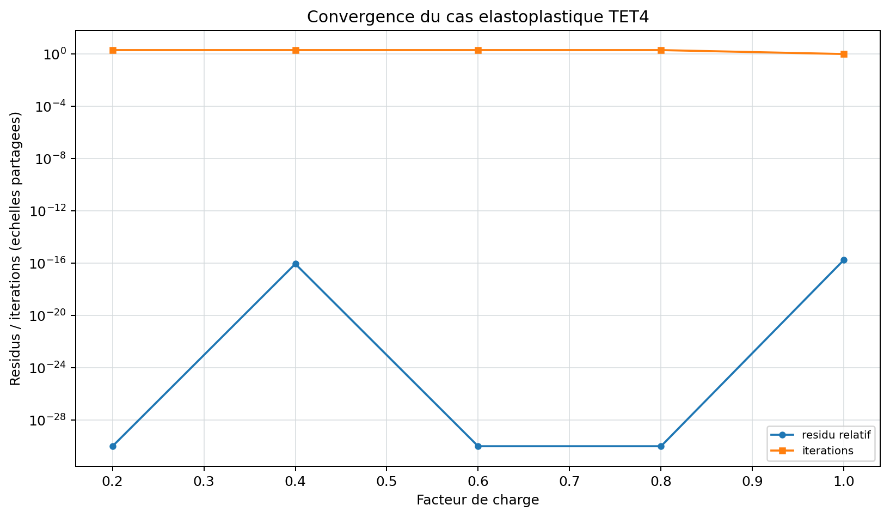

# Statique non lineaire

<span class="maturity experimental">experimental</span>

Le solveur traite une non-linearite materielle en petits deplacements. Il ne
contient pas encore de cinematique de grandes rotations ou de rigidite
geometrique generale.

## Equation et parametres

Le residu est $\mathbf r(\mathbf u,\lambda)=\lambda\mathbf f-\mathbf f_{int}$.
Les parametres controlent increments de charge, iterations maximales,
tolerance, line-search et rayon d'arc. Ils doivent etre justifies par une
etude de sensibilite; converger avec un seul decoupage ne prouve pas
l'independance au chemin numerique.

## Newton-Raphson

A l'iteration $k$ d'un pas de charge:

$$
\mathbf K_T(\mathbf u_k)\Delta\mathbf u_k
=\lambda\mathbf f-\mathbf f_{int}(\mathbf u_k),
\qquad
\mathbf u_{k+1}=\mathbf u_k+\Delta\mathbf u_k.
$$

Le Newton complet recalcule la tangente. Le Newton modifie la reutilise dans
le pas. La line-search reduit le pas par un critere d'Armijo lorsque le residu
ne decroit pas suffisamment.

## Continuation arc-length

L'arc-length ajoute le facteur de charge comme inconnue et contraint
l'increment par une sphere dans l'espace deplacement-charge. Cette voie peut
suivre certaines branches limites, mais l'implementation courante reste une
fonction de recherche et non un solveur de flambement qualifie.

## Etats materiau

Les etats d'un pas ne sont committes qu'apres convergence. La loi J2 utilise
un retour radial et une tangente algorithmique consistante. Chargement,
decharge, rechargement et plasticite parfaite sont testes unitairement.

## Checkpoint et reprise

Les chemins de charge controles peuvent sauvegarder un checkpoint NPZ apres
chaque nombre configure d'increments converges. Le fichier contient uniquement
un etat **committe** : deplacements, numero d'increment, facteur de charge et
variables internes de chaque point d'integration.

```json
{
  "analysis": {
    "type": "nonlinear_static",
    "method": "newton_raphson",
    "load_path": [0.5, 1.0, 0.0, -1.0, 0.0, 1.0],
    "checkpoint_path": "j2_state.npz",
    "checkpoint_interval": 2,
    "checkpoint_keep_steps": true,
    "restart_from": "j2_state.step00000002.npz"
  }
}
```

Une empreinte couvre geometrie, connectivite, materiaux, charges, blocages,
methode et chemin de charge. Toute modification physique refuse la reprise.
La sortie trace `restart_step`, `checkpoint_files`,
`checkpoint_model_signature` et `history_is_partial`.

La reprise adaptative et l'arc-length restent hors de ce premier contrat : ils
necessitent aussi de serialiser l'increment propose, le rayon de continuation et
les diagnostics de coupure. Ces combinaisons sont donc refusees explicitement.

{ .result-figure }

--8<-- "docs/generated/nonlinear_results.md"

## Conditions d'emploi

Toute utilisation exige un controle du nombre d'increments, des iterations,
du chemin de charge, de la dissipation et des variables internes. Le profil
`qualification` refuse cette famille; aucune image de convergence ne change
ce statut.

## Complexite, diagnostics et echecs

Chaque iteration Newton assemble une force interne et, pour Newton complet,
une tangente. Le cout est donc le nombre d'iterations multiplie par assemblage
et resolution. La sortie publie residus, iterations, facteurs de charge et
variables internes committes. Chaque increment controle publie aussi les normes
de derniere correction et de corrections cumulees, les coupures adaptatives,
le statut de commit et les travaux interne/externe incrementaux.

Ces travaux sont integres par la regle trapezoidale entre deux etats converges.
`relative_work_imbalance` est un diagnostic d'equilibre incremental; ce n'est
pas une decomposition thermodynamique exacte entre energie elastique stockee et
dissipation plastique. Sont bloques: pas non convergent, tangente
singuliere, etat non fini, retour materiau invalide et echec de line-search.

## Demonstration structurelle

La [barre J2 maillee](../demonstrations/benchmarks/j2_bar.md) compare la
contrainte moyenne a la loi uniaxiale et controle chaque pas, tout en gardant
un verdict global experimental.

## Tracabilite

| Algorithme | Reference primaire | Code | Test/invariant | Exigence |
| --- | --- | --- | --- | --- |
| Retour radial J2 et tangente consistante | [REF-J2-SIMO-1985](../reference/references.md#ref-j2-simo-1985) | `materials/solid.py` | differences finies, charge/decharge | `REQ-NL-001` |
| Newton et travail incremental | [REF-FEM-BATHE](../reference/references.md#ref-fem-bathe) | `core/nonlinear.py` | residu, iterations, dissipation | `REQ-NL-001` |
| Checkpoint transactionnel | Contrat interne controle | `core/nonlinear_checkpoint.py`, `io/nonlinear_checkpoint.py` | calcul continu/reprise, empreinte, corruption | `REQ-NL-001` |

## Contrat documentaire de la methode

| Rubrique exigee | Contenu et preuve |
| --- | --- |
| Geometrie et DDL | Herites de l'element; petits deplacements pour la loi materielle. |
| Formulation mathematique | Residuel, tangente J2 consistante, Newton et continuation. |
| Integration et algorithme | Increments, retour constitutif aux points de Gauss, corrections et commit. |
| Exemple executable | `python .\qf_solver.py solve --input .\examples\tet4_nonlinear_static.json --output .\results\nonlinear.json` |
| Maillage, chargement et conditions limites | Barre TET4, charge cyclique et supports du JSON. |
| Tableau de resultats et figure | Tableau plus haut et convergence ci-dessous. |
| Invariants | Equilibre, residu, dissipation, etats committes et finitude. |
| Convergence | Sensibilite aux increments, chargement/decharge et CalculiX. |
| Limites et references | Experimental; `REF-J2-SIMO-1985`, `REQ-NL-001`. |

{ .result-figure }

La figure de deformee est reliee au benchmark J2; la courbe ci-dessus controle
la convergence des increments.

Newton et arc-length ont des pages propres; Owner review requise.
