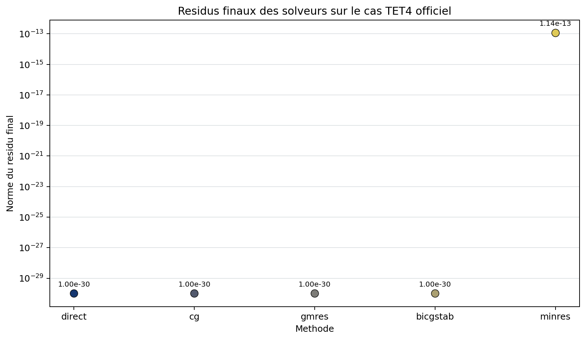

# Statique lineaire et systemes creux

Apres assemblage et application des blocages:

$$
\mathbf K_{ff}\mathbf u_f=\mathbf f_f.
$$

La matrice elastique correctement contrainte est normalement symetrique
definie positive. Le solveur ne suppose toutefois pas cette propriete pour
toutes les methodes disponibles.

## Hypotheses matricielles

| Propriete | Consequence |
| --- | --- |
| $K=K^T$ et definie positive | `cg` est la methode iterative naturelle |
| $K=K^T$ mais indefinie | `minres` est admissible; examiner la physique |
| matrice generale | `gmres` ou `bicgstab`, avec cout/robustesse differents |
| matrice singuliere | aucun resultat n'est accepte; revoir les blocages |

## Methodes

La derivation des voies directe et iteratives est detaillee dans
[Methodes lineaires : algorithmes](methodes_lineaires.md).

| Methode | Domaine conseille | Caracteristique |
| --- | --- | --- |
| `direct` / `spsolve` | Petits et moyens cas | LU creuse robuste, memoire potentiellement elevee |
| `cg` | Symetrique definie positive | Faible memoire, sensible au conditionnement |
| `minres` | Symetrique, eventuellement indefinie | Residus minimises sans stockage GMRES |
| `gmres` | Non symetrique general | Robuste mais stockage de la base de Krylov |
| `bicgstab` | Non symetrique general | Memoire contenue, convergence parfois irreguliere |

Les preconditionneurs proposes sont `jacobi` et `ilu`. Jacobi est peu couteux;
ILU peut accelerer fortement mais ajoute du remplissage et une factorisation.

## Criteres de fin

Les solveurs iteratifs utilisent `rtol`, `atol` et `maxiter`. Une solution est
ensuite controlee par:

$$
\eta=\frac{\|\mathbf K_{ff}\mathbf u_f-\mathbf f_f\|_2}
{\max(\|\mathbf f_f\|_2,\|\mathbf K_{ff}\mathbf u_f\|_2,1)}.
$$

Une solution non finie, un avertissement de rang ou $\eta$ superieur au seuil
devient une `NumericalConvergenceError`.

## Verification mecanique

Le residu libre controle les equations resolues. Les reactions sont le residu
sur les ddl bloques. Pour un probleme lineaire:

$$
U=\tfrac12\mathbf u^T\mathbf K\mathbf u,
\qquad
W=\mathbf u^T\mathbf f,
\qquad
2U\simeq W.
$$

Ces identites ne detectent pas un mauvais materiau ou une mauvaise charge;
elles prouvent la coherence du systeme discret assemble.

{ .result-figure }

--8<-- "docs/generated/linear_solver_results.md"

## Passage a l'echelle

Le mode standard extrait deux fois la matrice libre et materialise le
post-traitement. Pour plusieurs millions de ddl, utiliser la voie PETSc ou
matrix-free decrite dans [Grands modeles](grand_modele.md).

## Parametres et diagnostics

Les parametres publics sont `method`, `rtol`, `atol`, `maxiter`,
`preconditioner`, `ilu_drop_tol`, `ilu_fill_factor` et le seuil final de
residu. La sortie indique convergence, iterations, residu, preconditionneur et
historique. Un fallback n'est jamais silencieux.

## Complexite et memoire

Une LU creuse depend du remplissage et peut depasser largement le stockage de
$K$. Une iteration de Krylov coute principalement un produit matrice-vecteur
$O(nnz)$; GMRES ajoute le stockage d'une base croissante. ILU echange memoire
contre reduction du nombre d'iterations.

## Modes d'echec et demonstration

Sont bloques: rang insuffisant, pivot nul, limite d'iterations, residu anormal
et valeur non finie. Le benchmark
[poutre TET4/TET10](../demonstrations/benchmarks/cantilever.md) compare les
cinq methodes sur un meme systeme assemble.

## Tracabilite des algorithmes

| Methode/equation | Reference | Code | Test/invariant | Exigence |
| --- | --- | --- | --- | --- |
| Equilibre, reactions et energie | [REF-FEM-BATHE](../reference/references.md#ref-fem-bathe) | `core/solver.py` | residu libre, $2U=W$ | `REQ-SOL-001` |
| Gradient conjugue | [REF-CG-1952](../reference/references.md#ref-cg-1952) | `core/linear_methods.py` | comparaison directe | `REQ-SOL-001` |
| GMRES | [REF-GMRES-1986](../reference/references.md#ref-gmres-1986) | `core/linear_methods.py` | residu et non-regression | `REQ-SOL-001` |
| MINRES | [REF-MINRES-1975](../reference/references.md#ref-minres-1975) | `core/linear_methods.py` | matrice symetrique | `REQ-SOL-001` |
| BiCGSTAB | [REF-BICGSTAB-1992](../reference/references.md#ref-bicgstab-1992) | `core/linear_methods.py` | residu et non-regression | `REQ-SOL-001` |

## Contrat documentaire de la methode

| Rubrique exigee | Contenu et preuve |
| --- | --- |
| Geometrie et DDL | Herites du modele; resolution sur les DDL libres. |
| Formulation mathematique | $K_{ff}u_f=F_f-K_{fc}u_c$ et reconstruction des reactions. |
| Integration et algorithme | Quadrature elementaire, assemblage sparse, reduction puis solveur choisi. |
| Exemple executable | `python .\qf_solver.py solve --input .\examples\tet4_static.json --output .\results\static.json` |
| Maillage, chargement et conditions limites | Cas TET4 officiel, donnees JSON validees avant assemblage. |
| Tableau de resultats et figure | Tableau plus haut et [deformee TET4](../elements/tet4.md#contrat-documentaire-et-demonstration). |
| Invariants | Finitude, symetrie attendue, residu, reactions, equilibre et energie. |
| Convergence | Accord direct/iteratif et convergence en maillage propre a l'element. |
| Limites et references | Petites transformations; `REF-FEM-BATHE`, `REQ-SOL-001`. |

Owner review documentaire requise avant tout changement de maturite.
