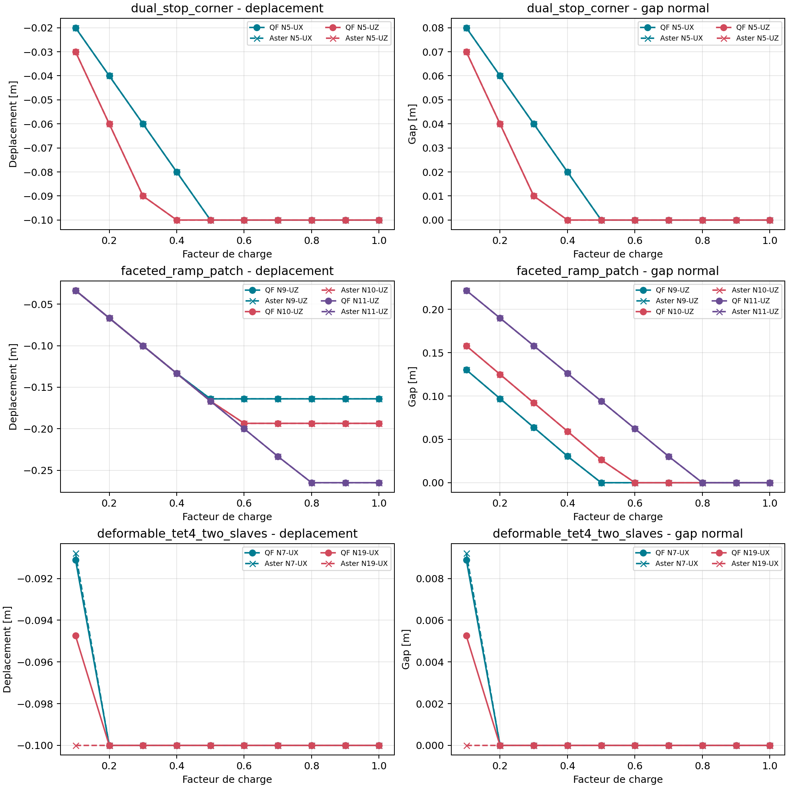

# 026-G09 Contact Lot 3 Evidence

Status: **PASS_WITH_LIMITATIONS**. This document records Lot 3 evidence before
the final Owner decision. The current official `026-G09` status is
`PASS_WITH_LIMITATIONS`, recorded in `0_2_6_g09_owner_closeout.md`.

## External runs

| Case | External result | Main observation | Limitation |
| --- | --- | --- | --- |
| Scalar open/close | `PASS_EXTERNAL_CORRELATION_BOUNDED` | QF and Code_Aster displacement, gap and active branch agree at the declared limits | Scalar unilateral operator only |
| Active planar TET4 face | `PASS_EXTERNAL_CORRELATION_BOUNDED` | Slave displacement difference `1.3877787807814457e-17`; master differences zero | Code_Aster active state is imposed by `LIAISON_DDL` |
| TET4 two-slave curve | `PASS_WITH_LIMITATIONS` | Active displacement error `4.024558464266181e-15`; active gap error `4.0245584642661925e-16` | Overall transition displacement error `4.339979885207582e-2`; exact unilateral versus penalty formulations differ |
| CalculiX TET4 pre-contact | `PASS_EXTERNAL_TIE_BREAKER` | Normalized displacement error `2.1027376317609138e-7` against limit `1e-5` | No CalculiX contact active-set or penalty claim |

## External mesh sensitivity

The deformable TET4 structural path was repeated at a second controlled mesh
(`tet4_grid=(6,4,4)`) in addition to the recorded `tet4_grid=(8,4,4)` run.
The complete-curve comparison remains explicitly bounded because the external
model uses exact unilateral constraints while QF uses penalty contact.

| Mesh | Overall U-curve error | Overall gap-curve error | Active U-curve error | Transition warning | Result |
| --- | ---: | ---: | ---: | ---: | --- |
| `8x4x4` | `4.339979885207582 %` | `54.99121110155485 %` | `4.024558464266181e-13 %` | `4.339979885207582 %` | `PASS_WITH_EXTERNAL_WARNING` |
| `6x4x4` | `5.25653195006103 %` | `57.00417573383535 %` | `7.216449660063467e-13 %` | `5.25653195006103 %` | `PASS_WITH_EXTERNAL_WARNING` |

The second level is a diagnostic mesh-sensitivity result, not a new universal
acceptance criterion. Its transition warning is just above the predeclared
`5 %` warning limit, while the active branch and final gap remain within their
predeclared adapter limits. This keeps the external statement bounded and
prevents the transition warning from being hidden by active-branch reporting.

The Code_Aster structural curve has ten load points. Its overall normalized
gap-curve difference is `0.5499121110155485` on the `8x4x4` run and
`0.5700417573383535` on the `6x4x4` run; these are retained as stated
limitations rather than hidden by reporting only the active branch. The active
branch itself is within the adapter limits. The transition warning is below the
pre-existing `0.05` limit on `8x4x4` and above it on `6x4x4`, which is recorded
as an explicit mesh-dependent limitation.

## Penalty governance

| Item | Value |
| --- | --- |
| Candidate interval | `1e4..1e6` |
| Basis | Lot 1 and Lot 2 TET4 initial-search sweeps, mesh levels 1/2/4 |
| Owner status | `OWNER_REVIEW_REQUIRED` |
| Production interval | None approved |
| Conditioning cutoff | None approved |

The interval is a bounded candidate for the tested domain, not a universal
contact-material rule. The Lot 2 mesh, cycle, rollback and adversarial
evidence remains unchanged and is aggregated by reference.

## Provenance

- Source SHA: `c76d4af39dc270a05596a53ef2d93baa9171c29b`.
- Source state at each final external run: `dirty=false`.
- Code_Aster image: `simvia/code_aster@sha256:4629a21a109309bb97fbdc27d750445cc869e151e2e2ed6290f69539614e4435`.
- CalculiX image: `qf-solver/calculix-nafems13h:2.20`.
- Mesh6 Code_Aster manifest: `qualification/0_2_6/g09_lot3_mesh6/vnv_manifest.json`.
- Exact artifact digests and adapter commands are in `g09_lot3_evidence.json`.

## Aggregate decision

The external evidence is adequate for a bounded correlation statement about
unilateral normal kinematics and the tested TET4 path. It is not evidence for
finite sliding, surface-to-surface contact, friction, contact tangent
qualification or a universal penalty range. The proposed lot status is
`PASS_WITH_LIMITATIONS`; the final bounded gate decision is recorded in
`0_2_6_g09_owner_closeout.md`.
