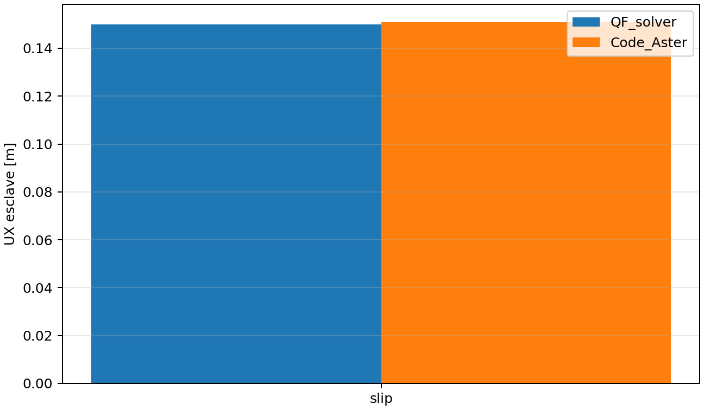

# Correlation externe Code_Aster: glissement de Coulomb borne

## Objet et perimetre

`VNV-CONTACT-FRICTION-CODEASTER-CONTINUE-003` compare le **glissement
sature** de QF_solver avec Code_Aster `18.1.0`, execute dans une image Docker
epinglee. Trois noeuds esclaves sont relies a des ressorts de somme
`1000 N/m`, charges par `FZ=-200 N` et `FX=+200 N`, puis ferment contre une
surface maitresse plane. Le coefficient vaut `mu=0.5`: la force tangentielle
sature donc a `100 N` et la fleche theorique du ressort est `0.1 m`.

QF_solver impose le contact normal par multiplicateur de Lagrange et sa
regularisation tangentielle par retour sur le cone. Code_Aster utilise
`DEFI_CONTACT(... FORMULATION="CONTINUE", FROTTEMENT="COULOMB")` avec
penalites normales `1e8 N/m` et tangentielles `1e4 N/m`. Les formulations ne
sont pas identiques; les seuils portent donc sur les observables en glissement,
pas sur une egalite terme a terme des matrices.

## Execution Docker reproductible

```powershell
python .\scripts\run_code_aster_friction_contact_vnv.py `
  --output .\results\VNV-CONTACT-FRICTION-CODEASTER-CONTINUE-003
```

Le script conserve les maillages `.mail`, decks `.comm`, logs stdout/stderr,
JSON normalise, PNG et manifeste SHA-256. L'image et son empreinte sont
definies dans `qualification/external_oracle_policy.json`; une installation
locale de Code_Aster ou une image non epinglee n'est pas une preuve valide.

## Resultat controle

La campagne executee le `2026-07-27` donne `UX=0.150000 m` dans QF_solver et
`UX=0.150916 m` dans Code_Aster, soit un ecart relatif de `0.6070 %`, sous le
seuil de `2 %`. La difference normale relative, issue de la penetration
penalisee Code_Aster, vaut `0.04995 %`, sous le seuil de `0.1 %`.



## Essai d'adhesion non retenu

Un essai exploratoire execute le `2026-07-28` avec `FX=50 N` conserve la
branche `stick` dans QF_solver, mais donne `UX=0.004545 m` dans QF_solver et
`UX=0.000916 m` dans Code_Aster, soit `396.20 %` d'ecart relatif. Le resultat
est coherent avec la compliance effective de la penalite tangentielle
`CONTINUE`, qui n'est pas egale a la raideur de regularisation QF_solver. Cet
essai est donc consigne comme **non comparable**, et non comme echec de
l'element ou preuve de correlation. Une future campagne devra etablir une
equivalence de compliance sur un cas lineaire dedie avant toute comparaison
d'adhesion. Une seconde tentative de mise a l'echelle de la penalite a ete
rejetee : les charges de validation donnent alors des ecarts de `107.16 %` et
`167.32 %`, avec un decalage de branche Code_Aster. Une calibration scalaire
ne suffit donc pas et ne sera pas publiee comme preuve.

## Exclusions explicites

Cette etude ne couvre **pas** l'adhérence elastique: le parametre de penalite
tangentielle Code_Aster n'est pas la regularisation de retour QF_solver. Elle
ne valide pas non plus les surfaces deformables, les contacts multiples, les
normales mises a jour, le grand glissement, la dynamique, l'usure ou la
cohesion. Le contact complet reste donc `experimental`.
