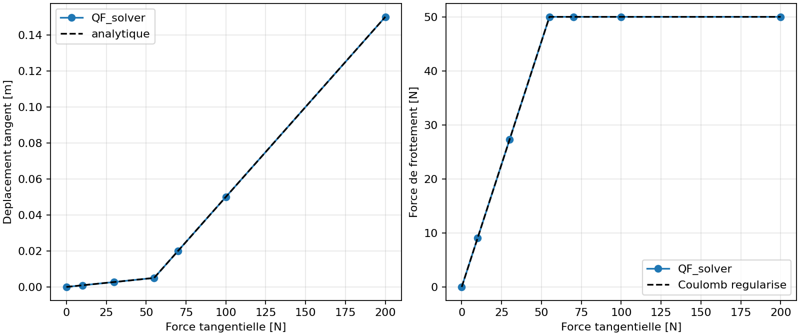
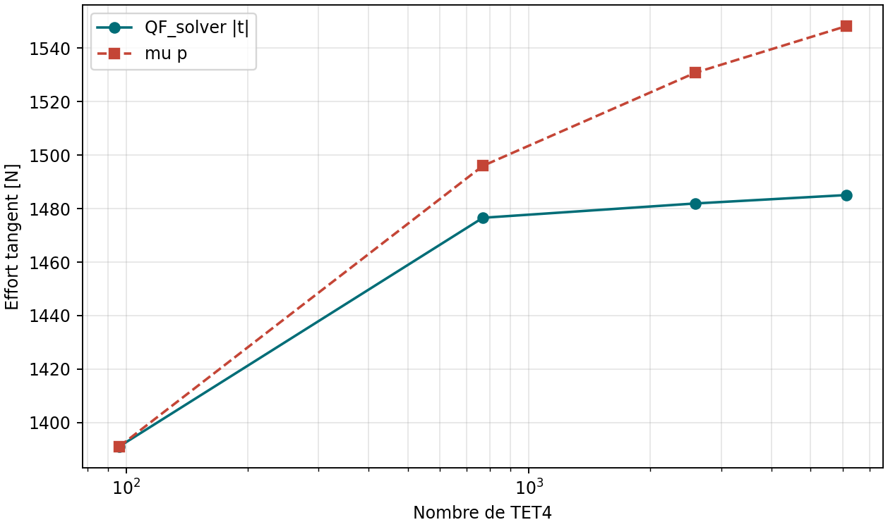

# V&V contact avec frottement : bloc analytique

## Objet et verdict

`VNV-CONTACT-FRICTION-BLOCK-001` verifie le contact noeud-triangle avec
frottement regularise sur un bloc a ressorts. Il couvre un contact ferme sous
une force normale connue, puis des forces tangentielles croissantes. La preuve
est interne, analytique et reproductible; elle conserve donc le statut
`experimental`.

Le ressort normal vaut $k_n=1000$, le ressort tangent structurel vaut
$k_x=1000$, la regularisation de contact vaut $k_t=10000$, le coefficient est
$\mu=0.5$ et la pression fermee est $p=100$. La borne est donc
$\mu p=50$.

## Reference analytique

Pour une force tangentielle $F$, le seuil appliqué est :

$$
F_{\mathrm{stick}}=\mu p\frac{k_x+k_t}{k_t}.
$$

Sous ce seuil, l'adhérence donne :

$$
u_t=\frac{F}{k_x+k_t},\qquad q=k_tu_t.
$$

Au-dessus, le glissement sature la force de frottement :

$$
q=\operatorname{sign}(F)\mu p,
\qquad
u_t=\frac{F-q}{k_x}.
$$

La campagne controle erreur de deplacement, erreur d'effort, pression,
respect du cone de Coulomb, travail local $q^Ts$, inversion de charge et
sensibilite de la force saturee a trois valeurs de $k_t$.

## Resultats regeneres

Les valeurs sont regenerees par `scripts/build_docs.py` dans
`docs/generated/contact_friction/summary.json` et les criteres sont publies
dans :

--8<-- "docs/generated/contact_friction_checks.md"

## Raffinement structurel TET4

`VNV-CONTACT-FRICTION-TET4-STRUCTURAL-002` applique simultanement une charge
normale et une charge tangentielle a une barre TET4 deformable. Les quatre
maillages verifient le gap, le cone de Coulomb et le choix de branche. Le
maillage grossier exerce le repli `active_slip_root`; les niveaux plus fins
peuvent rester en adhesion lorsque la reaction normale eleve la limite `mu p`.

--8<-- "docs/generated/contact_friction_structural_checks.md"

## Independance au pas de charge

Une rampe tangentielle de $0$ a $200$ est resolue avec `1`, `2`, `4`, `8` et
`16` pas, alors que la charge normale est maintenue constante. Deplacement
final, effort tangent et dissipation cumulee sont compares a `1e-12` dans
`test_constant_normal_pressure_ramp_is_independent_of_the_contact_step_count`.
Cette preuve ne s'applique pas a une rampe ou la pression normale varie elle
aussi : dans ce cas le travail dissipe peut physiquement dependre du chemin.

## Portee et limites decisives

La campagne analytique presente chaque charge comme une statique independante
afin de conserver une reference fermee simple. L'implementation dispose aussi
d'un chemin incremental `contact_load_history` : la memoire de glissement,
l'inversion de charge et la dissipation positive sont verifies separement dans
`test_contact_load_history_preserves_slip_memory_and_positive_dissipation`.
Cette preuve locale ne qualifie toutefois ni un calcul dynamique ni une loi de
frottement dependant de la vitesse.

Un cas structurel TET4 avec une forte interaction entre la compliance de la
piece et le glissement tangent est couvert par
`VNV-CONTACT-FRICTION-TET4-STRUCTURAL-002`. Lorsque le point fixe tangent
alterne, QF_solver bascule vers `active_slip_root`, qui resout les deux efforts
tangentiels avec le multiplicateur normal exact. Si cette racine hybride ne
progresse pas, `active_slip_consistent_newton` derive la branche active : les
reponses unitaires du systeme selle fournissent la sensibilite exacte des
deplacements et pressions, puis la projection de Coulomb est derivee
analytiquement. Une recherche lineaire d'Armijo protege le pas. En dernier
recours, `active_slip_least_squares` minimise le meme residu avec une region de
confiance. Des tests forcent separatement l'echec hybride et celui de Newton
afin de verifier ces deux replis. La campagne controle quatre maillages, le
gap et le cone de Coulomb. Une correlation
Code_Aster distincte couvre maintenant le glissement sature
`VNV-CONTACT-FRICTION-CODEASTER-CONTINUE-003`, mais pas l'adherence ni les
faces structurelles deformables. La tangente est consistante seulement tant
que l'ensemble actif et la normale restent figes; leur linearisation et cette
extension structurelle restent requises. Le perimetre reste `experimental`.

La page est reliee a `REQ-CONTACT-001`, `FORM-CONTACT-002` et
`tests/verification/test_frictional_contact_vnv.py`.
