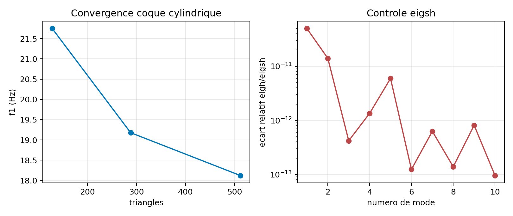

# V&V MITC3+ dynamique etendue

## Objectif

`VNV-MITC3-DYNAMIC-EXTENDED-001` complete la campagne dynamique compacte
MITC3+. Elle porte sur le materiau isotrope, afin de distinguer cette preuve
de celle des stratifies. Elle reunit une structure libre-libre, une coque
cylindrique facettisee, un raffinement de maillage, une comparaison
`eigh/eigsh`, une vibration libre Newmark et une reponse harmonique large
bande.

Le statut est **verified_development**. Les references temporelles et
frequentielles sont des invariants du premier mode calcule; elles ne sont pas
une correlation externe Code_Aster ou CalculiX.

## Libre-libre

L'assemblage de quatre triangles MITC3+ produit exactement six modes rigides
avant le premier mode elastique. Le rapport entre la plus grande valeur propre
rigide et la premiere valeur elastique est `5.94e-11`; les six champs rigides
analytiques ont un residu maximal de `2.11e-17`.


## Coque courbe et solveur creux

Le porte-a-faux cylindrique de rayon `0.5 m` et angle `pi/6` utilise des
facettes MITC3+ planes. Les maillages `16x4`, `24x6`, `32x8` montrent une
variation finale de frequence inferieure a `6 %`. Une rotation rigide globale
laisse les dix frequences invariantes a `1e-8` relatif. La comparaison sur
`16x4` entre `eigh` et `eigsh` est sous `1e-8`; le cas `40x10` resout dix
modes sur `2 560` DDL retenus avec `eigsh`, sans conversion dense. Pour cette
coque, `eigsh` utilise un shift-invert sparse avec `modal_shift_eigenvalue=1`
et `arpack_which=LM`: le calcul direct en `SM` produit un residu insuffisant
sur les modes bas et reste conserve comme diagnostic numerique, pas comme
resultat accepte.



## Newmark et harmonique

Le premier mode de la coque courbe initialise Newmark. Les pas `T/20`,
`T/40`, `T/80` donnent une erreur RMS decroissante; le pas fin atteint
`2.62e-03` avec une derive d'energie sous `1e-4`. La charge harmonique
`F=M phi_1` controle la limite statique a `0 Hz`, l'amplitude complexe, le
pic amorti autour de `f1`, les residus et la disponibilite des contraintes
elementaires sur toute la bande.


## Reproduction et limites

```powershell
python .\scripts\run_mitc3_dynamic_extended_vnv.py `
  --output .\results\VNV-MITC3-DYNAMIC-EXTENDED-001
```

Le dossier controle est
`qualification/vnv/mitc3_dynamic_extended/reference/`.

Les ecarts restants sont une correlation externe modale/transitoire/harmonique
sur une definition de maillage et de pas de temps identique, puis une Owner
review distincte. Les grandes rotations, le non-lineaire coque, le contact
transitoire et les stratifies dynamiques restent hors de cette campagne.
