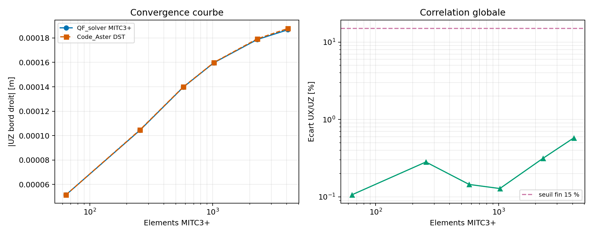
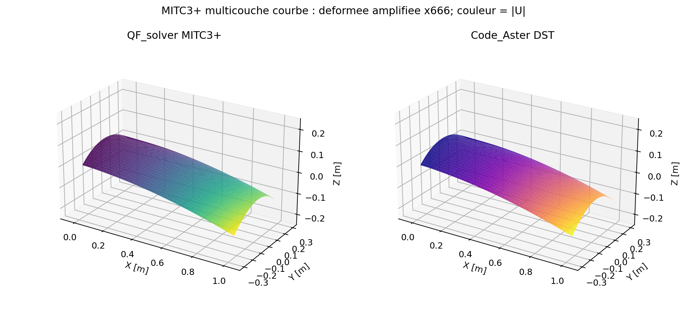

# MITC3+ multicouche courbe : correlation Code_Aster

Cette etude ajoute la correlation externe qui manquait au cas
`VNV-MITC3-LAMINATE-CURVED-PROJECTED-CODEASTER-DST-025`. Elle compare
QF_solver MITC3+ et Code_Aster 18.1.0 `DST/TRIA3/DEFI_COMPOSITE` sur les memes
facettes planes, les memes noeuds, les memes blocages et les memes resultantes.
Le statut global reste experimental et aucune maturite n'est promue
automatiquement.

## Objet mecanique

Le modele est un panneau cylindrique facettise de longueur `1,0 m`, de rayon
`0,5 m` et d'ouverture `60 deg`. Chaque cellule est decoupee en deux triangles.
Le bord gauche est encastre sur les six DDL. Le bord droit recoit `+1000 N`
selon `UX` et `-20 N` selon `UZ`, distribues avec les memes poids d'arete dans
les deux solveurs.

Le stratifié est `[0/90/90/0]`, avec quatre plis de `2,0 mm` :

| Constante | Valeur |
| --- | ---: |
| `E1` | `135 GPa` |
| `E2 = E3` | `10 GPa` |
| `nu12 = nu13` | `0,30` |
| `nu23` | `0,40` |
| `G12` | `5 GPa` |
| `G13` | `4,5 GPa` |
| `G23` | `3,8 GPa` |
| `rho` | `1600 kg/m3` |

La direction globale `(0,7 ; 1,0 ; 0,2)` est donnee directement a chaque
solveur. QF_solver la projette sur chaque facette avant de construire le repere
materiau. Code_Aster applique la meme regle avec `VECTEUR=(0.7, 1.0, 0.2)`
dans `AFFE_CARA_ELEM`. Les angles de plis sont ensuite appliques autour de la
normale locale.

## Raffinement et resultats

| Maillage | Triangles | Ecart vectoriel UX/UZ | `UZ` QF_solver [m] | `UZ` Code_Aster [m] |
| ---: | ---: | ---: | ---: | ---: |
| `8 x 4` | 64 | 0,106 % | -5,149510e-05 | -5,154873e-05 |
| `16 x 8` | 256 | 0,282 % | -1,044626e-04 | -1,047585e-04 |
| `24 x 12` | 576 | 0,145 % | -1,396900e-04 | -1,398923e-04 |
| `32 x 16` | 1 024 | 0,128 % | -1,597376e-04 | -1,599426e-04 |
| `48 x 24` | 2 304 | 0,315 % | -1,787278e-04 | -1,792945e-04 |
| `64 x 32` | 4 096 | **0,578 %** | -1,867267e-04 | -1,878145e-04 |





Les checks automatiques sont :

| Check | Valeur | Limite | Verdict |
| --- | ---: | ---: | --- |
| Ecart vectoriel fin | 0,578 % | 15 % | PASS |
| Ecart sur les deux niveaux fins | 0,578 % | 20 % | PASS |
| Increment final QF_solver | 4,48 % | 5 % | PASS |
| Increment final Code_Aster | 4,75 % | 5 % | PASS |
| Residu libre maximal QF_solver | `5,22e-11` | `1e-8` | PASS |

Le verdict de calcul est donc `PASS_EXTERNAL_CORRELATION`. L'accord
QF_solver/Code_Aster est bien meilleur que le seuil d'acceptation utilise ici.
Le raffinement reste toutefois important : le cas grossier `32 x 16` ne
permettait pas encore de conclure sur l'increment final, ce qui justifie les
deux niveaux supplementaires.

### Suivi `96 x 48`

Une reprise distincte `VNV-MITC3-LAMINATE-CURVED-PROJECTED-CODEASTER-DST-025-R1-96`
ajoute le niveau `96 x 48` apres le niveau `64 x 32` :

| Maillage | Triangles | Ecart vectoriel UX/UZ | Increment QF_solver | Increment Code_Aster | Residu libre QF_solver |
| ---: | ---: | ---: | ---: | ---: | ---: |
| `64 x 32` | 4 096 | `0,578 %` | - | - | `5,22e-11` |
| `96 x 48` | 9 216 | `0,996 %` | `3,381 %` | `3,818 %` | `1,07e-10` |

Les increments de maillage diminuent sous `4 %`, ce qui renforce la lecture de
convergence spatiale. L'ecart inter-solveurs reste inferieur a `1 %`, mais il
augmente legerement entre les deux derniers niveaux. Cette reprise soutient une
acceptation avec recommandation et non une fermeture sans reserve : un niveau
supplementaire ou une extrapolation de Richardson serait necessaire pour
documenter une asymptote.

## Audit axial indépendant Code_Aster / CalculiX

Le cas axial a ensuite été exécuté sur le niveau commun `64 x 32` avec une
seconde référence externe, CalculiX `S6 COMPOSITE`, sur les mêmes facettes et
les mêmes résultantes. Le modèle QF_solver est reproduit dans les deux chemins
d'entrée avec une différence relative de `1,37e-16`. Cette vérification exclut
un problème de génération du modèle QF ou de transfert du chargement.

| Observable au niveau `64 x 32` | QF_solver / Code_Aster DST | QF_solver / CalculiX S6 | Code_Aster / CalculiX |
| --- | ---: | ---: | ---: |
| Vecteur `UX/UZ` | `0,9066 %` | `6,4197 %` | `7,5910 %` |

La référence CalculiX S6 n'est pas identique à MITC3+ et ne remplace donc pas
Code_Aster comme oracle principal. En revanche, le désaccord de `7,5910 %`
entre les deux formulations externes montre que le cas axial courbe est
sensible à la formulation de coque et à la définition de l'observable
transverse. Le pas de temps ne peut pas être la cause : il s'agit d'un calcul
statique. Le seul raffinement de maillage ne suffit pas non plus à justifier
une promotion stable générale.

Le diagnostic est archivé dans
`qualification/vnv/external/mitc3_curved_axial_reference_audit_2026-08-21/`.
Il confirme une corrélation QF_solver/Code_Aster sous `1 %` au niveau commun,
mais conserve le gate général bloqué tant que l'asymptote axiale et la
comparabilité des formulations ne sont pas établies sur une seconde géométrie
ou par une référence de même ordre.


## Lecture des figures

La figure de convergence affiche separement les amplitudes de `UZ` et l'ecart
vectoriel. La figure de deformee montre les faces triangulaires, le maillage
initial implicitement par la geometrie facettisee, la deformee amplifiee et la
norme `|U|` en couleur. Les deux solveurs utilisent la meme echelle
d'amplification.

## Limites

Cette etude ne valide pas les contraintes ponctuelles aux singularites, les
contraintes interlaminaires `S13`, le delaminage, la rupture, le dommage, les
grandes deformations ou la dynamique courbe. Elle ne demontre pas l'identite
des matrices MITC3+ et DST : il s'agit d'une correlation d'observables globaux
sur un cas borne.

La decision Owner doit encore confirmer que le protocole, les images, le
maillage et les ecarts sont acceptables. La preuve peut soutenir un usage
engineering interne experimental, mais elle ne constitue pas une certification
externe.

## Reproduction

Depuis la racine du depot :

```powershell
python .\scripts\run_code_aster_mitc3_curved_laminate_vnv.py `
  --output .\results\VNV-MITC3-LAMINATE-CURVED-PROJECTED-CODEASTER-DST-025 `
  --levels 8 16 24 32 48 64
```

Le resultat machine-readable est dans
`qualification/vnv/external/code_aster_mitc3_curved_laminate/reference/summary.json`.
Le rapport complet et les journaux par niveau restent dans le dossier
`results/` local.

## References

La definition du repere de coque Code_Aster suit `AFFE_CARA_ELEM`, document
U4.42.01, mot-cle `COQUE/VECTEUR`. La formulation externe est `DST` sur
`TRIA3` avec `DEFI_COMPOSITE`; QF_solver utilise MITC3+ Reissner-Mindlin.
