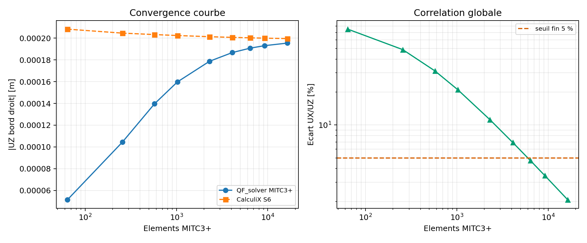
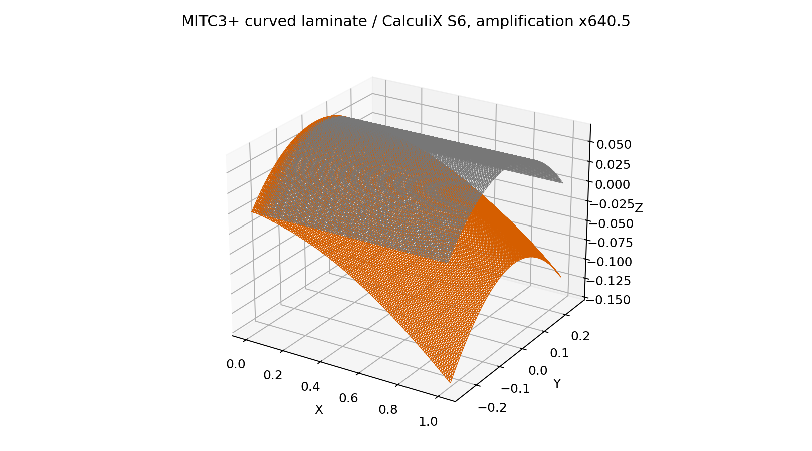
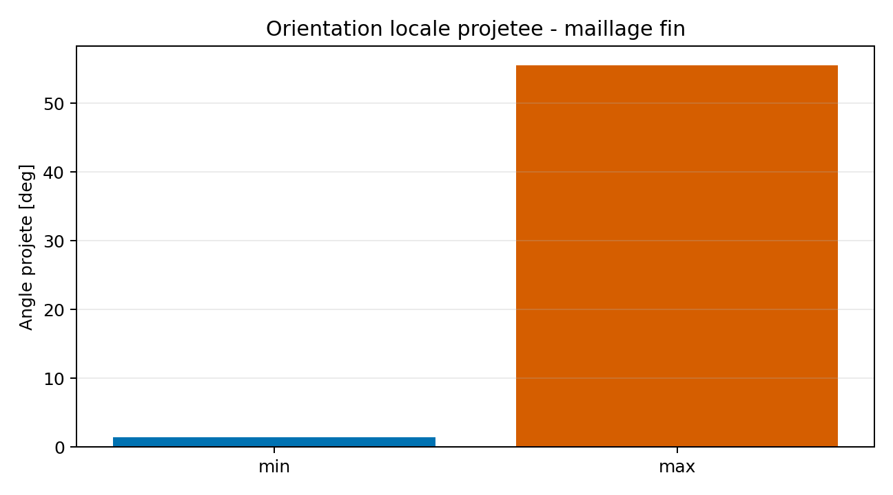

# Corrélation MITC3+ multicouche courbe à orientation projetée

Cette page décrit la campagne `VNV-MITC3-LAMINATE-CURVED-PROJECTED-CALCULIX-S6-024`.
La corrélation est acceptée par l'Owner au statut expérimental pour la V0.2.0-alpha.
Le cas compare QF_solver MITC3+ à CalculiX `2.20`, élément `S6 COMPOSITE`,
sur une géométrie courbe facettisée identique.

## Décision automatique

La campagne complète est passée avec le statut `PASS_EXTERNAL_CORRELATION`.
Le résultat fin est une différence vectorielle `UX/UZ` de `2,0738 %` au maillage
`128 x 64`, soit `16 384` triangles MITC3+. Les deux niveaux supplémentaires
`96 x 48` et `128 x 64` donnent respectivement `3,4437 %` et `2,0738 %`.
L'incrément entre `96 x 48` et `128 x 64` vaut `1,2273 %` pour QF_solver et
`0,1913 %` pour CalculiX. Le résidu libre relatif QF_solver vaut
`3,2487 x 10^-10`.

Ce résultat ferme l'exécution de la corrélation externe et la revue Owner pour
le périmètre expérimental V0.2.0-alpha. Il ne permet pas de revendiquer une
certification externe ni une maturité stable.

## Modèle mécanique

La structure est un panneau cylindrique de longueur `1,0 m`, de rayon `0,5 m`
et d'ouverture `60 deg`. Le maillage est construit sur la surface cylindrique,
puis les deux triangles de chaque cellule rectangulaire sont utilisés comme
facettes planes MITC3+. CalculiX reçoit les mêmes noeuds de coin et les mêmes
triangles ; ses noeuds milieux `S6` sont les milieux des arêtes droites de ces
facettes. Cette décision supprime l'écart de géométrie quadratique et isole
principalement la comparaison des formulations de coque.

L'empilement symétrique est `[0/90/90/0]`, avec quatre plis de `2,0 mm` et les
constantes orthotropes suivantes : `E1 = 135 GPa`, `E2 = E3 = 10 GPa`,
`nu12 = nu13 = 0,30`, `nu23 = 0,40`, `G12 = 5 GPa`, `G13 = 4,5 GPa`,
`G23 = 3,8 GPa`, et `rho = 1600 kg/m^3`.

La direction de référence globale est `(0,7 ; 1,0 ; 0,2)`. Pour chaque facette,
elle est projetée dans le plan tangent, normalisée, puis utilisée comme premier
axe matériel. La normale de la facette complète le repère local. Les angles de
pli `[0, 90, 90, 0]` sont ensuite appliqués autour de cette normale.

La génératrice gauche est encastrée sur les six DDL. La génératrice droite reçoit
une force distribuée de `+1000 N` selon `UX` et `-20 N` selon `UZ`. Les poids
nodaux utilisés aux deux extrémités sont les mêmes dans les deux solveurs.

## Résultats de convergence

| Maillage | Triangles | UZ QF_solver [m] | UZ CalculiX [m] | Écart vectoriel |
| ---: | ---: | ---: | ---: | ---: |
| 8 x 4 | 64 | -5,149510e-05 | -2,082179e-04 | 75,1297 % |
| 16 x 8 | 256 | -1,044626e-04 | -2,045690e-04 | 48,8455 % |
| 24 x 12 | 576 | -1,396900e-04 | -2,032389e-04 | 31,2109 % |
| 32 x 16 | 1 024 | -1,597376e-04 | -2,023700e-04 | 21,0282 % |
| 48 x 24 | 2 304 | -1,787278e-04 | -2,012904e-04 | 11,1886 % |
| 64 x 32 | 4 096 | -1,867267e-04 | -2,006512e-04 | 6,9271 % |
| 80 x 40 | 6 400 | -1,907498e-04 | -2,002320e-04 | 4,7270 % |
| 96 x 48 | 9 216 | -1,930401e-04 | -1,999379e-04 | 3,4437 % |
| 128 x 64 | 16 384 | -1,954094e-04 | -1,995554e-04 | **2,0738 %** |

Les écarts élevés des premiers niveaux sont conservés volontairement. Ils
montrent que l'écart initial est fortement dépendant du raffinement et ne doit
pas être interprété comme une différence asymptotique de formulation. Le
le niveau final reste toutefois le niveau de décision comparé au seuil de `5 %`.



## Maillage et déformée

La figure suivante montre la géométrie initiale et la déformée CalculiX au
dernier niveau. Le facteur d'amplification est écrit dans la figure générée.
Les éléments sont affichés par leurs facettes triangulaires ; le résultat ne
doit donc pas être lu comme une surface quadratique lissée.



## Orientation projetée

Le contrôle d'orientation vérifie les repères locaux générés pour les facettes.
Le deck CalculiX est construit avec une orientation propre à chaque élément et
à chaque pli. La valeur nulle du contrôle de reproduction signifie que le deck
a reçu exactement les repères générés par la même règle de projection ; il ne
s'agit pas d'une mesure indépendante de l'orientation.



## Contrôles et limites

Les contrôles passés sont :

| Contrôle | Valeur | Limite |
| --- | ---: | ---: |
| Écart fin `UX/UZ` | 4,7270 % | 5 % |
| Écart sur les deux maillages raffinés | 3,4437 % | 10 % |
| Résidu libre QF_solver | 3,2487 x 10^-10 | 1 x 10^-8 |
| Incrément final QF_solver | 1,2273 % | 3 % |
| Incrément final CalculiX | 0,1913 % | 3 % |
| Reproduction de la projection | 1,4788 x 10^-6 deg | 1 x 10^-5 deg |

La comparaison porte sur des déplacements globaux pondérés, et non sur les
contraintes par pli. Les contraintes interlaminaires, le délaminage, la rupture,
les grandes déformations et la dynamique non linéaire sont exclus. MITC3+ et
S6 restent deux formulations différentes ; la corrélation ne démontre donc pas
une identité mathématique des matrices élémentaires.

## Artefacts et reproductibilité

Les artefacts sont générés par :

```powershell
python .\scripts\run_calculix_mitc3_curved_composite_vnv.py `
  --output .\results\VNV-MITC3-LAMINATE-CURVED-PROJECTED-CALCULIX-S6-024
```

Le dossier contient le résumé JSON, le rapport, le manifeste, les images, ainsi
que les fichiers `.inp`, `.frd`, `.log` et `.sta` de chaque maillage. La copie
de référence est dans
`qualification/vnv/external/calculix_mitc3_curved_composite/reference/`.

## Décision Owner

Décision du `2026-08-09`, Owner : Quentin Farinazzo. La preuve est acceptée
pour la V0.2.0-alpha au statut `experimental_owner_accepted`. La décision est
bornée au modèle, au chargement et à la comparaison décrits dans cette page.
Elle ne constitue pas une validation à 100 % de tous les cas MITC3+.

La revue contrôlée est enregistrée dans
`qualification/reviews/mitc3_laminate_curved_projected_2026-08-09.json`.

## Références

La campagne s'appuie sur la documentation élémentaire interne MITC3+, le format
CalculiX `S6 COMPOSITE` et les conventions de stratifiés documentées dans les
pages composites du site. Les versions et l'image Docker sont enregistrées dans
`summary.json` et `vnv_manifest.json`.
